# Catalog 2.0 - Offers {: #offers}

## What does the OpenOlat catalog contain? [:octicons-tag-16:{ title="from Release 17.1 (OO-6201)" }](https://track.frentix.com/issue/OO-6201) {: #offers_catalog_content}

As in other catalogs, the OpenOlat catalog also displays short descriptions of "products" in many small entries. In OpenOlat these are

- Courses
- Implementations of curricula/products
- or other learning resources, e.g. tests or videos.

## Do all courses appear in the catalog? {: #offers_display_decision}

All created courses and learning resources are **not automatically** displayed in the catalog. The authors of the respective courses and learning resources decide whether something is included in the catalog.

To do this, an **offer** must be created in the respective course or learning resource. 
If no offer is created, no catalog entry is made.

[To the top of the page ^](#offers)

---

## How is an offer created? {: #offers_create}

Offers are attached to the course and are defined there by authors in the settings: 
`Course > Administration > Settings > Tab "Share"`

!!! note "Difference between Catalog 1.0 and Catalog 2.0"

    In Catalog 1.0, all offers are created in the courses: `Course > Administration > Settings > Tab "Share"`. Afterwards they are compiled in the **Catalog administration**.

    In Catalog 2.0, offers are also created in the course settings. In addition, you specify **where** the offer should appear in the catalog. Based on this information, Catalog 2.0 can then **dynamically compile** the offers itself.

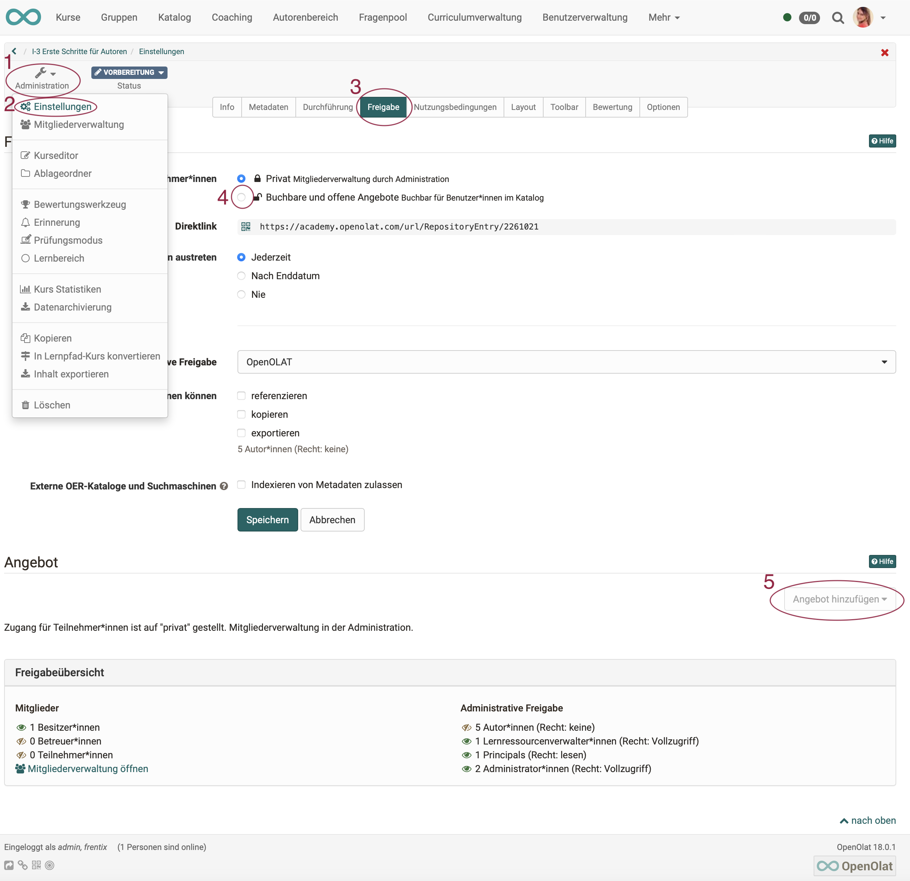{ class="shadow lightbox" }

[To the top of the page ^](#offers)

---

## Requirements for an offer {: #offers_requirements}

Access to a course is also configured in the course settings: `Course > Administration > Settings > Tab "Share"`. There are two basic variants available:

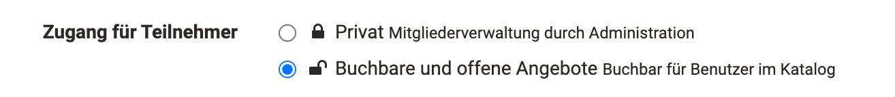{ class="shadow lightbox" }

If "Private" is selected, the participants are entered by the owners or persons who have the right to manage members. What is private should not be published in the catalog.

If the option "Bookable and open offers" is selected, learners can book a course/learning resource themselves, but may have to enter a password (depending on the setting).

If the second option "Bookable and open offers" is selected, you can then create offers.

[To the top of the page ^](#offers)

---

## What does an offer contain? {: #offer_content}

An offer contains the conditions under which the course or learning resource can be used.

An **offer** defines who can enrol in or book the selected learning resource or course and under what circumstances. A booking order is possible with an access code, without one or via PayPal (if activated by administrators). Access without a booking order or as a guest can also be configured. Booking can be understood as a synonym for enrolling, registering, purchasing. Select the "Add offer" button to add offers.

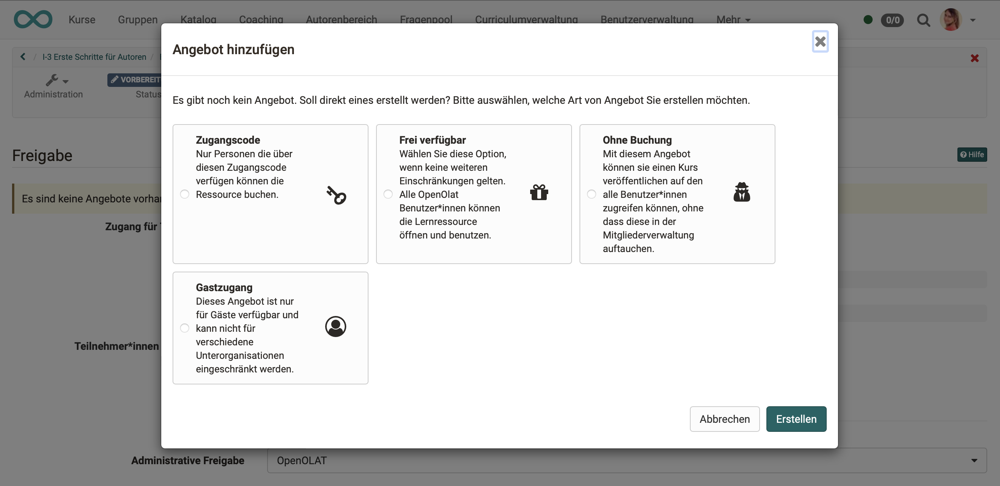{ class="shadow lightbox" }

Several different offers can be created for the same course. For example, the same course can then be offered free of charge to some participants and for a fee to others.

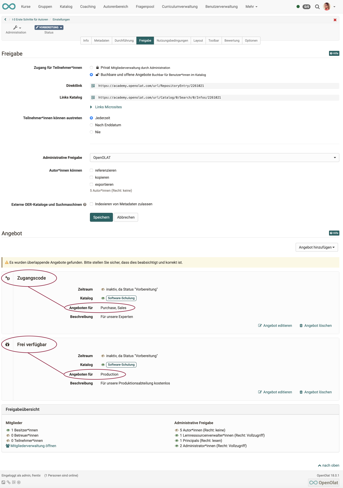{ class="shadow lightbox" }

Offers can also be limited to different parts of organisations (sub-organisations).

!!! info "Organisation membership"

    If an offer is restricted to a specific organisation or sub-organisation, it appears in the catalog **only for users who are members of that organisation**. Users outside the organisation do not see the offer, even if the course is published.

    Organisation membership is managed in the [user management](../../manual_admin/usermanagement/index.md).

[To the top of the page ^](#offers)

---

## Publish offers {: #offer_publish}

Edit an offer to determine when and where it will appear in the catalog.

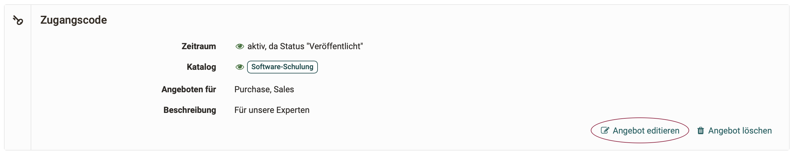{ class="shadow lightbox" }

Offers can be published regardless of the publication status of the course. To do this, select "time-limited" when creating the offer and define a future period. The offer is then available in the catalog for this defined period.

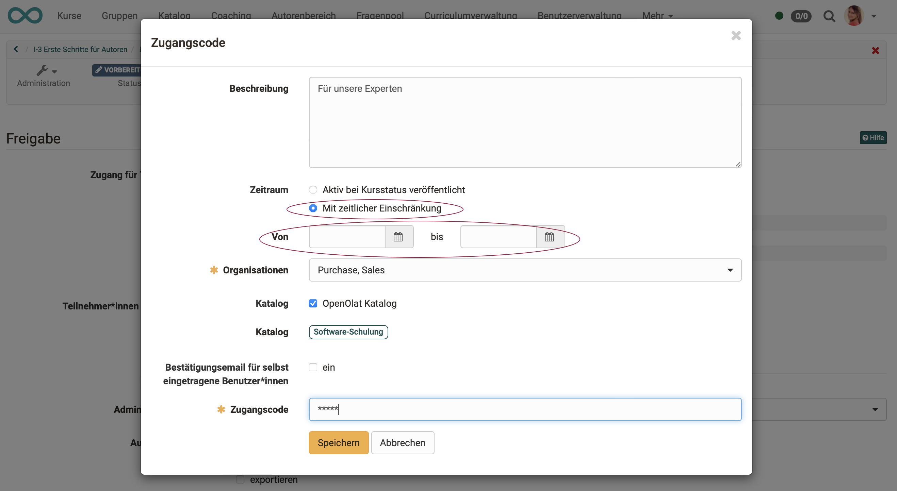{ class="shadow lightbox" }

In addition to the **basic activation** that the offer should be displayed in a catalog, a **subject** can be specified. If no subject is specified, the offer can be found via the search function in the catalog, for example, but it is not displayed in any taxonomy launcher in which offers with the same subject are displayed together.

In addition, the **access code**, for example, must be defined depending on the offer type.

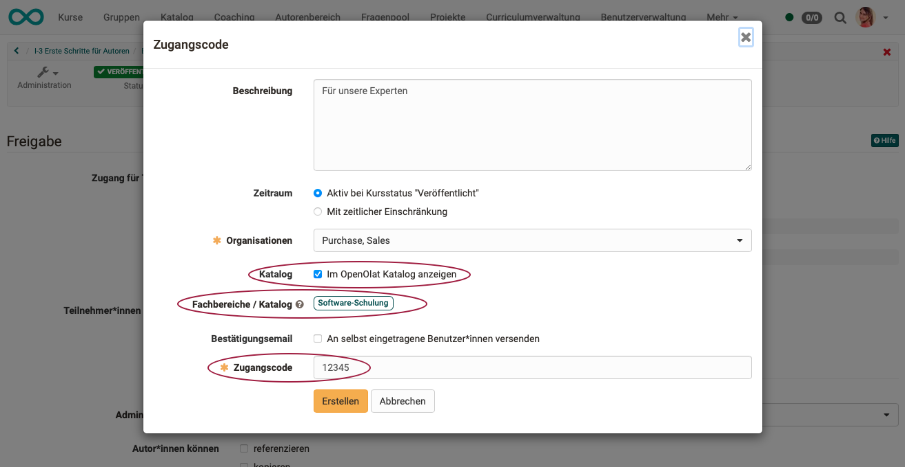{ class="shadow lightbox" }

[To the top of the page ^](#offers)

---

## Info page {: #offer_info}

If you click on a tile in the catalog, you get a more detailed description of the course or learning resource offered without the course being started. Even if an access authorisation has been set up for the course start, this info page can be viewed in the catalog. It contains the information that the authors have entered in the metadata: 
`Course > Administration > Settings > Tab "Info"`

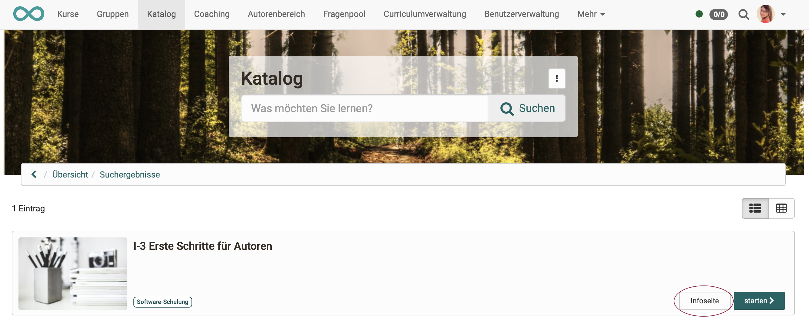{ class="shadow lightbox" }

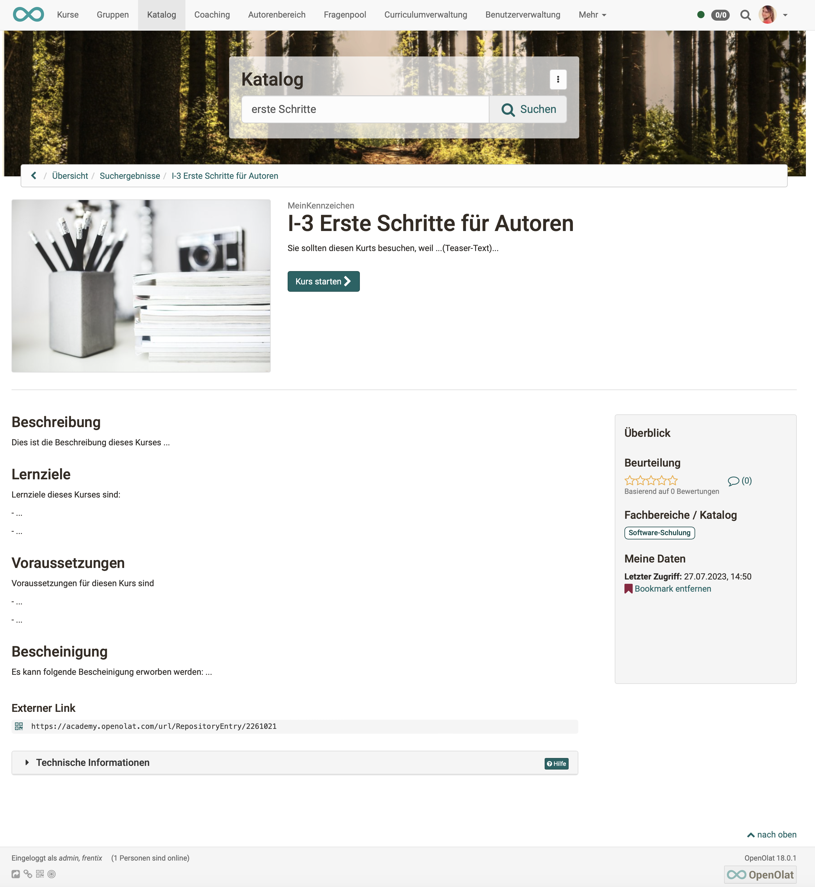{ class="shadow lightbox" }

[To the top of the page ^](#offers)

---

## Metadata, subject {: #offer_metadata}

It is of great importance to which subject authors assign a course or learning resource. This is because behind the subject is the taxonomy according to which courses are compiled in the taxonomy launchers of the catalog. You select the subject under: 
`Course > Administration > Settings > Tab "Metadata"`

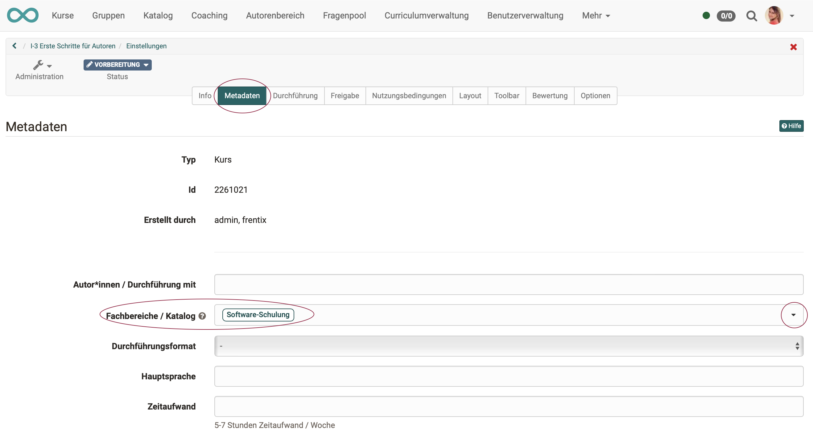{ class="shadow lightbox" }

The information on the subject provided in the "**Metadata**" tab can be used in the "**Share**" tab when creating an offer. The subjects are used for **keywording** in the catalog. Several subjects can be specified as keywords.

If you click on the small arrow at the end of the "Subjects / Catalog" line, you can select the keywords. First, a popup appears in which the subjects used are listed.

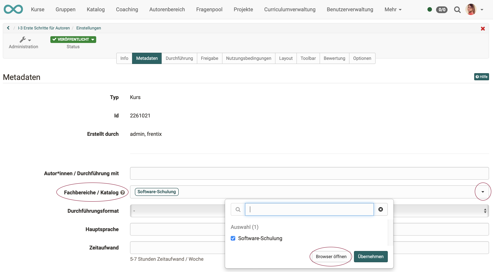{ class="shadow lightbox" }

You can now add further subjects using the search field or by opening a browser.

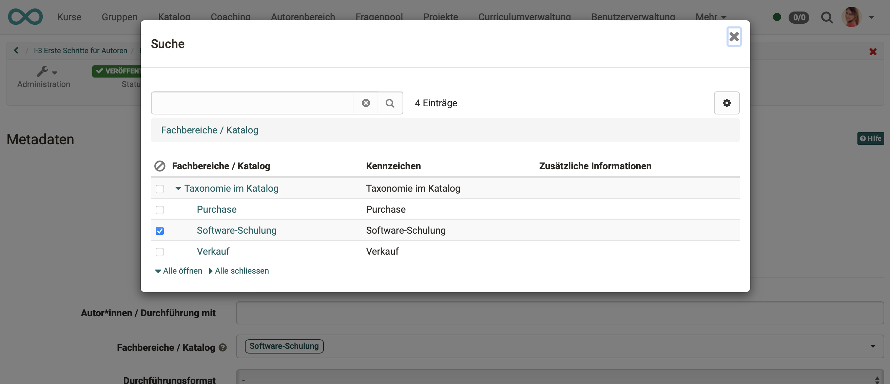{ class="shadow lightbox" }

The dynamic Catalog 2.0 can use this metadata to combine all offers that use the same taxonomy (have the same subjects specified) and display them together in a catalog section (launcher), the taxonomy launcher.

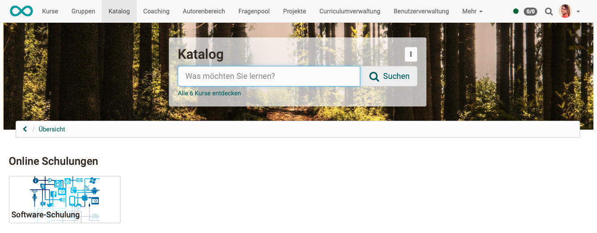{ class="shadow lightbox" }

Clicking on the tile of the taxonomy launcher opens the so-called microsite with the list of all courses and learning resources assigned to this subject.

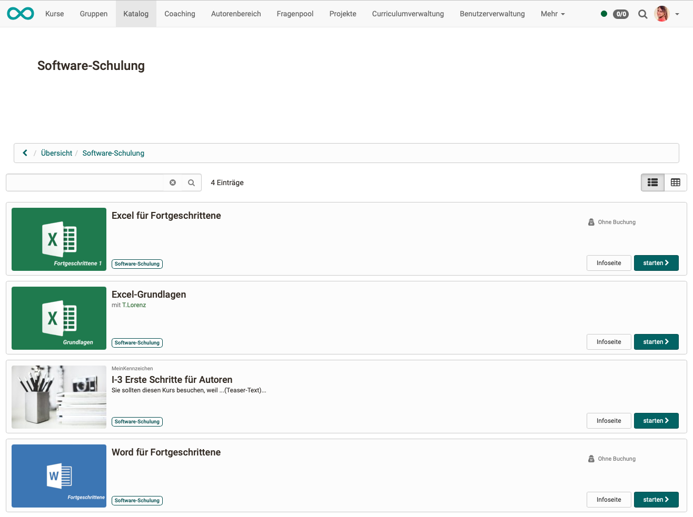{ class="shadow lightbox" }

!!! note "Catalog 1.0"

    Information on creating offers in Catalog 1.0 can be found [here](catalog1.0.md).

[To the top of the page ^](#offers)

---

## Further information {: #further_information}

[User management (administration manual) >](../../manual_admin/usermanagement/index.md) 
[Catalog 1.0 >](catalog1.0.md)

[To the top of the page ^](#offers)
