# Catalog 2.0 - Offers {: #offers}

## What does the OpenOlat catalog contain? [:octicons-tag-16:{ title="from Release 17.1 (OO-6201)" }](https://track.frentix.com/issue/OO-6201) {: #offers_catalog_content}

As in other catalogs, the OpenOlat catalog also displays short descriptions of "products" in many small entries. In OpenOlat these are

- Courses
- Implementations of curricula/products
- or other learning resources, e.g. tests or videos.

## Do all courses appear in the catalog? {: #offers_display_decision}

All created courses and learning resources are **not automatically** displayed in the catalog. The authors of the respective courses and learning resources decide whether something is included in the catalog.

To do this, an **offer** must be created in the respective course or learning resource. 
If no offer is created, no catalog entry is made.

[To the top of the page ^](#offers)

---

## How is an offer created? {: #offers_create}

Offers are attached to the course and are defined there by authors in the settings: 
`Course > Administration > Settings > Tab "Share"`

!!! note "Difference between Catalog 1.0 and Catalog 2.0"

    In Catalog 1.0, all offers are created in the courses: `Course > Administration > Settings > Tab "Share"`. Afterwards they are compiled in the **Catalog administration**.

    In Catalog 2.0, offers are also created in the course settings. In addition, you specify **where** the offer should appear in the catalog. Based on this information, Catalog 2.0 can then **dynamically compile** the offers itself.

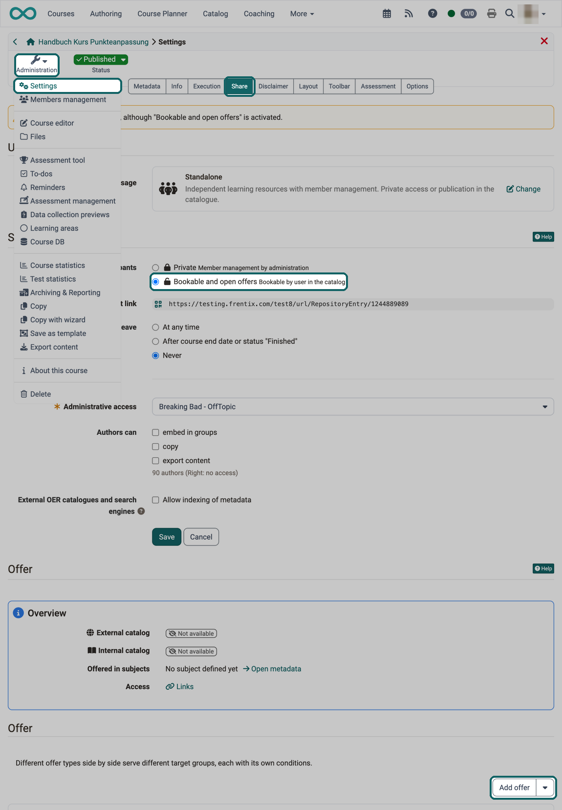{ class="shadow lightbox" title="Share tab of the course settings · 2026.09.28" }

[To the top of the page ^](#offers)

---

## Requirements for an offer {: #offers_requirements}

Access to a course is also configured in the course settings: `Course > Administration > Settings > Tab "Share"`. There are two basic variants available:

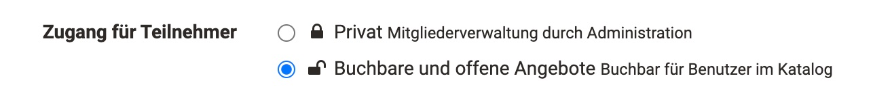{ class="shadow lightbox" title="Share tab of the course settings" }

If "Private" is selected, the participants are entered by the owners or persons who have the right to manage members. What is private should not be published in the catalog.

If the option "Bookable and open offers" is selected, learners can book a course/learning resource themselves, but may have to enter a password (depending on the setting).

If the second option "Bookable and open offers" is selected, you can then create offers.

[To the top of the page ^](#offers)

---

## What does an offer contain? {: #offer_content}

An offer contains the conditions under which the course or learning resource can be used.

An **offer** defines who can enrol in or book the selected learning resource or course and under what circumstances. A booking order is possible with an access code, without one or via PayPal (if activated by administrators). Access without a booking order or as a guest can also be configured. Booking can be understood as a synonym for enrolling, registering, purchasing. Select the "Add offer" button to add offers.

For offers of an implementation in the Course Planner, an offer can additionally require forms that are filled in as steps when booking. This is not possible for offers of a course or another learning resource. [Booking order forms >](Course_Planner_Implementations.md#booking_order_forms) [:octicons-tag-16:{ title="from Release 21.1 (OO-9724)" }](https://track.frentix.com/issue/OO-9724){:target="_blank"}

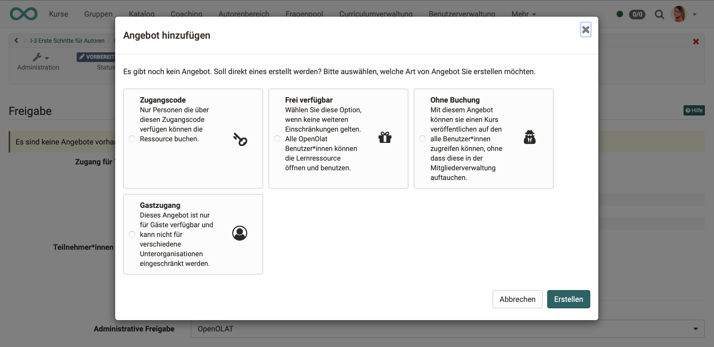{ class="shadow lightbox" title="Dialog Add offer" }

Several different offers can be created for the same course. For example, the same course can then be offered free of charge to some participants and for a fee to others.

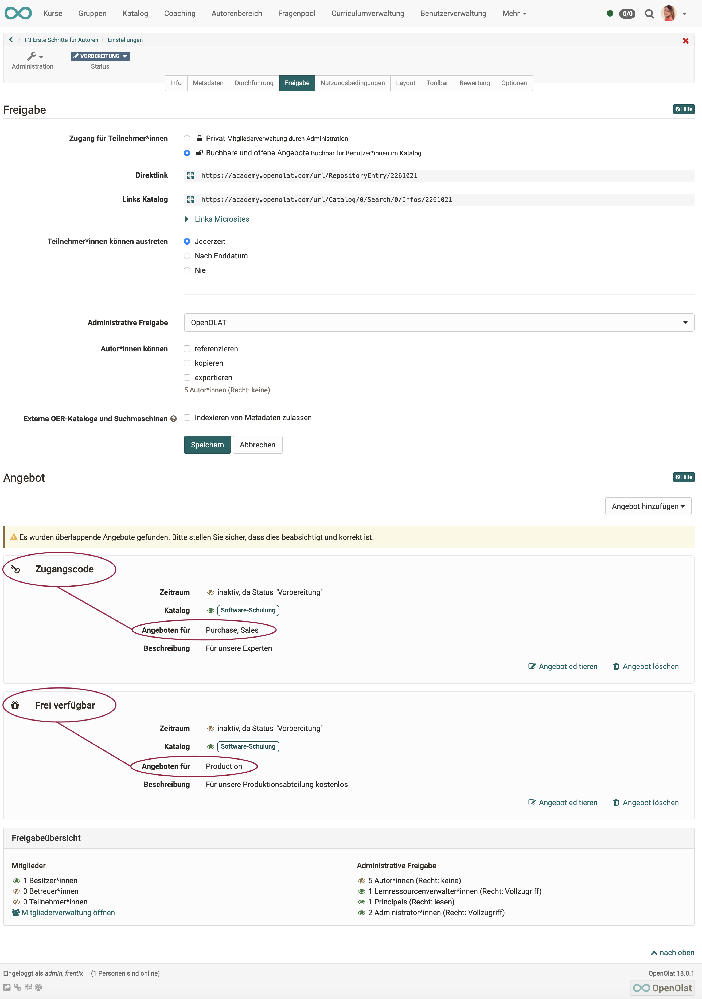{ class="shadow lightbox" title="Section Offer in the Share tab" }

Offers can also be limited to different parts of organisations (sub-organisations).

!!! info "Organisation membership"

    If an offer is restricted to a specific organisation or sub-organisation, it appears in the catalog **only for users who are members of that organisation**. Users outside the organisation do not see the offer, even if the course is published.

    Organisation membership is managed in the [user management](../../manual_admin/usermanagement/index.md).

[To the top of the page ^](#offers)

---

## Publish offers {: #offer_publish}

Edit an offer to determine when and where it will appear in the catalog.

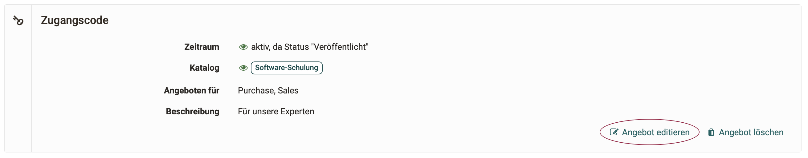{ class="shadow lightbox" title="Section Offer in the Share tab" }

Offers can be published regardless of the publication status of the course. To do this, select "time-limited" when creating the offer and define a future period. The offer is then available in the catalog for this defined period.

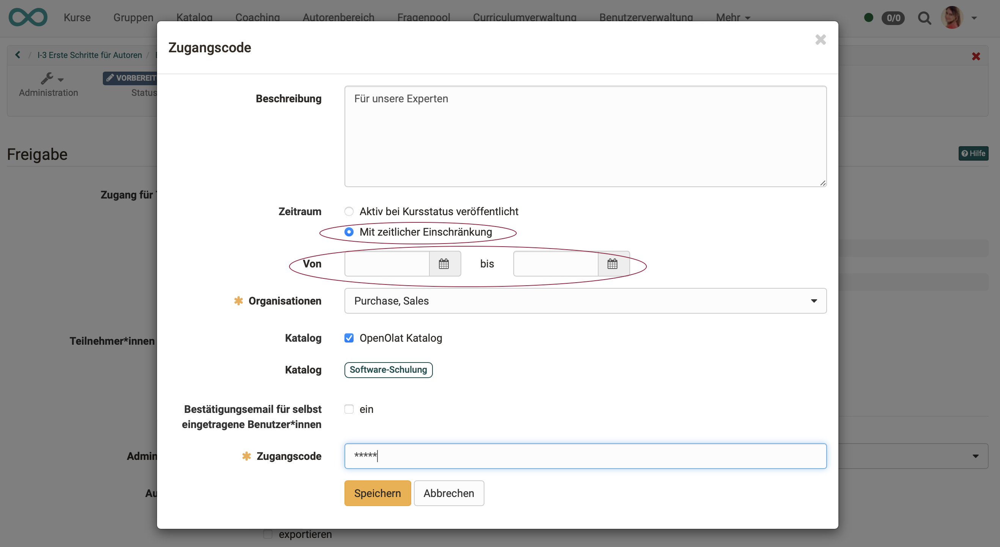{ class="shadow lightbox" title="Dialog Access code" }

In addition to the **basic activation** that the offer should be displayed in a catalog, a **subject** can be specified. If no subject is specified, the offer can be found via the search function in the catalog, for example, but it is not displayed in any taxonomy launcher in which offers with the same subject are displayed together.

In addition, the **access code**, for example, must be defined depending on the offer type.

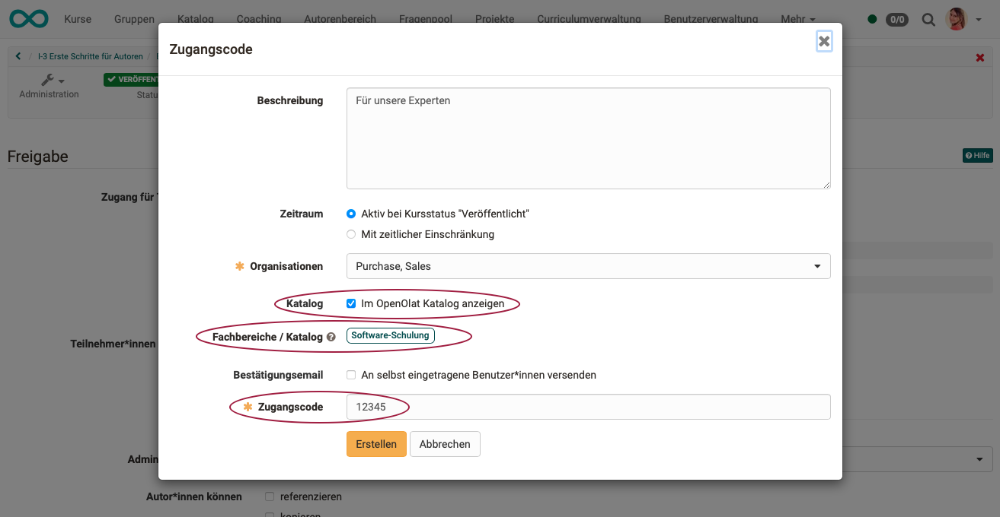{ class="shadow lightbox" title="Dialog Access code" }

[To the top of the page ^](#offers)

---

## How does booking an offer work? {: #offer_booking}

With a booking, you get access to a course or an implementation from the catalog. You book on the info page with **Book**. If the course or the implementation has several offers, the info page shows them for selection, labelled with the offer type and, if available, the price. First select the desired offer; **Book** then applies to this offer. What happens next depends on the offer type and on whether the offer uses forms.

If the offer does not use a form, clicking **Book** completes the booking immediately for "Freely available". For "Access code", the dialog "Access code" opens; for "Invoice", the dialog "Booking on invoice" opens with the button **Order for a fee**. Offers of individual courses never use forms: with an access code or freely available, you always book them this way. The offer type "Invoice" only exists for implementations.

### Booking with forms as a wizard [:octicons-tag-16:{ title="from Release 21.1 (OO-9742)" }](https://track.frentix.com/issue/OO-9742){:target="_blank"} {: #offer_booking_wizard}

If the offer of an implementation uses at least one form, OpenOlat guides you through a wizard. This way, you provide the details that the people responsible for planning need, for example dietary requirements or prior knowledge, together with the booking. Your answers are then available with your booking order.

The title of the wizard names the offer type and the implementation: "Booking freely available for", "Booking with an access code for" or "Booking on invoice for", followed by the title of the implementation and, if set, its reference.

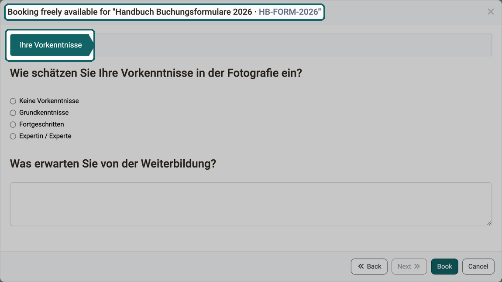{ class="shadow lightbox" title="Booking freely available wizard in the catalog · 2026.10.02" }

Which steps the wizard shows depends on the offer type:

| Offer type | Steps |
|---|---|
| Freely available | the forms |
| Access code | first the step "Access code", then the forms |
| Invoice | first the step "Booking details", then the forms |

In the step "Access code", you enter the access code you have received. In the step "Booking details", you select the billing address via **Select billing address**; it is mandatory. The "P.O. number" and the "Comment" are optional. If the offer has a price or a cancellation fee, the step shows this information.

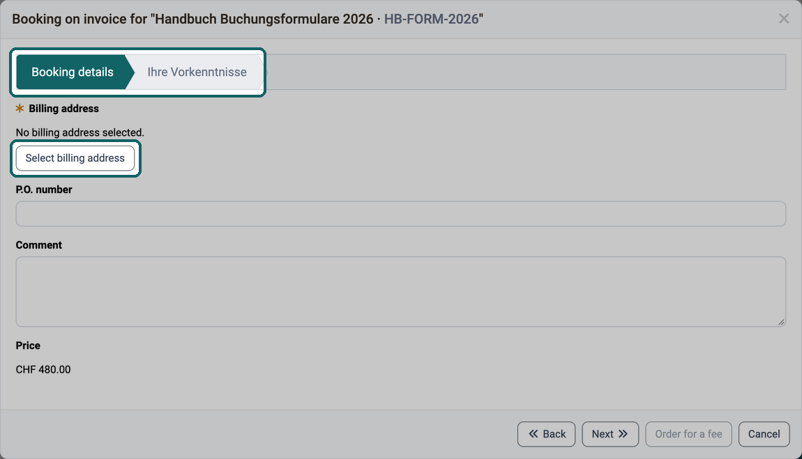{ class="shadow lightbox" title="Booking details step in the Booking on invoice wizard · 2026.10.02" }

Each form is a separate step, labelled with its step name. The offer determines the order of the forms.

- **Next** checks the mandatory fields of the displayed step and leads to the next step.
- **Back** leads to the previous step without checking. Your entries are retained.
- In the last step, the highlighted button completes the booking: **Book** for "Freely available" and "Access code", **Order for a fee** for "Invoice". In the steps before, this button is inactive; in the last step, **Next** is inactive.

The booking order is only created with this last click. If you cancel the wizard beforehand with **Cancel** or the close icon, you are not booked, and OpenOlat does not save any answers. If OpenOlat asks with the dialog "Unsaved form data", **Do not save data** closes the wizard and **Back to form** returns you to the step.

If another person books for you, for example with [Book on behalf of](Coaching_People.md#linemanager_educationmanager_book_participants) in Coaching or when [adding participants](Course_Planner_Implementations.md#add_members) in the Course Planner, this person fills in the forms. The answers belong to your booking order. You see your completed forms under [Booking orders](../personal_menu/Bookings.md) in the dialog "Booking" of the booking order.

Forms in offers only exist for implementations in the Course Planner, not for offers of individual courses and not for the offer type PayPal Checkout. How to use a form in an offer is described in [Use a form in an offer](Course_Planner_Implementations.md#booking_order_forms_offer).

[To the top of the page ^](#offers)

---

## Info page {: #offer_info}

If you click on a tile in the catalog, you get a more detailed description of the course or learning resource offered without the course being started. Even if an access authorisation has been set up for the course start, this info page can be viewed in the catalog. It contains the information that the authors have entered in the metadata: 
`Course > Administration > Settings > Tab "Info"`

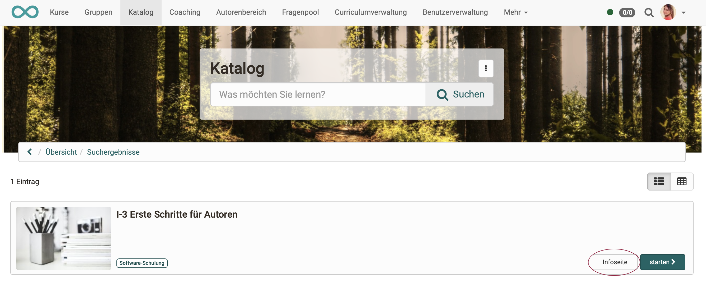{ class="shadow lightbox" title="Search results in the catalog" }

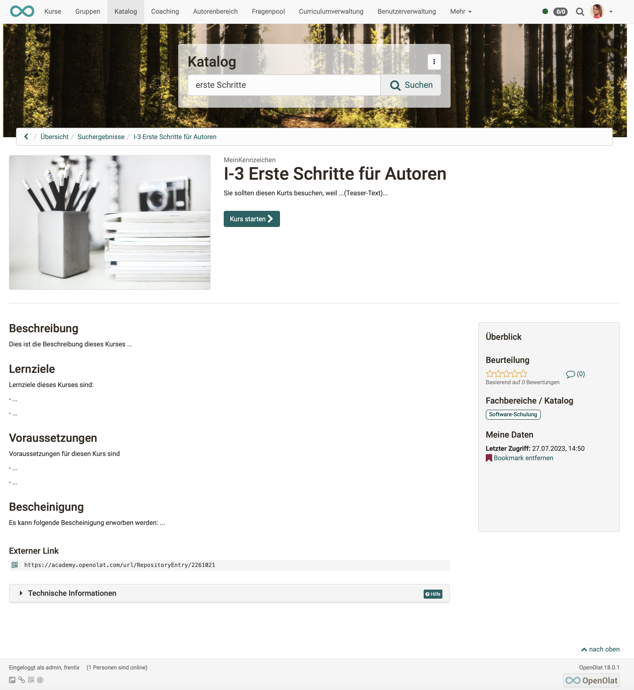{ class="shadow lightbox" title="Info page in the catalog" }

[To the top of the page ^](#offers)

---

## Metadata, subject {: #offer_metadata}

It is of great importance to which subject authors assign a course or learning resource. This is because behind the subject is the taxonomy according to which courses are compiled in the taxonomy launchers of the catalog. You select the subject under: 
`Course > Administration > Settings > Tab "Metadata"`

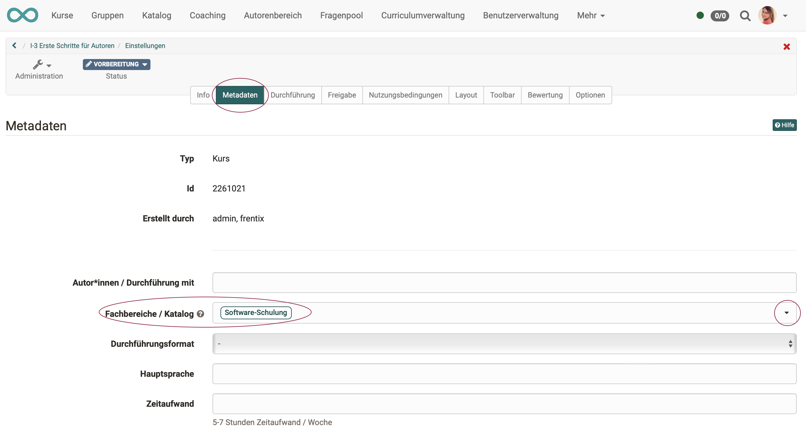{ class="shadow lightbox" title="Metadata tab of the course settings" }

The information on the subject provided in the "**Metadata**" tab can be used in the "**Share**" tab when creating an offer. The subjects are used for **keywording** in the catalog. Several subjects can be specified as keywords.

If you click on the small arrow at the end of the "Subjects / Catalog" line, you can select the keywords. First, a popup appears in which the subjects used are listed.

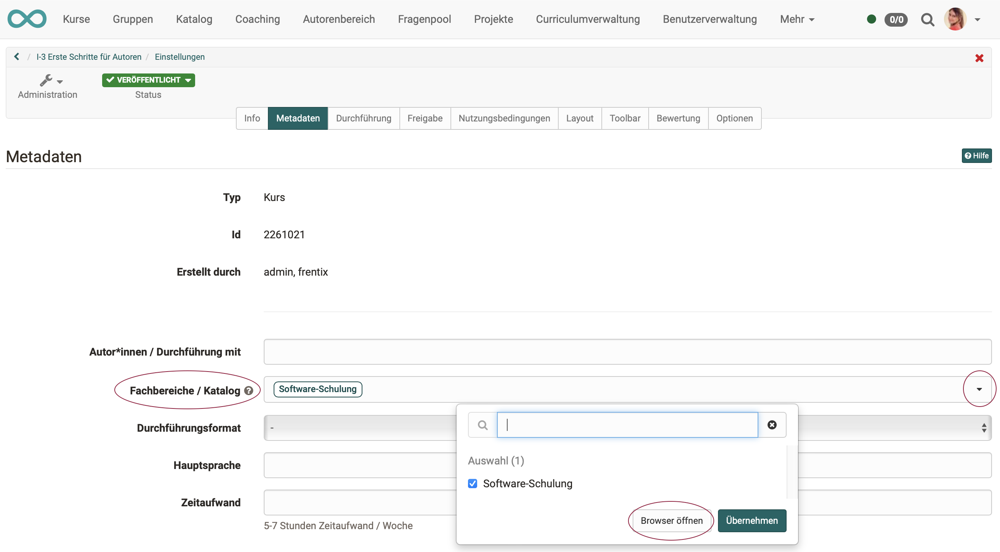{ class="shadow lightbox" title="Field Subjects / Catalog in the Metadata tab" }

You can now add further subjects using the search field or by opening a browser.

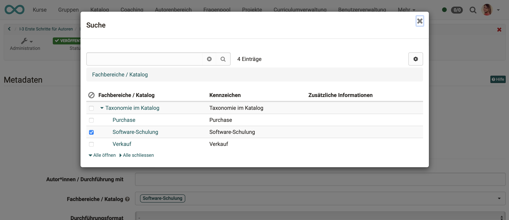{ class="shadow lightbox" title="Dialog Search for the subjects" }

The dynamic Catalog 2.0 can use this metadata to combine all offers that use the same taxonomy (have the same subjects specified) and display them together in a catalog section (launcher), the taxonomy launcher.

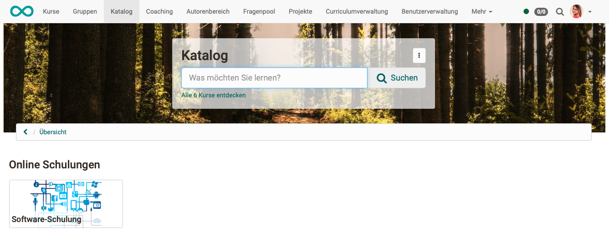{ class="shadow lightbox" title="Start page of the catalog" }

Clicking on the tile of the taxonomy launcher opens the so-called microsite with the list of all courses and learning resources assigned to this subject.

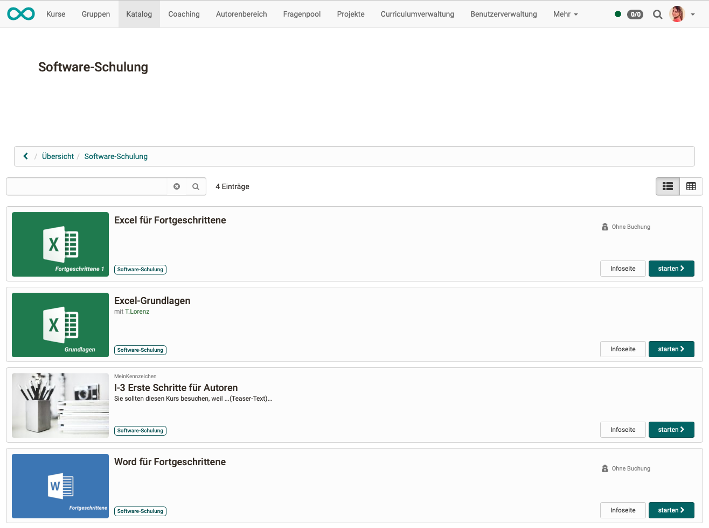{ class="shadow lightbox" title="Microsite of the taxonomy launcher" }

!!! note "Catalog 1.0"

    Information on creating offers in Catalog 1.0 can be found [here](catalog1.0.md).

[To the top of the page ^](#offers)

---

## Further information {: #further_information}

[Course Planner: Implementations >](Course_Planner_Implementations.md) 
[User management (administration manual) >](../../manual_admin/usermanagement/index.md) 
[Coaching - People >](Coaching_People.md) 
[User tools: Booking orders >](../personal_menu/Bookings.md) 
[Catalog 1.0 >](catalog1.0.md) 
[Offer concepts >](../basic_concepts/Offer_Concepts.md) 
[Access configuration / Share >](../learningresources/Access_configuration.md)

[To the top of the page ^](#offers)
