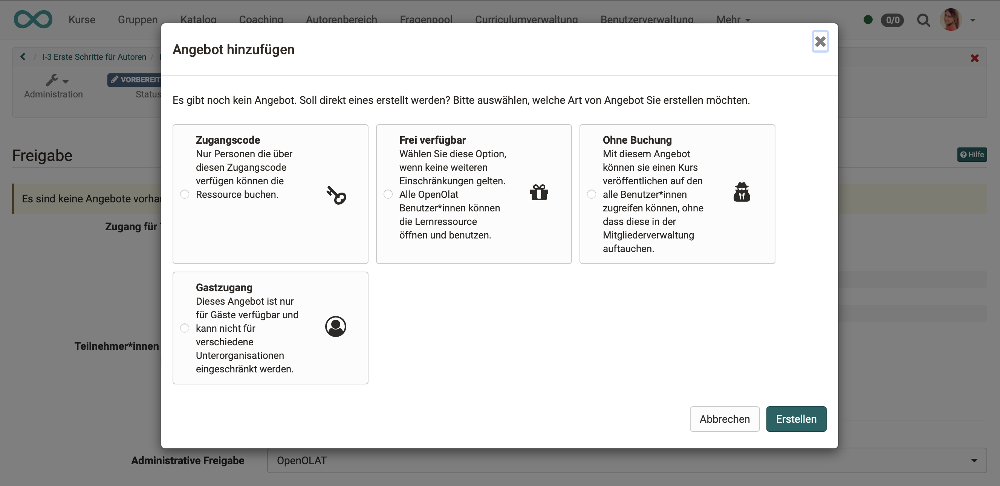
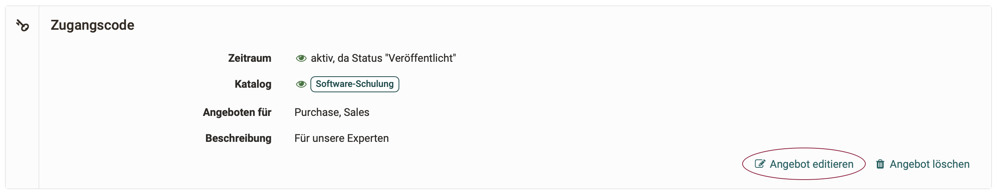
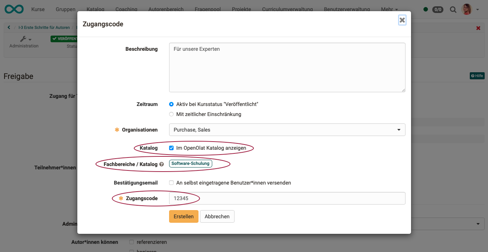
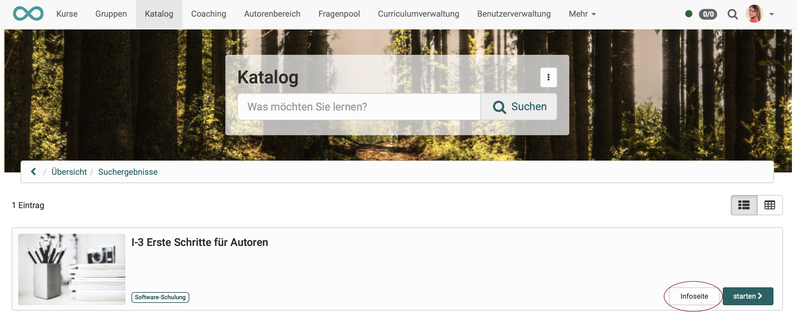
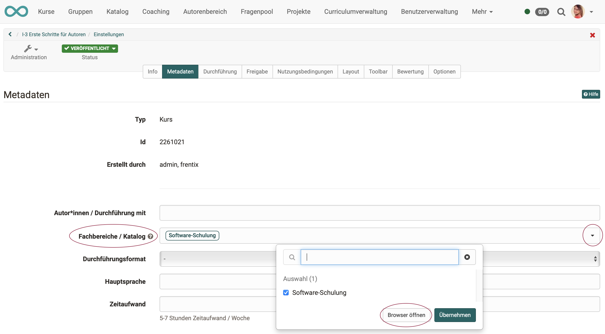
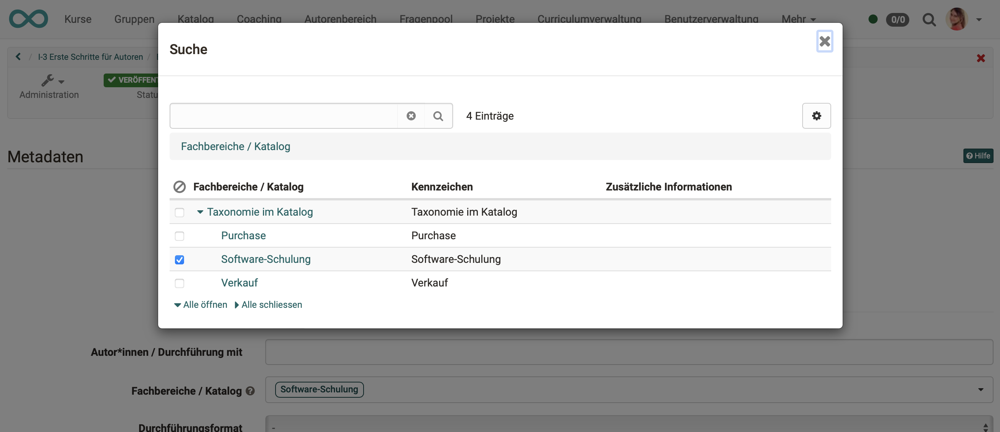
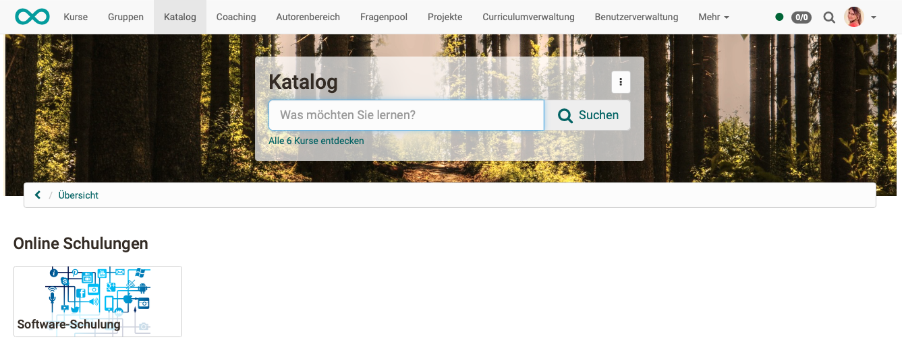
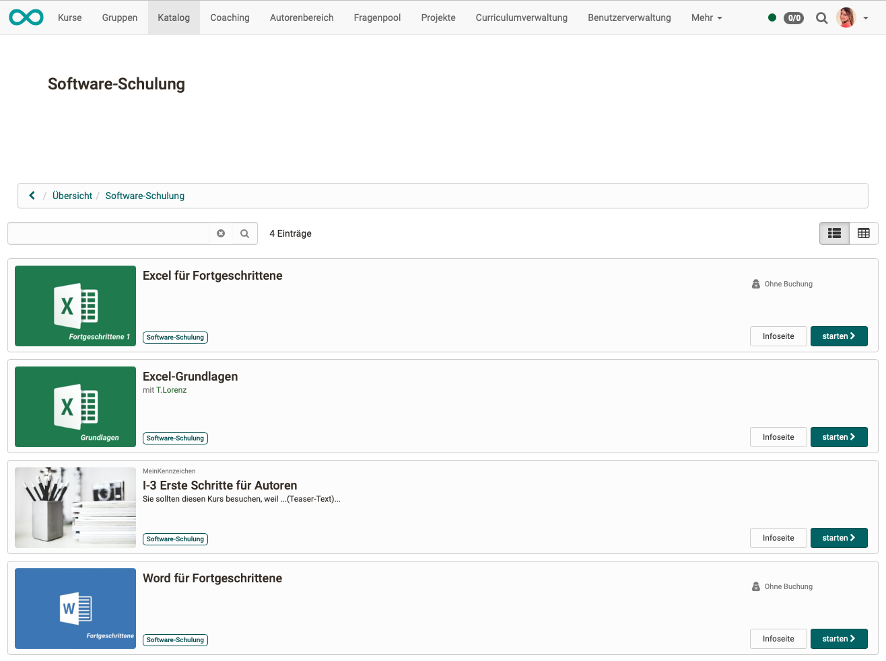

# Catalog 2.0 -  Offers {: #offers}

## What does the OpenOlat catalog contain? {: #offers_catalog_content}

As in other catalogs, the OpenOlat catalog also displays short descriptions of "products" in many small entries. In OpenOlat these are

- Courses
- implementations of curricula/products
- or other learning resources, e.g. tests or videos.

## Do all courses appear in the catalog? {: #offers_display_decision}

All created courses and learning resources are **not automatically** displayed in the catalog.The authors of the respective courses and learning resources decide whether something is included in the catalog.

To do this, an **offer** must be created in the respective course or learning resource. 
If no offer is created, no catalog entry is made.

[To the top of the page ^](#offers)

---

## How is an offer created? {: #offers_create}

Offers are attached to the course and are defined there by authors in the settings: 
**Administration > Settings > Tab "Shared"**

!!! info "Difference between Catalog 1.0 and Catalog 2.0"

    In Catalog 1.0, all offers are created in the courses (**Administration > Settings > Tab Shared**) and then compiled in the **Catalog administration**.

    In Catalog 2.0, offers are also created in the course settings. In addition, you can specify **where** the offer should appear in the catalog. Based on this information, Catalog 2.0 can then **dynamically compile** the offers itself.

{ class="shadow lightbox" }

[To the top of the page ^](#offers)

---

## Requirements for an offer {: #offers_requirements}

Access to a course is also configured in the **Administration** under **Settings** in the **Share** tab. There are two basic variants available:

{ class="shadow lightbox" }

If "Private" is selected, the participants are entered by the owners or persons who have the right to manage members. What is private should not be published in the catalog.

If the option "Bookable and open offers" is selected, learners can book a course/learning resource themselves, but may have to enter a password (depending on the setting).

If the second option "Bookable and open offers" is selected, you can then create offers.

[To the top of the page ^](#offers)

---

## What does an offer contain? {: #offer_content}

An offer contains the conditions under which the course or learning resource can be used.

An **offer** defines who can register for or book the selected learning resource or course and under what circumstances. A booking order is possible with an access code, without or via PayPal (if activated by the admin). Access without booking order or as a guest can also be configured. Booking can be understood as a synonym for booking, registering, purchasing. Select the "Add offer" button to add offers.

{ class="shadow lightbox" }

Several different offers can be created for the same course. For example, the same course can then be offered free of charge to some participants and for a fee to others.

Offers can also be limited to different parts of organizations (sub-organizations).

{ class="shadow lightbox" }

[To the top of the page ^](#offers)

---

## Publish offers {: #offer_publish}

Edit an offer to determine when and where it will appear in the catalog.

{ class="shadow lightbox" }

Offers can be published regardless of the publication status of the course. To do this, select "time-limited" when creating the offer and define a future period. The offer is then available in the catalog for this defined period.

{ class="shadow lightbox" }

In addition to the **basic activation** that the offer should be displayed in a catalog, a **specialist area** can be specified. If no subject area is specified, the offer can be found via the search function in the catalog, for example, but it will not be displayed in any taxonomy launcher in which offers with the same subject area are displayed together.

In addition, the **access code**, for example, must be defined depending on the offer type.

{ class="shadow lightbox" }

[To the top of the page ^](#offers)

---

## Info page {: #offer_info}

If you click on a tile in the catalog, you will receive a more detailed description of the course or learning resource offered without the course being started. Even if an access authorization may have been set up for the course start, this information page can be viewed in the catalog. It contains information that the author has entered in the metadata:
**Administration > Settings > Tab "Info"**

{ class="shadow lightbox" }

{ class="shadow lightbox" }

[To the top of the page ^](#offers)

---

## Metadata, Subjects {: #offer_metadata}

It is of great importance to which specialist area authors assign a course or learning resource. This is because behind the subject area is the taxonomy according to which courses are compiled in the catalog's taxonomy launchers. You can select the specialist area under **Administration > Settings > Tab "Metadata"** 

{ class="shadow lightbox" }

The information on the specialist area provided in the "**Metadata**" tab can be used in the "**Share**" tab when creating an offer. The subject areas are used for indexing in the catalog. Several subject areas can be specified as **keywords**.

If you click on the small arrow at the end of the "Departments / Catalog" line, you can select the keywords. First, a pop-up appears in which the departments used are listed.

{ class="shadow lightbox" }

You can now add further specialist areas using the search field or by opening a browser.

{ class="shadow lightbox" }

The dynamic catalog 2.0 can use this metadata to combine all offers that use the same taxonomy (have the same subject areas specified) and display them together in a catalog section (launcher) (taxonomy launcher).

{ class="shadow lightbox" }

Click on the taxonomy launcher tile to open the microsite with a list of all courses and learning resources that have been assigned to this subject area.

{ class="shadow lightbox" }

!!! tip "Catalog 1.0"

    Information on creating offers in catalog 1.0 can be found [here](catalog1.0.md).

[To the top of the page ^](#offers)
