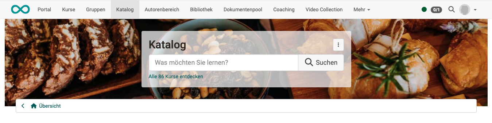
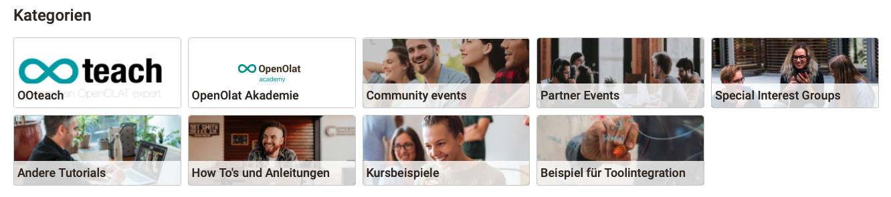
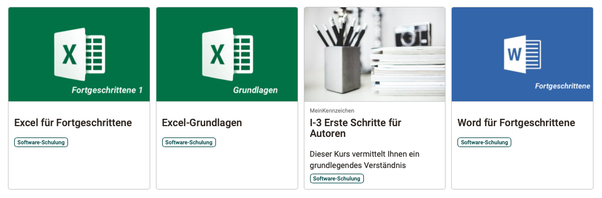
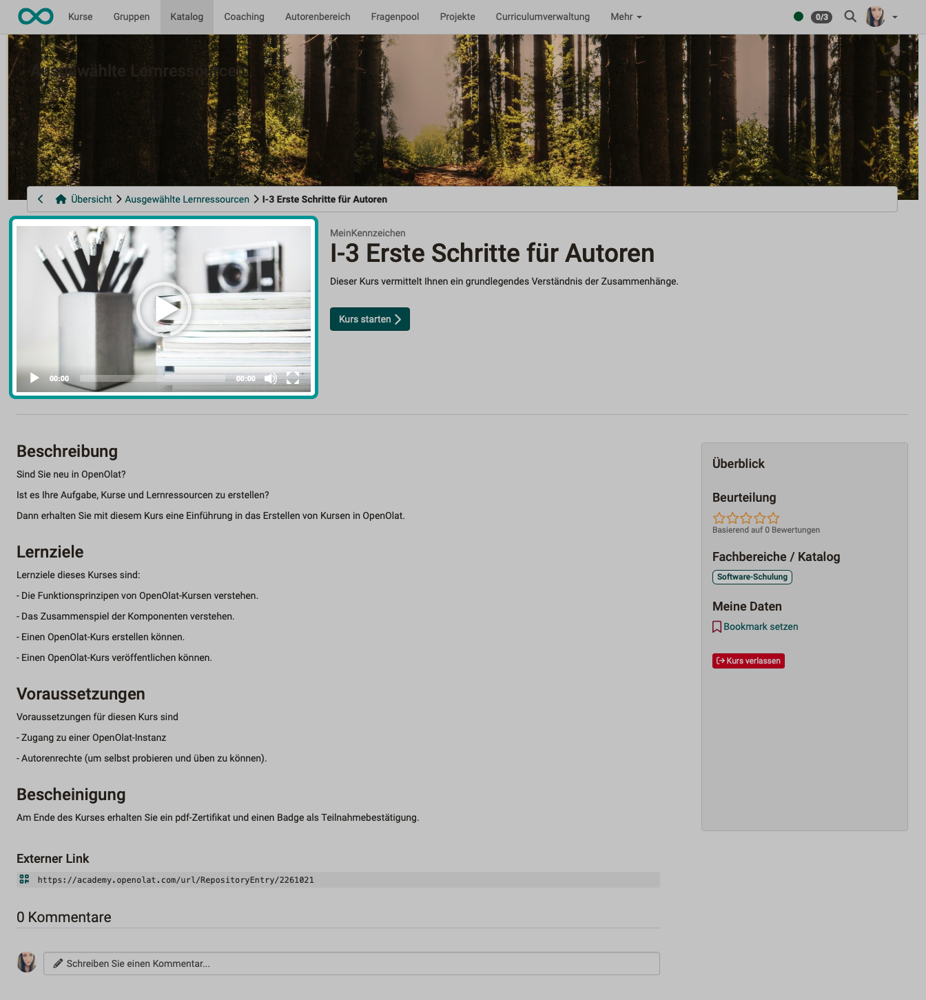
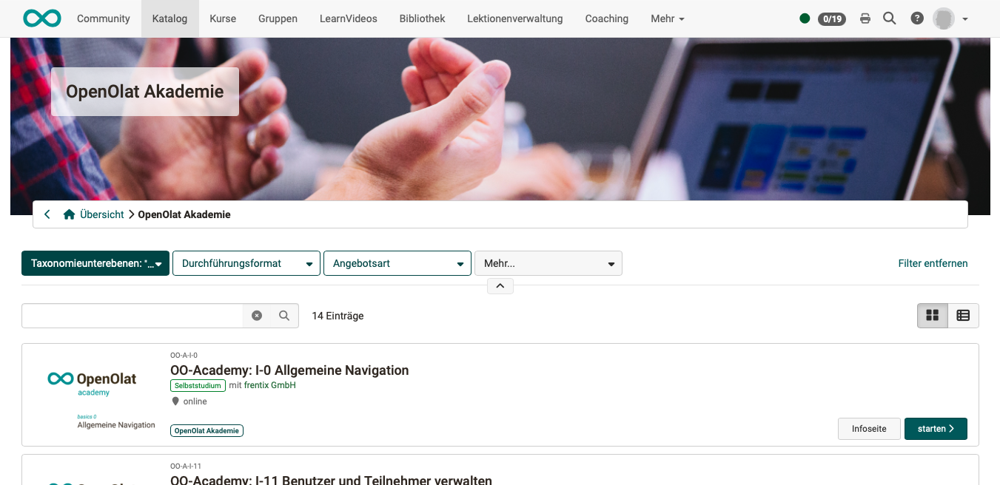

# Katalog 2.0 - Design {: #catalog_design}

Im Katalog werden Bilder für unterschiedliche illustrative Zwecke benutzt. Nachstehend finden Sie Informationen, wo und in welcher Grösse Bilder am besten importiert werden.

## Bildgrössen {: #image_size}

Wenn Bilder bereits in geeigneter Grösse in OpenOlat importiert werden, müssen sie von OpenOlat nicht mehr auf ein passendes Format oder Seitenverhältnis angepasst werden. Deshalb werden bestimmte Bildgrössen empfohlen. 

!!! tip "Tipp"

    Die unten angebotenen Muster (halbtransparente png) kann man sich im Grafikprogramm über das aktuelle Bild legen, um den passenden Ausschnitt zu wählen. 
    [Mockups zum Download >](assets/catalog20_image_mockups.zip)

### Header-Hintergrund {: #image_size_header}

**Verwendung:**
{ class="shadow lightbox" }

**Empfohlene Bildgrösse:** 1324 x 240 px, Dateigrösse max. 2 MB  
**Bemerkungen:** Ist das Bild höher als 240 px, wird ein passender Ausschnitt aus der Mitte heraus genommen. 
**Einfügen:** Das Hintergrundbild für die Startseite kann (mit Administratorenrecht) hochgeladen werden unter **Administration > Module > Katalog > Tab "Layout"**.   
**Muster:** [halbtransparentes png zum Download >](assets/catalog20_image_pattern_header.zip)

---

### Kategorien {: #image_size_categories}

**Verwendung:**
{ class="shadow lightbox" }

**Empfohlene Bildgrösse:** 240 x 155 px (Rechteck),  240 x 240 px (Quadrat) 
**Quadratisch oder rechteckig:** Die Bilder zu den Katagorien können quadratisch oder rechteckig gewählt werden. Diese Konfiguration ist einheitlich für alle Bilder zu den Kategorien und wird eingestellt unter **Administration > Module > Katalog > Tab "Layout"**. 
**Bemerkungen:** Der Text wird über dem unteren Bereich des Bildes angezeigt. Die Fläche dafür ist 240 x 35 px, weiss, halbtransparent und wird von OpenOlat über das Bild gelegt.  
**Einfügen:** Die Bilder für Kategorien werden (mit Administratorenrecht) hochgeladen unter **Administration > Module > Taxonomie > Tab "Metadaten"**. 
**Muster:** [halbtransparentes png zum Download >](assets/catalog20_image_pattern_categories.zip)

---

### Kachel/Karte {: #image_size_tile}

**Verwendung:**
{ class="shadow lightbox" }

**Empfohlene Bildgrösse:** max. 570 x 380 px, 72dpi, Dateigrösse max 5.1 MB  
**Bemerkungen:** Das Bild füllt den oberen Bereich der Kachel aus. Es ist das Titelbild des Kurses, das auch an anderen Stellen verwendet wird. Im unteren Bereich können Textelemente angezeigt werden. Ist das Bild grösser als der vorgesehene Bereich, wird ein passender Ausschnitt aus der Mitte des Bildes heraus genommen. 
**Einfügen:** Das Bild kann im jeweiligen Kurs (mit Autorenrecht) eingestellt werden unter **Administration > Einstellungen > Info**.  
**Muster:** [halbtransparentes png zum Download >](assets/catalog20_image_pattern_course.zip)

**Anzeigbare Informationen unter dem Bild:** Auf der Kachel können wahlweise folgende Informationen angezeigt werden. Diese Texte liegen nicht auf dem Bild, sondern werden unterhalb des Bildes angezeigt.

- Kennzeichen
- Teaser
- Fachbereiche/Katalog
- Durchführungsformat
- Hauptsprache
- Durchführungsort
- Durchführungszeitraum
- Autor:innen
- Zeitaufwand

Es ist zu empfehlen, aus Platzgründen nicht alle Informationen gleichzeitig auf der Kachel anzuzeigen. Deshalb ist eine Auswahl generell für alle Kacheln des Katalogs zu treffen unter **Administration > Module > Katalog > Tab "Layout"**. Die Höhe der Kacheln passt sich automatisch dem Platzbedarf an. 

---

### Infoseite zum Kurs {: #image_size_info}

**Verwendung:** 
{ class="shadow lightbox" }

**Zusätzliches Video:** Auf der Infoseite zum Kurs wird zunächst das Bild angezeigt. Wurde zusätzlich unter **Administration > Einstellungen > Info** ein Teaser-Video hochgeladen, kann es durch Klick auf das Bild gestartet werden. Das Video wird in der gleichen Grösse wie das Bild angezeigt, kann aber beim Abspielen auf Fullscreen vergrössert werden. 
**Empfohlene Bildgrösse:** 570 x 380 px, 72dpi, Dateigrösse max 5.1 MB  
**Bemerkungen:** Für die Infoseite zu einem Kurs wird das gleiche Bild verwendet, wie auf der Kachel/Karte im oberen Teil. 
**Einfügen:** Es kann im jeweiligen Kurs (mit Autorenrecht) eingestellt werden unter **Administration > Einstellungen > Info**.    
**Muster:** [halbtransparentes png zum Download >](assets/catalog20_image_pattern_course.zip)

---

### Microsite (nach Wahl einer Kategorie) {: #image_size_microsite}

**Verwendung:** 
{ class="shadow lightbox" }

**Empfohlene Bildgrösse:** 1324 x 240 px  
**Bemerkungen:** Ist das Bild höher als 240 px, wird ein passender Ausschnitt aus der Mitte heraus genommen. 
**Einfügen:** Die Header-Bilder für Microsites (Kategorien) werden (mit Administratorenrecht) hochgeladen unter **Administration > Module > Taxonomie > Tab "Metadaten"**.   
**Muster:** [halbtransparentes png zum Download >](assets/catalog20_image_pattern_header.zip)

[Zum Seitenanfang ^](#catalog_design)

---

## Weiterführende Informationen

[Angebote > ](../area_modules/catalog2.0_angebote.de.md) 
[Angebote erstellen > ](../../manual_how-to/catalog/catalog.de.md#catalog_create_offer) 
[Taxonomie > ](../../manual_admin/administration/Modules_Taxonomy.de.md) 

---

!!! info "Hinweis"

    Von den oben beschriebenen Gestaltungsmöglichkeiten abweichende Wünsche können von frentix geprüft und gegebenenfalls in das individuelle Layout einer Instanz integriert werden.

