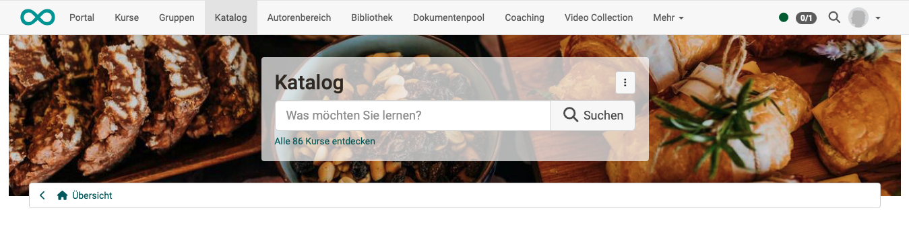
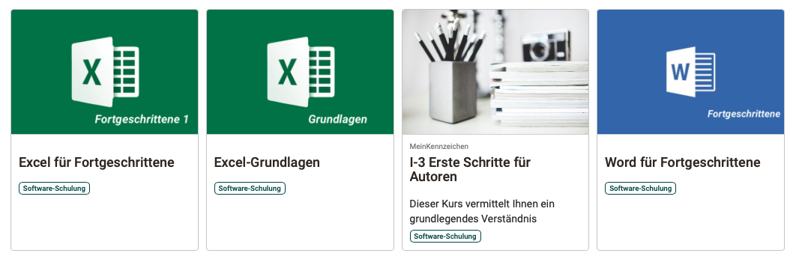
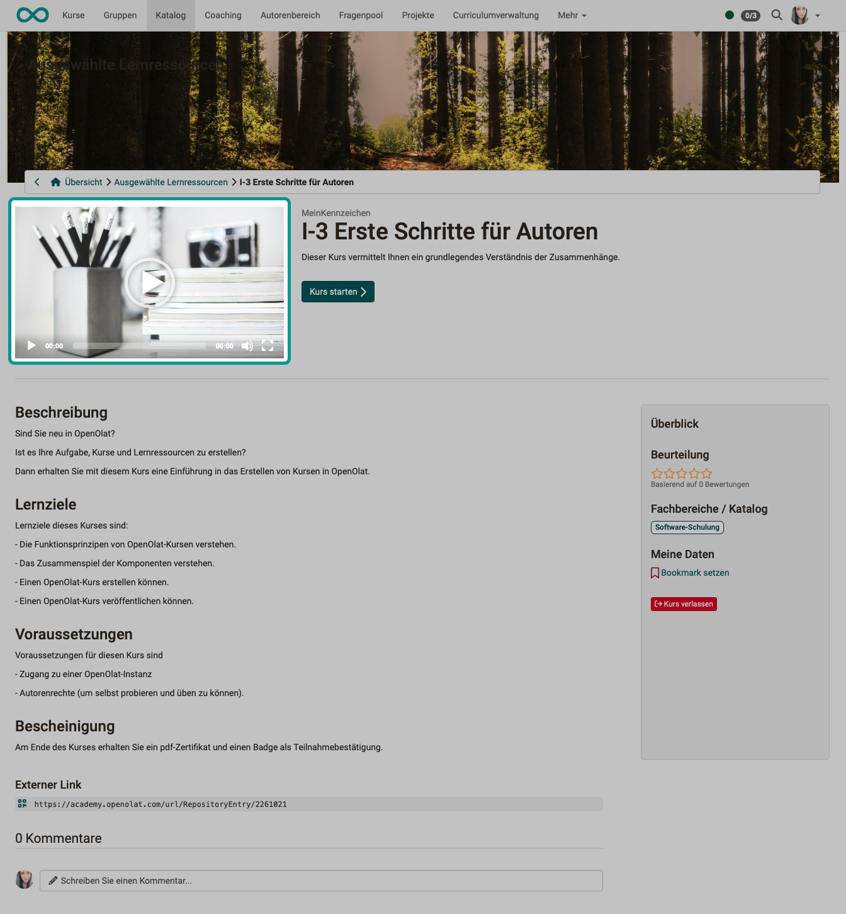
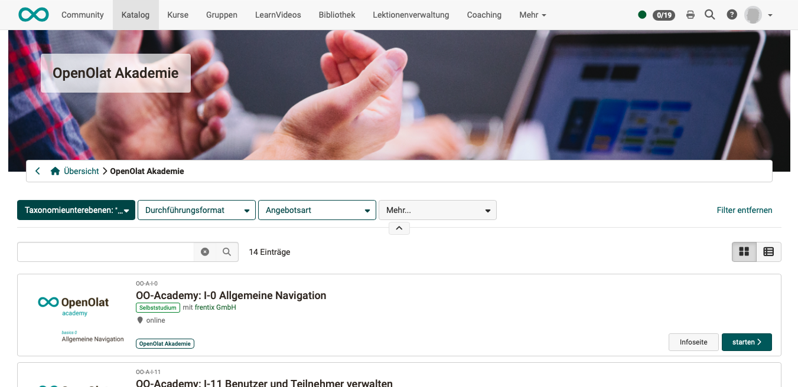

# Catalog 2.0 - Design {: #catalog_design}

Images are used in the catalog for various illustrative purposes. Below you will find information on where and in what size images are best imported.

## Image sizes {: #image_size}

If images are already imported into OpenOlat in a suitable size, OpenOlat no longer needs to adjust them to a suitable format or aspect ratio. Certain image sizes are therefore recommended.

!!! tip "Hint"

    The patterns offered below (semi-transparent png) can be placed over the current image in the graphics program to select the appropriate section. 
    [Mockups to download >](assets/catalog20_image_mockups.zip)

### Header background {: #image_size_header}

**Usage:**
{ class="shadow lightbox" }

**Recommended image size:** 1324 x 240 px, file size max. 2 MB 
**Remarks:** If the image is higher than 240 px, a suitable section is taken from the center. 
**Insert:** The background image for the start page can be uploaded with administrator rights in the system administration under `Administration > Modules > Catalog > Tab "Layout"`. 
**Sample:** [semi-transparent png to download >](assets/catalog20_image_pattern_header.zip)

---

### Categories {: #image_size_categories}
(Launchers of type "taxonomy level")

**Usage:** 
{ class="shadow lightbox" }

**Recommended image size:** 240 x 155 px (rectangle), 240 x 240 px (square) 
**Square or rectangular:** The images for the categories can be square or rectangular. This configuration is uniform for all category images and is set in the system administration under `Administration > Modules > Catalog > Tab "Layout"`. 
**Remarks:** The text is displayed over the lower area of the image. The area for this is 240 x 35 px, white, semi-transparent and is placed over the image by OpenOlat. 
**Insert:** The images for taxonomy launchers (categories) are uploaded with administrator rights in the system administration under `Administration > Modules > Taxonomy > Tab "Metadata"`. 
**Sample:** [semi-transparent png to download >](assets/catalog20_image_pattern_categories.zip)

---

### Tile/card {: #image_size_tile}

**Usage:**
{ class="shadow lightbox" }

**Recommended image size:** max. 570 x 380 px, 72dpi, file size max 5.1 MB 
**Remarks:** The image fills the upper area of the tile. It is the title image of the course, which is also used in other places. Text elements can be displayed in the lower area. If the image is larger than the designated area, a suitable section is taken from the center of the image. 
**Insert:** The image can be set in the respective course with author rights under `Course > Administration > Settings > Tab "Info"`. 
**Sample:** [semi-transparent png to download >](assets/catalog20_image_pattern_course.zip)

**Displayable information below the image:** The following information can optionally be displayed on the tile. These texts are not on the image, but are displayed below the image.

- Reference
- Teaser
- Subjects / Catalog
- Implementation format
- Main language
- Location
- Execution period
- Authors
- Expenditure of work

For reasons of space, it is recommended not to display all information on the tile at the same time. Therefore, a selection is made for all tiles of the catalog in the system administration under `Administration > Modules > Catalog > Tab "Layout"`. The height of the tiles automatically adjusts to the space required.

---

### Info page of the course {: #image_size_info}

**Usage:**
{ class="shadow lightbox" }

**Additional video:** The image is displayed first on the info page of the course. If a teaser video has additionally been uploaded under `Course > Administration > Settings > Tab "Info"`, it can be started by clicking on the image. The video is displayed in the same size as the image, but can be enlarged to full screen during playback. 
**Recommended image size:** 570 x 380 px, 72dpi, file size max 5.1 MB 
**Remarks:** The same image is used for the info page of a course as on the tile/card in the upper part. 
**Insert:** It can be set in the respective course with author rights under `Course > Administration > Settings > Tab "Info"`. 
**Sample:** [semi-transparent png to download >](assets/catalog20_image_pattern_course.zip)

---

### Microsite (after selecting a taxonomy level/a category) {: #image_size_microsite}

**Usage:**
{ class="shadow lightbox" }

**Recommended image size:** 1324 x 240 px 
**Remarks:** If the image is higher than 240 px, a suitable section is taken from the center. 
**Insert:** The header images for microsites (in taxonomy launchers/categories) are uploaded with administrator rights in the system administration under `Administration > Modules > Taxonomy > Tab "Metadata"`. 
**Sample:** [semi-transparent png to download >](assets/catalog20_image_pattern_header.zip)

!!! note "Note"

    Requests that deviate from the design options described above can be checked by frentix and, if necessary, integrated into the individual layout of an instance.

[To the top of the page ^](#catalog_design)

---

## Further information {: #further_information}

[Offers >](../area_modules/catalog2.0_angebote.md) 
[How do I present my courses in the OpenOlat catalog? >](../../manual_how-to/catalog/catalog.md) 
[Taxonomy (administration manual) >](../../manual_admin/administration/Modules_Taxonomy.md)

[To the top of the page ^](#catalog_design)
