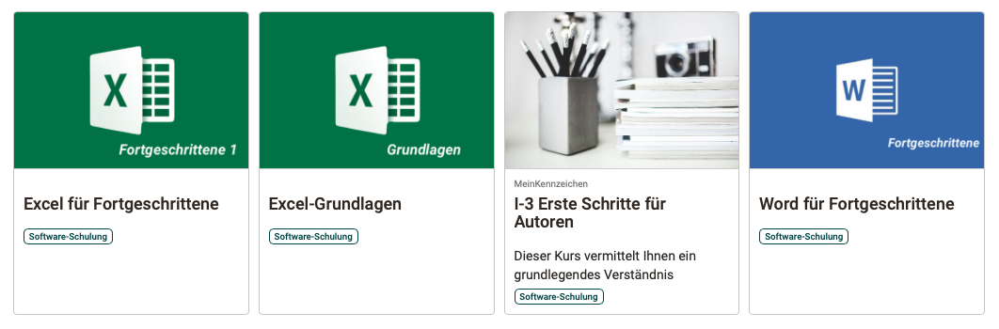
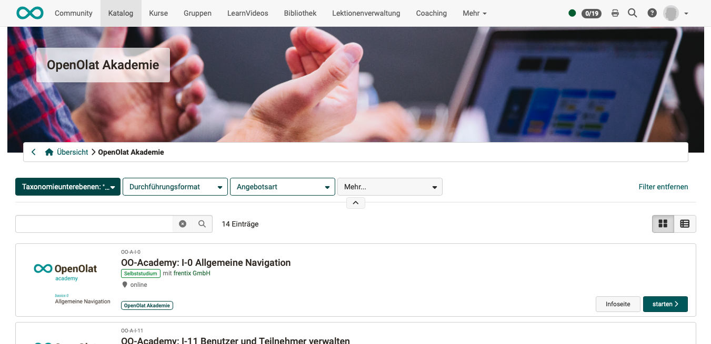

# Catalog 2.0 - Design  {: #catalog_design}

Images are used in the catalog for various illustrative purposes. Below you will find information on where and in what size images are best imported.

## Image size  {: #image_size}

If images are already imported into OpenOlat in a suitable size, OpenOlat no longer needs to adjust them to a suitable format or aspect ratio. Certain image sizes are therefore recommended.

!!! tip "Hint"

    The patterns offered below (semi-transparent png) can be placed over the current image in the graphics program to select the appropriate section. 
    [Mockups to download >](assets/catalog20_image_mockups.zip)

### Header background {: #image_size_header}

**Usage:**
{ class="shadow lightbox" }

**Recommended image size:** 1324 x 240 px, file size max. 2MB  
**Remarks:** If the image is higher than 240 px, a suitable section is taken from the center.  
**Insert:** The background image for the start page can be uploaded (with administrator rights) under **Administration > Module > Catalog > Tab "Layout"**.  
**Sample:** [half-transparent png to download >](assets/catalog20_image_pattern_header.zip)

---

### Categories {: #image_size_categories}

**Usage**
{ class="shadow lightbox" }

**Recommended image size:** 240 x 155 px (Rectangle), 240 x 240 px (square) 
**Squared or rectangular:** The images for the categories can be square or rectangular. This configuration is standardized for all category images and is set under **Administration > Module > Catalog > Tab "Layout"**. 
**Remarks:** The text is displayed above the lower area of the image. The area for this is 240 x 35 px, white, semi-transparent and is placed over the image by OpenOlat.  
**Insert:** The images for categories are uploaded (with administrator rights) under **Administration > Module > Taxonomy > Tab "Meta data"** 
**Sample:** [half-transparent png to download >](assets/catalog20_image_pattern_categories.zip)

---

### Tile/Card {: #image_size_tile}

**Usage**
{ class="shadow lightbox" }

**Recommended image size:** max. 570 x 380 px, 72dpi, file size max. 5.1MB  
**Remarks:** The image fills the upper area of the tile. It is the title image of the course, which is also used in other places. Text elements can be displayed in the lower area. If the image is larger than the designated area, a suitable section is taken from the center of the image.  
**Insert:** The image can be posted in the respective course (with copyright) under  **Administration > Settings > Info**.  
**Sample:** [half-transparent png to download >](assets/catalog20_image_pattern_course.zip)

**Displayable information under the image:** The following information can optionally be displayed on the tile. These texts are not on the image, but are displayed below the image.

- Identification mark
- Teaser
- Departments/Catalog
- Format of execution
- Main language
- Place of execution
- Time of execution
- Author
- Time requirement

For space reasons, it is recommended not to display all information on the tile at the same time. Therefore, a selection should generally be made for all tiles in the catalog under **Administration > Module > Catalog > Tab "Layout"**. The height of the tiles automatically adjusts to the space required. 

---

### Info page about the course {: #image_size_info}

**Usage:**
{ class="shadow lightbox" }

**Additional video:** The image is displayed first on the information page for the course. If a teaser video is uploaded additionally under **Administration > Settings > Info**, it can be started with a click on the teaser image. The video is displayed in the same size as the image, but can be enlarged to full screen during playback. 
**Recommended image size:** max. 570 x 380 px, 72dpi, file size max. 5.1MB  
**Remarks:** The same image is used for the info page for a course as on the tile/map in the upper part. 
**Insert:** It can be posted in the respective course (with author rights) under **Administration > Settings > Info**.  
**Sample:** [half-transparent png to download >](assets/catalog20_image_pattern_course.zip)

---

### Microsite (after selecting a category) {: #image_size_microsite}

**Usage**
{ class="shadow lightbox" }

**Recommended image size:** 1324 x 240 px  
**Remarks:** If the image is higher than 240 px, a suitable section is taken from the center. 
**Insert:** The header images for microsites (categories) are uploaded (with administrator rights) under **Administration > Module > Taxonomy > "Meta data"**.  
**Sample:** [half-transparent png to download >](assets/catalog20_image_pattern_course.zip)

[To the top of the page ^](#catalog-20---design---catalog_design)

---

## Further information

[Offers > ](../area_modules/catalog2.0_angebote.md) 
[Create offers > ](../../manual_how-to/catalog/catalog.md#catalog_create_offer) 
[Taxonomy > ](../../manual_admin/administration/Modules_Taxonomy.md) 

!!! info "Hint"

    Requests that deviate from the design options described above can be checked by frentix and, if necessary, integrated into the individual layout of an instance.

