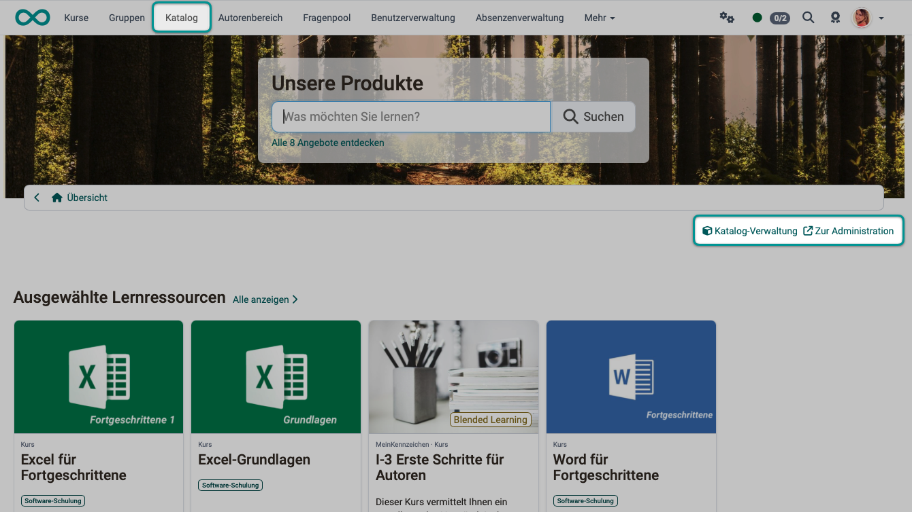
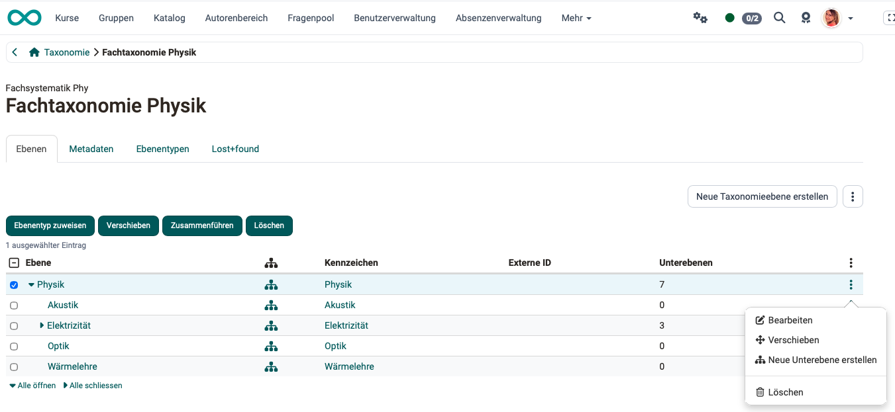
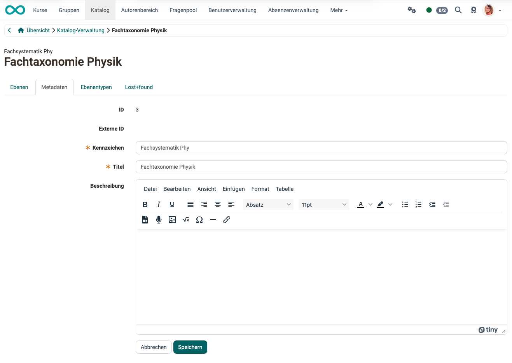
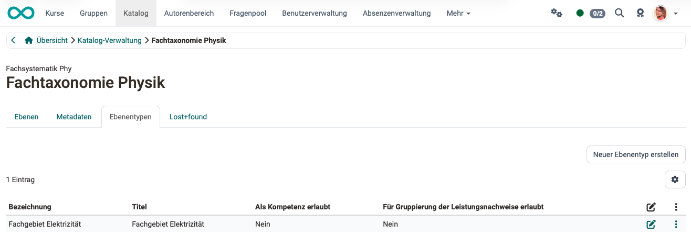
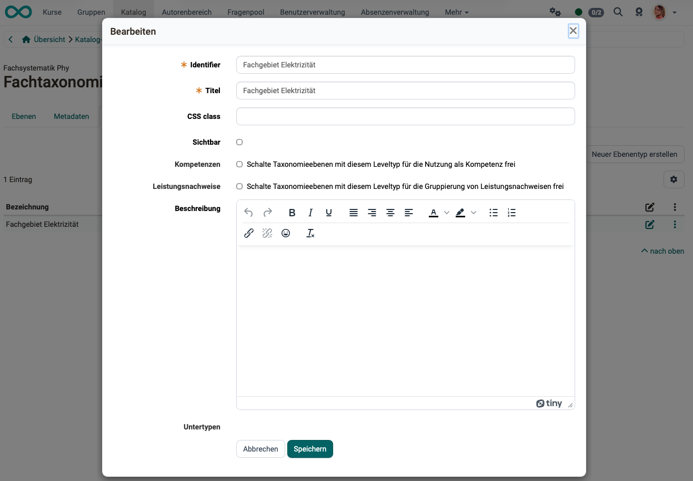
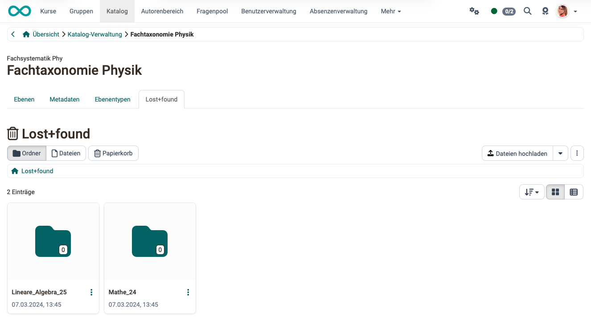

# Katalog 2.0 - Verwaltung {: #catalog_mgmt}

## Kurzbeschreibung der Katalog-Verwaltung {: #description}

Die Katalogverwaltung des Katalogs V2 ist kein Aufgabenbereich, der einer eigenen Rolle zugeordnet wäre. Es ist vielmehr ein Feature zur Bearbeitung derjenigen Taxonomien, die im Katalog verwendet werden. Wer dieses Recht (Kompetenz "Verwalten") besitzt, kann diese Taxonomien und Teile davon bearbeiten, ohne Administrator:in zu sein.

## Wo wird die Katalog-Verwaltung aufgerufen? {: #access}

Der Zugriff auf die Katalogverwaltung erfolgt über einen Link im Katalog.
Im Katalog finden Berechtigte rechts oben unter dem Header zusätzlich die Links

- **Katalog-Verwaltung**
- **Zur Administration**

{ class="shadow lightbox" }

[Zum Seitenanfang ^](#catalog_mgmt)

---

## Wer sieht im Katalog die beiden Links? {: #access_links}

Den Link **"Katalog-Verwaltung"** haben

- Lernressourcenverwalter:innen
- Administrator:innen
- Systemadministrator:innen

Den Link **"Zur Administration"** haben

- Systemadministrator:innen

[Zum Seitenanfang ^](#catalog_mgmt)

---

## Wie bekommt man das Recht (die Kompetenz) zur Katalogverwaltung? [:octicons-tag-16:{ title="ab Release 20.1 (OO-8544)" }](https://track.frentix.com/issue/OO-8544) {: #competence}

Die Kompetenz "Verwalten" (das Recht zur Bearbeitung der im Katalog verwendeten Taxonomien) kann auf 2 Arten erteilt werden:

**Möglichkeit 1:** 
Durch Systemadministrator:innen in der System-Administration: 
`Administration > Module > Taxonomie > "Taxonomietitel" > "Taxonomieebene" > Tab "Verwaltung" > Button "Verwalter:in hinzufügen"` 
Die Taxonomie muss für den Katalog aktiviert sein. Öffnen Sie sie mit "anzeigen/bearbeiten".

**Möglichkeit 2:** 
Durch Benutzerverwalter:innen: 
`Benutzerverwaltung > "Person" > Tab "Kompetenzen" > Button "Kompetenz 'Verwalten' hinzufügen"`

Sobald die Kompetenz erteilt wird, erscheint für diese Person der Link "Katalog-Verwaltung" rechts oben unter dem Katalog-Header.

!!! info "Wichtig"

    Die Katalogverwaltung ist nicht auf eine bestimmte Organisationseinheit eingeschränkt, obwohl die Rolle Lernressourcenverwalter:in auf eine Organisationseinheit eingeschränkt sein kann. (Taxonomien sind ebenfalls nicht auf Organisationseinheiten beschränkt.)

[Zum Seitenanfang ^](#catalog_mgmt)

---

## Sind Bearbeitungen von Lernressourcen in der Katalogverwaltung möglich? {: #functions}

Die inhaltliche Bearbeitung von Lernressourcen im Katalog findet im Autorenbereich statt. Kurse bearbeiten Sie deshalb [im Autorenbereich](../area_modules/Authoring.de.md). Dort werden diese auch gelöscht, zum Beispiel wenn sie beendet sind.

### Tab Ebenen  {: #tab_level}
Die Bearbeitungsmöglichkeiten der Fachbereiche (Taxonomieebenen) umfassen:

- Bearbeiten
- Verschieben
- Zusammenführen
- Ebenentyp zuweisen
- Löschen von Elementen der Taxonomieebene / Untertaxonomien
- Erstellen neuer Unterebenen

Unter den 3 Punkten rechts neben dem Button "Neue Taxonomieebene erstellen" finden Sie auch eine Möglichkeit, Taxonomieebenen zu importieren oder alle zu exportieren. Ein Export kann als zip-Archiv heruntergeladen werden. Darin enthalten ist eine Excel-Tabelle mit der hierarchischen Struktur der Taxonomieebenen.

{ class="shadow lightbox" }

!!! info "Wichtig"

    Das Gestalten der Launcher, Bereiche, usw. ist den Systemadministrator:innen vorbehalten.

[Zum Seitenanfang ^](#catalog_mgmt)

---

### Tab Metadaten {: #tab_metadata}

{ class="shadow lightbox" }

**ID:** Die ID wird automatisch erstellt und ermöglicht die eindeutige Identifikation des Objekts.

**Externe ID:** Falls ein externes Verwaltungssystem die Ebenen angelegt hat, wird zusätzlich zur automatisch erstellten ID die externe ID erstellt.

**Kennzeichen:** (Pflichtfeld) Wählen Sie ein eindeutiges und logisches Kennzeichen als Kennung für die Taxonomieebene. Dieses Kennzeichen wird in der Tabelle im Tab "Taxonomie" in der Spalte "Ebenentyp" angezeigt und ist für viele Zwecke praktikabler als der ausführliche Titel (der dafür verständlicher, umgangssprachlicher sein kann).

**Titel:** (Pflichtfeld) Der Titel wird an unterschiedlichen Stellen verwendet (Katalog 2.0, Dokumentenpool, e-Portfolio, Fragenpool). Er sollte die Taxonomieebene kurz und zutreffend beschreiben.

**Beschreibung:** Die Eingabe einer etwas ausführlicheren Beschreibung der Ebene ist optional.

[Zum Seitenanfang ^](#catalog_mgmt)

---

### Tab Ebenentypen {: #tab_leveltype}

Mit dem Button "Neuer Ebenentyp erstellen" legen Sie einen weiteren Ebenentyp an. Im Bearbeitungsdialog stehen die folgenden Felder zur Verfügung.

{ class="shadow lightbox" }

{ class="shadow lightbox" }

**Identifier:** Zusätzlich zum Titel muss ein Identifier angegeben werden.

**Titel:** Formulieren Sie einen zutreffenden Titel zur Beschreibung des Ebenentyps.

**CSS class:** Sofern eine entsprechende CSS class im Theme hinterlegt ist, kann sie hier ausgewählt werden.

**Sichtbar:** Hier wird definiert, ob alle Taxonomieebenen dieses Typs sichtbar sein sollen.

**Kompetenzen:** Benutzer:innen können in der Benutzerverwaltung Kompetenzen zugeteilt werden. Mit Wahl dieser Option werden Taxonomieebenen mit diesem Ebenentyp für die Nutzung als Kompetenz freigeschaltet.

**Leistungsnachweise:** Mit Wahl dieser Option werden Taxonomieebenen mit diesem Ebenentyp für die Gruppierung von Leistungsnachweisen freigeschaltet.

**Beschreibung:** Eine ausführlichere Beschreibung des Ebenentyps ist optional.

**Untertypen:** Aus den bereits bestehenden Ebenentypen kann ein Untertyp ausgewählt werden. So ist es möglich, eine hierarchische Struktur zu schaffen. Sie wird dann beim Erstellen der Taxonomieebenen sichtbar.

[Zum Seitenanfang ^](#catalog_mgmt)

---

### Tab Lost+found {: #tab_lost_found}

Hier liegen die Dokumente gelöschter Taxonomieebenen. Löschen Sie eine Ebene, ohne sie zusammenzuführen, kopiert OpenOlat deren Dokumente in einen Unterordner. Der Ordnername besteht aus dem Kennzeichen und der ID der gelöschten Ebene. Führen Sie die Ebene stattdessen mit einer anderen Ebene zusammen, wandern die Dokumente in die Zielebene.

{ class="shadow lightbox" }

[Zum Seitenanfang ^](#catalog_mgmt)

---

## Weiterführende Informationen {: #further_information}

[Autorenbereich >](../area_modules/Authoring.de.md) 
[Taxonomie (Administrationshandbuch) >](../../manual_admin/administration/Modules_Taxonomy.de.md) 
[Wie zeige ich meine Kurse im OpenOlat-Katalog? >](../../manual_how-to/catalog/catalog.de.md) 
[Angebote erstellen >](../area_modules/catalog2.0_angebote.de.md) 
[Katalog-Design >](../area_modules/catalog2.0_design.de.md) 
[Der Web-Katalog >](../area_modules/catalog2.0_web.de.md) 
[Katalog einrichten (Administrationshandbuch) >](../../manual_admin/administration/Modules_Catalog_2.0.de.md) 

[Zum Seitenanfang ^](#catalog_mgmt)

