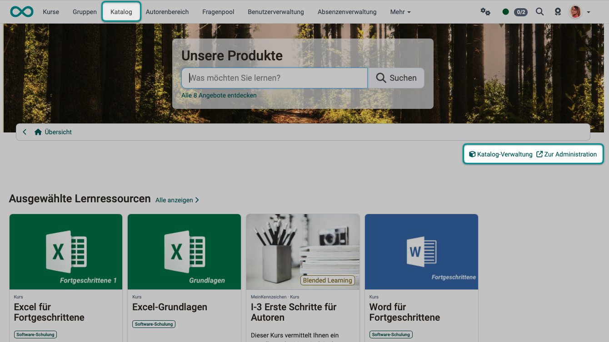
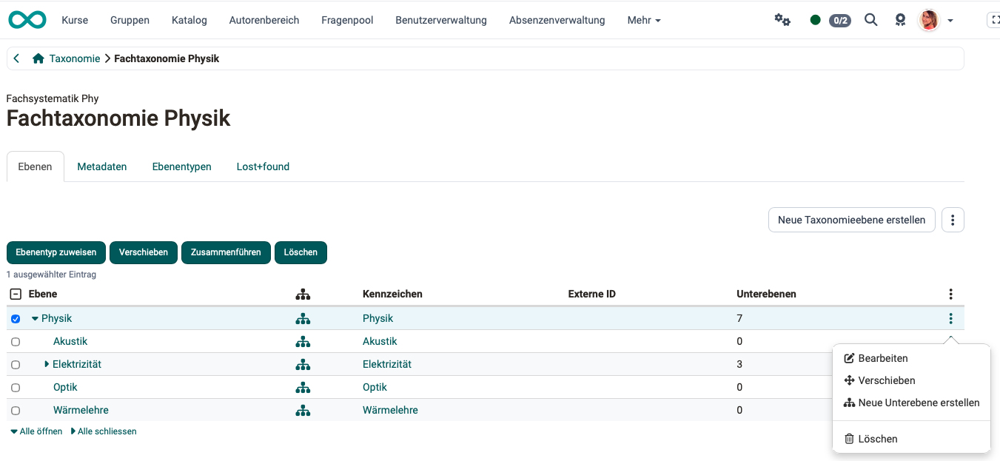
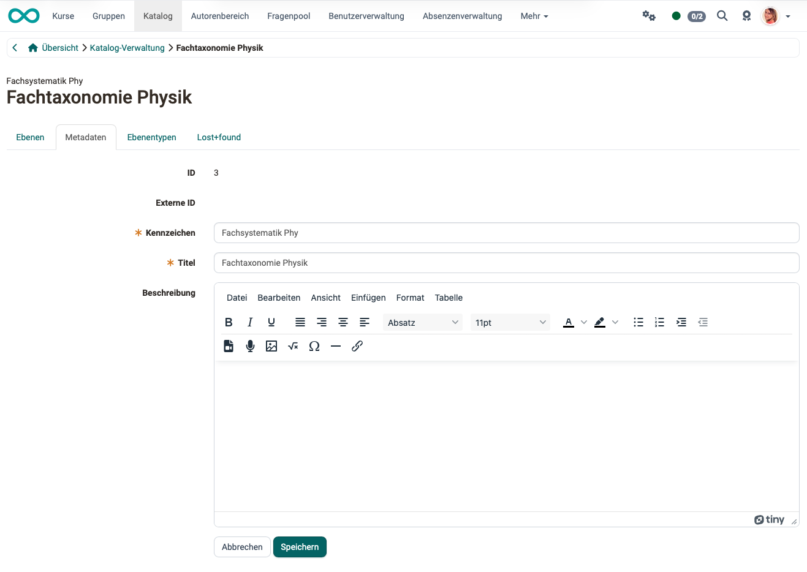
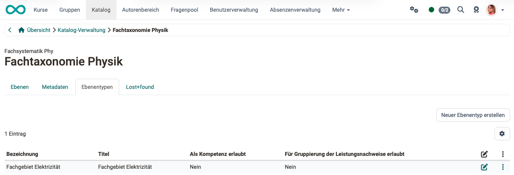
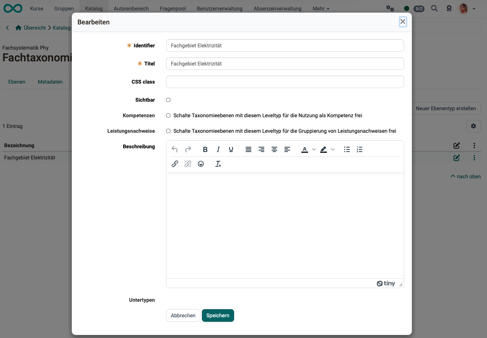
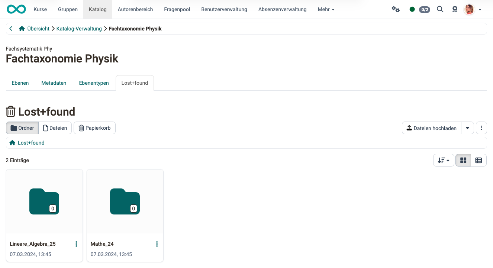

# Catalog 2.0 - Management {: #catalog_mgmt}

## Kurzbeschreibung der Katalog-Verwaltung {: #description}

Catalog V2 management is not a responsibility assigned to a specific role. Rather, it is a feature for editing the taxonomies used in the catalog. Users with this permission ("Managing" competence) can edit these taxonomies and parts of them without being an administrator.

## Where can I access the catalog management? {: #access}

Access to the catalog management system is available via a link in the catalog.
In the catalog, authorized users will also find the following links in the top-right corner, below the header:

- **Catalog management**
- **To the administration**

{ class="shadow lightbox" }

[To the top of the page ^](#catalog_mgmt)

---

## Who sees the access links in the catalog? {: #access_links}

Click the **"Catalog Management"** link

- Learning resource managers
- Administrators
- System administrators

Click the **"Administration"** link

- System administrators

[To the top of the page ^](#catalog_mgmt)

---

## How do you obtain the right (authority) to manage the catalog? {: #competence}

The "Manage" permission (the right to edit the taxonomies used in the catalog) can be granted in two ways:

**Option 1:** 
By system administrators: 
Administration > Modules > Taxonomy > Click "View/Edit" in a taxonomy that is enabled for the catalog > Select a taxonomy level > "Administration" tab > "Add administrator" button

**Option 2:** 
By user management: 
User Management > Select a Person > Competencies tab > "Add 'Manage' competency" button

Once the permission has been granted, the "Catalog Management" link will appear for that person in the upper-right corner, below the catalog header.

!!! hint "Note"

    Catalog management is not limited to a specific organizational unit, although the role of Learning Resources Manager may be restricted to a specific organizational unit. (Taxonomies are also not limited to organizational units.)

[To the top of the page ^](#catalog_mgmt)

---

## What operations are possible in catalog management? {: #functions}

### Tab Level  {: #tab_level}
The editing options for the subject areas (taxonomy levels) include:

- Move
- Deleting elements of the taxonomy level / subtaxonomies
- Creating new sub-layers

Under the three dots to the right of the “Create New Taxonomy Level” button, you'll also find options to import taxonomy levels or export them all. The exported data can be downloaded as a ZIP archive, which contains an Excel spreadsheet showing the hierarchical structure of the taxonomy levels.

{ class="shadow lightbox" }

!!! hint "Note"

    The design of launchers, sections, etc., is reserved for system administrators.

[To the top of the page ^](#catalog_mgmt)

---

### Tab Metadata {: #tab_metadata}

{ class="shadow lightbox" }

**ID:** The ID is generated automatically and allows the object to be uniquely identified.

**External ID:** If an external management system created the levels, the external ID is generated in addition to the automatically generated ID.

**Identifier:** (Required field) Select a unique and logical identifier for the taxonomy level. This identifier appears in the “Taxonomy” tab of the table, in the "Level Type" column, and is more practical for many purposes than the full title (which may be more understandable and colloquial).

**Title:** (Required field) The title is used in various places (Catalog 2.0, Document Pool, e-Portfolio, Question Pool). It should provide a brief and accurate description of the taxonomy level.

**Description:** Entering a more detailed description of the layer is optional.

[To the top of the page ^](#catalog_mgmt)

---

### Tab Level types {: #tab_leveltype}

{ class="shadow lightbox" }

{ class="shadow lightbox" }

**Identifier:** In addition to the title, an identifier must be provided.

**Title:** Enter an appropriate title to describe the layer type.

**CSS class:** If a corresponding CSS class is defined in the theme, it can be selected here.

**Visible:** This setting determines whether all taxonomy levels of this type should be visible.

**Competencies:** Users can be assigned competencies in the user management section. Selecting this option enables taxonomy levels of this type to be used as competencies.

**Coursework:** Selecting this option enables taxonomy levels with this level type for grouping coursework.

**Description:** A more detailed description of the layer type is optional.

**Subtypes:** You can select a subtype from the existing level types. This allows you to create a hierarchical structure, which will then be visible when you create the taxonomy levels.

[To the top of the page ^](#catalog_mgmt)

---

### Tab Lost & Found {: #tab_lost_found}

All elements from the "Layers" tab are stored here.

{ class="shadow lightbox" }

[To the top of the page ^](#catalog_mgmt)

---

## Further information {: #further_information}

[Taxonomy (admin manual) > ](../../manual_admin/administration/Modules_Taxonomy.md) 
[Create offer >](../area_modules/catalog2.0_angebote.md) 
[Catalog design >](../area_modules/catalog2.0_design.md) 
[The web catalog >](../area_modules/catalog2.0_web.md) 
[Set up catalog (admin manual) >](../../manual_admin/administration/Modules_Catalog_2.0.md#config_web-catalog) 

[To the top of the page ^](#catalog_mgmt)