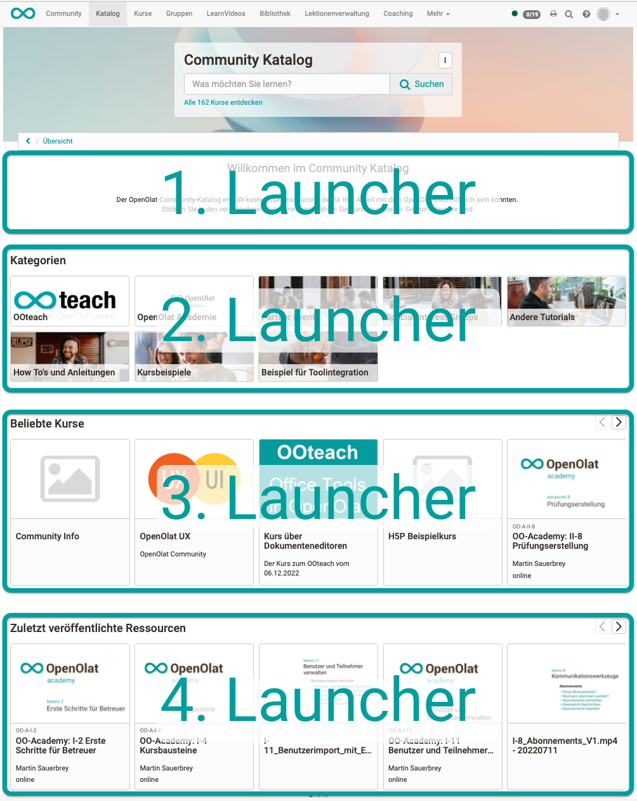
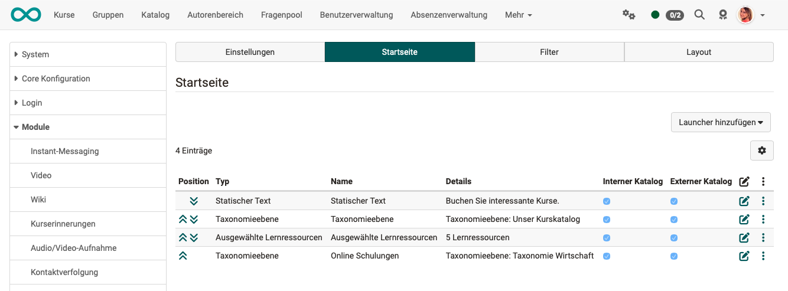
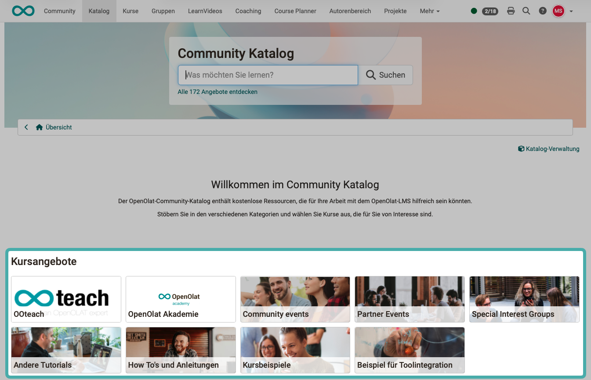
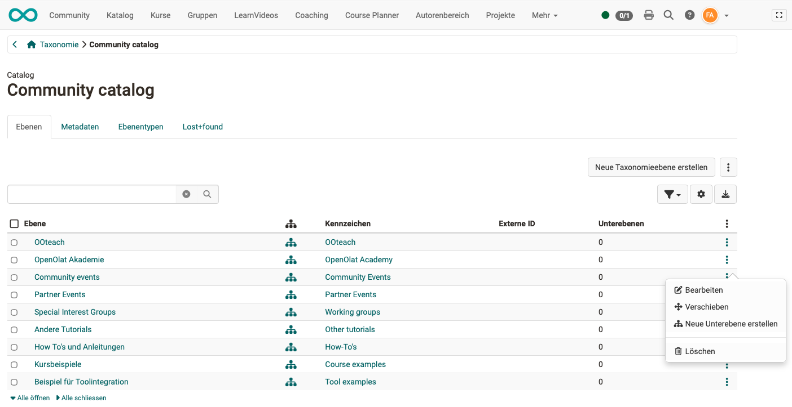
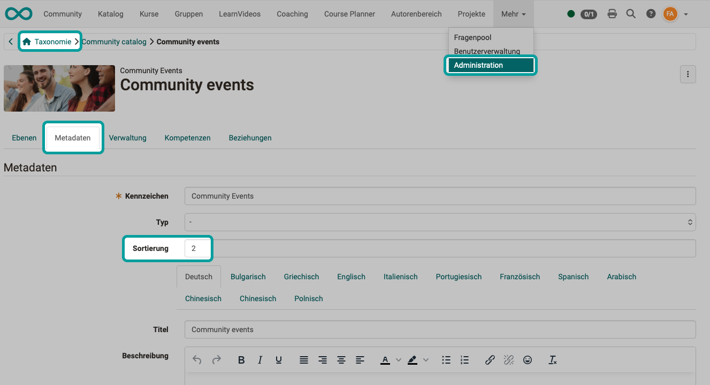
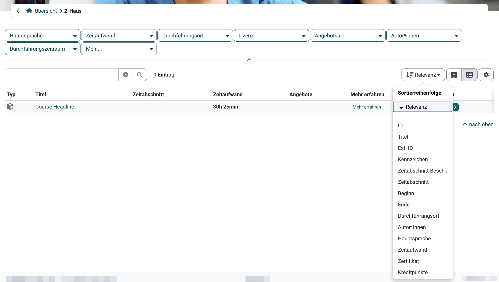
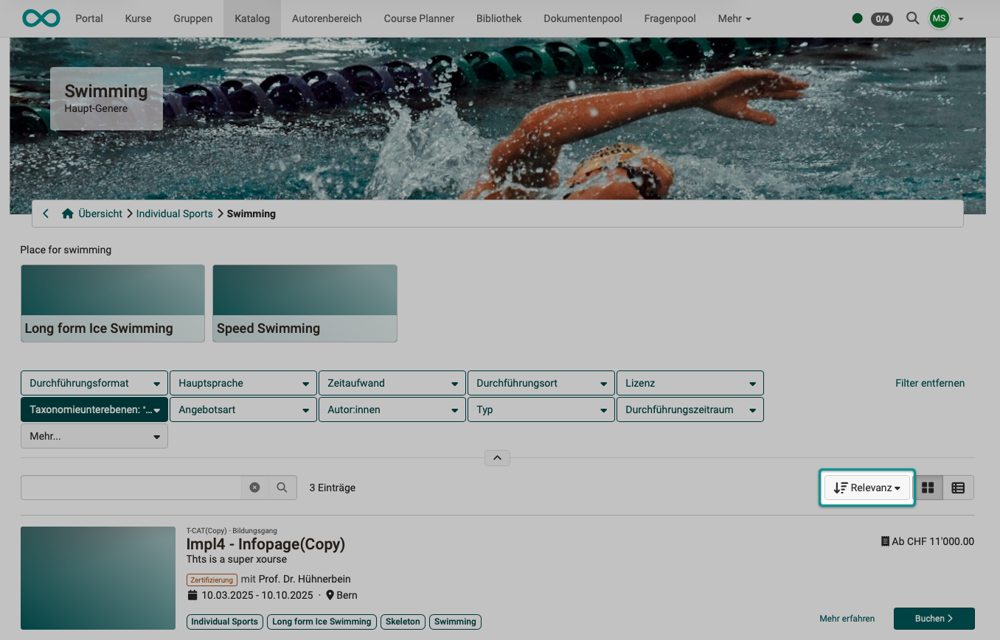
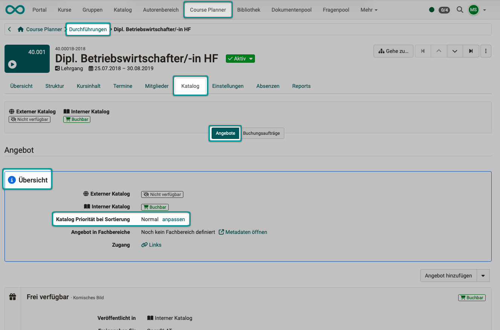
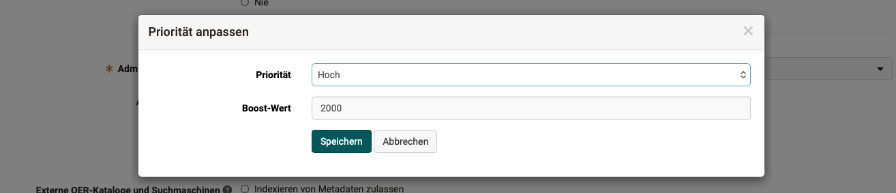

# Katalog 2.0 - Sortierung/Reihenfolge {: #catalog_sort}

Im Katalog 2.0 können die Angebote manuell oder dynamisch zusammengestellt werden. Wenn Kursbesitzer:innen beim Konfigurieren den Wunsch angegeben haben, dass ihr Kurs im Katalog erscheinen soll, werden dynamisch Einträge in den Katalog eingefügt.

Dadurch stellt sich die Frage, an welcher Stelle im Katalog die Angebote angezeigt werden.

## Sortierung/Reihenfolge auf der Startseite des Katalogs {: #sorting_startpage}

Auf der **Startseite** des Katalogs wird die Reihenfolge der Objekte durch die Launcher bestimmt. Als Launcher werden die Abschnitte bezeichnet.

{ class="shadow lightbox" }

!!! note "Wie zeige ich meine Kurse im Katalog?"
    Anleitung zum Anzeigen von Kursen im Katalog. 
    [Wie zeige ich meine Kurse im Katalog? >](../../manual_how-to/catalog/catalog.de.md)

### Reihenfolge der Launcher festlegen {: #sorting_startpage_launcher}

Die Reihenfolge der Launcher (Abschnitte auf der Startseite) wird in der System-Administration festgelegt unter: 
`Administration > Module > Katalog > Tab "Startseite"`

Die Reihenfolge kann durch Klick auf die Doppelpfeile zu Beginn der Zeilen festgelegt werden.

{ class="shadow lightbox" }

[Zum Seitenanfang ^](#catalog_sort)

---

### Sortierung innerhalb eines Launchers {: #sorting_startpage_inside_launcher}

Innerhalb eines Launcher hängt die Reihenfolge der Angebote vom Launchertyp ab:

!!! note "Launchertyp"
    Konfiguration der Launchertypen in der Administration. 
    [Launchertyp >](../../manual_admin/administration/Modules_Catalog_2.0.de.md#tab_start_page)

**Launchertyp "Statischer Text":** 
Es erfolgt keine automatische Sortierung.

**Launchertyp "Beliebte Kurse":** 
Die Reihenfolge der Angebote wird durch die Anzahl der Klicks auf Kursbausteine während der letzten 28 Tage bestimmt. Dabei werden nur Kurse mit Status "Veröffentlicht" berücksichtigt.

**Launchertyp "Zuletzt veröffentlicht":** 
Die Angebote sind nach Veröffentlichungsdatum geordnet.

**Launchertyp "Zufallsgenerator":** 
Zufallsreihenfolge

**Launchertyp "Taxonomieebene":** 
In einem Launcher vom Typ "Taxonomielevel" werden keine Kurse und Lernressourcen direkt angezeigt, die angezeigten Taxonomielevel entsprechen vielmehr Ordnern, in denen dann erst die Kurse und Lernressourcen zu finden sind. 
Die Angebote werden nach der Taxonomie automatisch ausgewählt und dann alphabetisch geordnet in einer Microsite aufgelistet, die sich beim Klick auf einen der Taxonomielevel in einem Taxonomie-Launcher öffnet.

**Launchertyp "Ausgewählte Lernressourcen":** 
Die manuell hinzugefügten Lernressourcen können durch Klick auf Doppelpfeile vor den Einträgen geordnet werden.

**Launchertyp "Ausgewählte Durchführungen":** 
Die manuell hinzugefügten Durchführungen können durch Klick auf Doppelpfeile vor den Einträgen geordnet werden.

[Zum Seitenanfang ^](#catalog_sort)

---

### Reihenfolge der Unterseiten/Kategorien festlegen {: #sorting_startpage_categories}

Soll ein Launcher Unterkategorien anzeigen, wird ein Launcher vom Typ "Taxonomieebene" verwendet.

{ class="shadow lightbox" }

Die Reihenfolge der Einträge innerhalb des Taxonomie-Launchers (Reihenfolge der Unterseiten/Kategorien im Katalog) wird durch die Struktur der Taxonomie bestimmt und muss deshalb via Taxonomie geändert werden. 
`Administration > Module > Taxonomie > Aktivierung einer Taxonomie für Lernressourcen/Katalog`

Beispiel: Taxonomiestruktur für den vorstehend angezeigten Taxonomie-Launcher:

{ class="shadow lightbox" }

* Wählen Sie unter den 3 Punkten die Option zum Bearbeiten einer Taxonomieebene. 
* Im Tab "Metadaten" finden Sie das Feld zur Angabe der Sortierung. 
* Die hier für die Taxonomie angegebene Zahl bestimmt auch die Position innerhalb des Launchers. (Im oben gezeigten Beispiel: 0 = 1. Unterseite/Kategorie, 1 = 2. Unterseite/Kategorie, 2 = 3. Unterseite/Kategorie => im Katalog an dritter Position)

{ class="shadow lightbox" }

!!! info "Wichtig"

    Eine Änderung der Taxonomiestruktur hat nicht nur im Katalog Auswirkungen, sondern auch überall dort, wo diese Taxonomie ebenfalls für eine Auswahl verwendet wird. 

[Zum Seitenanfang ^](#catalog_sort)

---

## Sortierung/Reihenfolge innerhalb der Kategorien (Microsites) des Katalogs {: #sorting_microsites}

### Sortierreihenfolge selbst wählen {: #sorting_microsites_button}

Über der Liste einer Kategorie sitzt rechts oben der Sortier-Button. Er trägt immer das aktive Kriterium als Beschriftung, das Pfeilsymbol zeigt die Richtung. Ein Klick öffnet die Liste **"Sortierreihenfolge"**.

{ class="shadow lightbox" }

Zur Auswahl stehen "Relevanz" sowie alle sortierbaren Spalten der Liste, darunter "Zeitabschnitt" und "Zeitabschnitt Beschr.".

!!! info "Wichtig"
    Der Sortier-Button erscheint nur, wenn die "Sortierung nach Priorität" aktiviert ist. Ohne diese Einstellung ist die Liste fest nach dem Titel aufsteigend sortiert und lässt sich nur über die Spaltentitel umsortieren. Die Aktivierung beschreibt der Abschnitt [Sortierung nach Priorität](#sorting_microsites_by_priority).

!!! note "Modul Zeitabschnitte"
    Die Spalte "Zeitabschnitt" erscheint in der Liste, sobald die Systemadministration das Modul "Zeitabschnitte" eingeschaltet hat. 
    [Modul Zeitabschnitte >](../../manual_admin/administration/Modules_Time_Period.de.md)

[Zum Seitenanfang ^](#catalog_sort)

---

### Sortierung über die Spaltentitel [:octicons-tag-16:{ title="ab Release 20.3.0 (OO-9218)" }](https://track.frentix.com/issue/OO-9218){:target="_blank"} {: #sorting_microsites_lists}

Wie in allen Listen in OpenOlat, können auch die Angebote des Katalogs durch **Klick auf einen Spaltentitel** sortiert werden.

!!! note "Hinweis"
    Die Spalte "Zeitabschnitt" sortiert chronologisch nach dem Zeitrahmen und nicht alphabetisch nach der Kurzbezeichnung: zuerst nach dem Beginndatum, dann nach dem Enddatum, zuletzt nach dem Titel. Einträge ohne Zeitabschnitt erscheinen immer am Ende der Liste.

    Das Kriterium "Zeitabschnitt Beschr." sortiert alphabetisch nach der Beschreibung. Einträge ohne Beschreibung erscheinen am Ende der Liste.

[Zum Seitenanfang ^](#catalog_sort)

---

### Sortierung nach Priorität [:octicons-tag-16:{ title="ab Release 20.2.0 (OO-9039)" }](https://track.frentix.com/issue/OO-9039){:target="_blank"} {: #sorting_microsites_by_priority}

Die "Sortierung nach Priorität" aktivieren Administrator:innen in der System-Administration unter: 
`Administration > Module > Katalog > Tab "Einstellungen" > Toggle-Button "Sortierung nach Priorität"`

Danach erscheint der Sortier-Button rechts oben über einer Auflistung. Sein Standardkriterium ist "Relevanz".

{ class="shadow lightbox" }

Bei gewählter "Sortierung nach Relevanz" findet eine mehrstufige Sortierung statt: 
1. Kriterium: Sortierung nach Priorität 
2. Kriterium: Sortierung nach Beginndatum 
3. Kriterium: Sortierung nach Enddatum 
4. Kriterium: Sortierung nach Titel (alphabetisch)

Ist kein Datum angegeben, werden die Einträge ohne Datum nach denen mit Datum angezeigt.

[Zum Seitenanfang ^](#catalog_sort)

---

### Wo kann die Priorität eingestellt werden? {: #sorting_microsites_define_priority}

**Im Kurs:** 
`Kurs > Administration > Einstellungen > Abschnitt "Angebot Übersicht" > Klick auf "anpassen"`

**Im Course Planner:** 
`Course Planner > Durchführung > Tab Katalog > Button "Angebote" > Abschnitt "Angebot Übersicht" > Klick auf "anpassen"`

Beispiel Course Planner:

{ class="shadow lightbox" }

[Zum Seitenanfang ^](#catalog_sort)

---

### Welche Prioritäten können gesetzt werden? {: #sorting_microsites_priorities}

Als Priorität kann ein voreingestellter Boost-Wert gewählt oder ein eigener Boost-Wert eingegeben werden.
Je höher der Boost-Wert, umso weiter vorne wird ein Angebot im Katalog angezeigt. Mit eigenen benutzerdefinierten Boost-Werten kann eine Feinjustierung in der Anzeigereihenfolge vorgenommen werden.

- Normal (Boost-Wert 0)
- Mittel (Boost-Wert 1000)
- Hoch (Boost-Wert 2000)
- Sehr hoch (Boost-Wert 3000)
- Ultimativ (Boost-Wert 4000)
- Benutzerdefiniert (eigener Boost-Wert)

{ class="shadow lightbox" }

!!! info "Wichtig"

    Die Sortierung nach Prioritäten hat keinen Einfluss auf die Sortierung auf der Startseite. Dort wird die Reihenfolge der Angebote durch die jeweiligen Launchertypen und die manuelle Anordnung in der Administration festgelegt.

[Zum Seitenanfang ^](#catalog_sort)

---

## Weiterführende Informationen {: #further_information}

[Wie zeige ich meine Kurse im Katalog? >](../../manual_how-to/catalog/catalog.de.md) 
[Angebote >](../../manual_user/area_modules/catalog2.0_angebote.de.md) 
[Design >](../../manual_user/area_modules/catalog2.0_design.de.md) 
[Externer Katalog >](../../manual_user/area_modules/catalog2.0_web.de.md) 
[Aktivierung der Prioritäten in der Administration >](../../manual_admin/administration/Modules_Catalog_2.0.de.md) 
[Modul Zeitabschnitte >](../../manual_admin/administration/Modules_Time_Period.de.md)

[Zum Seitenanfang ^](#catalog_sort)