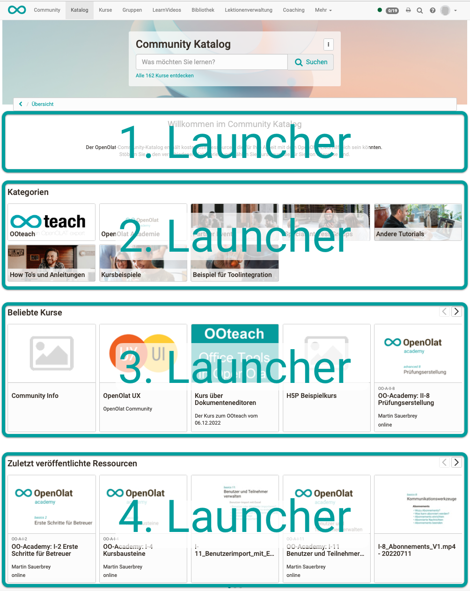
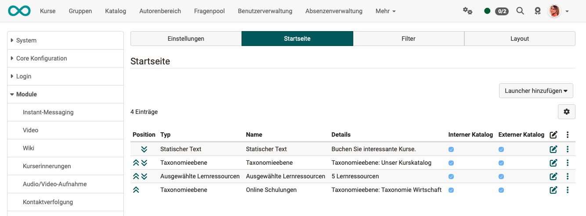
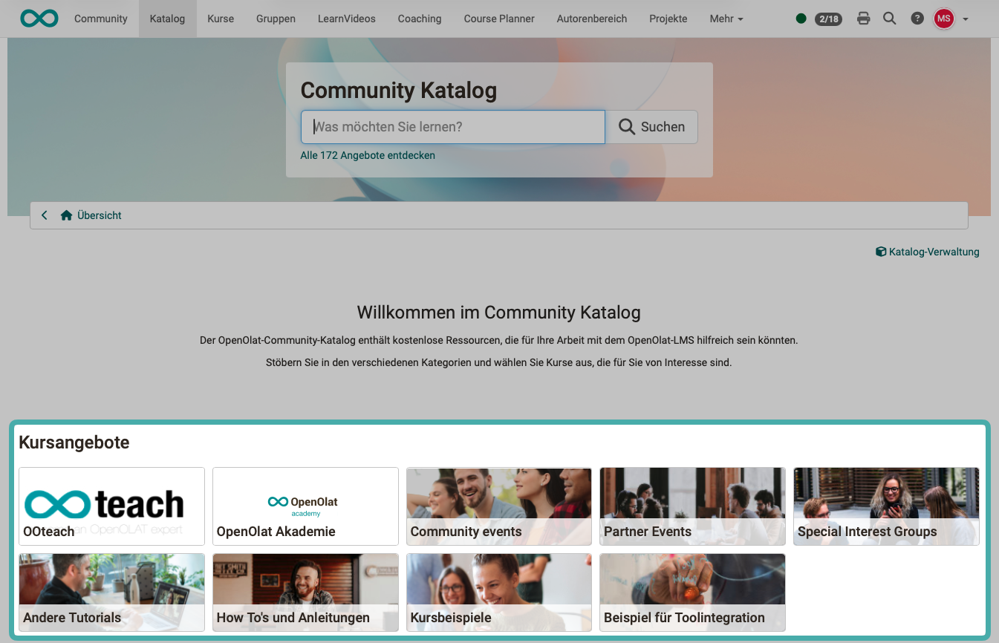
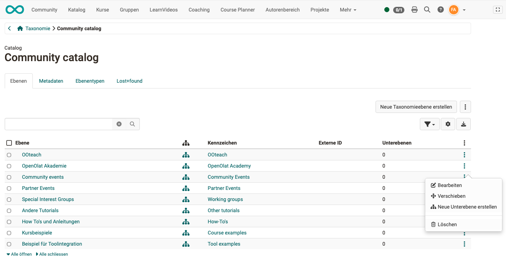
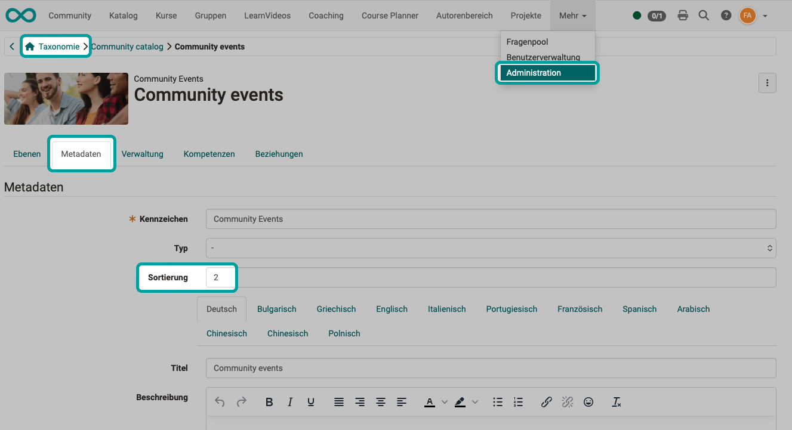
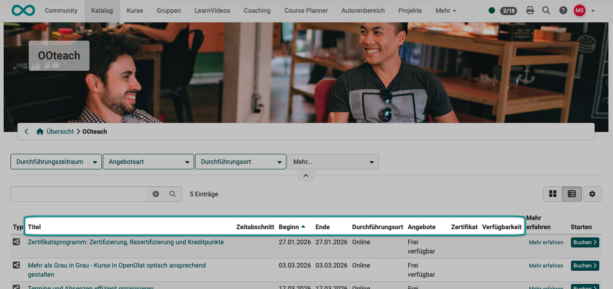
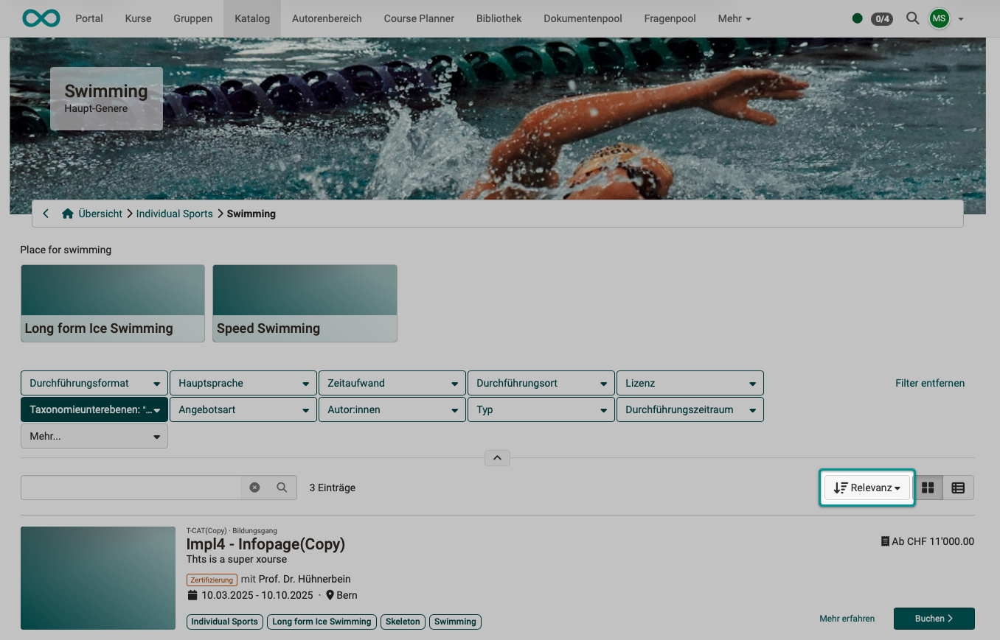
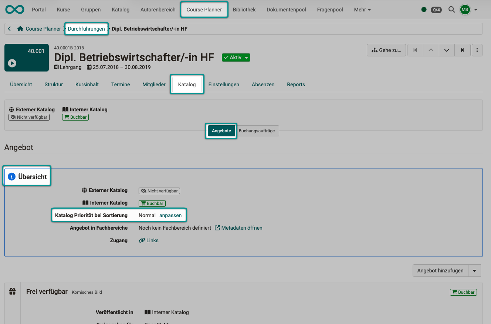
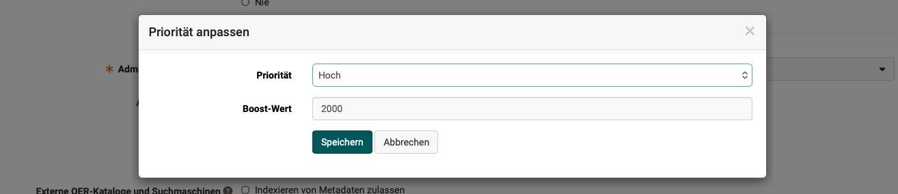

# Catalog 2.0 - Sorting/order  {: #catalog_sort}

In Catalog 2.0, offers can be compiled manually or dynamically. If course owners have specified during configuration that they want their course to appear in the catalog, entries are dynamically added to the catalog.

This raises the question of where in the catalog the offers are displayed.

## Sorting/order on the catalog start page {: #sorting_startpage}

On the **home page** of the catalog, the order of the objects is determined by the launchers. The sections are referred to as launchers.
You can find more information in the manual ["How do I display my courses in the catalog?" >](../../manual_how-to/catalog/catalog.md)

{ class="shadow lightbox" }

### Set the order of launchers {: #sorting_startpage_launcher}

The order of the launchers (sections on the start page) is defined under: 
**Administration > Module  > Catalog > Tab "Start page"**

The order can be set by clicking on the double arrows at the beginning of the lines.

{ class="shadow lightbox" }

[To the top of the page ^](#catalog_sort)

---

### Sorting within the launcher {: #sorting_startpage_inside_launcher}

Within a launcher, the order of the offers depends on the [launcher type](../../manual_admin/administration/Modules_Catalog_2.0.md#tab_start_page):

**Launcher type "Static text":** 
There is no automatic sorting.

**Launcher type "Popular courses":** 
The order of the offers is determined by the number of clicks on course components during the last 28 days. 
Only courses with the status "Published" are taken into account.

**Launcher type "Last published":** 
The order of offers is determined by publishing date.

**Launcher type "Random":** 
Random order.

**Launcher type "Taxonomy level":** 
In a “Taxonomy Level” launcher, courses and learning resources are not displayed directly; rather, the taxonomy levels shown correspond to folders where the courses and learning resources can be found.  
The offerings are automatically selected based on the taxonomy and then listed alphabetically on a microsite that opens when you click on one of the taxonomy levels in a taxonomy launcher.

**Launcher type "Selected learning resources":** 
The manually added learning resources can be sorted by clicking on the double arrows in front of the entries.  

**Launcher type "Selected implementations":** 
The manually added implementations can be sorted by clicking on the double arrows in front of the entries.

[To the top of the page ^](#catalog_sort)

---

### Set the order of subpages/categories {: #sorting_startpage_categories}

If a launcher is to display subcategories, a launcher of the "taxonomy level" type is used.

{ class="shadow lightbox" }

The order of entries within the taxonomy launcher (order of subpages/categories in the catalog) is determined by the structure of the taxonomy and must therefore be changed via taxonomy.
**Administration > Module > Taxonomy > Activation of a taxonomy for learning resources/catalog**

Example: Taxonomy structure for the taxonomy launcher displayed above: 
{ class="shadow lightbox" }

* Select the option to edit a taxonomy level from the 3 dots.  
* In the "Metadata" tab, you will find the field for specifying the sorting order. 
* The number specified here for the taxonomy also determines the position within the launcher. (In the example shown above: 0 = 1. Subpage/Category, 1 = 2. Subpage/Category, 2 = 3. Subpage/Category => third in the catalog)

{ class="shadow lightbox" }

!!! note "Note"

    A change in the taxonomy structure not only affects the catalog, but also everywhere else where this taxonomy is used for selection. 

[To the top of the page ^](#catalog_sort)

---

## Sorting/order within categories (microsites) of the catalog {: #sorting_microsites}

### Manual sorting of lists by users {: #sorting_microsites_lists}

As with all lists in OpenOlat, the offerings in the catalog can also be sorted by **clicking on a column title**.

{ class="shadow lightbox" }

[To the top of the page ^](#catalog_sort)

---

### Sorting by priority {: #sorting_microsites_by_priority}

If "Sort by priority" has been activated by an administrator (Administration > Modules > Catalog > "Settings" tab > "Sort by priority" toggle button), the **"Priority" button** appears at the top right above a list.
 
{ class="shadow lightbox" }

When "Sort by Priority" is selected, a multi-stage sorting process takes place: 
1. Criterion: Sorting by priority 
2. Criterion: Sorting by start date 
3. Criterion: Sorting by end date 
4. Criterion: Sorting by title (alphabetically)

If no date is specified, entries without a date are displayed after those with a date.

[To the top of the page ^](#catalog_sort)

---

### Where can I set priorities? {: #sorting_microsites_define_priority}

**In a course:** 
Course > Administration > Settings > section "Offer Overview" > click on "change"

**In Course Planner:** 
Course Planner > Implementation > tab Catalog > button "Offers" > section "Offer Overview" > click on "change"

Example Course Planner:
{ class="shadow lightbox" }

[To the top of the page ^](#catalog_sort)

---

### What priorities can be set? {: #sorting_microsites_priorities}

As a priority, you can select a preset boost value or enter your own boost value. The higher the boost value, the further up an offer will appear in the catalog. With your own user-defined boost values, you can fine-tune the display order.

- normal (boost value 0)
- medium (boost value 1000)
- high (boost value 2000)
- very high (boost value 3000)
- ultimative (boost value 4000)
- custom (define your own boost value)

{ class="shadow lightbox" }

!!! note "Note"

    Sorting by priority does not affect the sorting on the start page. There, the order of the offers is determined by the respective launcher types and the manual arrangement in the administration.
    
    

[To the top of the page ^](#catalog_sort)

---

## Further information  {: #further_information}

[How do I present my courses in the OpenOlat catalog? >](../../manual_how-to/catalog/catalog.md) 
[Offers >](../../manual_user/area_modules/catalog2.0_angebote.md) 
[Design >](../../manual_user/area_modules/catalog2.0_design.md) 
[External catalog >](../../manual_user/area_modules/catalog2.0_web.md) 
[Activate priorities in administration >](../../manual_admin/administration/Modules_Catalog_2.0.md) 

[To the top of the page ^](#catalog_sort)

