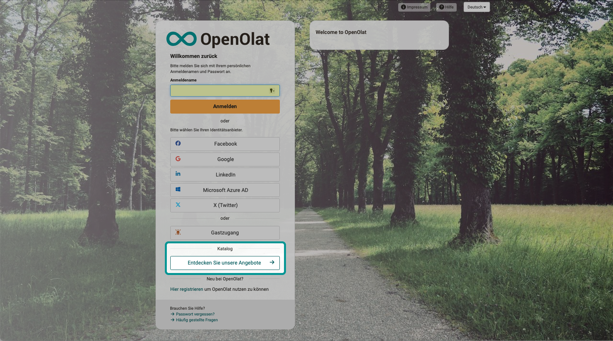
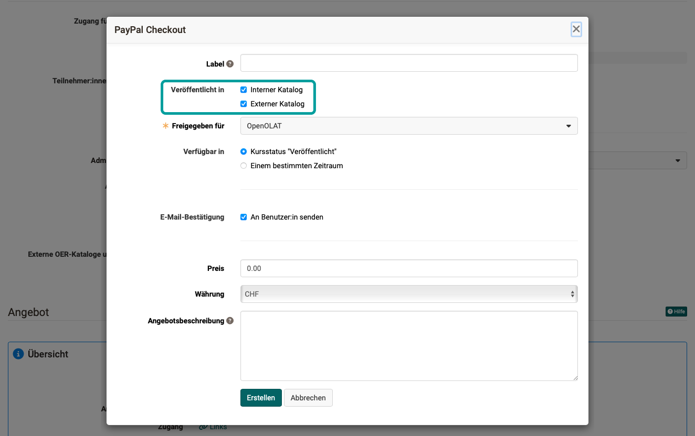

# Web-Katalog (extern verfügbarer Katalog) {: #web_catalog}

## Situation ohne Web-Katalog {: #without_web_catalog}

In OpenOlat werden Kurse erstellt und können im Katalog angeboten werden. Um den Teilnehmer:innen beim Kursbesuch Feedback geben zu können oder Testergebnisse, Zertifikate usw. zu speichern, müssen die Teilnehmer:innen in OpenOlat registriert sein. Nur dann können die Ergebnisse gespeichert werden.

Deshalb muss in OpenOlat ein/eine Benutzer:in angelegt werden (Registrationsprozess). 
Auch um den Katalog durchblättern zu können, muss man ohne den Web-Katalog bereits registriert sein. Dies wurde oft als Hindernis empfunden, deshalb wurde in Release 20 ein von aussen nutzbarer Katalog implementiert.

## Situation mit Web-Katalog {: #with_web_catalog}

Ab Release 20 können in OpenOlat Angebote hinterlegt werden, die in einem externen Web-Katalog angezeigt werden. „Extern“ bedeutet, dass der Katalog nach ausserhalb der „Registrierungsmauer“ gespiegelt wird und dort ohne Registrierung aufgerufen werden kann. Die Ausgangsversion des Katalogs (innerhalb der „Registrierungsmauer“), die nur von registrierten Benutzer:innen aufgerufen werden kann, muss ein Katalog V2 sein. Ein Katalog V1 kann nicht als Web-Katalog angezeigt werden.

Auch die Preise und die Anzahl der in einem Kurs verfügbaren Plätze sind im Web-Katalog ersichtlich. 

Benutzer:innen können dann diese Kurse auswählen und buchen. Sie werden erst nach einer getroffenen Wahl durch den Registrierungsprozess geführt (um Arbeitsergebnisse speichern zu können). 

Bei bereits in OpenOlat registrierten Benutzer:innen wird die Buchung ihrem bestehenden Konto zugeordnet. Die Buchung wird anschliessend bestätigt. 

## Aufruf des Web-Katalogs {: #web_catalog_access}

Der Web-Katalog kann ab Release 20 auf dem Login-Screen angeboten werden. (Der Web-Katalog und die Anzeige des Buttons muss in der Administration eingerichtet werden.)

Der Link zum Web-Katalog kann aber auch an anderer Stelle in eine Website eingebaut werden. 

{ class="shadow lightbox" }

[Zum Seitenanfang ^](#web_catalog)

---

## Angebote für den Web-Katalog erstellen

Damit im Web-Katalog oder im internen Katalog ein Kurs ausgeschrieben werden kann, muss ein Angebot erstellt werden unter: **(Kurs-)Administration > Einstellungen > Tab "Freigabe"** 

Bevor ein neues Angebot erstellt werden kann, müssen 2 Voraussetzungen erfüllt sein.

 Im Abschnitt "Verwendungszweck" muss die Option "Eigenständig" gewählt sein.

 Im Abschnitt "Freigabe" muss als "Zugang für Teilnehmer:innen" die Option "Buchbare und offene Angebote" gewählt sein.

Anschliessend kann ein Angebot erstellt werden.  

{ class="shadow lightbox" }

Wenn Sie nun einen der Angebotstypen wählen, können Sie jeweils auch angeben, ob das Angebot im externen Web-Katalog veröffentlicht werden soll. 
Soll für internen und externen Katalog das Angebot gleich sein, setzen Sie beide Häkchen. 
Sollen für internen und externen Katalog Unterschiede bestehen (z.B. intern kostenlos - extern kostenpflichtig), erstellen Sie 2 verschiedene Angebote. 

{ class="shadow lightbox" }

!!! hint "Hinweis"

    Auch mit dem Course Planner erstellte Durchführungen können im Web-Katalog angeboten werden. In diesem Fall ist beim Kurs unter **Einstellungen > Tab "Freigabe" > Abschnitt "Verwendungszweck"** die Option "Einbindung in Curriculum/Produkt" ausgewählt und es kann im Kurs selbst kein Angebot erstellt werden.
    
    Mehr zu Angeboten von Durchführungen finden Sie [hier](../../manual_user/area_modules/Course_Planner_Implementations.de.md#tab_catalog).

[Zum Seitenanfang ^](#web_catalog)

---

## Weitere Informationen {: #further_information}

[Web-Katalog einrichten (Administrationshandbuch) >](../../manual_admin/administration/Modules_Catalog_2.0.de.md) 
