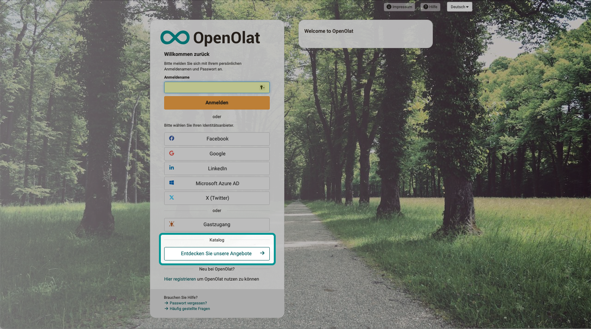
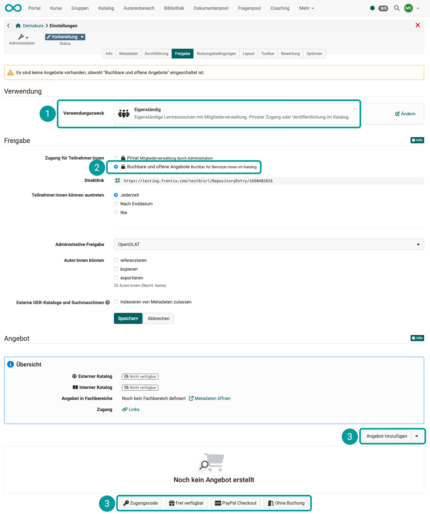
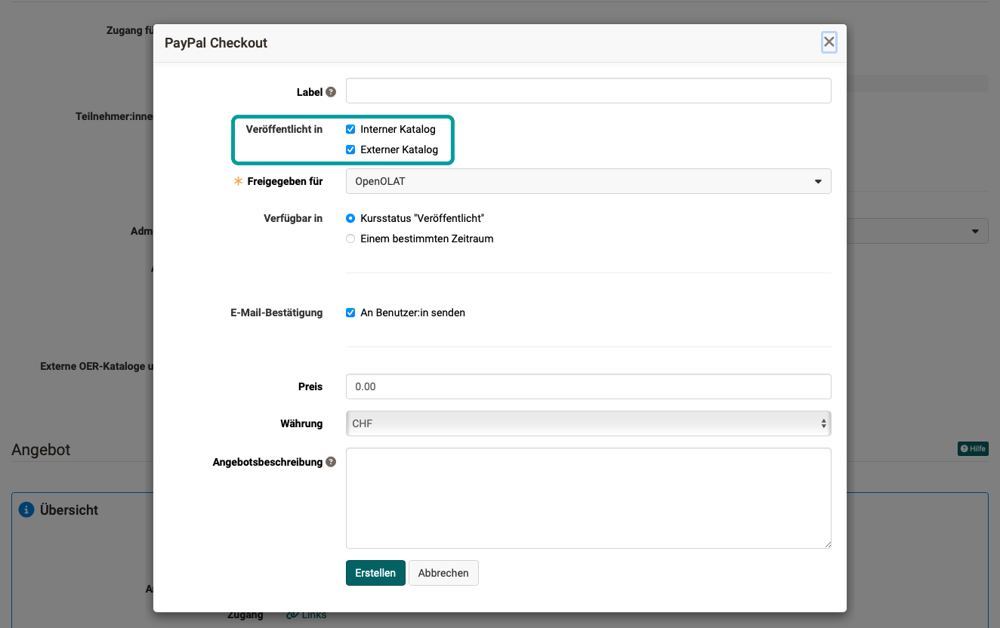
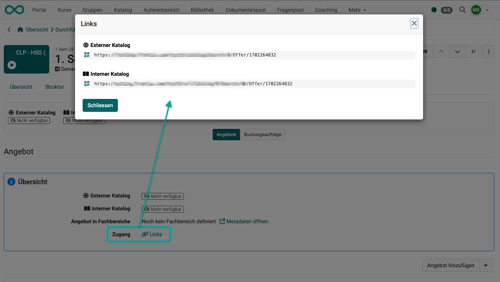

# Extern verfügbarer Katalog {: #web_catalog}

## Situation ohne externen Katalog {: #without_web_catalog}

In OpenOlat werden Kurse erstellt und können im Katalog angeboten werden. Um den Teilnehmer:innen beim Kursbesuch Feedback geben zu können oder Testergebnisse, Zertifikate usw. zu speichern, müssen die Teilnehmer:innen in OpenOlat registriert sein. Nur dann können die Ergebnisse gespeichert werden.

Deshalb muss in OpenOlat eine Benutzer:in angelegt werden (Registrationsprozess).
Auch um den Katalog durchblättern zu können, muss man ohne den externen Katalog bereits registriert sein.

## Situation mit externem Katalog [:octicons-tag-16:{ title="ab Release 20.0 (OO-8002)" }](https://track.frentix.com/issue/OO-8002) {: #with_web_catalog}

In OpenOlat können Angebote hinterlegt werden, die in einem externen Katalog angezeigt werden. "Extern" bedeutet, dass der Katalog nach ausserhalb der "Registrierungsmauer" gespiegelt wird und dort ohne Registrierung aufgerufen werden kann. Die Ausgangsversion des Katalogs (innerhalb der "Registrierungsmauer"), die nur von registrierten Benutzer:innen aufgerufen werden kann, muss ein Katalog 2.0 sein. Ein Katalog 1.0 kann nicht als externer Katalog angezeigt werden.

Auch die Preise und die Anzahl der in einem Kurs verfügbaren Plätze sind im externen Katalog ersichtlich.

Benutzer:innen können dann diese Kurse auswählen und buchen. Sie werden erst nach einer getroffenen Wahl durch den Registrierungsprozess geführt (um Arbeitsergebnisse speichern zu können).

Bei bereits in OpenOlat registrierten Benutzer:innen wird die Buchung ihrem bestehenden Konto zugeordnet. Die Buchung wird anschliessend bestätigt.

## Aufruf des externen Katalogs {: #web_catalog_access}

Der externe Katalog kann auf dem Login-Screen angeboten werden. Der externe Katalog und die Anzeige des Buttons werden in der System-Administration eingerichtet: `Administration > Module > Katalog > Tab "Einstellungen"`.

{ class="shadow lightbox" }

Der Link zum externen Katalog kann aber auch an anderer Stelle in eine Website eingebaut werden.

Und auch [direkte Links zu einem Angebot](#web_catalog_direct_link) können verschickt werden.

[Zum Seitenanfang ^](#web_catalog)

---

## Angebote für den externen Katalog erstellen {: #web_catalog_offers}

Damit im externen Katalog oder im internen Katalog ein Kurs ausgeschrieben werden kann, muss ein Angebot erstellt werden unter: 
`Kurs > Administration > Einstellungen > Tab "Freigabe"`

Bevor ein neues Angebot erstellt werden kann, müssen zwei Voraussetzungen erfüllt sein.

 Im Abschnitt "Verwendungszweck" muss die Option "Eigenständig" gewählt sein.

 Im Abschnitt "Freigabe" muss als "Zugang für Teilnehmer:innen" die Option "Buchbare und offene Angebote" gewählt sein.

Anschliessend kann ein Angebot erstellt werden. 

{ class="shadow lightbox" }

Wenn Sie nun einen der Angebotstypen wählen, können Sie jeweils auch angeben, ob das Angebot im externen Katalog veröffentlicht werden soll. 
Soll für internen und externen Katalog das Angebot gleich sein, setzen Sie beide Häkchen. 
Sollen für internen und externen Katalog Unterschiede bestehen (z.B. intern kostenlos, extern kostenpflichtig), erstellen Sie zwei verschiedene Angebote.

{ class="shadow lightbox" }

!!! note "Hinweis"

    Auch mit dem Course Planner erstellte Durchführungen können im externen Katalog angeboten werden. In diesem Fall ist beim Kurs unter `Kurs > Administration > Einstellungen > Tab "Freigabe" > Abschnitt "Verwendungszweck"` die Option "Verwendung im Course Planner" ausgewählt und es kann im Kurs selbst kein Angebot erstellt werden.

    Mehr zu Angeboten von Durchführungen finden Sie [hier](Course_Planner_Implementations.de.md#tab_catalog).

### Direktlink zu einem Angebot {: #web_catalog_direct_link}

Wenn Sie einen Direktlink zu einem bestimmten Angebot z.B. per Mail verschicken wollen (externer oder interner Katalog), finden Sie die Links in der Übersicht der Angebote.

**Beispiel: Links zum Angebot einer Durchführung**

{ class="shadow lightbox" }

[Zum Seitenanfang ^](#web_catalog)

---

## Weiterführende Informationen {: #further_information}

[Course Planner: Durchführungen >](Course_Planner_Implementations.de.md) 
[Externen Katalog einrichten (Administrationshandbuch) >](../../manual_admin/administration/Modules_Catalog_2.0.de.md)

[Zum Seitenanfang ^](#web_catalog)
