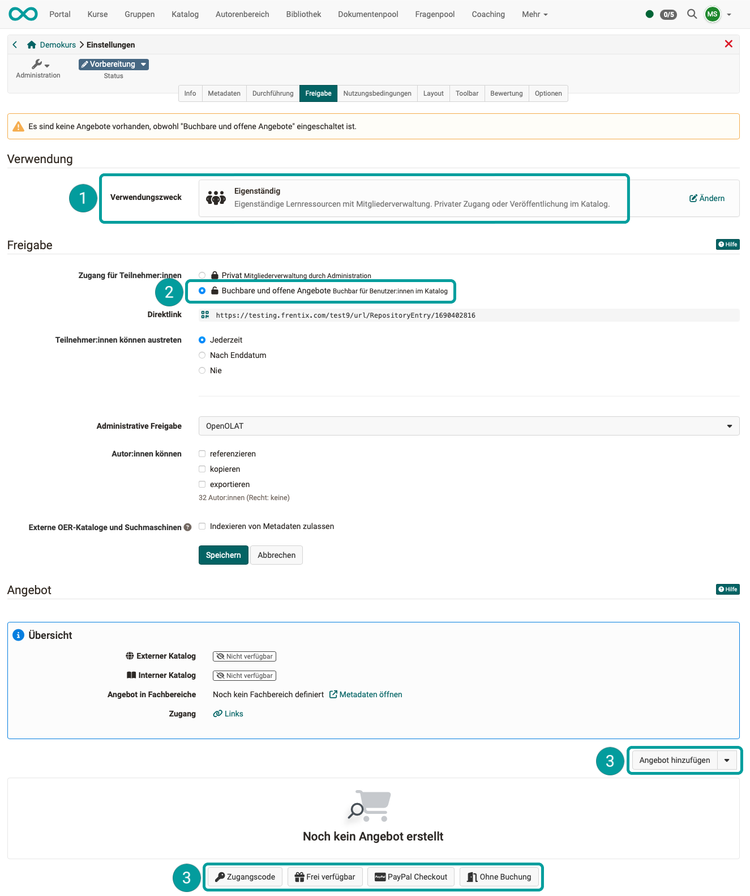
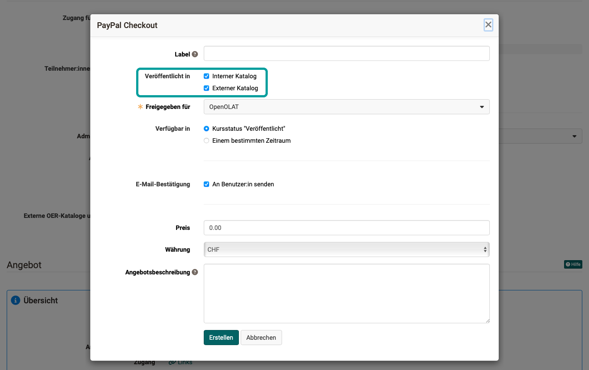

# Web Catalog (external available catalog) {: #web_catalog}

## Situation without Web Catalog {: #without_web_catalog}

Courses are created in OpenOlat and can be offered in the catalog. Participants must be registered in OpenOlat in order to be able to give feedback to participants when attending courses or to save test results, certificates etc. Only then can the results be saved.

Therefore, a user must be created in OpenOlat (registration process).
You also have to be registered without the web catalog in order to browse through the catalog. This was often perceived as an obstacle, which is why an externally usable catalog was implemented in Release 20.

## Situation with Web Catalog {: #with_web_catalog}

As of Release 20, offers can be stored in OpenOlat that are displayed in an external web catalog. "External" means that the catalog is mirrored outside the "registration wall" and can be accessed there without registration. The initial version of the catalog (within the "registration wall"), which can only be accessed by registered users, must be a catalog V2. A catalog V1 cannot be displayed as a web catalog.

The prices and the number of places available in a course can also be seen in the web catalog.

Users can then select and book these courses. They will only be guided through the registration process once they have made their choice (in order to be able to save work results).

For users already registered in OpenOlat, the booking is assigned to their existing account. The booking is then confirmed.

## Web Catalog access {: #web_catalog_access}

The web catalog can be offered on the login screen from Release 20. (The web catalog and the display of the button must be set up in the administration).

The link to the web catalog can also be integrated elsewhere in a website.

{ class="shadow lightbox" }

[To the top of the page ^](#web_catalog)

---

## Create offers in Web Catalog

In order for a course to be advertised in the web catalog or in the internal catalog, an offer must be created under: **(Course) Administration > Settings > Tab "Share"** 

Before a new offer can be created, two requirements must be met.

 In the section "Usage" the option "Standalone" must be selected.

 In the "Share" section, the option "Bookable and open offers" must be selected as "Access for participants".

An offer can then be drawn up.  

{ class="shadow lightbox" }

If you now select one of the offer types, you can also specify whether the offer should be published in the external web catalog.  
If the offer should be the same for internal and external catalogs, check both boxes. 
If there are to be differences between the internal and external catalog (e.g. internal free of charge - external chargeable), create 2 different offers.

{ class="shadow lightbox" }

!!! hint "Note"

    Courses created with the Course Planner can also be offered in the web catalog. In this case, the option "Integration in curriculum/product" is selected for the course under **Settings > "Share" tab > "Usage"** section and no offer can be created in the course itself.

    More about offers of implementations can be found [here](../../manual_user/area_modules/Course_Planner_Implementations.md#tab_catalog)

[To the top of the page ^](#web_catalog)

---

## Further information {: #further_information}

[Set up web catalog (admin manual) >](../../manual_admin/administration/Modules_Catalog_2.0.md) 
