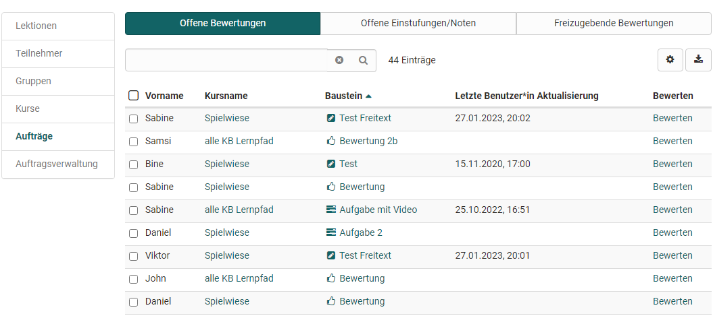

# Coaching - Aufträge

{ class="shadow lightbox" }

### 1. Tab Offene Bewertungen

{ class="shadow lightbox" }

Hier haben Sie Zugriff auf alle Kursbausteine, die noch zu bewerten sind. Diese können entsprechend der Spalten sortiert und dann einzeln ausgewählt und bewertet werden. Mit Klick auf den Link "Bewerten" gelangt man in das entsprechende Bewertungsformular.

### 2. Tab Offene Einstufungen/Noten
Hier finden Sie alle Kursbausteine, die zwar schon bewertet wurden, bei denen aber die manuelle Zuordnung zu einer Notenskala bzw. einem Bewertungssystem noch nicht abgeschlossen wurde.

Der Tab ist nur relevant, wenn mindestens einem  Kursbaustein auch eine Bewertungsskala zur manuellen Freigabe zugewiesen wurde.

### 3. Tab Freizugebende Bewertungen

Hier finden Sie alle Bewertungen, die noch nicht für den User sichtbar sind und noch freigegeben werden müssen. In diesem Tab ist es auch möglich alle Kursbausteine auszuwählen und dann alle auf einen Schlag freizugeben.

