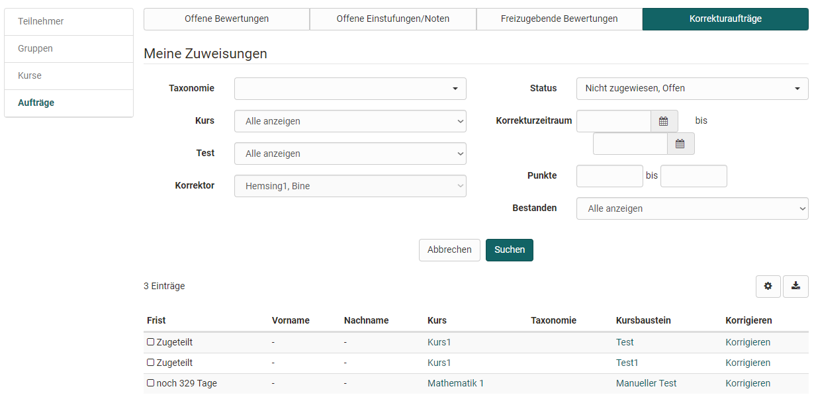

# Coaching - Orders management

{ class="shadow lightbox" }

This menu refers to the correction workflow for the manual assessment of OpenOlat tests. The [Correction workflow](../learningresources/Test_settings.md) can be activated in the learning resource "Test". You can then assign one or more people to tests as correctors. If you are at least the owner of a test for which this option has been activated, you will see the order management in the Coaching Tool and be able to manage the individual correctors and their activities.

### 1. Tab Correctors

Here you get an overview of all your correctors and their grading status. You can also filter the correctors according to various criteria, e.g. for specific courses, concrete tests or open assessments.

The corresponding column selection can be used to display how many tests a graders should grade in total, how many they have already completed, how many are open and which are overdue, and what correction time is planned. Furthermore, additional correctors can be added to a test or existing assignments can be deactivated.

It is also possible to add correctors directly to the respective [test learning resource](../learningresources/Test_settings.md).

### 2. Tab Grading assignments

This tab only appears if you have been entered as a corrector for a test. You see an overview of the tests in the different courses that you still have to check and correct manually. Depending on the setting in the learning resource "Test", the assessment is anonymous or not.

{ class="shadow lightbox" }

Via the link "Correct", the corrector can directly access the test to be corrected and can make manual evaluations here and also overwrite automatic evaluations if necessary. It also makes sense to leave a corresponding comment.

Learning resource administrators or course owners receive an overview of all correctors and their correction orders in the menu "Correction orders". This includes a display of how many assignments are still open or overdue.
{ class="shadow lightbox" }

### 3. Tab Open grading assignments

The course elements (tests and tasks) with the respective persons, who have not yet been assigned to a corrector, are displayed here. 