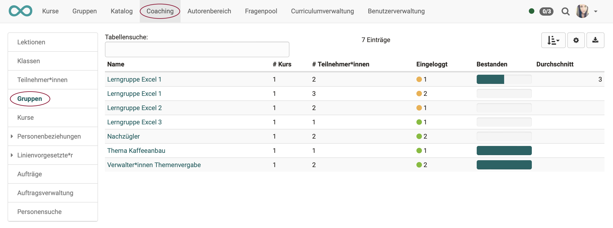

# Coaching - Groups

{ class="shadow lightbox" }

### 1. WHOM does the list show?
The menu item "Groups" shows the list of all groups you are coaching, which are located in the Coaching tool.

In contrast to the participant and course overview (A and C), only the OpenOlat users who are registered in one of the course-related groups appear in the group overview (B).

### 2. WHAT does the list show?  

You will see at once,

* how many courses the respective group is involved in.
* whether all group members have already logged into the group at least once.
* how many participants the group has in total.
* and how many group members have already passed the associated course. (If a pass has been configured in the course.)

Clicking on a group name opens the list of group members with further information on the score, certificate, etc.  
If you then click on a user name, the user-specific overview opens:

* You get access to the persons assessment tool for the corresponding course.
* Additionally, you have access to the lessons and the corresponding evidence of achievement, if activated.

This way you can also assess group members.
