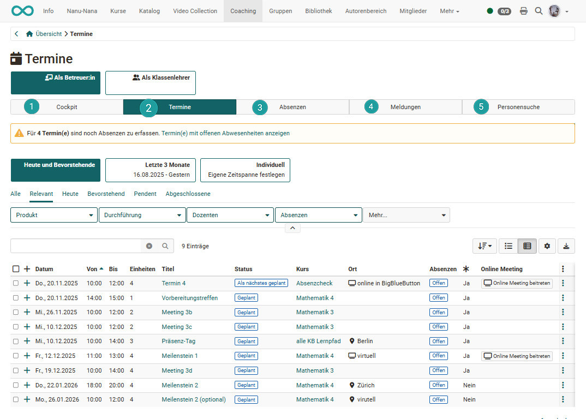
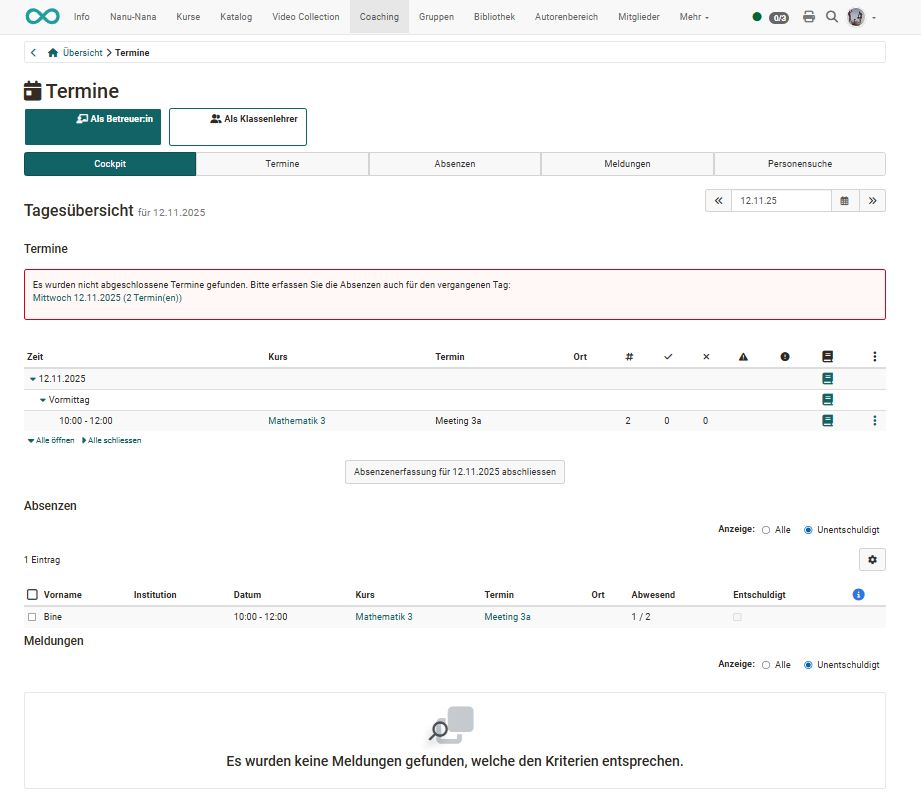

# Coaching - Termine / Absenzen

!!! info "Hinweis"

    Dieses Werkzeug wird im Coaching Tool nur angezeigt, wenn es von den Administrator:innen [aktiviert](../../../manual_admin/docs/administration/Modules_Events_and_Absences.de.md) wurde.

    Ausserdem muss mindestens in einem Kurs die Termin- und Absenzverwaltung eingeschaltet sein. Das Einschalten erfolgt unter: Kursadaministration -> Tab "Durchführung" -> Haken bei "Termin und Absenzverwaltung einschalten" setzen.
    
    Sind diese Voraussetzungen erfüllt, wird der zusätzliche Tab "Termine / Absenzen" im Coachingtool angezeigt.

    Siehe auch [Absenzmanagement](../learningresources/Events_and_absences.de.md)

{ class="shadow lightbox" }

Hier werden die Termine aus unterschiedlichen Kursen gebündelt angezeigt und Personen können kursübergreifend organisiert werden. 

### 1. Tab Cockpit

Im Tab Cockpit erscheint eine Übersicht der Termine für den aktuellen Tag. Auch erscheinen Hinweise, falls es aktuell noch etwas zu erledigen gibt. Anstatt des aktuellen Tages kann auch ein konkreter alternativer Tag ausgewählt werden. 

{ class="shadow lightbox" }

Die Termine können sich auf die Rolle Betreuer:in oder sofern vorhanden auf weitere spezielle Rollen wie "als Klassenlehrer" beziehen.

Über die angezeigte Übersicht und Klick auf den jeweiligen Kurs hat die Lehrperson Zugriff auf weitere Informationen und kann auch die Absenzenerfassung abschliessen. Über das 3-Punkte Menü können eine Absenzen- oder eine Excel-Tabelle heruntergeladen werden. 

### 2. Tab Termine

Hier kann ein Zeitfenster ausgewählt und Termine nach Stichworten gesucht werden. 
Es wird eine Übersicht der Termine für diese Zeitspanne angezeigt. Je nach (in der Tabellenansicht) eingeblendeten Spalten erhält man diverse Informationen zu den Terminen und kann auch  zu einem mit dem Termin verbundenen virtuellen Klassenzimmer navigieren. Über das eingeblendete Buchsymbol können für abgelaufene Termine Absenzen erfasst werden, sofern eine Absenzenerfassung für die Termine des Kureses aktiviert wurde. 

Weitere Informationen zum Thema "Termine" finden Sie [hier](../learningresources/Events_and_absences.de.md).

### 3. Tab Absenzen

Hier kann nach Benutzer:innen, Dozent:innen, Kurstiteln und Terminen gesucht werden. Es können die Absenzen bestimmter Personen für ein gewähltes Zeitfenster angezeigt werden. Je nach Bedarf können die Spalten sortiert werden. (Z.B. nach Kursen, Datum, entschuldigt, Namen, usw.)

### 4. Tab Meldungen

Hier kann nach Benutzer:innen, Dozent:innen, Kurstiteln und Terminen gesucht werden und bestimmte Arten von Meldungen ausgewählt werden, z.B. ohne Abmeldung, abgemeldet oder dispensiert. 

Neue Absenzen, Dispensen oder Abmeldungen für einzelne Personen können schnell erfasst werden. 

### 5. Tab Personensuche

Dies ist die einfachste und übersichtlichste Möglichkeit gezielt nach Personen bzw. Lernenden zu suchen und deren Termine und Absenzen einzusehen und die Anwesenheit zu organisieren.

### Tab Rekurse

Die Bearbeitung der Rekurse erfolgt in der Regel durch Absenzenverwalter:innen, die kursübergreifend alle Rekurse in der zentralen kursübergreifenden Absenzenverwaltung abrufen können. Der Tab erscheint nur, wenn Sie die Berechtigung für die Organisation von Rekursen haben.
Hier kann nach abgelehntem, angenommenem oder pendentem Status für einen bestimmten Zeitraum gesucht werden.

