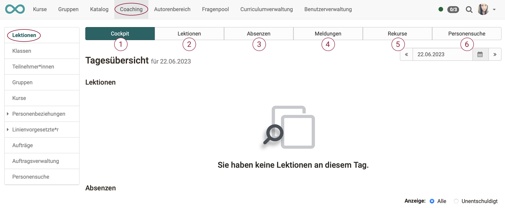
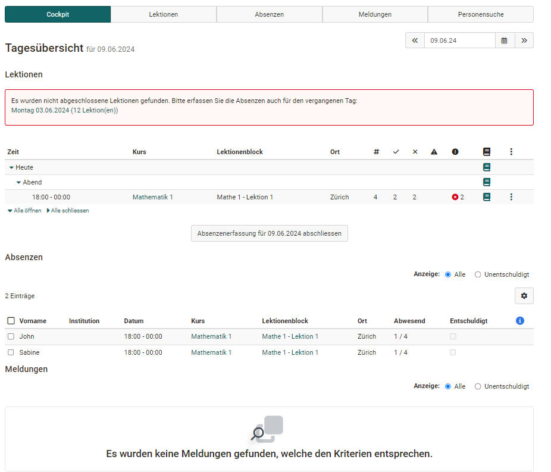

# Coaching - Lektionen

!!! info "Hinweis"

    Dieses Werkzeug wird im Coaching Tool nur angezeigt, wenn vom Administrator das Modul Lektionen aktiviert wurde.

    Ausserdem muss mindestens 1 Lektionenblock vorhanden sein. (In mindestens einem Kurs muss unter den Einstellungen > Tab "Durchführung" > Abschnitt "Konfiguration Lektionen- und Absenzenmanagment im Kurs" das Lektionenmanagement eingeschaltet sein.)

    Sind diese Voraussetzungen erfüllt, wird der zusätzliche Tab "Lektionen" im Coachingtool angezeigt.

    Siehe auch [Absenzmanagement](../learningresources/Lectures_and_absences.de.md)

{ class="shadow lightbox" }

### 1. Tab Cockpit

Im Tab Cockpit erscheint eine Übersicht der Lektionenblöcke für den aktuellen Tag. Auch erscheinen Hinweise, falls es aktuell noch etwas zu erledigen gibt. Anstatt des aktuellen Tages kann auch ein konkreter alternativer Tag ausgewählt werden. 

{ class="shadow lightbox" }

Einzelne Lektionen können als Excel File exportiert und eine Abenzenliste und eine Präsenzliste im PDF-Format für den Download erstellt werden.

Über die angezeigte Übersicht und Klick auf den jeweiligen Kurs hat die Lehrperson Zugriff auf weitere Informationen und kann auch die Absenzerfassung abschliessen.

### 2. Tab Lektionen

Hier kann ein Zeitfenster ausgewählt und nach Stichworten gesucht werden. Es wird eine Übersicht der Lektionenblöcke für diese Zeitspanne angezeigt. Weitere Informationen zum Thema "Lektionen" finden Sie [hier](../learningresources/Lectures_Teacher_view.de.md).

### 3. Tab Absenzen

Hier kann nach Benutzern, Dozenten, Kurstiteln und Lektionenblöcken gesucht werden. Es können die Absenzen bestimmter Personen für ein gewähltes Zeitfenster angezeigt werden. Je nach Bedarf können die Spalten sortiert werden. (Z.B. nach Kursen, Datum, entschuldigt, Namen, usw.)

### 4. Tab Meldungen

Hier kann nach Benutzern, Dozenten, Kurstiteln, Lektionenblöcken und der Art der Meldung gesucht werden.

Ähnlich wie im Tab Absenzen können hier Abmeldungen und Dispensen nach bestimmten Kriterien angezeigt und auch neue Dispensen erfasst werden.

### 5. Tab Rekurse

Hier kann nach abgelehntem, angenommenem oder pendentem Status für einen bestimmten Zeitraum gesucht werden.

### 6. Tab Personensuche

Hier finden Sie die Standardsuche nach Personen.

