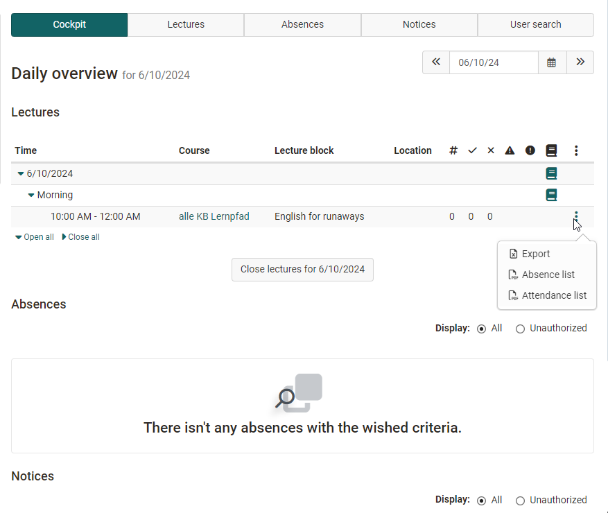

# Coaching - Lectures

!!! info "Note"

    This tool is only displayed in the Coaching Tool if the Lessons module has been activated by the administrator.

    In addition, there must be at least 1 lesson block. (In at least one course, lesson management must be activated under Settings > Tab "Execution" > Section "Configuration of Lesson and Absence Management in the Course.)

    If these requirements are met, the additional menu item "Lectures" is displayed in the coaching tool.

    See also [Absence management](../learningresources/Lectures_and_absences.md)

{ class="shadow lightbox" }

### 1. Tab Cockpit

An overview of the lesson blocks for the current day appears in the Cockpit tab. Notes also appear if there is still something to do. Instead of the current day, a specific alternative day can also be selected. 

{ class="shadow lightbox" }

Individual lessons can be exported as excel files and an absence list and an attendance list in PDF format can be created for download.

Via the displayed overview and a click on the respective course, the teacher has access to further information and can also complete the absence detection.

### 2. Tab Lectures

A time slot can be selected here and it can be searched for keywords. An overview of the lesson blocks for this time period is displayed. Further information on the subject of "Lectures" can be found [here](../learningresources/Lectures_Teacher_view.md).

### 3. Tab Absences

Here you can search for users, lecturers, course titles and lecture blocks. The absences of specific persons for a selected time slot can be displayed. The columns can be sorted according to your requirements. (E.g. by courses, date, excused, names, etc.)

### 4. Tab Messages

Here you can search for users, lecturers, course titles, lecture blocks and the type of report.

Similar to the Absences tab, cancellations and dispensations can be displayed here according to certain criteria and new dispenses can also be recorded.

### 5. Tab Recourses

Here you can search for rejected, accepted or pending status for a certain period of time.

### 6. Tab User search

Here you will find the standard search for people.

