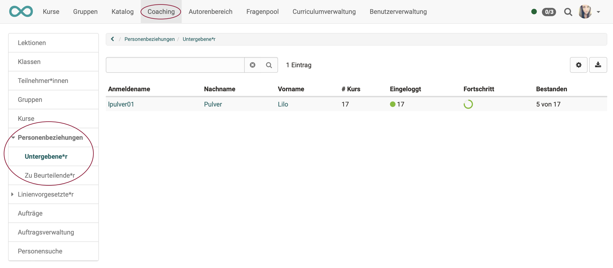

# Coaching - Role user-to-user

{ class="shadow lightbox" }

With the user-to-user relationship in OpenOlat, cross-course support functions can be set up in the administration or user management, for example for mentors, learning guides and coaches. If this is the case, coaches can easily and clearly access the persons to be coached in the Coaching Tool and make assessments.

Specific rights can be defined for each user-to-user relationship and thus access can be granted to explicitly released contents of the supervised persons, such as course list, calendar, absence overview, evidences of achievements and certificates. Similarly, the role of "line manager" is also mapped in the Coaching Tool. Defined contents of users of the own organizational unit can also be accessed here.
