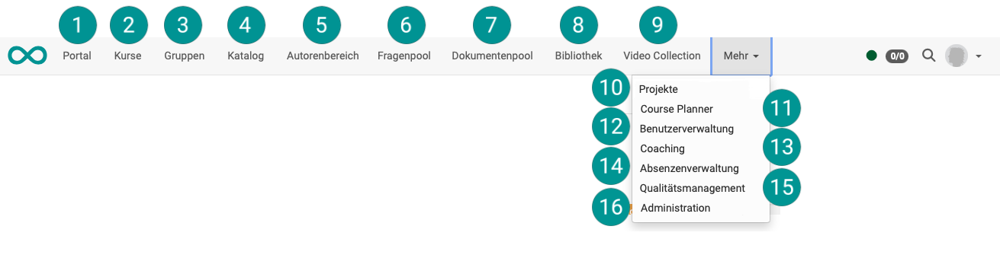

# Bereiche und Module {: #sites}

OpenOlat ist modular aufgebaut. Die wichtigsten Bereiche und Module sind allgemein verfügbar, einige können nach Bedarf zusätzlich aktiviert werden. Die zentralen Elemente erscheinen in der Regel als Menüpunkt in der obersten Navigationszeile. Persönliche Bereiche können über die ["Persönlichen Werkzeuge"](../personal_menu/Personal_Tools.de.md) aufgerufen werden.

Bei aktiviertem Modul ist die Verfügbarkeit im Hauptmenü ausserdem rollenabhängig. 
Die Reihenfolge/Anordnung in der Kopfzeile kann von Administrator:innen bestimmt werden.

{ class="shadow lightbox" }

## Portal {: #portal}

{ class=" aside-left-lg" }

Wenn die Portalfunktion eingeschaltet ist, können auf der Portalseite (Einstiegsseite) verschiedene Informationen und Schnellzugänge angeboten werden.

[Zu den Details >](../basic_concepts/Portal_configuration.de.md) 
[Zum Seitenanfang ^](#sites)

## Kurse {: #courses}

{ class=" aside-left-lg" }

Kurse sind das wichtigste Grundelement in OpenOlat. Grundsätzlich werden alle Lerninhalte innerhalb von Kursen angeboten. 

[Zu den Details >](Courses.de.md) 
[Zum Seitenanfang ^](#sites)

## Gruppen {: #groups}

{ class=" aside-left-lg" }

Gruppen können für unterschiedliche Zwecke verwendet werden, z.B. vereinfachen sie die Teilnehmeradministration oder erleichtern das kooperative, unabhängige Online-Lernen. 

[Zu den Details >](Group_Management.de.md) 
[Zum Seitenanfang ^](#sites)

## Katalog {: #catalog}

{ class=" aside-left-lg" }

Wird ein Katalog zum Anbieten der Kurse und Lernressourcen gewünscht, kann dies von OpenOlat [Administrator:innen aktiviert](../../manual_admin/administration/Modules_Catalog_2.0.de.md) werden. Je nach Version des Katalogs, erscheint er als eigener Menüpunkt [(Katalog V2)](../area_modules/catalog2.0.de.md) oder als Tab im Bereich Kurse [(Katalog V1)](../area_modules/catalog1.0.de.md). 

[Zu den Details >](catalog2.0.de.md) 
[Zum Seitenanfang ^](#sites)

## Autorenbereich {: #authoring}

{ class=" aside-left-lg" }

In diesem zentralen Bereich finden OpenOlat Autoren alles, was zum Erstellen neuer Kurse erforderlich ist.

[Zu den Details >](Authoring.de.md) 
[Zum Seitenanfang ^](#sites)

## Fragenpool {: #question_bank}

{ class=" aside-left-lg" }

Der Fragenpool ist ein Bereich, in dem Fragen zur Wiederverwendung gesammelt werden. OpenOlat bietet dazu ein Management der Zugriffsberechtigungen usw.

[Zu den Details >](Question_Bank.de.md) 
[Zum Seitenanfang ^](#sites)

## Dokumentenpool

{ class=" aside-left-lg" }

Der Dokumentenpool ist eine taxonomiebasierte, kursübergreifende Dokumentenverwaltung.

[Zu den Details >](../../manual_admin/administration/Modules_Document_pool.de.md) 
[Zum Seitenanfang ^](#sites)

## Bibliothek  {: #library}

{ class=" aside-left-lg" }

In der Bibliothek können unterschiedliche Dokumente (Office-Dokumente, Bild-Dateien, usw.) allen Benutzer:innen zur Verfügung gestellt werden.

[Zu den Details >](Library.de.md) 
[Zum Seitenanfang ^](#sites)

## Video Collection  {: #video_collection}

{ class=" aside-left-lg" }

Die Video Collection ist eine Sammlung aller freigegebenen Video-Lernressourcen Ihrer OpenOlat-Instanz.

[Zu den Details >](Video_Collection.de.md) 
[Zum Seitenanfang ^](#sites)

## Projekte  {: #projects}

{ class=" aside-left-lg" }

Hier finden Sie ein Tool für die kooperative Projekt-Arbeit mit Terminen, ToDos, Entscheid-Doku, gemeinsamen Dokumenten und mehr. 

[Zu den Details >](Project_Overview.de.md) 
[Zum Seitenanfang ^](#sites)

## Course Planner  {: #course_planner}

{ class=" aside-left-lg" }

Ab :octicons-tag-24: Release 20 wurde eine erweiterte, allgemeine Kursplanung in OpenOlat integriert.

[Zu den Details des Course Planners >](Course_Planner.de.md) 
[Zum Seitenanfang ^](#sites)

## Benutzerverwaltung {: #user_management}

{ class=" aside-left-lg" }

In der Benutzerverwaltung können neue Benutzer importiert oder angelegt und konfiguriert werden. 

[Zu den Details >](../../manual_admin/usermanagement/index.de.md) 
[Zum Seitenanfang ^](#sites)

## Coaching  {: #coaching}

{ class=" aside-left-lg" }

Das Coaching-Werkzeug ermöglicht es Betreuer:innen **kursübergreifende** Bewertungen und Aktionen durchzuführen. (Im Unterschied zum Bewertungswerkzeug, das innerhalb eines bestimmten Kurses verwendet wird.) 

[Zu den Details >](Coaching.de.md) 
[Zum Seitenanfang ^](#sites)

## Absenzenverwaltung {: #absence_management}

{ class=" aside-left-lg" }

Ab :octicons-tag-24: Relase 20 werden Absenzen in diesem separaten Modul verwaltet.

[Zu den Details >](Absence_Management.de.md) 
[Zum Seitenanfang ^](#sites)

## Qualitätsmanagement {: #quality_management}

{ class=" aside-left-lg" }

Die Organisation von Befragungen (Datenerhebungen) mit Formularen kann durch ein Zusatzmodul "Qualitätsmanagement" kursübergreifend bewerkstelligt werden.

[Zu den Details >](Quality_Management.de.md) 
[Zum Seitenanfang ^](#sites)

## Administration  {: #administration}

{ class=" aside-left-lg" }

Dieser Menüpunkt wird nur Administrator:innen angezeigt. Mit entsprechendem Recht können hier die Verwaltungs- und Einrichtungsoptionen zur OpenOlat-Instanz aufgerufen werden.

[Zum Administrationshandbuch >](../../manual_admin/administration/System.de.md) 
[Zum Seitenanfang ^](#sites)

