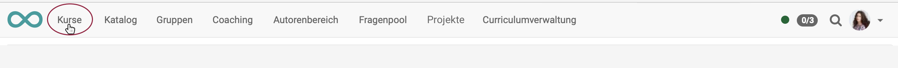
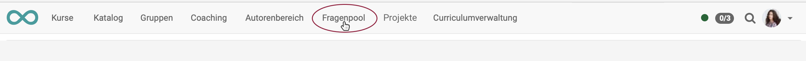

# Bereiche und Module 

OpenOlat ist modular aufgebaut. Die wichtigsten Bereiche und Module sind allgemein verfügbar, einige können nach Bedarf zusätzlich aktiviert werden.

## Kurse

{ class="shadow lightbox" }

Kurse sind das wichtigste Grundelement in OpenOlat. Grundsätzlich werden alle Lerninhalte innerhalb von Kursen angeboten.

## Katalog

{ class="shadow lightbox" }

Wird ein Katalog zum Anbieten der Kurse und Lernressourcen gewünscht, kann dieses optionale Modul aktiviert werden.

## Gruppen

{ class="shadow lightbox" }

Gruppen vereinfachen die Teilnehmeradministration. OpenOlat erlaubt die Bildung ganz unterschiedlicher Gruppen.

## Coaching

{ class="shadow lightbox" }

Zur Betreuung der Kursteilnehmer:innen enthält ein optionales Modul zusätzliche Features.

## Autorenbereich

{ class="shadow lightbox" }

Hier befindet sich alles, was zum Erstellen neuer Kurse erforderlich ist.

## Fragenpool

{ class="shadow lightbox" }

Der Fragenpool ist ein Bereich, in dem Fragen zur Wiederverwendung gesammelt werden. OpenOlat bietet dazu ein Management der Zugriffsberechtigungen usw.

## Projekte

{ class="shadow lightbox" }

OpenOlat stellt auch Werkzeuge zum Durchführen von Projekten zur Verfügung. 

## Portfolio

In OpenOlat kann auf verschiedene Art mit Portfolios gearbeitet werden.

## Curriculumverwaltung

{ class="shadow lightbox" }

Optional kann OpenOlat in einem eigenen Modul auch Curricula verwalten.
