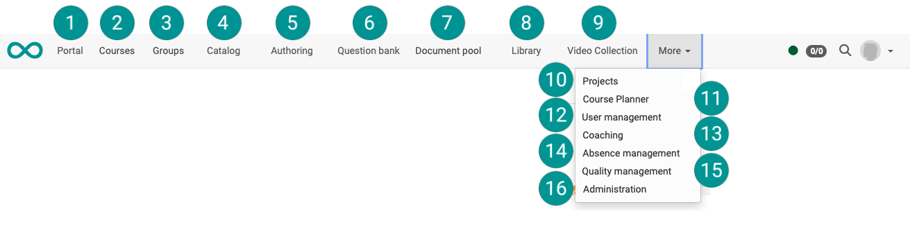

# Area and modules {: #sites}

OpenOlat has a modular structure. The most important areas and modules are generally available, some can be additionally activated as needed. The central elements usually appear as a menu item in the top navigation bar. (This line is sometimes also referred to as a "header".) Personal areas can be accessed via the ["Personal Tools"](../personal_menu/Personal_Tools.md).

If the module is activated, availability in the main menu is also role-dependent. 
The order/arrangement in the header can be determined by administrators.

{ class="shadow lightbox" }

## Portal {: #portal}

{ class=" aside-left-lg" }

If the portal function is switched on, various information and quick accesses can be offered on the portal page (initial page).

[See the details >](../basic_concepts/Portal_configuration.md) 
[To the top of the page ^](#sites)

## Courses {: #courses}

{ class=" aside-left-lg" }

Courses are the most important basic element in OpenOlat. Basically, all learning content is offered within courses.

[See the details >](Courses.md) 
[To the top of the page ^](#sites)

## Groups {: #groups}

{ class=" aside-left-lg" }

Groups can be used for different purposes e.g. they simplify participant administration or facilitate cooperative, independent online learning.

[See the details >](Group_Management.md) 
[To the top of the page ^](#sites)

## Catalog {: #catalog}

{ class=" aside-left-lg" }

If a catalog for offering the courses and learning resources is desired, it can be [activated by OpenOlat administrators](../../manual_admin/administration/Modules_Catalog_2.0.md). The catalog appears as a separate menu item. This applies to both [Catalog 1.0](../area_modules/catalog1.0.md) and [Catalog 2.0](../area_modules/catalog2.0.md).

[See the details >](catalog2.0.md) 
[To the top of the page ^](#sites)

## Authoring area {: #authoring}

{ class=" aside-left-lg" }

In this central area OpenOlat authors can find everything needed to create new courses.

[See the details >](Authoring.md) 
[To the top of the page ^](#sites)

## Question pool {: #question_bank}

{ class=" aside-left-lg" }

The question pool is an area, where questions are collected for reuse. OpenOlat offers a management of access permissions etc. for this purpose.

[See the details >](Question_Bank.md) 
[To the top of the page ^](#sites)

## Document pool

{ class=" aside-left-lg" }

The document pool is a taxonomy-based, cross-course document management system.

[See the details >](../../manual_admin/administration/Modules_Document_pool.md) 
[To the top of the page ^](#sites)

## Library  {: #library}

{ class=" aside-left-lg" }

Various documents (Office documents, image files, etc.) can be made available to all users in the library.

[See the details >](Library.md) 
[To the top of the page ^](#sites)

## Video Collection  {: #video_collection}

{ class=" aside-left-lg" }

The Video Collection is a collection of all shared video learning resources of your OpenOlat instance.

[See the details >](Video_Collection.md) 
[To the top of the page ^](#sites)

## Projects  {: #projects}

{ class=" aside-left-lg" }

Here you find a tool for collaborative project work with deadlines, to-dos, decision documentation, shared documents and more.

[See the details >](Project_Overview.md) 
[To the top of the page ^](#sites)

## Course Planner [:octicons-tag-16:{ title="from Release 20.0 (OO-7834)" }](https://track.frentix.com/issue/OO-7834) {: #course_planner}

{ class=" aside-left-lg" }

The Course Planner is the extended, general course planning in OpenOlat.

[To the details of the Course Planner >](Course_Planner.md) 
[To the top of the page ^](#sites)

## User management {: #user_management}

{ class=" aside-left-lg" }

New users can be imported or created and configured in the user management.

[See the details >](../../manual_admin/usermanagement/index.md) 
[To the top of the page ^](#sites)

## Coaching  {: #coaching}

{ class=" aside-left-lg" }

The coaching tool allows coaches to perform **cross-course** assessments and actions. (Unlike the [assessment tool](../learningresources/Assessment_tool_overview.md), which is used within a specific course.)

[See the details >](Coaching.md) 
[To the top of the page ^](#sites)

## Absence management {: #absence_management}

{ class=" aside-left-lg" }

Absences are managed in this separate module.

[See the details >](Absence_Management.md) 
[To the top of the page ^](#sites)

## Quality management {: #quality_management}

{ class=" aside-left-lg" }

The organisation of surveys (data collection) with forms can be managed across all courses using an additional "Quality management" module.

[See the details >](Quality_Management.md) 
[To the top of the page ^](#sites)

## Administration  {: #administration}

{ class=" aside-left-lg" }

This menu item is only displayed for administrators. With the appropriate authorisation, the administration and setup options for the OpenOlat instance can be called up here.

[To the administration manual >](../../manual_admin/administration/System.md) 
[To the top of the page ^](#sites)
