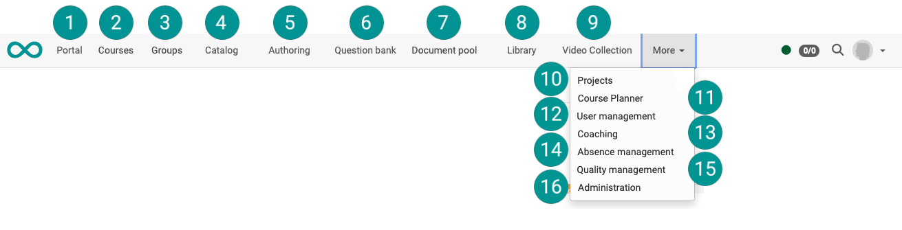

# Sites and modules {: #sites}

When you work in OpenOlat, you switch between the sites through the main navigation. This is the top row of every page (also called "header"). A site is an entry of the main navigation, for example Courses, Groups, Catalog or Coaching: a click on it leads to the functions of this site. What concerns only you, for example your calendar or your notes, you open through the [Personal tools](../personal_menu/Personal_Tools.md) instead.

Which sites you see is controlled by three things: the module, the activation in the administration and your role. Every OpenOlat instance therefore composes and orders its main navigation differently. The following image shows what is possible: an instance with almost all available sites. Most instances offer fewer.

{ class="shadow lightbox" title="Example view with almost all available sites, not the standard of an instance" }

## What decides about a site {: #conditions}

You are looking for a site and cannot find it, while a colleague sees it. Four conditions decide about this. Going through them one by one leads to the cause and tells you whom to ask.

1. **The module is activated.** Without an active module the site does not appear, even if it is activated in the list of sites. Administrators switch on the catalog in the system administration, for example, in the [Module Catalog](../../manual_admin/administration/Modules_Catalog_2.0.md): `Administration > Modules > Catalog`
2. **The site is activated and sorted in.** Administrators keep all sites in one list, in the system administration under `Administration > Customizing > Sites`, tab "Order". The "Enabled" checkbox releases an entry, the "Up" and "Down" arrows set the order.
3. **The role has access.** The "Access" column of that same list determines which roles see the site, for example "Registered users without guests/external users" or "Learning resource managers and authors only". Two people with different roles therefore see a different main navigation.
4. **There is space in the main navigation.** What no longer fits in is collected by OpenOlat in the "More" menu on the right. This depends on the width of the screen, not on a setting.

Some entries in the list are named differently from the site they create: the entry "My courses" appears as "Courses".

Besides the sites of the table below, four info pages and two external sites can be added as sites of their own. Administrators fill an info page with a course, an external site with a URL.

How administrators operate this list is described in the administration manual: [Customizing: Sites](../../manual_admin/administration/Customizing.md#sites).

## Where the sites are described {: #areas}

You know the site and are looking for the page that explains it. The table lists the sites this manual describes. It does not show which sites are visible on a particular instance. The number refers to the marking in the image above.

| No. in the image | Site | Described on |
|---|---|---|
| 1 | Portal | [Portal configuration](../basic_concepts/Portal_configuration.md) |
| 2 | Courses | [Finding courses](Courses.md) |
| 3 | Groups | [Group Management](Group_Management.md) |
| 4 | Catalog | [Catalog 2.0](catalog2.0.md) |
| 5 | Authoring | [Authoring](Authoring.md) |
| 6 | Question bank | [Question Bank](Question_Bank.md) |
| 7 | Document pool | [Module Document Pool](../../manual_admin/administration/Modules_Document_pool.md), administration manual |
| 8 | Library | [Library](Library.md) |
| 9 | Video Collection | [Video Collection](Video_Collection.md) |
| 10 | Projects | [Projects](Project_Overview.md) |
| 11 | Course Planner | [Course Planner](Course_Planner.md) |
| 12 | User management | [User management](../../manual_admin/usermanagement/index.md), administration manual |
| 13 | Coaching | [Coaching](Coaching.md) |
| 14 | Absence management | [Absence management](Absence_Management.md) |
| 15 | Quality management | [Quality Management](Quality_Management.md) |
| 16 | Administration | [System](../../manual_admin/administration/System.md), administration manual |

The portfolio does not appear as a site in the main navigation. You open it through the Personal tools as "Portfolio 2.0", and it is described under [Creating Portfolios](Portfolio.md).

## Further information {: #further_information}

**Further** 
[Navigation >](../basic_concepts/Navigation.md) 
[Roles and their working areas >](../basic_concepts/Roles_Home_Areas.md) 
[Roles and Rights: Which roles are available? >](../basic_concepts/Roles.md)

[To the top of the page ^](#sites)
