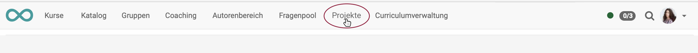

{ class="shadow lightbox" }

# Projekte - Projekte bearbeiten

Um den Projekttitel und weitere allgemeine Projekteinstellungen zu bearbeiten, wählen Sie das **Icon mit den drei Punkten** und dort die Option „Projekt bearbeiten“.

{ class="shadow lightbox" }

