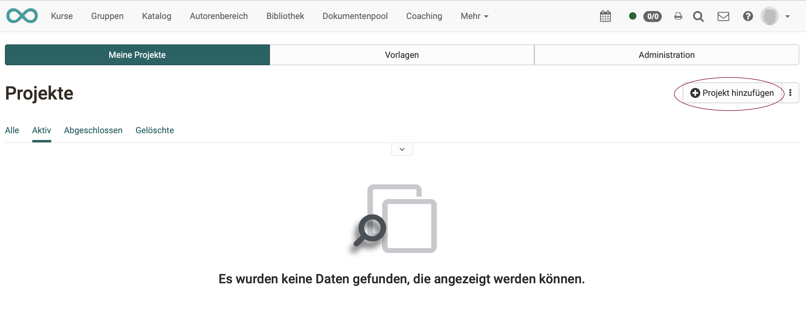
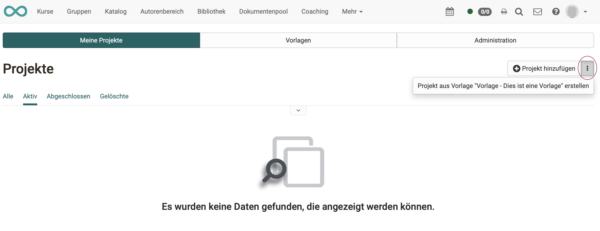

{ class="shadow lightbox" }

# Projekte - Wie lege ich ein neues Projekt an?

## Ohne Vorlage

Ein völlig neues Projekt (ohne Vorlage) erstellen Sie unter 
**Projekte > Tab „Meine Projekte“ > Button „Projekt hinzufügen“**

{ class="shadow lightbox" }

## Mit Vorlage

Am einfachsten lassen sich neue Projekte erstellen, wenn eine **Vorlage** verwendet wird. Die Vorlagen lassen sich unter einem separaten Tab erstellen und bearbeiten.

{ class="shadow lightbox" }

## Vorlage erstellen

tbd