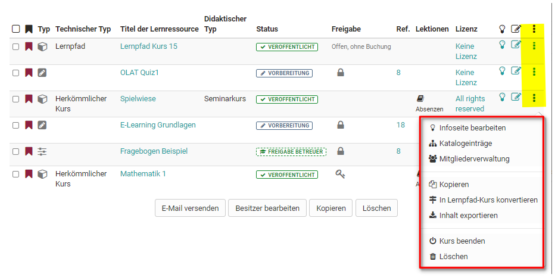

#  Aktionen im „Autorenbereich"

  * 1Autorenbereich vordefinierte Filter
    * 1.1Erstellen
    * 1.2 Importieren
  * 2Tabellenansicht konfigurieren
    * 2.1Menüs und weitere Einstellungen aufrufen
  * 3Weitere Aktionen
    * 3.1E-Mail versenden
    * 3.2Besitzer bearbeiten
    * 3.3Kopieren
    * 3.4Löschen

## Autorenbereich vordefinierte Filter

Unter „Meine Einträge“ sehen OpenOlat Autoren alle ihre Lernressourcen bei
denen sie Besitzer sind. Unter „Favoriten“ werden alle Lernressourcen eines
Autors angezeigt, auf den er selbst einen Bookmark gesetzt hat.

Im Tab „Suchmaske“ können Sie nach Lernressourcen suchen.  Der Tab „Gelöscht“
stellt Ihren „Papierkorb“ mit all Ihren Lernressourcen, die Sie gelöscht haben
dar.

### Erstellen

Im Autorenbereich können OpenOlat Autoren neue Kurse und weitere
[Lernressourcen](assets/Verschiedene Typen von Lernressourcen.html)anlegen. Der
konkrete Erstellungsprozess mit den verschiedenen Editoren ist in den Kapiteln

sites/manual_user/docs/authoring/Actions_in_the_'Authoring'_section.de.md §Creating_Courses.de.md§ 481
[„Kurs erstellen"](../display/OO161DE/Kurs+erstellen.html), [„CP-Lerninhalt

sites/manual_user/docs/authoring/Actions_in_the_'Authoring'_section.de.md §Creating_CP_Learning_Content.de.md§ 481
erstellen"](../display/OO161DE/CP-Lerninhalt+erstellen.html), [„Wiki

sites/manual_user/docs/authoring/Actions_in_the_'Authoring'_section.de.md §Creating_Wikis.de.md§ 481
erstellen"](../display/OO161DE/Wiki+erstellen.html), [„Podcast

sites/manual_user/docs/authoring/Actions_in_the_'Authoring'_section.de.md §Creating_Podcasts.de.md§ 481
erstellen"](../display/OO161DE/Podcast+erstellen.html), [„Blog

sites/manual_user/docs/authoring/Actions_in_the_'Authoring'_section.de.md §Creating_Blogs.de.md§ 481
erstellen"](../display/OO161DE/Blog+erstellen.html), ["Portfolio

sites/manual_user/docs/authoring/Actions_in_the_'Authoring'_section.de.md §Creating_Portfolios.de.md§ 481
erstellen",](../display/OO161DE/Portfolio+erstellen.html) ["Tests erstellen"

sites/manual_user/docs/authoring/Actions_in_the_'Authoring'_section.de.md §Creating_Tests.de.md§ 481
](../display/OO161DE/Tests+erstellen.html) beschrieben.

Wenn Sie Ihre Kurse systematisch aufbauen und Lernressourcen in mehreren
Kursen verwenden wollen, sollten Sie die Lernressourcen lieber im
Autorenbereich erstellen.

  

  

###  Importieren

Ausserhalb von OpenOlat erstellte oder aus einem OpenOlat System exportierte
Lernressourcen können in OpenOlat importiert werden, wenn Sie in einem für
OpenOlat kompatiblen Format vorliegen. Mögliche Typen werden unter dem Punkt
[„Verschiedene Typen von

sites/manual_user/docs/authoring/Actions_in_the_'Authoring'_section.de.md §Various_Types_of_Learning_Resources.de.md§ 481
Lernressourcen"](Various_Types_of_Learning_Resources.de.md)
erklärt. Darüber können über den Link "Importieren URL" auch Links zu externen
Videos z.B. YouTube gesetzt und als OpenOlat [Lernressource

sites/manual_user/docs/authoring/Actions_in_the_'Authoring'_section.de.md §Learning_resource_Video.de.md§ 481
Video](../resource_video/Learning_resource_Video.de.md) angelegt werden.

Wenn Sie einen Kurs z.B. aus einer anderen OpenOlat Instanz importieren
möchten, werden Sie gefragt, ob Sie die vom Kurs referenzierten Lernressourcen
(z.B. ein Wiki oder einen Test) ebenfalls importieren möchten. Markieren Sie
die entsprechende Checkbox, wenn Sie die referenzierten Lernressourcen
ebenfalls importieren möchten. Publizieren Sie den importierten Kurs im
Anschluss, um ihn für Sie und andere OpenOlat-Benutzer sichtbar zu machen.

Am Ende des Imports erscheint das Menü „Einstellungen“ und weitere
Konfigurationen sind möglich, z.B. eine Definition der Lizenz.

 **Lizenzen**

Werden Lernressourcen importiert oder erstellt, kann im nächsten Schritt u.a.
in den Metadaten ein entsprechender Lizenztyp sowie ein Lizenzgeber zugeordnet
werden.

  

In der Übersicht des Autorenbereichs werden die zugeordneten Lizenzen in der
Spalte «Lizenz» angezeigt werden. Mit Klick auf die Lizenz erhält man
detaillierte Informationen zur jeweiligen Lizenz.  

## Tabellenansicht konfigurieren

Wählen Sie über das Zahnrad aus, welche Spalten und damit verbundenen
Informationen Ihnen angezeigt werden sollen. Besonders informativ sind z.B.
der Status, die Referenzierung (Ref.), das Erstellungsdatum oder bei Kursen
der Technische Kurstyp um herkömmliche Kurse von Lernpfad Kursen zu
unterscheiden.  Neben der Auswahl der Spalten können Sie noch die Anzeige auf
bestimmte Typen von Lernressourcen beschränken und auch die Art der Sortierung
definieren z.B. sortiert nach der Referenzierung oder dem Status oder dem
Erstellungsdatum.

### Menüs und weitere Einstellungen aufrufen

Über die Menüpunkte neben Ihrern Lernressourcen können Sie viele Funktionen
direkt aufrufen. Hierzu zählen:

  * Ein Klick auf den Titel einer Lernressource öffnet die entsprechende Ressource.
  * Die Infoseite öffnen Sie über . Bei editierbaren Lernressourcen wie Kurse, Glossare, Tests, PCs, Blogs und Podcasts öffnet das Icon „Editieren“ den entsprechenden Editor.
  * Die 3-Punkte führen schnell zu grundlegenden Menüs die im Folgenden kurz angerissen werden:

#### Infoseite bearbeiten

Damit gelangen Sie in den Bereich "Einstellungen" und können die
Informationen, die auf der Infoseite erscheinen, ändern. Mehr Informationen
dazu finden Sie auf der Seite "[Infoseite

sites/manual_user/docs/authoring/Actions_in_the_'Authoring'_section.de.md §Set_up_info_page.de.md§ 481
einrichten](Set_up_info_page.de.md)".

#### Katalogeinträge

Damit können Sie neue Katalogeinträge erstellen und bereits bestehende
Einträge bearbeiten. Mehr Informationen dazu finden Sie im Kapitel
„Kurseinstellungen“ unter dem Punkt

sites/manual_user/docs/authoring/Actions_in_the_'Authoring'_section.de.md §Course_Settings.de.md§ 481
„[Katalogeinträge](../course_create/Course_Settings.de.md#Kurseinstellungen-d13e1856)“.

#### Mitgliederverwaltung

Hier können Sie Mitglieder einer Lernressource organisieren. Mehr
Informationen dazu finden Sie im Kapitel

sites/manual_user/docs/authoring/Actions_in_the_'Authoring'_section.de.md §Members_management.de.md§ 481
„[Mitgliederverwaltung](../course_operation/Members_management.de.md)“.

#### Kopieren

Damit können Sie die Lernressource kopieren um sie beispielsweise für ein
neues Semester wieder zu verwenden oder eine Sicherheitskopie zu erstellen.

#### Inhalt exportieren

Exportieren Sie hiermit Ihre Lernressourcen als ZIP-Datei z.B. als Backup oder
für den Export in ein anderes System.

#### Löschen

Eine Lernressource kann nur gelöscht werden, wenn sie in keinem Kurs verwendet
wird, und nur von ihrem Besitzer.

Herkömmliche Kurse erhalten noch das Menü "In Lernpfad konvertieren" um einen
herkömmlichen Kurs in einen Kurs vom Typ [Lernpfad

sites/manual_user/docs/authoring/Actions_in_the_'Authoring'_section.de.md §Learning_path_course.de.md§ 481
](../course_create/Learning_path_course.de.md)umzuwandeln und somit eine
Kopie des Ursprungskurses zu erstellen.

## Weitere Aktionen

In den Tabs "Favoriten", "Meine Einträge" und "Suchmaske" stehen unterhalb der
angezeigten Lernressourcen weitere Aktionen zur Verfügung, die auf zuvor
markierte Lernresssourcen angewendet werden können. So können z.B. E-Mail an
alle Kursteilnehmer aus mehreren Kursen verschickt werden oder eine Person
mehreren Lernressourcen als Besitzer hinzugefügt werden, mehrere
Lernressourcen auf einmal kopiert oder gelöscht werden.

### E-Mail versenden

Mit dieser Funktion können E-Mails an die Mitglieder von mehreren Kursen bzw.
Lernressourcen gleichzeitig verschickt werden. Wählen Sie dazu die gewünschten
Lernressourcen aus, indem Sie die Checkbox links auswählen. Es öffnet sich ein
Wizard. Sie können nun definieren, an wen die E-Mail verschickt werden soll.
Mögliche Empfänger sind alle Kursbesitzer, Kursbetreuer und die Teilnehmer.
Sie können die E-Mail an alle Kurse schicken, die Ihnen angezeigt werden. Dazu
gehören auch Kurse, welche für alle Autoren sichtbar sind. Sie müssen also
nicht zwingend Mitglied des Kurses sein, um diese Funktion zu nutzen.

### Besitzer bearbeiten

Hier werden Ihnen die Besitzer der ausgewählten Lernressourcen angezeigt und
Sie können diese gleichzeitig aus mehreren Kursen entfernen oder auch neue
Besitzer den ausgewählten Lernressourcen hinzufügen. Eine
E-Mailbenachrichtigungsoption schließt die Bearbeitung ab.

### Kopieren

Wählen Sie eine oder mehrere Lernressourcen aus um sie zu kopieren. Kopierte
Lernressourcen befinden sich anschliessend im Tab "Meine Einträge". Der Zusatz
"(Kopie)" wird dem Titel hinzufügt. Der Titel kann aber nach Wunsch geändert
werden.

### Löschen

Hier können Sie schnell mehrere Lernressourcen auf einmal löschen. Sie müssen
diese Aktion zur Sicherheit noch einmal im Menü bestätigen. Die Besitzer der
Lernressource werden per E-Mail benachrichtigt. Nach dem Löschen erscheinen
die Lernressourcen nicht mehr unter "Meine Einträge",sondern werden in den Tab
"Gelöscht" (Papierkorb Funktion) verschoben und sind dort nur für die
jeweiligen Besitzer sichtbar. Die Besitzer der gelöschten Lernressource können
gelöschte Lernressourcen wiederherstellen. Die OpenOlat Administratoren können
gelöschte Lernressourcen ebenfalls wiederherstellen und auch definitiv
löschen.
