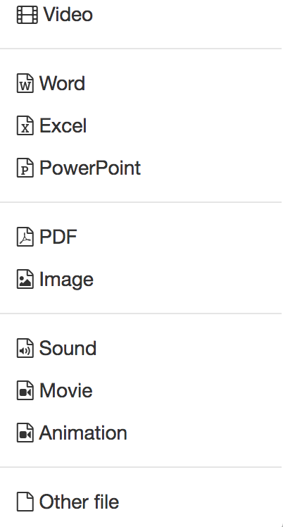

#  Actions in the 'Authoring' section

  * 1 Actions in the 'Authoring' section 
    * 1.1Authoring Area Tabs
      * 1.1.1 Create
      * 1.1.2 Import
    * 1.2Author Area Column Configuration
      * 1.2.1Life cycle
      * 1.2.2Configure Table View
      * 1.2.3 Calling up menus and other settings
    * 1.3Further actions
      * 1.3.1Send E-mail
      * 1.3.2Modify owners
      * 1.3.3Copy
      * 1.3.4Delete

## Authoring Area Tabs

Under "My entries" OpenOlat authors can see all the learning resources they
own. The "Favorites" tab is a subgroup of "My Entries. It shows all learning
resources of an author which are bookmarked. Learning resources can be
imported or created both in the "Favorites" tab and under "My Entries".

In the tab "Search form" you can search for learning resources. The "Deleted"
tab displays your "Trash" with all your learning resources that you have
deleted.

###  Create

OpenOlat authors can create new courses and additional [learning
resources](Various+Types+of+Learning+Resources.html) in the "My Entries and
Favorites" tabs. How to use various editors will be further explained in the
chapters ["Creating Courses"](Creating+Courses.html), ["Creating CP Learning
Content"](Creating+CP+Learning+Content.html), ["Creating
Wikis"](Creating+Wikis.html), ["Creating Podcasts"](Creating+Podcasts.html),
["Creating Blogs"](Creating+Blogs.html), ["Creating Portfolio
Tasks"](Creating+Portfolio+Tasks.html), ["Creating
Tests"](Creating+Tests.html) and ["Creating
Questionnaires"](Creating+Questionnaires.html).

If you build your courses systematically and if you want to use your learning
resources in several courses, you should better created the learning resources
in the authoring

###  Import

Learning resources generated outside of OpenOlat can be imported if they have
a format that is compatible. Suitable formats have been commented on in the
section ["Various Types of Learning
Resources"](Various+Types+of+Learning+Resources.html). Using the "Import URL"
link, you can also set links to external videos, e.g. YouTube, and create them
as OpenOlat learning resource videos.

If you want to import a course e.g. from another OpenOlat instance, you will
be asked whether you also want to import the learning resources referenced by
the course (e.g. a wiki or a test). Select the corresponding checkbox if you
also want to import the referenced learning resources. Publish the imported
course afterwards to make it visible to you and other OpenOlat users.

At the end of the import, the "Settings" menu appears and further
configurations are possible, e.g. a definition of the license.

 **Licenses**

When uploading learning resources such as pictures, text, audio and video
files within the authoring section a license and a licensor can be assigned in
the metadata.

In the corresponding overview in the authoring section all assigned licenses
will be shown in the column «license». By clicking on a license, detailed
license information will be displayed.

## Author Area Column Configuration

The respective column display can be further configured in all tabs.

### Life cycle

Here you set whether the further table display is to refer to all, active, or
completed learning resources.

### Configure Table View

Here you can set which of your learning resources you want to display and in
which order.

  

###  Calling up menus and other settings

You can call many functions directly from the table view of your learning
resources. These include

  * A click on the title of a learning resource opens the corresponding resource.
  * The info page can be opened via. For editable learning resources such as courses, glossaries, tests, questionnaires, PCs, blogs and podcasts, the "Edit" icon opens the corresponding editor.
  * The ~~cogwheel~~ Die 3-Punkte quickly leads to basic menus that are briefly outlined in the following:

#### Change infopage

Opens the form for changing the content of the info page. You can find more
information on the page "[Change
infopage](Course+Settings.html#CourseSettings-d14e1774)".

#### Catalogue entries

Create new catalogue entries or edit existing entries. For further information
please refer to the chapter "Course Settings", section "[Catalog
entries](Course+Settings.html#CourseSettings-d14e1825)".

#### Members management

Opens the members management of the respective learning resource. You can find
more information on the page "[Members management](Members+management.html)".

#### Copy

Copy learning resources for re-use in a new semester or create a safety copy.

#### Export Content

Export your learning resource as ZIP file for example as back-up or for the
export in another system.

#### Delete

A learning resource can only be deleted if it is not used within a course at
that moment, and only by its owner.

## Further actions

In the tabs "Favorites", "My entries" and "Search form" further actions are
available below the displayed learning resources, which can be applied to
previously marked learning resources. For example, e-mails can be sent to all
course participants from several courses or a person can be added to several
learning resources as owner, several learning resources can be copied or
deleted at once.

### Send E-mail

With this feature e-mails can be sent to members of several courses and
learning resources at the same time. Chose the desired learning resources by
selecting the checkboxes on the left. A wizard opens. Now it can be defined to
whom the e-mail should be sent. Possible recipients are course owners, course
coaches and participants. You can send e-mails to all courses visible to you
in the authoring. These are for example courses which are visible for all
authors. This means you do not need to be a member of this certain course to
use this feature.

### Modify owners

Here you will see the owners of the selected learning resources and you can
remove them from several courses at once or add new owners to the selected
learning resources. An email notification option completes the editing.

### Copy

All learning resources can be copied. Copied learning resources will be found
in the tab "My entries" after. The supplement "(Copy)" is added to the title.
The title can be changed as desired.

### Delete

Learning resources can also be deleted together. Then the learning resources
are not deleted definitely. They can be found in the tab "Deleted" and are
there only visible for the corresponding owner. The owner of the deleted
learning resources can restore the deleted learning resources. The OpenOlat
system administrator can restore deleted learning resources as well and can
also delete them definitely.

  

