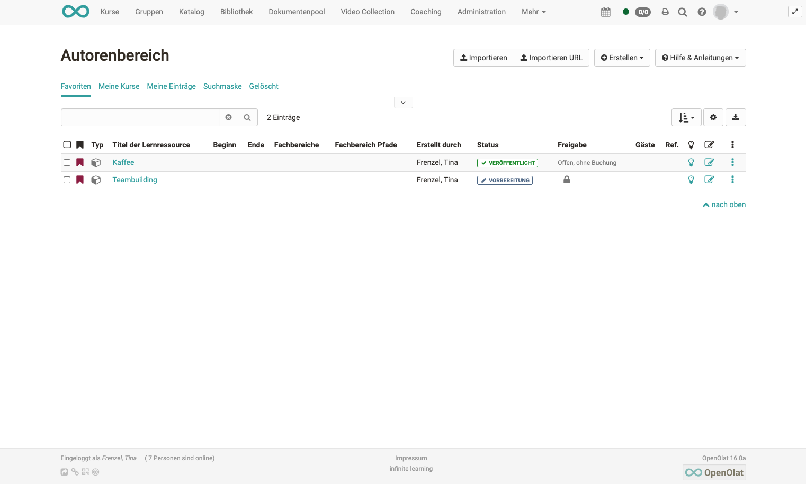

#  Aktionen im „Autorenbereich"

Der Autorenbereich ist der zentrale Bereich für OpenOlat Autoren. Hier finden Sie alle ihre Kurse und weiteren Lernressourcen und können diese auch erstellen oder importieren. 

Im Folgenden wird erläutert welche generellen Einstellungen im Autorenbereich vorgenommen werden können. 
 

## Vordefinierte Filter des Autorenbereichs

Der Autorenbereich beinhaltet bestimmte vordefinierte Filter. Hierzu zählen:

* Favoriten
* Meine Kurse
* Meine Einträge
* Gelöscht

sowie eine Suchmaske.

Unter „Meine Einträge“ sehen OpenOlat Autoren alle Lernressourcen bei
denen sie Besitzer sind. Unter "Meine Kurse" werden alle herkömmlichen Kurse und alle Lernpfad Kurse bei denen Sie Besitzer sind angezeigt. "Meine Kurse" ist somit eine Untermenge von "Meine Einträge". 

Unter „Favoriten“ werden die Lernressourcen angezeigt, die ein Autor selbst als  Favorit mit einem OpenOlat Bookmark gekennzeichnet hat. Der Tab „Gelöscht“ beinhaltet alle gelöschten Lernressourcen bei denen Sie Besitzer sind. Der Tab "Gelöscht" ist somit eine Art Papierkorb.

## Lernressourcen Erstellen

Im Autorenbereich können OpenOlat Autoren neue Kurse und weitere
[Lernressourcen](Various_Types_of_Learning_Resources.de.md) anlegen. Der konkrete Erstellungsprozess mit den verschiedenen Editoren ist in den folgenden Kapiteln beschrieben:

* [„Kurs erstellen"](../course_create/index.de.md), 
* [„CP-Lerninhalt erstellen"](../resource_cp/index.de.md), 
* [„Wiki erstellen"](../resource_wiki/index.de.md), 
* [„Podcast erstellen"](../resource_podcast/index.de.md), 
* [„Blog erstellen"](../resource_blog/index.de.md), 
* ["Portfolio erstellen",](../portfolio/index.de.md) 
* ["Tests erstellen" ](../tests/index.de.md),
* ["Formulare erstellen (für Umfragen) " ](../forms/index.de.md) 

!!! tip "Tipp"

    Wenn Sie Ihre Kurse systematisch aufbauen und Lernressourcen in mehreren Kursen verwenden wollen, sollten Sie die Lernressourcen besser im Autorenbereich als direkt im Kurs erstellen.

###  Importieren {: #import}

Ausserhalb von OpenOlat erstellte oder aus einem OpenOlat System exportierte
Lernressourcen können in OpenOlat importiert werden, wenn Sie in einem für
OpenOlat kompatiblen Format vorliegen. Mögliche Typen werden unter dem Punkt
[„Verschiedene Typen von
Lernressourcen"](Various_Types_of_Learning_Resources.de.md)
erklärt. Darüber können über den Link "Importieren URL" auch Links zu externen
Videos z.B. in YouTube gesetzt und als OpenOlat [Lernressource
Video](../resource_video/Learning_resource_Video.de.md) angelegt werden.

Wenn Sie einen Kurs z.B. aus einer anderen OpenOlat Instanz importieren
möchten, werden Sie gefragt, ob Sie die vom Kurs referenzierten Lernressourcen
(z.B. ein Wiki oder einen Test) ebenfalls importieren möchten. Markieren Sie
die entsprechende Checkbox, wenn Sie die referenzierten Lernressourcen
ebenfalls importieren möchten. Publizieren Sie den importierten Kurs im
Anschluss, um ihn für Sie und andere OpenOlat-Benutzer sichtbar zu machen.

Am Ende des Imports erscheint das Menü „Einstellungen“ und weitere
Konfigurationen sind möglich, z.B. eine Definition der Lizenz.

 **Lizenzen**

Werden Lernressourcen importiert oder erstellt, kann im nächsten Schritt u.a.
in den Metadaten ein entsprechender Lizenztyp sowie ein Lizenzgeber zugeordnet werden.

  
In der Übersicht des Autorenbereichs werden die zugeordneten Lizenzen in der
Spalte «Lizenz» angezeigt werden. Mit Klick auf die Lizenz erhält man
detaillierte Informationen zur jeweiligen Lizenz.  

## Tabellenansicht konfigurieren

Wählen Sie über das Zahnrad aus, welche Spalten und damit verbundenen
Informationen Ihnen angezeigt werden sollen. Besonders informativ sind z.B.
der Status, die Referenzierung (Ref.), das Erstellungsdatum oder bei Kursen
der Technische Kurstyp um herkömmliche Kurse von Lernpfad Kursen zu
unterscheiden.  

Neben der Auswahl der Spalten können Sie noch die Art der Sortierung
definieren z.B. sortiert nach der Referenzierung oder dem Status oder dem
Erstellungsdatum und die gesamte Tabelle downloaden.

### Menüs und weitere Einstellungen aufrufen

Über die Menüpunkte neben Ihren Lernressourcen können Sie viele Funktionen direkt aufrufen. Hierzu zählen:

  * Ein Klick auf den **Titel** einer Lernressource öffnet die entsprechende Ressource.
  * Die **Infoseite** öffnen Sie über . 
  * Bei **editierbaren** Lernressourcen wie Kurse, Glossare, Tests, PCs, Blogs und Podcasts öffnet das Bearbeitungsicon „Editieren“ den entsprechenden Editor.
  * Die **3-Punkte** führen schnell zu grundlegenden Menüs die im Folgenden kurz angerissen werden:

#### Infoseite bearbeiten

Damit gelangen Sie in den Bereich "Einstellungen" und können die
Informationen, die auf der Infoseite erscheinen, ändern. Mehr Informationen
dazu finden Sie auf der Seite "[Infoseite einrichten](Set_up_info_page.de.md)".

#### Katalogeinträge

Damit können Sie neue Katalogeinträge erstellen und bereits bestehende
Einträge bearbeiten. Mehr Informationen dazu finden Sie im Kapitel
„Kurseinstellungen“ unter dem Punkt [Tab Katalog](../course_create/Course_Settings.de.md)

#### Mitgliederverwaltung

Hier können Sie Mitglieder einer Lernressource organisieren. Mehr
Informationen dazu finden Sie im Kapitel [Mitgliederverwaltung](../course_operation/Members_management.de.md)

#### Kopieren

Damit können Sie die Lernressource kopieren um sie beispielsweise für ein
neues Semester wieder zu verwenden oder eine Sicherheitskopie zu erstellen.

#### Inhalt exportieren

Exportieren Sie hiermit Ihre Lernressourcen als ZIP-Datei z.B. als Backup oder
für den Export in ein anderes System.

#### Löschen

Eine Lernressource kann nur von den Besitzern der Lernressource gelöscht werden.

Herkömmliche Kurse erhalten noch das Menü "In Lernpfad konvertieren" um einen
herkömmlichen Kurs in einen Kurs vom Typ [Lernpfad](../course_create/Learning_path_course.de.md)
umzuwandeln und somit eine Kopie des Ursprungskurses zu erstellen.

## Weitere Aktionen

Wählt man eine oder mehrere der angezeigten Lernressourcen aus der Tabelle aus erscheinen weitere Möglichkeiten. 

So können z.B. E-Mails an
alle Kursteilnehmenden aus mehreren Kursen verschickt oder eine Person
mehreren Lernressourcen als Besitzer hinzugefügt werden. Auch das Löschen oder Kopieren mehrere Lernressourcen auf einmal ist so einfach möglich.

### E-Mail versenden

Wählen Sie die gewünschten Lernressourcen aus und klicken Sie auf "E-Mail versenden". Es öffnet sich ein
Dialog. Sie können nun definieren, an wen die E-Mail verschickt werden soll.
Mögliche Empfänger sind alle Kursbesitzer, alle Kursbetreuer und alle Teilnehmenden. Fügen Die einen Betreff und die gewünschte Nachricht hinzu. Bei Bedarf kann noch ein Anhang und eine Kopie für den Absender ergänzt werden.

!!! info "Hinweis"

    Sie können die E-Mail an alle Kurse schicken, die Ihnen angezeigt werden. Dazu gehören auch Kurse, welche für alle Autoren sichtbar sind. Sie müssen also nicht zwingend Mitglied des Kurses sein, um diese Funktion zu nutzen.

### Besitzer bearbeiten

Hier werden Ihnen alle Besitzer der ausgewählten Lernressourcen angezeigt und Sie können diese gleichzeitig aus mehreren Kursen entfernen oder auch neue
Besitzer den ausgewählten Lernressourcen hinzufügen. Eine
E-Mailbenachrichtigungsoption schliesst die Bearbeitung ab.

### Kopieren

Wählen Sie eine oder mehrere Lernressourcen aus um sie zu kopieren. Kopierte Lernressourcen befinden sich anschliessend im Tab "Meine Einträge". Der Zusatz "(Kopie)" wird dem Titel hinzufügt. Der Titel kann aber anschliessend nach Wunsch geändert werden.

### Löschen

Hier können Sie schnell mehrere Lernressourcen auf einmal löschen. Sie müssen diese Aktion zur Sicherheit noch einmal im Menü bestätigen. Die Besitzer der Lernressource werden per E-Mail benachrichtigt. Nach dem Löschen erscheinen die Lernressourcen nicht mehr unter "Meine Einträge", sondern werden in den Tab "Gelöscht" (Papierkorb Funktion) verschoben und sind dort nur für die jeweiligen Besitzer sichtbar. Die Besitzer der gelöschten Lernressource können
gelöschte Lernressourcen wiederherstellen. 

Die OpenOlat Administratoren können
gelöschte Lernressourcen ebenfalls wiederherstellen und auch definitiv
löschen.
