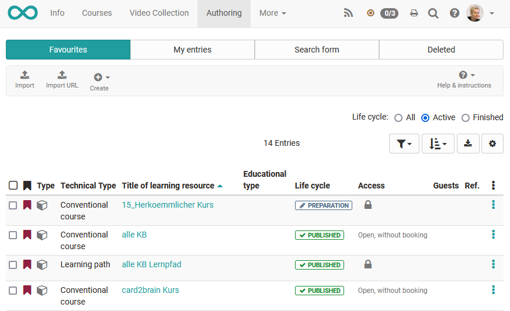
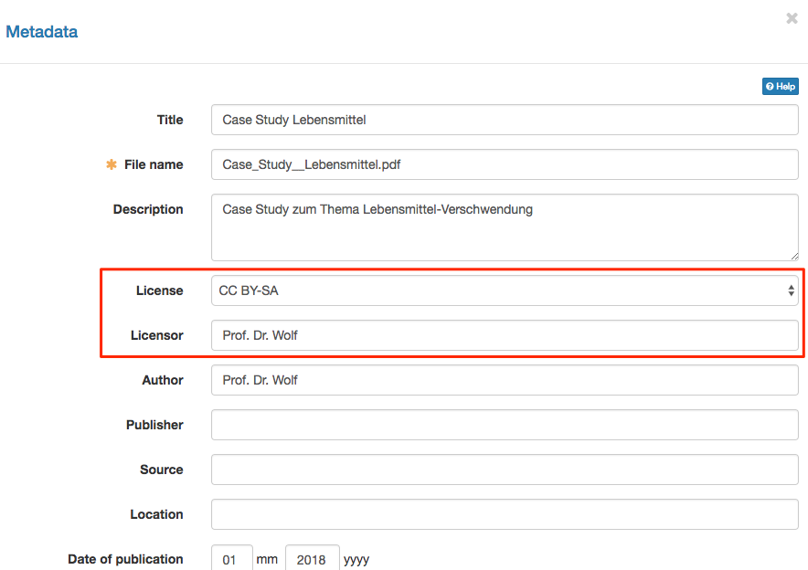
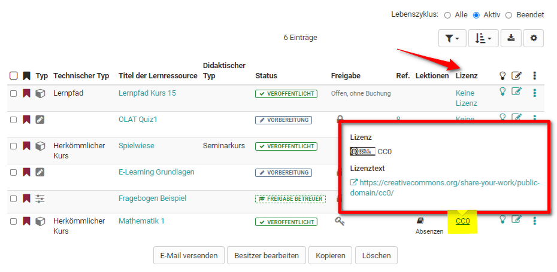
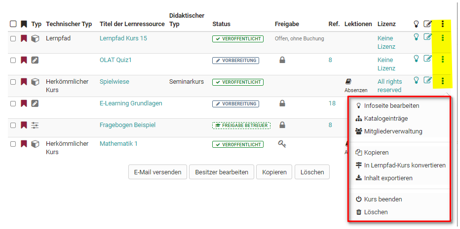
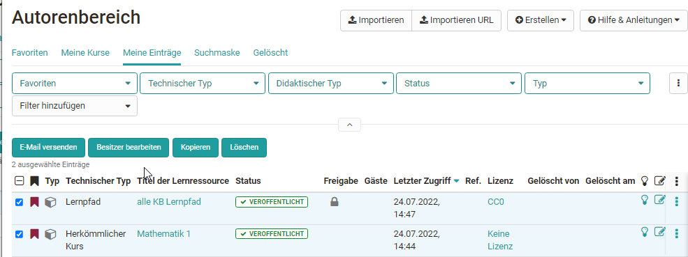

#  Actions in the 'Authoring' section

Der Autorenbereich ist der zentrale Bereich für OpenOlat Autoren. Under "My entries" OpenOlat authors can see all the learning resources they own und können diese auch erstellen oder importieren. 

Im Folgenden wird erläutert welche generellen Einstellungen im Autorenbereich vorgenommen werden können. 

## Vordefinierte Filter des Autorenbereichs

Der Autorenbereich beinhaltet bestimmte vordefinierte Filter. Hierzu zählen:

* Favoriten
* Meine Kurse
* Meine Einträge
* Gelöscht

sowie eine Suchmaske.

Unter „Meine Einträge“ sehen OpenOlat Autoren alle Lernressourcen bei denen sie Besitzer sind. Unter "Meine Kurse" werden alle herkömmlichen Kurse und alle Lernpfad Kurse bei denen Sie Besitzer sind angezeigt. "Meine Kurse" ist somit eine Teilmenge von "Meine Einträge. 

The "Favorites" tab is a subgroup of "My Entries. It shows all learning resources of an author which are bookmarked. The "Deleted"
tab displays your "Trash" with all your learning resources that you have
deleted.

###  Create learning resources

OpenOlat authors can create new courses and additional [learning resources](Various_Types_of_Learning_Resources.md). How to use various editors will be further explained in the
chapters 

* [„Creating Courses"](../course_create/index.md), 
* [„Creating CP Learning Content"](../resource_cp/index.md), 
* [„Creating wikis"](../resource_wiki/index.md), 
* [„Creating Podcasts"](../resource_podcast/index.md), 
* [„Creating Blogs"](../resource_blog/index.md), 
* ["Creating Portfolio Tasks",](../portfolio/index.md),
* ["Creating Tests" ](../tests/index.md) and
* ["Creating Forms and Questionnaires" ](../forms/index.md).

!!! tip

    If you build your courses systematically and if you want to use your learning
    resources in several courses, you should better created the learning resources
    in the authoring.

###  Import {: #import}

Learning resources generated outside of OpenOlat can be imported if they have
a format that is compatible. Suitable formats have been commented on in the
section ["Various Types of Learning Resources"](Various_Types_of_Learning_Resources.md). Using the "Import URL"
link, you can also set links to external videos, e.g. YouTube, and create them
as OpenOlat learning resource videos.

If you want to import a course e.g. from another OpenOlat instance, you will
be asked whether you also want to import the learning resources referenced by
the course (e.g. a wiki or a test). Select the corresponding checkbox if you
also want to import the referenced learning resources. Publish the imported
course afterwards to make it visible to you and other OpenOlat users.

At the end of the import, the "Settings" menu appears and further
configurations are possible, e.g. a definition of the license.

 **Licenses**

When uploading learning resources such as pictures, text, audio and video
files within the authoring section a license and a licensor can be assigned in
the metadata.

In the corresponding overview in the authoring section all assigned licenses
will be shown in the column «license». By clicking on a license, detailed
license information will be displayed.

## Tabellenansicht konfigurieren

Wählen Sie über das Zahnrad aus, welche Spalten und damit verbundenen
Informationen Ihnen angezeigt werden sollen. Besonders informativ sind z.B.
der Status, die Referenzierung (Ref.), das Erstellungsdatum oder bei Kursen
der Technische Kurstyp um herkömmliche Kurse von Lernpfad Kursen zu
unterscheiden.  

Neben der Auswahl der Spalten können Sie noch die Art der Sortierung
definieren z.B. sortiert nach der Referenzierung oder dem Status oder dem
Erstellungsdatum und die gesamte Tabelle downloaden.

###  Calling up menus and other settings

You can call many functions directly from the table view of your learning
resources. These include

  * A click on the **title** of a learning resource opens the corresponding resource.
  * The **info page** can be opened via. For **editable** learning resources such as courses, glossaries, tests, questionnaires, PCs, blogs and podcasts, the "Edit" icon opens the corresponding editor.
  * The Die 3-Punkte quickly leads to basic menus that are briefly outlined in the following:

#### Change infopage

Opens the form for changing the content of the info page. You can find more
information on the page "[Change infopage](../course_create/Course_Settings.md#CourseSettings-d14e1774)".

#### Catalogue entries

Create new catalogue entries or edit existing entries. For further information
please refer to the chapter "Course Settings", section "[Catalog entries](../course_create/Course_Settings.md#CourseSettings-d14e1825)".

#### Members management

Opens the members management of the respective learning resource. You can find
more information on the page [Members management](../course_operation/Members_management.md).

#### Copy

Copy learning resources for re-use in a new semester or create a safety copy.

#### Export Content

Export your learning resource as ZIP file for example as back-up or for the
export in another system.

#### Delete

A learning resource can only be deleted by its owner.

Herkömmliche Kurse erhalten noch das Menü "In Lernpfad konvertieren" um einen
herkömmlichen Kurs in einen Kurs vom Typ [Lernpfad](../course_create/Learning_path_course.de.md)
umzuwandeln und somit eine Kopie des Ursprungskurses zu erstellen.

## Further actions

Wählt man eine oder mehrere der angezeigten Lernressourcen aus der Tabelle aus erscheinen weitere Möglichkeiten. 

For example, e-mails can be sent to all
course participants from several courses or a person can be added to several learning resources as owner, several learning resources can be copied or deleted at once.

### Send E-mail

With this feature e-mails can be sent to members of several courses and
learning resources at the same time. Chose the desired learning resources by
selecting the checkboxes on the left. A wizard opens. Now it can be defined to whom the e-mail should be sent. Possible recipients are course owners, course coaches and participants. 

!!! hint

    You can send e-mails to all courses visible to you in the authoring. These are for example courses which are visible for all
    authors. This means you do not need to be a member of this certain course to
    use this feature.

### Modify owners

Here you will see the owners of the selected learning resources and you can
remove them from several courses at once or add new owners to the selected
learning resources. An email notification option completes the editing.

### Copy

All learning resources can be copied. Copied learning resources will be found
in the tab "My entries" after. The supplement "(Copy)" is added to the title.
The title can be changed as desired.

### Delete

Learning resources can also be deleted together. Then the learning resources
are not deleted definitely. They can be found in the tab "Deleted" and are
there only visible for the corresponding owner. The owner of the deleted
learning resources can restore the deleted learning resources. The OpenOlat

system administrator can restore deleted learning resources as well and can
also delete them definitely.

  

