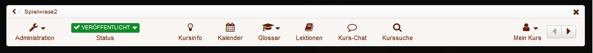
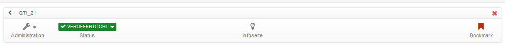
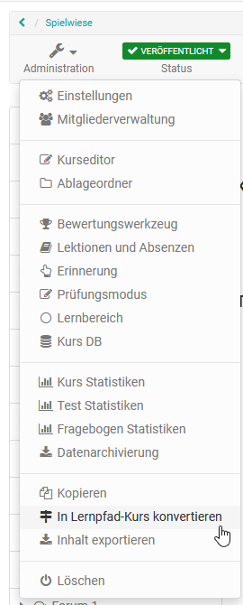
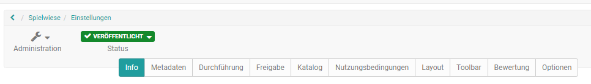

# Detailansicht einer Lernressource

## Toolbar

Jede Lernressource verfügt über eine Toolbar die Zugriff auf verschiedene
Werkzeuge und Einstellungen bereitstellt. Welche der folgenden Aktionen
möglich sind, hängt einerseits von Ihrer Zugriffsberechtigung und andererseits
vom Lernressourcentyp ab. Auf die Toolbar haben Sie sowohl von der
Lernressource sowie von der Infoseite aus Zugriff.

Beispiele für eine Kurs und eine Test-Toolbar:

Das Dropdown-Menü "Administration" stellt sämtliche Werkzeuge zur
Konfiguration und Einrichtung einer Lernressource bereit und ist ziemlich
umfangreich. Die genauen Möglichkeiten variieren je nach Lernressource.

Im Untermenü "Einstellungen" sind viele Optionen gebündelt. Hier kann die
Infoseite eingerichtet, die Freigabe der Lernressource organisiert,
Katalogeinträge vorgenommen und einiges mehr.

Weitere Informationen zu ein einzelnen Einstellungen finden Sie unter "[
_Kurseinstellungen_](../course_create/Course_Settings.de.md)".

 