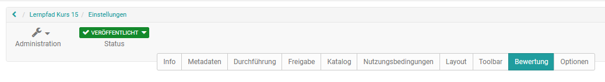

# Infoseite einrichten

Jede Lernressource verfügt über eine [Infoseite](../catalog/Info_page.de.md). Diese kann
vom Besitzer der Lernressource inhaltlich gefüllt werden und steht
Interessierten nach Veröffentlichung der Lernressource, unabhängig von einer
Buchung, bereits vor betreten der Lernressource zur Verfügung. Das ist z.B.
sinnvoll, wenn man die Zielgruppe bereits im Vorfeld informieren möchte.

Die Einrichtung der Infoseite erfolgt im Bereich "Einstellungen" des Menüs
"Administration". Besonders die Tabs "Info", "Metadaten" und "Durchführung"
sind hierfür relevant. Je ausführlicher Sie die Lernressource beschreiben,
umso einfacher kann diese gefunden und desto besser sind Interessierte und
spätere Teilnehmer informiert.

Der Screenshot zeig die "Einstellungen" eines Kurses. Je nach Lernressource
steht nur ein Teil der Tabs zur Verfügung.

## Info

 **Titel der Lernressource:** **** Ein Pflichtfeld. Über diesen Titel (maximal
100 Zeichen) kann die Lernressource auch in der Suchmaske gefunden werden.
Geben Sie hier einen möglichst kurzen und präzisen Titel für die Lernressource
ein. **  
**

**Kennzeichen:** Eine externe Kennung für die Ressource, z.B. die Bezeichnung
aus dem Vorlesungsverzeichnis oder eines gedruckten Kurskataloges.

 **Beschreibung:** Hier können Sie weitere Informationen zur Lernressource
bereitstellen und die Dinge erwähnen, die für die Lernressource wichtig sind.

Geben Sie die **Lernziele** und **Voraussetzungen** Ihres Kurses an, damit
Interessierte mehr darüber erfahren.

 **Bescheinigung** : Hier können Sie erläutern ob bzw. welche Bescheinigung
die Teilnehmer nach der Bearbeitung des Kurses bzw. der Lernressource erhalten
und welche Anforderungen damit verknüpft sind.

Ein **Titelbild** (jpg Format) oder ein kleines Video als **Teaser-Film** im
mp4 Format runden die Beschreibung ab. Das Bild wird im Katalog und der
Infoseite angezeigt. Achten Sie dabei auf die angezeigten technischen Vorgaben
und die Upload Grenzen.

Sie sollten unbedingt ein Titelbild oder Teaser-Film einstellen. Dadurch
gewinnt die Beschreibung deutlich an Attraktivität. Achten Sie bei Bildern
darauf, keine Texte oder nur kurze Schlagworte darzustellen und eine zum Kurs
bzw. zur Lernressource passenden Visualisierung zu verwenden.

## Metadaten

Im Reiter "Metadaten" nehmen Sie weitere Einstellungen für die Infoseite vor.
**  
**

**Autoren** : Hier können die zuständigen Ansprechpartner oder Lehrenden
eingetragen werden. Sie müssen nicht mit dem Ersteller der Lernressource
übereinstimmen. Das Feld ist ein reines Textfeld, der Inhalt wird lediglich
auf der Kursübersichtsseite angezeigt.

 **Fachbereiche** : Sofern definiert, können hier passende Fachbereiche
ausgewählt werden.

 **Didaktischer Typ:**   Kurse können hier einer der ausgewählten Kategorien
zugeordnet werden. Die Zuordnung hat aber keinerlei Auswirkung auf die
wirkliche Ausgestaltung des Kurses. Auch können die Begriffe von
unterschiedlichen Autoren verschieden verwendet werden.

 **Hauptsprache** : Tragen Sie die Sprache ein in der die Lernressource
erstellt wurde bzw. die Sprache in der der Kurs, Test o.ä. durchgeführt wird.
Es wird keine Selektion von Kursen anhand der Benutzersprache und dieses
Feldes durchgeführt.

Auch der **Zeitaufwand** für die Lernressource kann hier eingetragen werden.
**  
**

 **Lizenz** : Wählen Sie im Drop-Down Menü aus unter welcher Lizenz die
Lernressource stehen soll. Die Grundeinstellung ist "All rights reserved",
weitere Einstellungen der Creative Commons können hier ebenfalls verwendet
werden. Welche Lizenzen genau eingestellt werden können definiert der Admin in
den allgemeinen OpenOlat Einstellungen.

Typische Creative Commons Lizenzen sind

  * CC BY-NC-ND
  * CC BY-NC-SA
  * CC-BY-NC
  * CC BY-SA
  * CC BY
  * CC0

Was sich genau hinter welcher Lizenz verbirgt können Sie [hier
](https://creativecommons.org/licenses/?lang=de)nachlesen.  Ergänzend zur
Lizenz kann auch der **Lizenzgeber** eingetragen werden.

Wichtig: Überlegen Sie sich genau unter welche Lizenz Sie einen Kurs oder eine
andere Lernressource stellen wollen. Wenn Sie verstärkt OER (open educational
resources) erstellen wollen, sind die Creative Commons Lizenzen ein passender
Ansatz. Beachten Sie aber für alle verwendeten Materialien unbedingt das
Urheberrecht, damit Ihre Angaben korrekt sind.

## Durchführung

Kurse verfügen, im Gegensatz zu anderen Lernressourcen, im Menü
"Einstellungen" noch über den Tab "Durchführung". **  
**

 **Durchführungsort** : Der Ort, an dem ein Kurs bzw. eine Lernressource
durchgeführt wird. Dieser Punkt ist vor allem bei Blended Learning Angeboten
sinnvoll. Bei einer reinen online Nutzung kann das Feld auch frei bleiben.
Alternativ kann hier „online“ oder „Internet“ eingetragen werden.

 **Durchführungszeitraum:** Bei Lernressourcen vom Typ "Kurs" kann ein
Durchführungszeitraum festgelegt werden. Folgende Optionen sind möglich:

  *  _Ohne_ : Wählen Sie diese Option, wenn der Kurs nicht zu einem bestimmten Daten beginnt und aufhört oder Sie den Termin nicht explizit in den Informationen einbauen möchten.

  *  _Mit Begin- und Enddatum_ : Der Kursbesitzer kann hier das Start- und Enddatum des Kurses eintragen. Das Datum erscheint anschließend als Information in der Kursübersicht. Das eingetragene Datum ist jedoch unabhängig vom Kursstatus und den Kurszugangsrechten (siehe Kapitel „[Zugangskonfiguration](../course_create/Access_configuration.de.md)“). Es hat also keine Auswirkung auf die Sichtbarkeit und den Zugang für die Kursmitglieder.

  *  _Semester_ : Wenn auf Systemebene vom OpenOlat Administrator Semesterdaten konfiguriert wurden, kann hier eine der angezeigten Semester Optionen ausgewählt werden. Das Semester erscheint anschließend als Information in der Kursübersicht. Das Semester ist jedoch unabhängig vom Kursstatus und den Kurszugangsrechten (siehe Kapitel „[Zugangskonfiguration](../course_create/Access_configuration.de.md)“). Es hat also keine Auswirkung auf die Sichtbarkeit und den Zugang für die Kursmitglieder.

Der konfigurierte Durchführungszeitraum wird auch in den Informationen der
Kursinfo angezeigt.

Ferner gibt es noch weitere Einstellungen, die nicht direkt in der Kursinfo
angezeigt werden.

  

Die ID der Lernressource, der Ersteller sowie der Typ der Lernressource werden
automatisch generiert und angezeigt. Mit der ID können Sie die Lernressource
auch über die Suchmaske suchen. Sie können auch nach dem dargestellten Typ
suchen.

