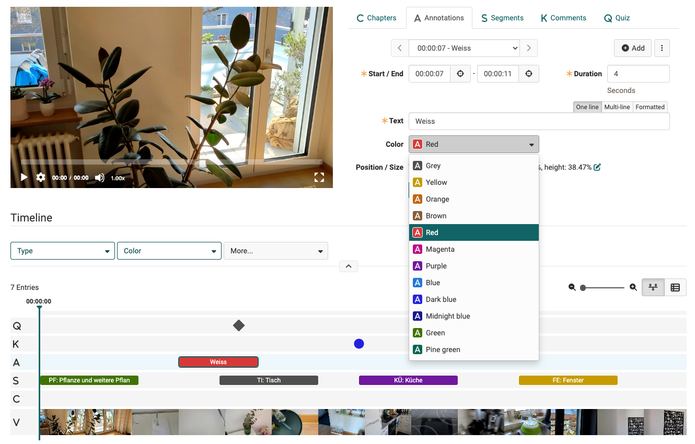

# Accessibility: Colors {: #colors}

## Background colors [:octicons-tag-16:{ title="from Release 19.1 (OO-8090)" }](https://track.frentix.com/issue/OO-8090){:target="_blank"} {: #background_colors}

One aspect of the [WCAG 2.1 AA guideline](https://www.w3.org/TR/WCAG21/) are specifications regarding the contrast ratio of fonts to the respective background. In OpenOlat, link elements with colors that are too light are therefore automatically darkened so that they meet the minimum contrast according to WCAG 2.1. On a grey background, this can lead to visible differences in the font color compared to the white background.

As a rule, this is only the case if the selected standard color already has a very low contrast value. This can be checked with the following tool, for example: 
[https://webaim.org/resources/contrastchecker/](https://webaim.org/resources/contrastchecker/)

## Recommendations {: #recommendations}

A) If the "corporate color" has a low contrast value, it should only be present in layout elements such as the logo or as a background color in the top navigation and should not be used as a link color. The following could be used as a link color:

- a high-contrast variant of the main color
- a complementary color that harmonizes with the main color
- a secondary "corporate color"

B) If no alternative color is possible for the links, the automatic contrast adjustment can be deactivated and the low-contrast main color can be used again. We would like to point out that WCAG AA conformity cannot be achieved in this way.

## Examples {: #examples}

We make sure that the contrast (especially of the primary colors) enables particularly good legibility. For example, the **color selection tool** only contains colors that have been tested for contrast.

{ class="shadow lightbox" }

## Further information {: #further_information}

[WCAG 2.1 (W3C) >](https://www.w3.org/TR/WCAG21/) 
[WebAIM Contrast Checker >](https://webaim.org/resources/contrastchecker/) 
[Accessibility: Basic principles >](Accessibility_Principals.md) 
[Learning resource: Video >](../learningresources/Learning_resource_Video.md) 
[Customizing >](../../manual_admin/administration/Customizing.md)

[To the top of the page ^](#colors)
