# Rollen und Rechte: Rollen zuweisen {: #role_assignment} 

## Rollenzuweisung für Organisationsrollen {: #role_assignment_org} 

Organisationsweit oder systemweit gültige Rollen werden in der Benutzerverwaltung vergeben: 
**Benutzerverwaltung > Auswahl eines Benutzers > Tab "Rollen"** 
Dem entsprechend wird die Zuweisung typischerweise durch Benutzerverwalter:innen oder Administrator:innen vorgenommen.

:octicons-device-camera-video-24: **Video-Einführung**: [Benutzerverwaltung](<https://www.youtube.com/embed/V1RuH0q08J8>){:target="_blank”}

Als Standard-Rolle ist "Benutzer:in" eingetragen. Je nach Aufgabenbereich sind weitere Rollen - und damit weitere Rechte - zu aktivieren.

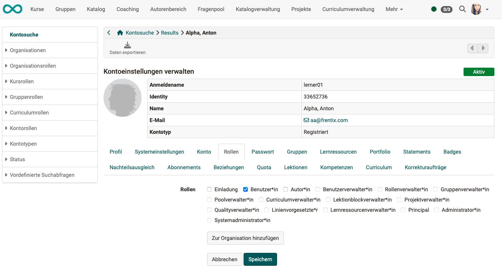{ class=" shadow lightbox" }

[zum Seitenanfang ^](#role_assignment)

---

## Rollenzuweisung für Kursrollen {: #role_assignment_course}

**Rollen neuer Kursmitglieder** 
Kursbesitzer:innen fügen neue Kursmitglieder hinzu unter 
**Kursadministration > Mitgliederverwaltung > Button "Mitglied hinzufügen"** 
Die gewünschte Rolle innerhalb eines Kurses wird dann während des Erfassens des neuen Mitglieds abgefragt.

**Rollenzuweisung der Kursbesitzer:innen** 
Eine Person mit Autorenrecht (= Organisationsrolle "Autor:in"), die einen Kurs erstellt, ist automatisch Besitzer:in dieses Kurses (Kursrolle "Besitzer:in"). Wenn gewünscht, können dann weitere Personen zu Mit-Besitzer:innen gemacht werden.

**Rollen der Kursmitglieder ändern** 
Bei Mitgliedern eines Kurses kann die Rolle geändert werden unter  
**Kursadministration > Mitgliederverwaltung > Mitglied auswählen (Klick auf den Namen) > eine oder mehrere Kursrollen vergeben**

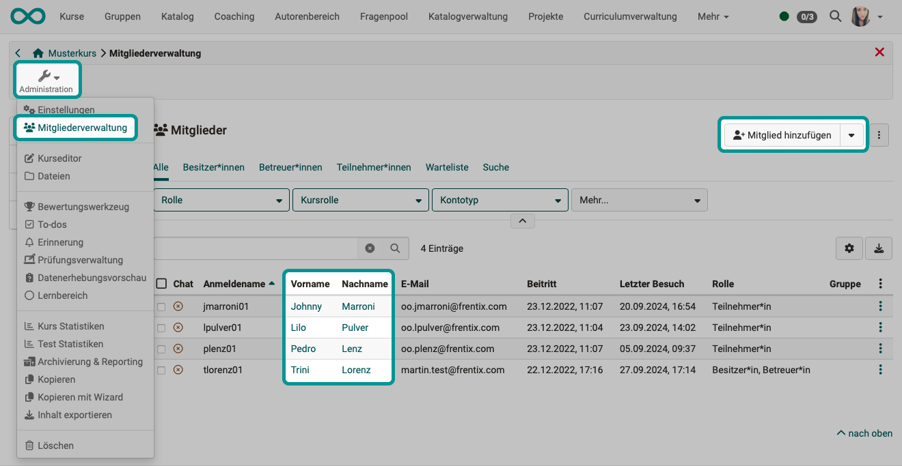{ class=" shadow lightbox" }
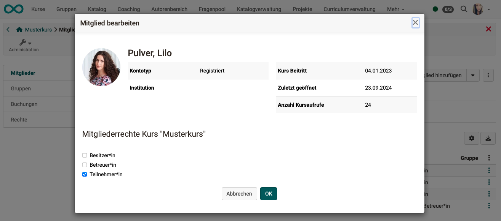{ class=" shadow lightbox" }

[zum Seitenanfang ^](#role_assignment)

---

## Rollenzuweisung für Gruppenrollen {: #role_assignment_group} 

**Rollenzuweisung beim [Erstellen einer neuen Gruppe](../groups/index.de.md) / Hinzufügen neuer Mitglieder:** 
Beim Hinzufügen neuer Mitglieder werden auch die Rollen "Gruppenteilnehmer:in" und "Gruppenbetreuer:in" vergeben.

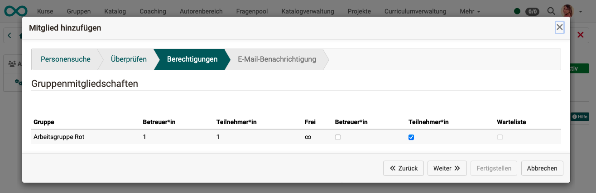{ class=" shadow lightbox" }

**Rollen der Gruppenmitglieder ändern** 
Besteht bereits eine Mitgliedschaft in einer Gruppe und Sie wollen die Rolle der Person ändern, können Sie dies (bei vorhandener Berechtigung zum Bearbeiten) in der Administration der Gruppe.

**Gruppen > Administration > Tab Mitglieder > Icon mit 3 Punkten am Ende der Zeile des betreffenden Mitglieds > Option "Mitglied bearbeiten"**

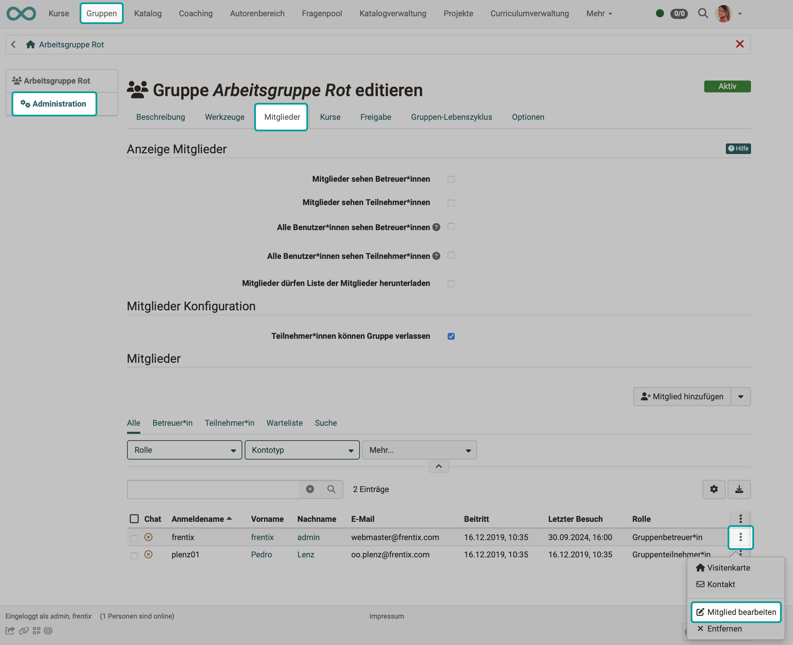{ class=" shadow lightbox" }
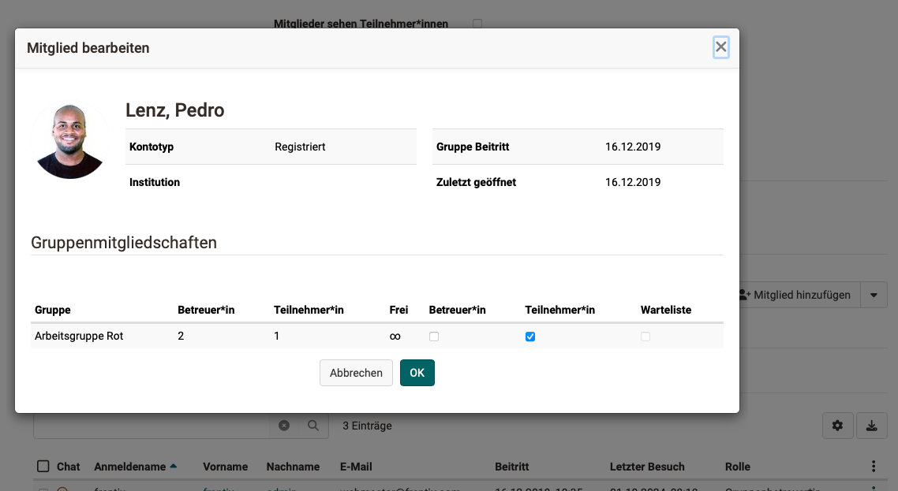{ class=" shadow lightbox" }

**Zuweisung der Rolle Gruppenbetreuer:innen** 
Wenn Sie eine neue Gruppe erstellen, sind Sie automatisch Betreuer:in dieser Gruppe. Betreuer:innen einer Gruppe erhalten zusätzlich den Link "Administration" im Menü. Wenn gewünscht, können dann weitere Personen zu Gruppenbetreuer:innen gemacht werden. 
(Vorgehen dazu: Gruppen > Administration > Tab Mitglieder > Icon mit 3 Punkten am Ende der Zeile des betreffenden Mitglieds > Option "Mitglied bearbeiten")

**Zuweisung der Rolle Gruppenverwalter:innen** 
Da Gruppenverwalter:innen gruppenübergreifend Aufgaben wahrnehmen, ist dies eine organisationsweit gültige Rolle. Deshalb wird diese Rolle nicht innerhalb einer bestimmten Gruppe vergeben, sondern in der Benutzerverwaltung (Vorgehen wie für organisationsweit gültige Rollen).

[zum Seitenanfang ^](#role_assignment)

---

## Rollenzuweisung für Curricula {: #role_assignment_curriculum} 

In einem Curriculum und Curriculumelement können folgende Rollen zugewiesen werden:

* Curriculumbesitzer:in
* Elementbesitzer:in
* Klassenlehrer:in (Master Coach)
* (Curriculum-)Kursbesitzer:in
* (Curriculum-)Betreuer:in
* (Curriculum-)Teilnehmer:in

Nach dem Eintragen der Rolle hat die Person automatisch Zugriff auf **alle** Kurse, die mit dem jeweiligen Curriculum oder Curriculumelement verbunden sind. Jeweils entsprechend den Rechten, die mit ihrer Rolle im Curriculum verbunden sind.

Einem Curriculum als Ganzes können keine Mitglieder zugewiesen werden, nur den Curriculumelementen.

**Rollenzuweisung beim Hinzufügen neuer Curriculum-Mitglieder**  
Jedem Curriculumelement können durch Curriculumverwalter:innen, Curriculumbesitzer:innen oder Curriculumelementbesitzer:innen direkt Benutzer:innen als neue Curriculumsmitglieder zugewiesen werden. Während des Eintrags der neuen Mitgliedschaft können gleich Rollen zugewiesen werden.

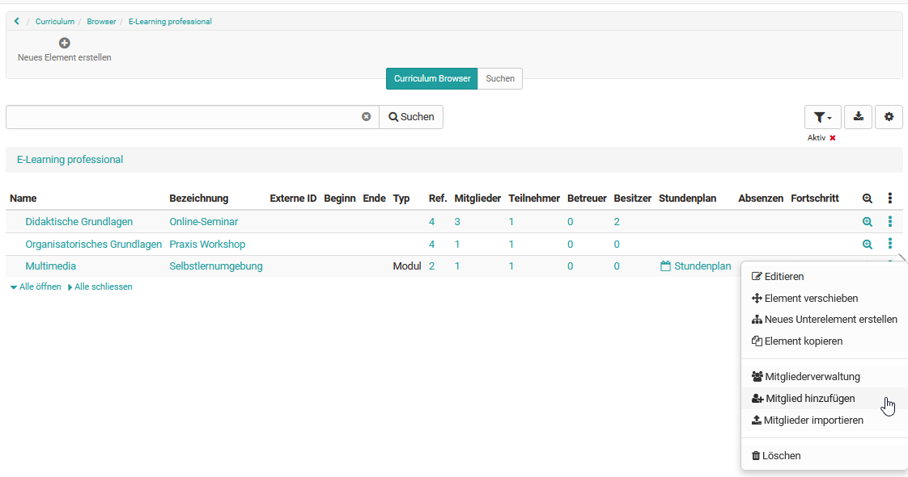{ class=" shadow lightbox" }

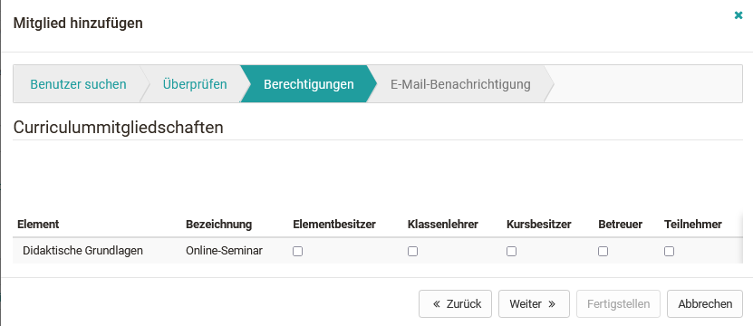{ class=" shadow lightbox" }

 

**Rollenzuweisung bei bestehenden Mitgliedschaften ändern**  

Die Bearbeitungsmöglichkeit für die Rollen

* Curriculumelementbesitzer:in
* Klassenlehrer:in
* (Curriculum-)Kursbesitzer:in
* (Curriculum-)Kursbetreuer:in
* (Curriculum-)Kursteilnehmer:in

finden Sie jeweils beim Curriculumelement: **Curriculumelement öffnen > 3-Punkt-Menü > Mitgliederverwaltung**

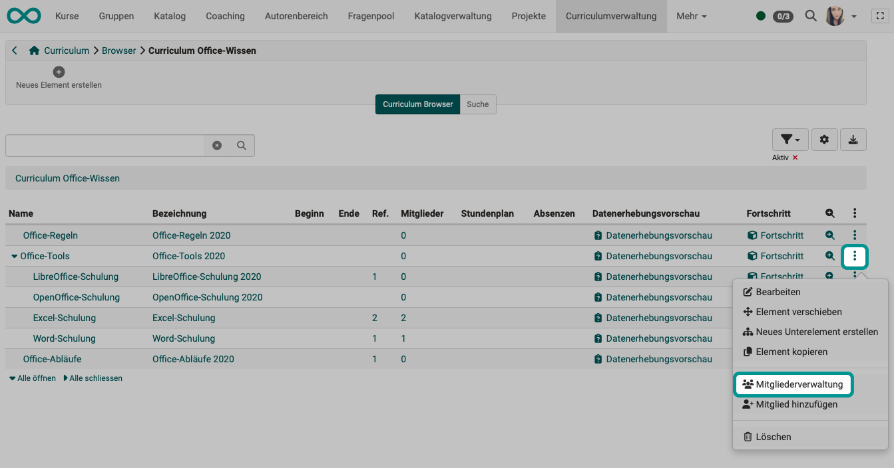{ class=" shadow lightbox" }

**Zuweisung der Rolle Curriculumbesitzer:in** 
Die Rolle des/der Curriculumbesitzer:in wird zugewiesen durch Curriculumverwalter:innen unter 
**Curriculumverwaltung > Curriculum Browser > Tab Benutzerverwaltung > Button "Mitglied hinzufügen"**

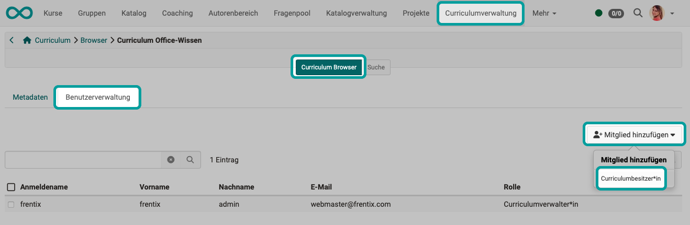{ class=" shadow lightbox" }

**Zuweisung der Rolle Curriculumverwalter:in** 
Diese Rolle ist eine curriculumsübergreifende, organisationsweit geltende Rolle.
Curriculumverwalter:innen müssen deshalb in der Benutzerverwaltung hinzugefügt werden.
Siehe [Curriculum bearbeiten und Curriculumverwalter hinzufügen](../area_modules/Curriculum_Management.de.md#curriculum-bearbeiten-und-curriculumverwalter-hinzufugen).  

[zum Seitenanfang ^](#role_assignment)

---

## Rollenzuweisung organisationsspezifischer Rollen {: #role_assignment_orgunit} 

Die Rollen, die Benutzer:innen in unterschiedlichen Organisationseinheiten erhalten, werden in der Benutzerverwaltung vergeben. 
**Benutzerverwaltung > Benutzer:in auswählen > Tab Rollen > OrgUnit auswählen**

:octicons-device-camera-video-24: **Video-Einführung**: [Benutzerverwaltung](<https://www.youtube.com/embed/V1RuH0q08J8>){:target="_blank”}

Eine Person kann in mehreren Organisationseinheiten Mitglied sein und in jeder Organisationseinheit andere Rollen innehaben. Z.B. wenn die Person nur in der eigenen Organisationseinheit Autorenrechte haben soll. 

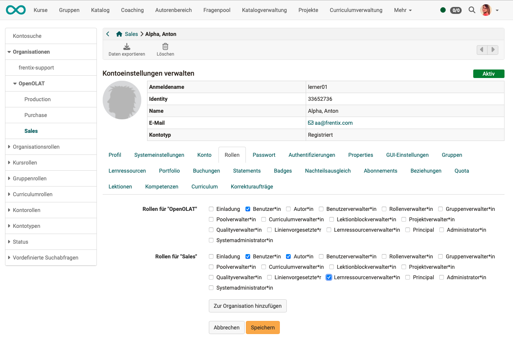{ class=" shadow lightbox" }

[zum Seitenanfang ^](#role_assignment)

---

## Rollenzuweisung der "Einladung" {: #role_assignment_invitee} 

Die "Rolle", bzw. den zugehörigen Rechtestatus, erhalten alle Personen, die über die Option "**Externe Mitglieder einladen**" einem Kurs hinzugefügt wurden. Im Benutzermanagement sollte nur ausnahmsweise die Rolle "Einladung" zugeteilt werden. 

Soll z.B. im ePortfolio eine externe Person Einsicht in eine Mappe erhalten, wird die Einladung erstellt unter  
**Portfolio-Mappe wählen > Tab Freigabe > Zugriffsrecht hinzufügen > Einladung hinzufügen**

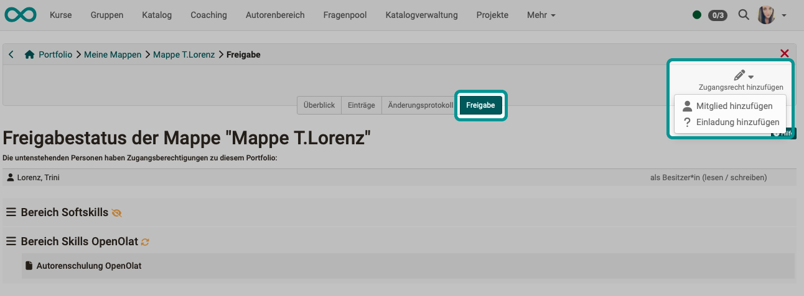{ class=" shadow lightbox" }

[zum Seitenanfang ^](#role_assignment)

---

## Eigene Rollen und Beziehungen definieren {: #role_assignment_relations} 

Die Aktiverung und Definition eigener Rollen muss durch **Administrator:innen** erfolgen. 
(**Administration > Module > Rolle Benutzer zu Benutzer**) 
Z.B. Vorgesetzte:r, Untergebene:r, Expert:in, Zu Beurteilende:r, Elternteil, Ausbildungsverantwortliche:r, Schüler:in, Mentor:in, Lernbegleiter:in, usw.

Anschliessend können durch **Benutzerverwalter:innen** in 
**Benutzerverwaltung > Benutzer:in wählen > Tab Beziehungen** 
neue Beziehungen zwischen dem/der gewählten Benutzer:in und anderen OpenOlat-Nutzern angegeben werden
(z.B. Vorgesetzte:r - Untergebene:r).

Es kann nur die von Administrator:innen eingerichtete und definierte Systematik der Rollen verwendet werden.

[zum Seitenanfang ^](#role_assignment)

---

## Weiterführende Informationen

:octicons-device-camera-video-24: **Video-Einführung**: [Benutzerverwaltung](<https://www.youtube.com/embed/V1RuH0q08J8>){:target="_blank”}

[Organisationsrollen](roles.de.md#org)  

[Kursrollen](roles.de.md#course)  

[Gruppenrollen](roles.de.md#groups)  
[Erstellen einer neuen Gruppe](../groups/index.de.md)  
[Gruppen verwalten](../area_modules/Group_Management.de.md) 

[Curriculumrollen](roles.de.md#curriculum)  
[Curriculumverwaltung](../area_modules/Curriculum_Management.de.md)  

[Rollen in einer Organisationseinheit](roles.de.md#orgunit)  

[Selbst definierte Rollen und Beziehungen](roles.de.md#relations)  

[Rolle "Einladung"](roles.de.md#invitee)  

 

[zum Seitenanfang ^](#role_assignment)
