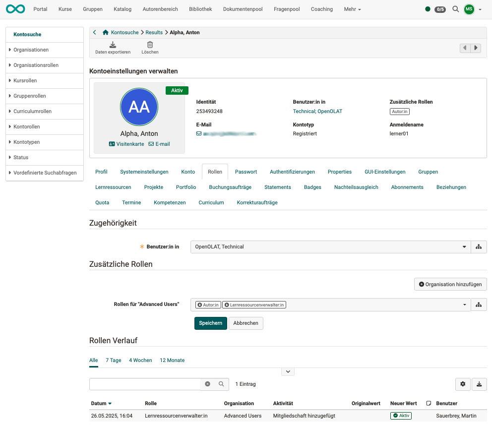
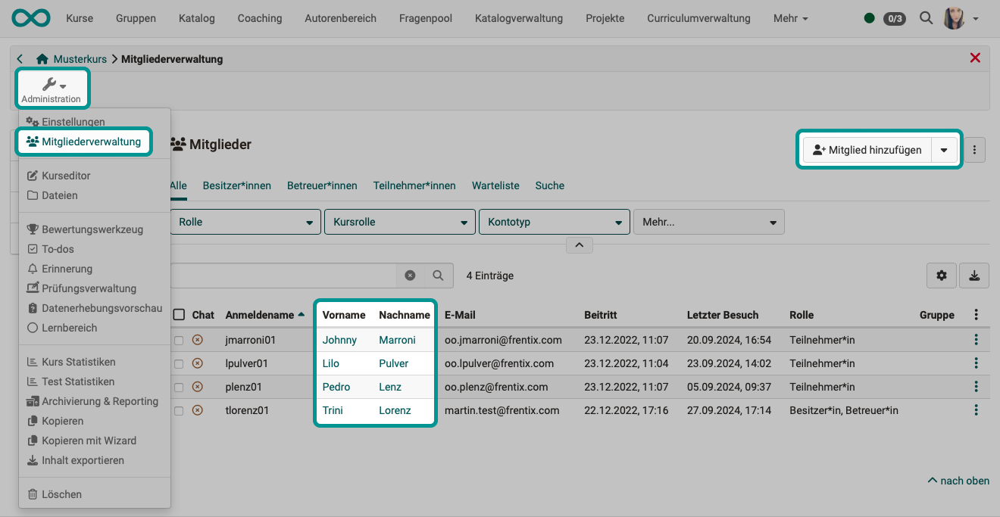
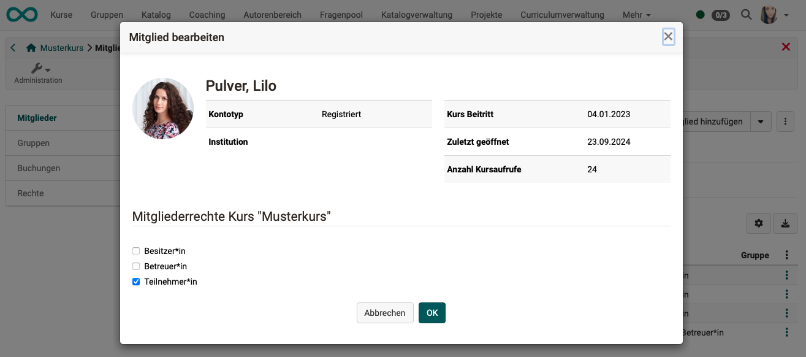
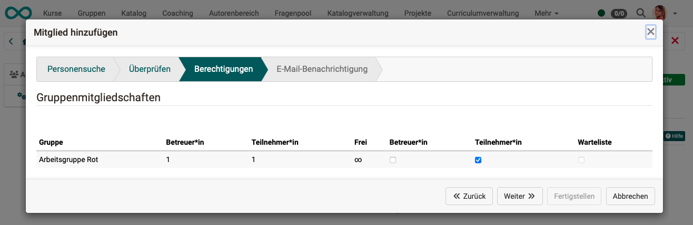
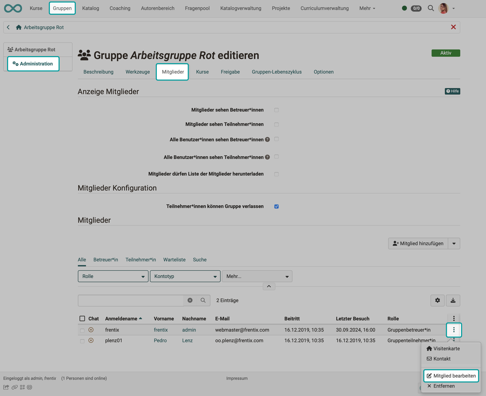
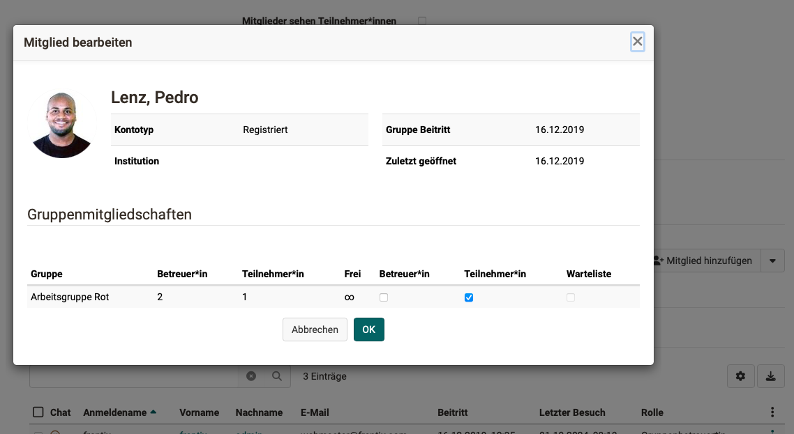
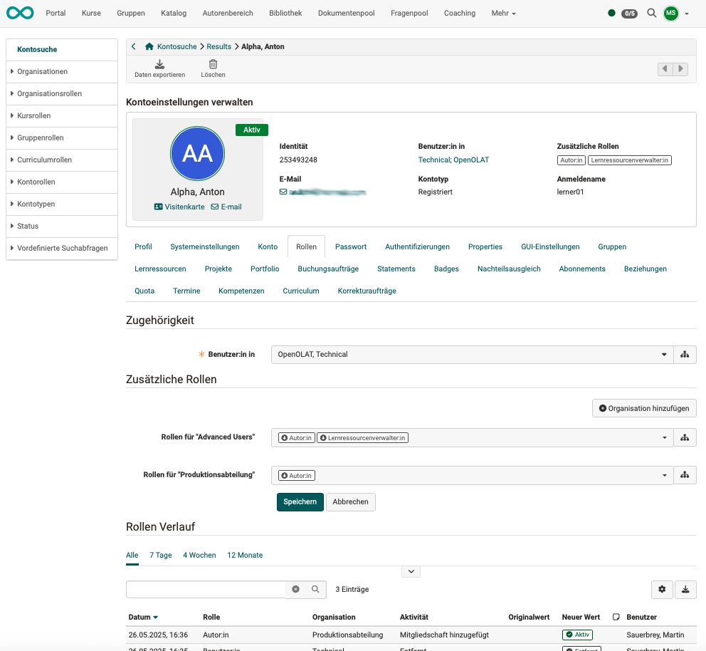
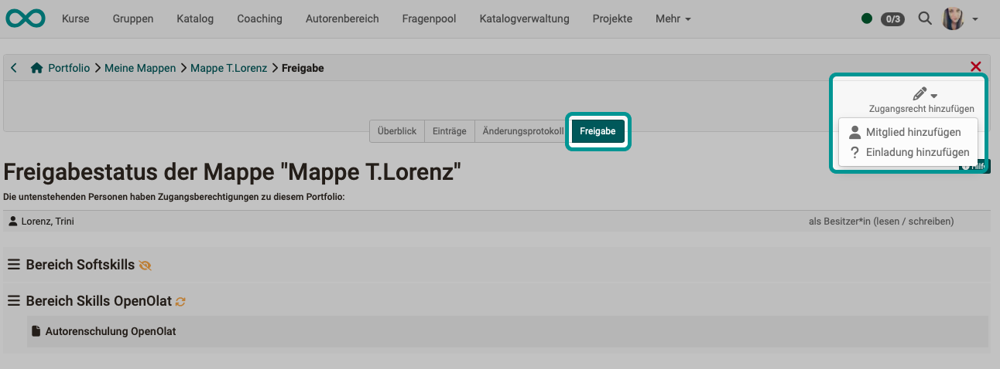

# Roles and Rights: Assign roles {: #role_assignment}

## Role assignment for organisation roles {: #role_assignment_org}

Organisation-wide or system-wide roles are assigned in the user management: 
`User management > Select user > Tab "Roles"` 
Accordingly, the assignment is typically made by user managers or administrators.

:octicons-device-camera-video-24: **Video Introduction (German)**: [User management](<https://www.youtube.com/embed/V1RuH0q08J8>){:target="_blank"}

Depending on the area of responsibility, roles, and therefore additional rights, have to be added.

The "Roles" tab shows the affiliation of the person ("User in"), their additional roles per organisation and, under "Roles history", every change to the roles. The administration manual describes the details: [Configure User](../../manual_admin/usermanagement/Configure_User.md)

{ class="shadow lightbox" }

[To the top of the page ^](#role_assignment)

---

## Role assignment for course roles {: #role_assignment_course}

**Roles of new course members** 
Course owners add new course members under 
`Course > Administration > Members management > Button "Add member"` 
The desired role within a course is then queried while the new member is being entered.

**Role assignment of the course owners** 
A person with authoring rights (= organisation role "Author") who creates a course is automatically the owner of this course (course role "Owner"). If desired, other people can then be made co-owners.

**Change roles of course members** 
For members of a course, the role can be changed under 
`Course > Administration > Members management > Click on the name of the member` 
In the dialog "Edit member" you assign one or more course roles.

{ class="shadow lightbox" }
{ class="shadow lightbox" }

[To the top of the page ^](#role_assignment)

---

## Role assignment for group roles {: #role_assignment_group} 

**Role assignment when [creating a new group](../groups/index.md) / adding new members:** 
When new members are added, the roles "Group participant" and "Group coach" are also assigned.

{ class="shadow lightbox" }

**Change roles of group members** 
If a membership in a group already exists and you want to change the role of the person, you can do this (if you have the authorisation to edit) in the administration of the group: 
`Groups > Administration > Tab "Members" > Icon with 3 dots at the end of the row > "Edit membership"`

{ class="shadow lightbox" }
{ class="shadow lightbox" }

**Assignment of the role group coach** 
When you create a new group, you are automatically the coach of this group. Coaches of a group also receive the "Administration" link in the menu. If desired, additional people can then be made group coaches. 
Procedure: `Groups > Administration > Tab "Members" > Icon with 3 dots at the end of the row > "Edit membership"`

**Assignment of the role group manager** 
As group managers perform cross-group tasks, this is an organisation-wide role. Therefore, this role is not assigned within a specific group, but in the user management (procedure as for organisation-wide roles).

[To the top of the page ^](#role_assignment)

---

## Role assignment in the Course Planner {: #role_assignment_course_planner} 

Anyone who has the role course planner automatically has access to all courses associated with the respective product. 

No members can be assigned to a product, only to the implementations. Course planners can assign the participants for all implementations.

[To the top of the page ^](#role_assignment)

---

## Role assignment of organisation-specific roles {: #role_assignment_orgunit} 

The roles that users receive in different organisation units are assigned in the user management. 
`User management > Select user > Tab "Roles" > Button "Add organisation"`

:octicons-device-camera-video-24: **Video Introduction (German)**: [User management](<https://www.youtube.com/embed/V1RuH0q08J8>){:target="_blank"}

A person can be a member of several organisation units and hold different roles in each organisation unit. For example, if the person should only have author rights in their own organisation unit. 

{ class="shadow lightbox" }

[To the top of the page ^](#role_assignment)

---

## Role assignment of the "Invitee" {: #role_assignment_invitee} 

All persons who have been added to a course via the option "**Invite external members**" receive this "role", or the associated rights status. In the user management the role "Invitee" should only be assigned in exceptional cases. 

If, for example, an external person is to be given access to a binder in the Portfolio, the invitation is created under 
`Portfolio > My binders > "Binder" > Tab "Shares" > Add access rights > Add invitation`

{ class="shadow lightbox" }

[To the top of the page ^](#role_assignment)

---

## Define own roles and relations {: #role_assignment_relations} 

The activation and definition of own roles is carried out by **administrators** in the system administration: 
`Administration > Modules > Role user to user` 
E.g. superior, subordinate, expert, appraisee, parent, education manager, student, mentor, learning guide, etc.

Subsequently, **user managers** can specify under 
`User management > Select user > Tab "Relations"` 
new relations between the selected person and other OpenOlat users (e.g. superior - subordinate).

Only the system of roles set up and defined by administrators can be used.

With the user-to-user relation in OpenOlat, cross-course support functions can be set up in the administration or in the user management, for example for mentors, learning guides and superiors. If this is the case, coaches can easily and clearly access the persons to be coached in Coaching and make assessments.

Specific rights can be defined for each user-to-user relation and thus access can be granted to explicitly released contents of the coached persons, such as course list, calendar, absence overview, efficiency statements and certificates. Similarly, the role "Line manager" is also mapped in Coaching. Here, too, defined contents of users of the own organisation unit can be accessed.

[To the top of the page ^](#role_assignment)

---

## Further information {: #further_information} 

**Mentioned on this page** 
[Configure User >](../../manual_admin/usermanagement/Configure_User.md) 
[Groups >](../groups/index.md)

**Further reading** 
[Which roles are available? >](Roles.md) 
[Group Management >](../area_modules/Group_Management.md) 
[Course Planner: Overview >](../area_modules/Course_Planner.md)

**youtube** 
[User management](<https://www.youtube.com/embed/V1RuH0q08J8>)

[To the top of the page ^](#role_assignment)
