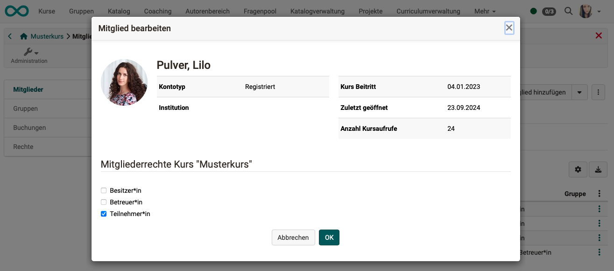
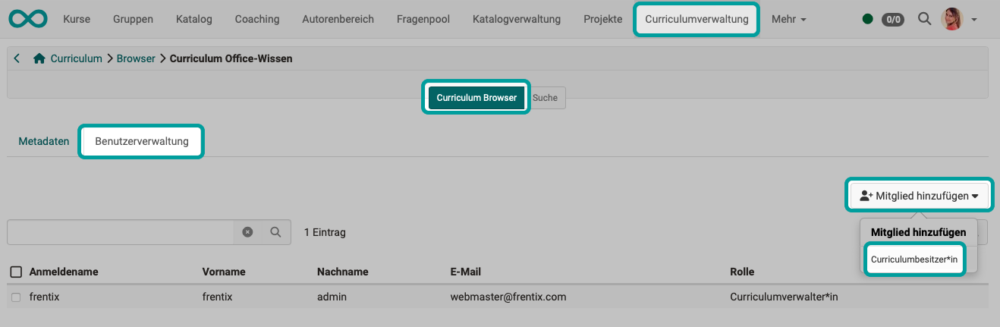
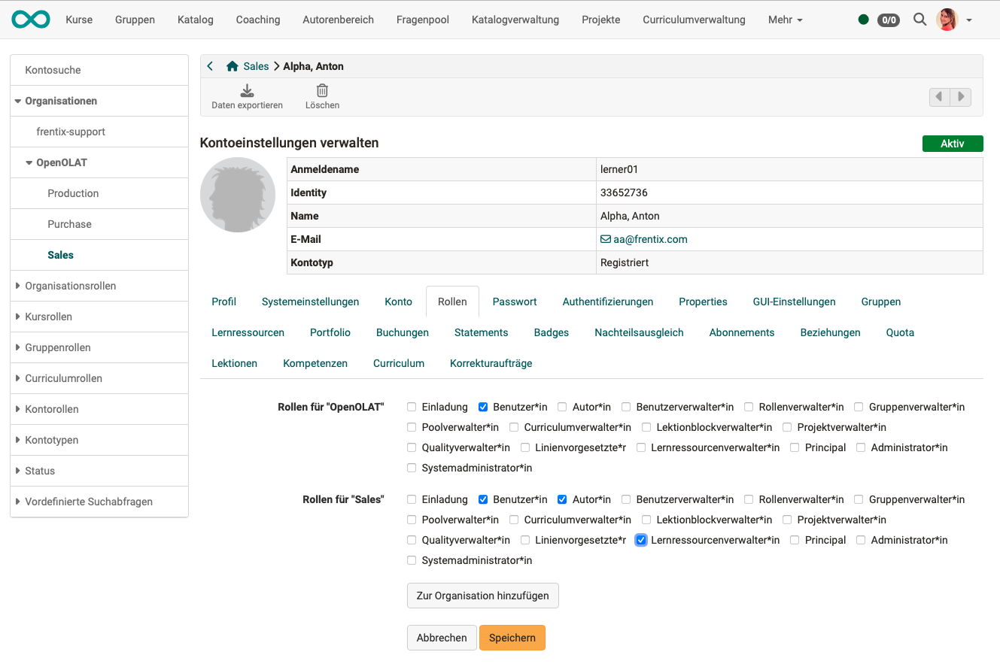

# Roles and Rights: Assign roles {: #role_assignment}

## Role assignment for system roles {: #role_assignment_system}

System-wide roles are assigned in the user management: 
**User management > Selecting a user > Tab "Roles"** 
Accordingly, the assignment is typically made by user management or administrators.

"User" is entered as the default role. Depending on the area of responsibility, additional roles - and therefore additional rights - must be activated.

{ class=" shadow lightbox" }

[To the top of the page ^](#role_assignment)

---

## Role assignment for course roles {: #role_assignment_course}

**Roles of new course participants** 
Course owners add new course members at 
**Course administration > User management > Button "Add member"** 
The desired role within a course is then queried when the new member is entered.

**Assignment of roles to course owners** 
A person with author rights (= system role "Author"), who creates a course, is automatically the owner of this course (course role "Owner"). If desired, other people can then be made co-owners.

**Changing the roles of course members** 
For members of a course, the role can be changed under 
**Course administration > Members management > Select member (Click on the name) > Assign one or more course roles**

{ class=" shadow lightbox" }
{ class=" shadow lightbox" }

[To the top of the page ^](#role_assignment)

---

## Role assignment for group roles {: #role_assignment_group} 

**Role assignment when [creating a new group](../groups/index.md) / Adding new Members:** 
When new members are added, the roles "Group member" and "Group coach" are also assigned.

{ class=" shadow lightbox" }

**Change roles of group members** 
If there is already a membership in a group and you want to change the role of the person, you can do this (if you have the authorization to edit) in the administration of the group.

**Groups > Administration > Members tab > Icon with 3 dots at the end of the row of the member in question > Option "Edit member"**

{ class=" shadow lightbox" }
{ class=" shadow lightbox" }

**Assignment of the group coach role** 
When you create a new group, you are automatically the coach of this group. Coaches of a group also receive the "Administration" link in the menu. If desired, additional people can then be made group coaches. 
(Procedure: Groups > Administration > Members tab > Icon with 3 dots at the end of the line of the member in question > Option "Edit member")

**Assignment of the group administrator** 
As group administrators perform cross-group tasks, this is a system-wide role. Therefore, this role is not assigned within a specific group, but in the user administration (procedure as for system-wide roles).

[To the top of the page ^](#role_assignment)

---

## Role assignment for curricula {: #role_assignment_curriculum}

The following roles can be assigned in a curriculum and curriculum element:

* Curriculum owner
* Element owner
* Class teacher (Master Coach)
* (Curriculum-) Course owner
* (Curriculum-) Coach
* (Curriculum-) Participant

Once the role has been entered, the person automatically has access to **all** courses associated with the respective curriculum or curriculum element. In each case according to the rights associated with their role in the curriculum.

No members can be assigned to a curriculum as a whole, only to curriculum elements.

**Role assignment when adding new curriculum members**  
Curriculum administrators, curriculum owners or curriculum element owners can directly assign users as new curriculum members to each curriculum element. Roles can be assigned immediately during the entry of the new membership.

{ class=" shadow lightbox" }

{ class=" shadow lightbox" }

 

**Change role assignment for existing memberships** 

The processing option for the roles

* Curriculum owner
* Class teacher (Master Coach)
* (Curriculum-) Course owner
* (Curriculum-) Coach
* (Curriculum-) Participant

can be found at the corresponding curriculum element **Open curriculum element > 3 point menu > Members management**

{ class=" shadow lightbox" }

**Assignment of the role curriculum owner** 
The role of the curriculum owner is assigned by curriculum administrators under 
**Curriculum management > Curriculum browser > User management tab > Button "Add member"**

{ class=" shadow lightbox" }

**Assignment of the role Curriculum administrator** 
This role is a cross-curriculum, system-wide role.
Curriculum administrators must therefore be added in the user administration.
See [edit curriculum and add curriculum administrator](../area_modules/Curriculum_Management.md#edit-curriculum-and-add-curriculum-administrator)

[To the top of the page ^](#role_assignment)

---

## Role assignment of organization-specific roles {: #role_assignment_orgunit} 

The roles that users receive in different organizational units are assigned in the user management. 
**User management > Select user > Roles tab > Select OrgUnit**

A person can be a member of several organizational units and have different roles in each organizational unit. For example, if the person should only have author rights in their own organizational unit.

{ class=" shadow lightbox" }

[To the top of the page ^](#role_assignment)

---

## Role assignment of "Invitees" {: #role_assignment_invitee} 

All persons who have been added to a course via the option "**Invite external members**" receive the "role" or the associated rights status. In user management, the "Invitee" role should only be assigned in exceptional cases. 

If, for example, an external person is to be given access to a portfolio in the ePortfolio, the invitation is created under  
**Select portfolio binder > Shares tab > Add Access right > Add invitee**

{ class=" shadow lightbox" }

[To the top of the page ^](#role_assignment)

---

## Further information

[System roles](roles.md#system)  

[Course roles](roles.md#course)  

[Group roles](roles.md#groups)  
[Creating a new group](../groups/index.md)  
[Group management](../area_modules/Group_Management.md) 

[Curriculum roles](roles.md#curriculum)  
[Curriculum management](../area_modules/Curriculum_Management.md)  

[Roles in an organization](roles.md#orgunit)  

[Self-defined roles and relations](roles.md#relations)  

[Role "Invitee"](roles.md#invitee)  

 

[To the top of the page ^](#role_assignment)

