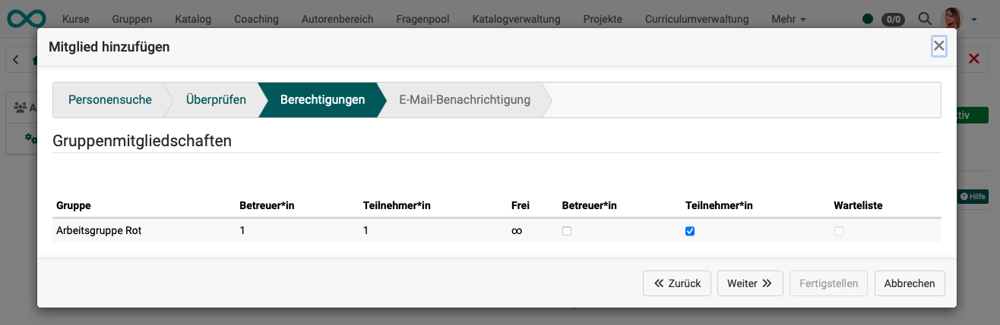
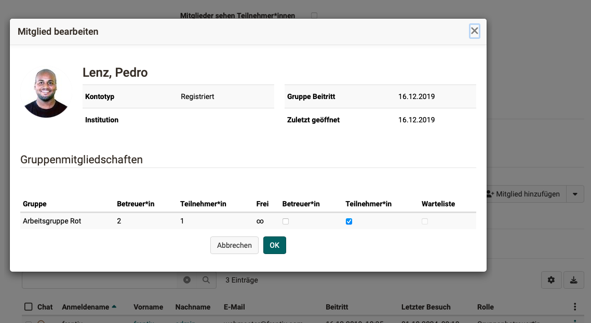
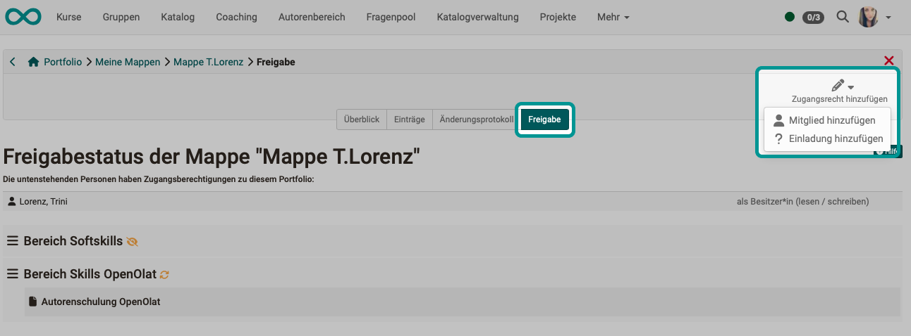

# Roles and Rights: Assign roles {: #role_assignment}

## Role assignment for organisation roles {: #role_assignment_org}

Organisation-wide or system-wide roles are assigned in the user management: 
**User management > Selecting a user > Tab "Roles"** 
Accordingly, the assignment is typically made by user management or administrators.

Depending on the area of responsibility, roles - and therefore additional rights - must be added.

{ class=" shadow lightbox" }

[To the top of the page ^](#role_assignment)

---

## Role assignment for course roles {: #role_assignment_course}

**Roles for new course members** 
Course owners add new course members at 
**Course administration > Member management > Button "Add member"** 
The desired role within a course is then queried when the new member is entered.

**Role assignment of the course owners** 
A person with authoring rights (= organizational role "Author") who creates a course is automatically the owner of this course (course role "Owner"). If desired, other people can then be made co-owners.

**Change roles of course members** 
For members of a course, the role can be changed under 
**Course administration > Member management > Select member (Click on name) > Assign one or more course roles**

{ class=" shadow lightbox" }
{ class=" shadow lightbox" }

[To the top of the page ^](#role_assignment)

---

## Role assignment for group roles {: #role_assignment_group} 

**Role assignment when [creating a new group](../groups/index.md) / Adding new Members:** 
When new members are added, the roles "Group member" and "Group coach" are also assigned.

{ class=" shadow lightbox" }

**Change roles of group members** 
If there is already a membership in a group and you want to change the role of the person, you can do this (if you have the authorization to edit) in the administration of the group.

**Groups > Administration > Members tab > Icon with 3 dots at the end of the row of the member in question > Option "Edit member"**

{ class=" shadow lightbox" }
{ class=" shadow lightbox" }

**Assignment of the group coach role** 
When you create a new group, you are automatically the coach of this group. Coaches of a group also receive the "Administration" link in the menu. If desired, additional people can then be made group coaches. 
(Procedure: Groups > Administration > Members tab > Icon with 3 dots at the end of the line of the member in question > Option "Edit member")

**Assignment of the group administrator** 
As group administrators perform cross-group tasks, this is a organisation-wide role. Therefore, this role is not assigned within a specific group, but in the user administration (procedure as for organisation-wide roles).

[To the top of the page ^](#role_assignment)

---

## Role assignment in the course planner {: #role_assignment_course_planner}

Anyone who has the role of a course planner automatically has access to all courses associated with the respective product.

No members can be assigned to a product, only to the sessions. Course planners can assign participants to all courses.

[To the top of the page ^](#role_assignment)

---

## Role assignment of organization-specific roles {: #role_assignment_orgunit} 

The roles that users receive in different organizational units are assigned in the user management. 
**User management > Select user > Roles tab > Select OrgUnit**

A person can be a member of several organizational units and have different roles in each organizational unit. For example, if the person should only have author rights in their own organizational unit.

{ class=" shadow lightbox" }

[To the top of the page ^](#role_assignment)

---

## Role assignment of "Invitees" {: #role_assignment_invitee} 

All persons who have been added to a course via the option "**Invite external members**" receive the "role" or the associated rights status. In user management, the "Invitee" role should only be assigned in exceptional cases. 

If, for example, an external person is to be given access to a portfolio in the ePortfolio, the invitation is created under  
**Select portfolio binder > Shares tab > Add Access right > Add invitee**

{ class=" shadow lightbox" }

[To the top of the page ^](#role_assignment)

---

## Define own roles and relations {: #role_assignment_relations} 

The activation and definition of own roles must be carried out by **administrators**. 
(**Administration > Modules > Role user to user**) 
E.g. superior, subordinate, expert, appraisee, parent, training coach, student, mentor, learning guide, etc.

Subsequently, **user administrators** in 
**User management > Select user > Tab Relations** 
new relationships between the selected user and other OpenOlat users can be specified
(e.g. superior, subordinate).

Only the system of roles set up and defined by the administrator can be used.

With the user-to-user relationship in OpenOlat, cross-course support functions can be set up in the administration or user management, for example for mentors, learning guides and coaches. If this is the case, coaches can easily and clearly access the persons to be coached in the Coaching Tool and make assessments.

Specific rights can be defined for each user-to-user relationship and thus access can be granted to explicitly released contents of the supervised persons, such as course list, calendar, absence overview, evidences of achievements and certificates. Similarly, the role of "line manager" is also mapped in the Coaching Tool. Defined contents of users of the own organizational unit can also be accessed here.

[To the top of the page ^](#role_assignment)

---

## Further information

[Organisation roles](../basic_concepts/Roles.md#organisation-wide-roles--org)  
[Course roles](../basic_concepts/Roles.md#roles-in-a-course--course)  
[Group roles](../basic_concepts/Roles.md#roles-in-groups--groups)  
[Creating a new group](../groups/Create_Groups.md)  
[Group management](../area_modules/Group_Management.md) 
[Roles in an organization unit](../basic_concepts/Roles.md#roles-in-an-organization--orgunit)  
[Self-defined roles and relations](../basic_concepts/Roles.md#self-defined-roles-and-relations--relations)  
[Role "Invitee"](../basic_concepts/Roles.md#role-invitee--invitee)

[To the top of the page ^](#role_assignment)

