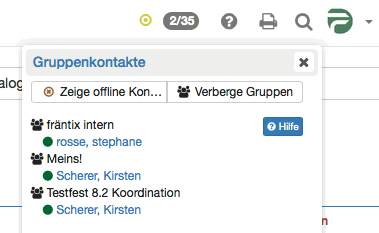

# Chat

:octicons-device-camera-video-24: **Video-Einführung**: [Chat](<https://www.youtube.com/embed/OX44EiWqZTk>){:target="_blank”}

Instant-Messaging (IM) erlaubt den Austausch von Nachrichten mit Personen in Echtzeit - das sogenannte "Chatten". Wichtig ist dabei die Information über die Verfügbarkeit von potentiellen Chatpartnern. Diese Information liefert die Liste der Gruppenkontakte. Um mit einem der verfügbaren Kontakte einen Chat zu starten, klicken Sie auf den gewünschten Kontakt und der Chat wird in einem Chatfenster gestartet. Ist eine Person im Moment nicht erreichbar, so werden die Nachrichten gespeichert und dem Benutzer beim nächsten Login angezeigt.  
  

## Messaging Status
Unterschieden wird zwischen:

Verfügbar: Wählen Sie diesen Status, um Chatanfragen und Kurznachrichten unmittelbar zu erhalten. Sie signalisieren Gesprächsbereitschaft.

Bitte nicht stören: Wählen Sie diesen Status, wenn Sie beschäftigt sind und nicht durch aufgehende Chatfenster gestört werden wollen. Sie signalisieren, dass Sie zwar online sind aber nicht direkt auf Anfragen antworten wollen.

Nicht verfügbar: Wählen Sie diesen Status, wenn Sie nicht wollen das andere Benutzer sie kontaktieren. Für andere Benutzer sieht es aus als wären Sie offline. Sie erhalten Nachrichten trotzdem als Briefsymbol und können bei Bedarf auf Nachrichten antworten.

Durch einen Klick auf das runde Symbol können Sie Ihren Instant-Messaging- Status wechseln. So signalisieren Sie anderen OpenOlat-Benutzern, ob Sie für den Chat verfügbar sind oder nicht. Während Sie einen Test lösen, wird Ihr Status automatisch auf "bitte nicht stören" gesetzt. Sie können erst nach dem Beenden des Tests wieder chatten.

Wenn Sie grundsätzlich nach dem Einloggen einen anderen Status als "Verfügbar" haben möchten, können Sie dies im persönlichen Menü → Einstellungen → Instant- Messaging ändern (siehe unten "Persönliche Chat Einstellungen").

## Nachrichten senden
Durch einen Klick auf die zwei Ziffern (xx/xx) oben rechts in der Menuzeile
neben dem Instant-Messaging-Status-Symbol (z.B. grüner Punkt) öffnet sich eine Liste. Dort werden alle zurzeit eingeloggten Mitglieder Ihrer Gruppen angezeigt. Um den Chat zu starten, klicken Sie auf den Namen des gewünschten Chatpartners. Durch das Auswählen wird ein Chatfenster geöffnet. Wird der gewünschte OpenOlat Benutzer als Offline angezeigt, können Sie ihm ebenso eine Nachricht schicken. Beim nächsten Login erscheint die Nachricht als Briefchen links neben dem Chat-Icon.

Werden die zwei Ziffern nicht angezeigt, so wurde der direkte Chat durch einen Systemadministrator ausgeschaltet. Folgendermassen können Sie dennoch bei ausgeschalteten Gruppenkontakten anderen Benutzern Nachrichten schicken: Entweder über die OpenOlat-Suche oder im persönlichen Menü unter "Andere Benutzer" nach dem entsprechenden Mitglied suchen. In der Visitenkarte finden
Sie unterhalb des Profilbildes die Möglichkeit den Benutzer zu kontaktieren. Wurde der Kurznachrichten-Empfang durch den Benutzer ausgeschaltet, ist der Kontaktlink für diesen spezifischen Benutzer nicht vorhanden.

Dies funktioniert selbstverständlich auch bei eingeschaltetem Chat, um OpenOlat Benutzer zu kontaktieren die sich nicht in Ihrer Kontaktliste befinden.

Gängige Emoticons wie Lachen oder Augenzwinkern, Cool oder Erstaunt werden unterstützt. Ebenso Daumen hoch ( + ) und Daumen runter ( - )

## Nachrichten empfangen
Nachrichten können auf zwei Arten empfangen werden: Wenn Ihr Status "Verfügbar" ist, öffnet sich beim Empfang neuer Nachrichten ein Chatfenster.
Lautet Ihr Status "Bitte nicht stören" oder "Nicht verfügbar", erscheinen die Nachrichten als blinkendes Briefchen links neben dem Chat-Icon rechts oben in der Menuzeile. Wenn Sie auf das Briefchen klicken, geht ein Chatfenster mit der Nachricht auf. Ist das Chatfenster bereits offen, werden neue Nachrichten dort angezeigt.

Falls Sie eine Nachricht erhalten während Sie offline sind, so wird diese Nachricht gespeichert und beim nächsten Einloggen als Briefchen angezeigt.

## Kontakte der Gruppenliste verwalten
Kontakte können über die Gruppe von OpenOlat hinzugefügt oder entfernt werden.
Sofern Sie Betreuer oder Betreuerin einer Gruppe sind, können Sie Betreuer und Betreuerinnen oder Teilnehmende in Ihre Gruppe ein- oder ausladen. Diese Personen erscheinen dann auf Ihrer Gruppenliste im Chat sofern die Gruppe die Anzeige der Gruppenmitglieder zulässt. Gruppenbetreuer werden in der Kontaktliste mit fetter Schrift dargestellt.

Wie Sie die Anzeige der Gruppenmitglieder in Ihrer Gruppe konfigurieren erfahren Sie in der [Gruppenadministration](../groups/Group_Administration.de.md).

## Einem Gruppen- oder Kurschat beitreten
An verschiedenen Orten in OpenOlat gibt es Chaträume (z.B. Gruppe/Kurs).
Klicken Sie auf den Link _Chatraum betreten_. Ein Chatfenster geht auf und Sie betreten den Gruppen-/Kurs-Chat. Ist bereits eine Historie vorhanden, können Sie diese anzeigen lassen um sich über den bisherigen Gesprächsverlauf zu informieren. Nachrichten an einen Chatraum werden an alle Personen im jeweiligen Raum gesendet. Die Liste der Teilnehmer ist neben dem Chatfenster ersichtlich. Möchten Sie sich anonym äussern so können Sie ein Pseudonym wählen. Teilnehmer des Chats sehen dann ihren richtigen Namen nicht. Diese Option muss vom Systemadministrator eingeschaltet werden und ist auf IhremSystem unter Umständen nicht verfügbar. Falls Sie den Raum wieder verlassenmöchten, schliessen Sie das Fenster.

## Persönliche Chat Einstellungen {: #settings}
Im Tab "Instant-Messaging" der persönlichen Einstellungen können Sie festlegen ob andere Benutzer Sie kontaktieren dürfen. Wenn Sie keine Nachrichten von anderen Benutzern empfangen wollen, schalten Sie diese Funktion aus, und der Kontaktlink in der Visitenkarte wird entfernt. In diesem Fall können Sie nur von Kurs-/Gruppenmitgliedern Kurznachrichten empfangen.

 **Nach dem Einloggen ist mein Status:**
Hier können Sie zwischen drei Einstellungen wählen, die zukünftig jeweils nach dem Login aktiv sein sollen. Wenn Sie Ihren momentanen Status ändern wollen, können Sie dies über das runde Status-Symbol rechts oben tun. Beim nächsten Login ist dann wieder der Status aktiv, den Sie hier festgelegt haben.

## Chat-Protokolle
Um Chat-Protokolle einzusehen, öffnen Sie das Chatfenster des gewünschten Chat-Partners. Wählen Sie dann oben den Zeitraum des Protokolls aus. Sie können sich das Chatprotokoll des letzten Tages, der letzten Woche oder des letzten Monats anzeigen lassen.