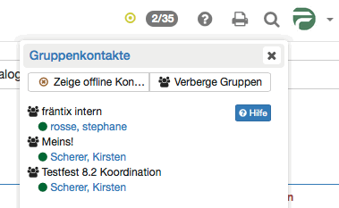

# Chat {: #chat}

:octicons-device-camera-video-24: **Video-Einführung**: [Chat](<https://www.youtube.com/embed/OX44EiWqZTk>){:target="_blank"}

Instant-Messaging (IM) erlaubt den Austausch von Nachrichten mit Personen in Echtzeit, das sogenannte "Chatten". Wichtig ist dabei die Information über die Verfügbarkeit von potentiellen Chatpartner:innen. Diese Information liefert die Liste der Gruppenkontakte. Um mit einem der verfügbaren Kontakte einen Chat zu starten, klicken Sie auf den gewünschten Kontakt. Der Chat wird in einem Chatfenster gestartet. Ist eine Person im Moment nicht erreichbar, so werden die Nachrichten gespeichert und der Benutzer:in beim nächsten Login angezeigt.

{ class="shadow lightbox" }

## Messaging Status {: #status}

Unterschieden wird zwischen:

Verfügbar: Wählen Sie diesen Status, um Chatanfragen und Kurznachrichten unmittelbar zu erhalten. Sie signalisieren Gesprächsbereitschaft.

Bitte nicht stören: Wählen Sie diesen Status, wenn Sie beschäftigt sind und nicht durch aufgehende Chatfenster gestört werden wollen. Sie signalisieren, dass Sie zwar online sind, aber nicht direkt auf Anfragen antworten wollen.

Nicht verfügbar: Wählen Sie diesen Status, wenn Sie nicht wollen, dass andere Benutzer:innen Sie kontaktieren. Für andere Benutzer:innen sieht es aus, als wären Sie offline. Sie erhalten Nachrichten trotzdem als Briefsymbol und können bei Bedarf auf Nachrichten antworten.

Durch einen Klick auf das runde Symbol können Sie Ihren Instant-Messaging-Status wechseln. So signalisieren Sie anderen OpenOlat-Benutzer:innen, ob Sie für den Chat verfügbar sind oder nicht. Während Sie einen Test lösen, wird Ihr Status automatisch auf "Bitte nicht stören" gesetzt. Sie können erst nach dem Beenden des Tests wieder chatten.

Wenn Sie nach dem Einloggen grundsätzlich einen anderen Status als "Verfügbar" haben möchten, ändern Sie dies unter `Persönliches Menü > Einstellungen > Tab "Instant-Messaging"` (siehe unten "Persönliche Chat-Einstellungen").

## Nachrichten senden {: #send}

Durch einen Klick auf die zwei Ziffern (xx/xx) oben rechts in der Kopfzeile neben dem Instant-Messaging-Status-Symbol (z.B. grüner Punkt) öffnet sich eine Liste. Dort werden alle zurzeit eingeloggten Mitglieder Ihrer Gruppen angezeigt. Um den Chat zu starten, klicken Sie auf den Namen der gewünschten Person. Ein Chatfenster wird geöffnet. Wird die gewünschte Benutzer:in als offline angezeigt, können Sie ihr ebenso eine Nachricht schicken. Beim nächsten Login erscheint die Nachricht als Briefchen links neben dem Chat-Icon.

Werden die zwei Ziffern nicht angezeigt, haben Systemadministrator:innen den direkten Chat ausgeschaltet. Auch bei ausgeschalteten Gruppenkontakten können Sie anderen Benutzer:innen Nachrichten schicken: Suchen Sie die Person über die OpenOlat-Suche oder im persönlichen Menü unter [Personensuche](../personal_menu/Other_users.de.md). In der Visitenkarte finden Sie unterhalb des Profilbildes die Möglichkeit, die Person zu kontaktieren. Hat die Benutzer:in den Kurznachrichten-Empfang ausgeschaltet, ist der Kontaktlink für diese Person nicht vorhanden.

Dies funktioniert auch bei eingeschaltetem Chat, um OpenOlat-Benutzer:innen zu kontaktieren, die sich nicht in Ihrer Kontaktliste befinden.

Gängige Emoticons wie Lachen oder Augenzwinkern, Cool oder Erstaunt werden unterstützt, ebenso Daumen hoch ( + ) und Daumen runter ( - ).

## Nachrichten empfangen {: #receive}

Nachrichten können auf zwei Arten empfangen werden: Wenn Ihr Status "Verfügbar" ist, öffnet sich beim Empfang neuer Nachrichten ein Chatfenster.
Lautet Ihr Status "Bitte nicht stören" oder "Nicht verfügbar", erscheinen die Nachrichten als blinkendes Briefchen links neben dem Chat-Icon rechts oben in der Kopfzeile. Wenn Sie auf das Briefchen klicken, geht ein Chatfenster mit der Nachricht auf. Ist das Chatfenster bereits offen, werden neue Nachrichten dort angezeigt.

Falls Sie eine Nachricht erhalten, während Sie offline sind, so wird diese Nachricht gespeichert und beim nächsten Einloggen als Briefchen angezeigt.

## Kontakte der Gruppenliste verwalten {: #group_list}

Kontakte können über die Gruppe von OpenOlat hinzugefügt oder entfernt werden.
Sofern Sie Betreuer:in einer Gruppe sind, können Sie Betreuer:innen oder Teilnehmende in Ihre Gruppe ein- oder ausladen. Diese Personen erscheinen dann auf Ihrer Gruppenliste im Chat, sofern die Gruppe die Anzeige der Gruppenmitglieder zulässt. Gruppenbetreuer:innen werden in der Kontaktliste mit fetter Schrift dargestellt.

Wie Sie die Anzeige der Gruppenmitglieder in Ihrer Gruppe konfigurieren, erfahren Sie in der [Gruppenadministration](../groups/Group_Administration.de.md).

## Einem Gruppen- oder Kurschat beitreten {: #join_group}

An verschiedenen Orten in OpenOlat gibt es Chaträume, z.B. im Kurs und in der Gruppe. Öffnen Sie den Chatraum im Kurs über "Kurs-Chat" in der Toolbar, in der Gruppe über den Menüeintrag "Chat". Ein Chatfenster geht auf und Sie betreten den Gruppen- oder Kurs-Chat. Ist bereits ein Verlauf vorhanden, zeigen Sie ihn über "Verlauf anzeigen" an, um sich über den bisherigen Gesprächsverlauf zu informieren. Nachrichten an einen Chatraum werden an alle Personen im jeweiligen Raum gesendet. Die Liste der Teilnehmenden ist neben dem Chatfenster ersichtlich. Möchten Sie sich anonym äussern, so können Sie ein Pseudonym wählen. Die anderen Teilnehmenden des Chats sehen dann Ihren richtigen Namen nicht. Diese Option müssen Systemadministrator:innen einschalten; sie ist auf Ihrem System unter Umständen nicht verfügbar. Falls Sie den Raum wieder verlassen möchten, schliessen Sie das Fenster.

## Persönliche Chat-Einstellungen {: #settings}

Im Tab "Instant-Messaging" der [persönlichen Einstellungen](../personal_menu/Settings.de.md#tab_instant-messaging) legen Sie fest, ob andere Benutzer:innen Sie kontaktieren dürfen. Wenn Sie keine Nachrichten von anderen Benutzer:innen empfangen wollen, schalten Sie diese Funktion aus. Der Kontaktlink in der Visitenkarte wird dann entfernt. In diesem Fall können Sie nur von Kurs- und Gruppenmitgliedern Kurznachrichten empfangen.

**Nach dem Einloggen ist mein Status:** 
Hier können Sie zwischen drei Einstellungen wählen, die zukünftig jeweils nach dem Login aktiv sein sollen. Wenn Sie Ihren momentanen Status ändern wollen, können Sie dies über das runde Status-Symbol rechts oben tun. Beim nächsten Login ist dann wieder der Status aktiv, den Sie hier festgelegt haben.

## Chat-Protokolle {: #chat_logs}

Um Chat-Protokolle einzusehen, öffnen Sie das Chatfenster der gewünschten Chatpartner:in. Wählen Sie dann oben den Zeitraum des Protokolls aus. Sie können sich das Chatprotokoll des letzten Tages, der letzten Woche oder des letzten Monats anzeigen lassen.

## Weiterführende Informationen {: #further_information}

[Persönliche Werkzeuge: Personensuche >](../personal_menu/Other_users.de.md) 
[Gruppenadministration >](../groups/Group_Administration.de.md) 
[Persönliche Konfiguration: Einstellungen >](../personal_menu/Settings.de.md) 
[Modul Instant Messaging (Administration) >](../../manual_admin/administration/Instant_Messaging.de.md) 
[Zusätzliche Kursfunktionen >](../learningresources/Additional_Course_Features.de.md)

**youtube** 
[Chat](<https://www.youtube.com/embed/OX44EiWqZTk>)

[Zum Seitenanfang ^](#chat)
