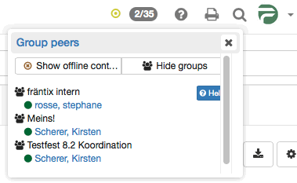

# Chat {: #chat}

:octicons-device-camera-video-24: **Video Introduction (German)**: [Chat](<https://www.youtube.com/embed/OX44EiWqZTk>){:target="_blank"}

Instant Messaging (IM) allows the exchange of messages with persons in real time, commonly known as "chat". Information on the availability of potential chat partners is important. This information is provided by the list of group peers. To start a chat with one of the available contacts, click on that contact. The chat is started in a chat window. If a person is not available at the moment, the messages are saved and displayed to the user at the next login.

{ class="shadow lightbox" }

## Messaging Status {: #status}

The following statuses are distinguished:

Available: Select this status to receive chat requests and messages immediately. You are signaling that you are open for discussion.

Please do not disturb: Select this status when you are busy and do not want to be disturbed by opening chat windows. You are signaling that you are online, but do not want to answer requests immediately.

Not available: Select this status when you do not want to be contacted by other users. For other users, you appear to be offline. You still receive messages as a letter icon and can reply to messages if you like.

By clicking on the round symbol, you can change your Instant Messaging status. That way you show other OpenOlat users whether you are available for chat or not. While you are taking a test, your status is automatically set to "Please do not disturb". Only after finishing the test are you able to chat again.

If you generally want a status other than "Available" after logging in, change this under `Personal menu > Settings > Tab "Instant Messaging"` (see "Personal chat settings" below).

## Sending messages {: #send}

By clicking on the two digits (xx/xx) at the top right of the header next to the Instant Messaging status symbol (e.g. green dot), a list opens. There you see all members of your groups who are currently logged in. To start a chat, click on the name of the desired person. A chat window opens. If the desired user is displayed as offline, you can send them a message as well. At the next login, the message appears as a small envelope to the left of the chat icon.

If the two digits are not displayed, system administrators have disabled the direct chat. Even with disabled group peers, you can send messages to other users: Search for the person via the OpenOlat search or in the personal menu under [Other users](../personal_menu/Other_users.md). In the visiting card, below the profile image, you find the option to contact the person. If the user has disabled the receipt of messages, the contact link is not available for this person.

This also works with the chat enabled, in order to contact OpenOlat users who are not in your contact list.

Popular emoticons such as smiling, winking, cool or surprised are supported, as well as thumbs up ( + ) and thumbs down ( - ).

## Receiving messages {: #receive}

Messages can be received in two ways: If your status is "Available", a chat window opens when new messages are received.
If your status is "Please do not disturb" or "Not available", the messages appear as a blinking envelope to the left of the chat icon at the top right of the header. When you click on the envelope, a chat window with the message opens. If the chat window is already open, new messages are displayed there.

If you receive a message while you are offline, this message is stored and displayed as an envelope at the next login.

## Manage group list contacts {: #group_list}

Contacts can be added or removed via the groups of OpenOlat.
Provided that you are the coach of a group, you can invite or disinvite coaches or participants to your group. These persons then appear on your group list in the chat, provided that the group allows the display of group members. Group coaches are displayed in bold in the contact list.

How to configure the display of group members in your group is described in the [Group Administration](../groups/Group_Administration.md).

## Join a group or course chat {: #join_group}

There are chatrooms at different places in OpenOlat, e.g. in the course and in the group. Open the chatroom in the course via "Course chat" in the toolbar, in the group via the menu entry "Chat". A chat window opens and you enter the group or course chat. If a history already exists, display it via "Show history" to learn about the discussion so far. Messages to a chatroom are sent to all persons in that room. The list of participants is displayed next to the chat window. If you want to participate anonymously, you can choose a nickname. The other chat participants then do not see your real name. System administrators must enable this option; it may not be available on your system. If you want to leave the room, close the window.

## Personal chat settings {: #settings}

In the tab "Instant Messaging" of the [personal settings](../personal_menu/Settings.md#tab_instant-messaging), you specify whether other users may contact you. If you do not wish to receive messages from other users, turn off this feature. The contact link in the visiting card is then removed. In that case, you can only receive messages from course and group members.

**Default status after login:** 
Here you can choose between three settings that are active after each future login. If you want to change your current status, you can do this via the round status symbol at the top right. At the next login, the status you have set here is active again.

## Chat logs {: #chat_logs}

To view chat logs, open the chat window of the desired chat partner. Then select the period of the log at the top. You can view the chat log of the last day, the last week or the last month.

## Further information {: #further_information}

[Personal tools: Other users >](../personal_menu/Other_users.md) 
[Group Administration >](../groups/Group_Administration.md) 
[Personal Configuration: Settings >](../personal_menu/Settings.md) 
[Module Instant Messaging (Administration) >](../../manual_admin/administration/Instant_Messaging.md) 
[Additional Course Features >](../learningresources/Additional_Course_Features.md)

**youtube** 
[Chat](<https://www.youtube.com/embed/OX44EiWqZTk>)

[To the top of the page ^](#chat)
