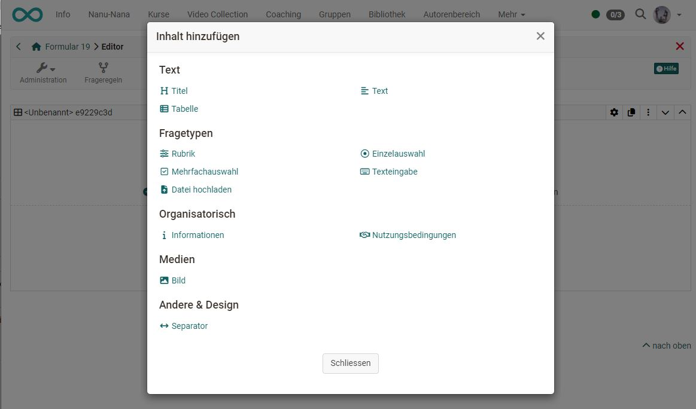
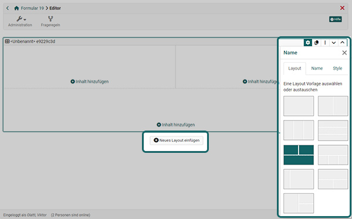

# Content Editor {: #content_editor}

## Was ist der Content Editor? {: #content_editor}

Der Content Editor ermöglicht es basierend auf einem selbst gewählten Layout verschiedene Inhaltselemente in eine Seite einzufügen und so eine Inhaltsseite optimiert für mobile Devices zu gestalten. Eine Speicherung der Änderungen erfolgt automatisch.

Der Content Editor wird an verschiedenen Stellen in OpenOlat verwendet. 

{ class="shadow lightbox" }

!!! info "Hinweis"
      
    Neben dem Content Editor existiert in OpenOlat noch der HTML-Editor "Tiny MC", der z.B. im [Kursbaustein "HTML-Seite"](../learningresources/Course_Element_HTML_Page.de.md) verwendet wird. 

## Wo kommt der Content Editor zum Einsatz? {: #content_editor_use}

Der Content Editor wird im [Kursbaustein Seite](../learningresources/Course_Element_Page.de.md), in der [Lernressource "Formular"](../learningresources/Form.de.md) und im ["Portfolio 2.0"](../area_modules/The_portfolio_editor.de.md) verwendet.

### Kursbaustein Seite {: #course_element_page}

Der Content Editor wird im Kursbaustein Seite entweder im Kurseditor im Tab „Seiteninhalt“ oder bei geschlossenem Kurseditor durch Aktivierung des Bearbeitungsmodus direkt beim gewünschten Kursbaustein Seite aktiviert. 

**Bei geschlossenem Kurseditor:**

{ class="shadow lightbox" }

Über den Schiebeschalter kann der Bearbeitungsmodus ein- und ausgeschaltet werden. 

**Im Kurseditor:**

{ class="shadow lightbox" }

Im Kurseditor kann konfiguriert werden, ob neben den Kursbesiter:innen auch Betreuende den jeweiligen Content Editor des Kursbausteins bei geschlossenem Kurseditor verwenden und Änderungen vornehmen dürfen. 

{ class="shadow lightbox" }

Die Medien-Inhalte des [Kursbausteins "Seite"](../learningresources/Course_Element_Page.de.md) (Bilder, Audio, Video, Diagramme, Zitate, Dokumente, etc.) werden im [Media Center](../personal_menu/Media_Center.de.md), nicht im Ablageordner des Kurses (vergl. [Kursbaustein "HTML-Seite"](../learningresources/Course_Element_HTML_Page.de.md)), gespeichert. Weitere Infos finden Sie bei den Erläuterungen zu den jeweiligen Kursbausteintypen. 

Für Portfolio und Formular-Lernressource gelten andere Regeln.

[Zum Seitenanfang ^](#content_editor)

---

### Lernressource Formular {: #form}

Der Content Editor wird auch in der [Lernressource Formular](../learningresources/Form.de.md) und allen Elementen die die Lernressource Formular nutzen verwendet. 

Die angezeigten Optionen zum Einfügen von Inhalt sind an das Formular angepasst, z.B. stehen hier verschiedene Fragetypen zur Auswahl.

{ class="shadow lightbox" }

[Zum Seitenanfang ^](#content_editor)

---

### E-Portfolio {: #portfolio}

Auch für Einträge in [Portfolio-Mappen](../area_modules/My_portfolio_binders.de.md), die sowohl kursunabhängig als auch in Verbindung mit [Portfoliovorlagen](../learningresources/Portfolio_template_Creation.de.md) und [Portfolioaufgaben](../learningresources/Course_Element_Portfolio_Task.de.md) verwendet werden können, wird der Content Editor verwendet.

{ class="shadow lightbox" }

[Zum Seitenanfang ^](#content_editor)

---

## Layout im Content Editor {: #content_editor_layout}

Bevor Sie Inhalte im Content Editor einfügen können, müssen Sie zuerst ein "neues Layout" hinzufügen. Das Layout dient als Raster, das die Anordnung der Inhalte (Blöcke) bestimmt.

Es stehen verschiedene Layouts zur Auswahl, die sich durch unterschiedlich angeordnete Felder unterscheiden. Sie können auf einer Seite auch mehrere Layouts kombinieren.

Falls nötig, lässt sich das Layout später jederzeit ändern. Klicken Sie dazu einfach auf das Zahnrad-Symbol (Einstellungen bearbeiten) des Layouts und wählen Sie ein neues Layout aus.

{ class="shadow lightbox" }

Sind mehrere Layouts vorhanden, können Sie die Reihenfolge der Layouts ändern. 
Zum Verschieben eines gesamten Layouts verwenden Sie die Pfeile.

{ class="shadow lightbox" }

[Zum Seitenanfang ^](#content_editor)

---

## Inhalte im Layout organisieren {: #organize_content}

### Inhalts-Blöcke {: #content_blocks}

In jeden Bereich eines Layouts können Inhalts-Blöcke mit verschiedenen konkreten Inhalten hinzugefügt werden. Die Anzahl der Inhaltsblöcke variiert je nach gewähltem Design. Ein dreispaltiges Design verfügt dabei beispielsweise über 3 Inhaltsblöcke. 

### Inhalte in einem Block hinzufügen, positionieren und konfigurieren {: #add_content}

Über "Inhalt hinzufügen" werden die konkreten Inhalte und Medien einem Block hinzugefügt. 

Sobald ein hinzugefügter Inhalt angeklickt/markiert worden ist, erscheint ein Popup-Fenster, in dem Eigenschaften dieses Inhalts eingestellt werden können. Das ist der sogenannte "Inspektor". 

Das Inspektor-Popup lässt sich auch mit dem Zahnrad-Icon des Inhalts ein- und ausblenden.

{ class="shadow lightbox" }

**Menüs**

Neben dem Zahnradsymbol gibt es noch ein 3-Punkte Menü und ein Fadenkreuz. Über das Fadenkreuz können weitere Inhaltselemente davor oder danach hinzugefügt oder das markierte Element gelöscht werden. Über das Fadenkreuz kann das markierte Element per Drag & Drop an eine andere Position, einen anderen Inhalts-Block oder ein anderes Layout verschoben werden.  

{ class="shadow lightbox" }

[Zum Seitenanfang ^](#content_editor)

---

### Generelle Formatierungen für alle Inhaltsblöcke - Der Inspektor {: #inspector}

**Abstände**

Für die ansprechende Gestaltung eines Layouts sind einheitliche Abstände zwischen den Feldern des Layouts (Inhaltsblöcken) bedeutsam. Sie haben die Wahl zwischen verschiedenen Abständen: 

* kein Abstand
* S (klein)
* M (mittel)
* L (gross)
* XL (extragross)
* benutzerdefiniert

=== "S (kleiner Abstand)"

    { class="shadow lightbox" title="kleiner Abstand" }

=== "M (mittlerer Abstand)"

    { class="shadow lightbox" title="mittlerer Abstand" }

=== "XL (extra-grosser Abstand)"

    { class="shadow lightbox" title="extra-grosser Abstand" }

**Block-Stil 'Hinweis'**

Ab Release 18.2.3 können Layouts und manche Inhaltsblöcke als formatierte Hinweis-Box dargestellt werden. Bei Auswahl eines vordefinierten Hinweis-Typs werden Informationen durch eine entsprechende Farbgebung der Box - ggfs. mit passendem Icon - deutlich hervorgehoben. Ein Set an weiteren Farben und Icons zur benutzerdefinierten Gestaltung der Box ist ebenfalls verfügbar. Auf Wunsch kann eine Box auch einklappbar gemacht werden.

{ class="shadow lightbox" }

Beispiel:

{ class="shadow lightbox" }

[Zum Seitenanfang ^](#content_editor)

---

## Inhaltstypen {: #content_types}

Bitte beachten Sie, dass nicht in jedem Content Editor *alle* Elemente zur Verfügung stehen. 

### Text Elemente {: #text_elements}

<h3>Titel</h3>

Für das Überschriftselement sind verschiedene Schriftgrössen vordefiniert.

{ class="shadow lightbox" }

<h3>Text</h3>

Hierüber werden Texte hinzugefügt. 
{ class="shadow lightbox" }

<h3>Tabelle</h3>

{ class="shadow lightbox" }

<h3>Mathematische Formel</h3>

Für mathematische Formeln steht ein spezieller kleiner Editor zur Verfügung.

{ class="shadow lightbox" }

Dieses Textelement existiert nicht im Formular Editor. 

<h3>Code-Beispiel</h3>

Der 'Code' Block ermöglicht die Textdarstellung in einer Schriftart mit festen Abständen und Nummerierung der Zeilen. Dies ist insbesondere bei technischen Lerninhalten wie Programmierbeispielen sehr hilfreich. Beim Anlegen des Code Blocks kann die verwendete Programmiersprache gewählt werden. Zur Weiterverarbeitung können Teilnehmende die Code-Vorlage direkt in die Zwischenablage kopieren.

{ class="shadow lightbox" }

Dieses Textelement existiert nicht im Formular Editor. 

<h3>Zitat</h3>

Wird ein Text als Zitat erfasst, hat er automatisch eine vordefinierte Formatierung. Die Zitate werden wie Audios oder Videos als wiederverwendbare Objekte im Medien Center gespeichert.  

Dieses Textelement existiert nicht im Formular Editor. 

[Zum Seitenanfang ^](#content_editor)

---

### Medien {: #media}

!!! info "Info"

    Statt des Bereichs Medien mit den zugehörigen Inhaltselementen gibt es im [Formular Editor](../learningresources/Form_Editor.de.md) die Bereiche "Fragetypen" und "Organisatorisch" mit entsprechenden Inhaltselementen. 

<h3>Bild</h3>

Alle im Medien Center verfügbaren Bilder können eingebunden werden. Neue Bilder lassen sich hochladen und werden automatisch im Medien Center abgelegt.

<h3>Galerie</h3>

Mehrere Bilder können in einem Galerie-Element durchgeblättert werden (Slideshow), in einem Raster dargestellt werden (Spalten und Zeilen von Autor:innen definierbar) oder mit Vorschau dargestellt werden (1 Bild gross, die übrigen Bilder als verkleinerte Vorschaubilder). Im Inspektor kann das Erscheinungsbild der Galerie variiert werden. Die Bilder entstammen dem Medien Center. 

{ class="shadow lightbox" }

<h3>Bildervergleich</h3>

Zwei übereinander liegende Bilder können durch einen Schieberegler überblendet werden.

{ class="shadow lightbox" }

<h3>Audio</h3>

Audios können direkt in OpenOlat neu aufgenommen, hochgeladen oder aus den bereits vorhandenen Audios ausgewählt werden.

{ class="shadow lightbox" }

<h3>Video</h3>

Im Block 'Video' können auch Videos per URL eingebunden werden.  
Unterstützt werden die Video-Formate MP4 und m3u8 sowie die Plattformen YouTube, Vimeo, Panopto und nanoo.tv. Auch die Aufzeichnung neuer Videos direkt in OpenOlat ist möglich.

<h3>Dokument</h3>

Hier können Dokumente in verschiedenen Formaten (z.B. PDF- oder Word-Dateien) per Drag & Drop hochgeladen, aus dem Medien Center ausgewählt oder in bestimmten Formaten direkt erstellt werden. Die Medien werden automatisch im Medien Center abgelegt.

Über das Inspektor-Menü haben Sie ebenfalls Zugriff auf das Medien Center, um den Dokumenten zusätzliche Informationen hinzuzufügen und weitere Freigaben zu definieren. Eine Datei, die zunächst nur für einen Inhaltsblock vorgesehen war, kann dadurch auch anderweitig genutzt oder von anderen OpenOlat-Benutzer:innen bearbeitet werden.

Zusätzlich besteht im Bereich "Share" die Möglichkeit, für neu erstellte oder hochgeladene Dokumente direkt eine Freigabe zu erteilen.

{ class="shadow lightbox" }

<h3>Diagramm (draw.io.) </h3>

Es können bereits vorhandene Diagramme aus dem Medien Center geladen werden oder direkt neue Diagramme mit draw.io erstellt werden. Wenn Sie als Einzelperson die Datei bearbeiten, findet die Bearbeitung auf dem OpenOlat-Server statt, im Kollaborationsmodus auf einem externen Server. 

{ class="shadow lightbox" }

[Zum Seitenanfang ^](#content_editor)

---

### Wissen {: #quiz}

!!! info "Info"

    Dieser Bereich existiert nur im Content Editors des Kursbaustein Seite.

<h3>Quiz</h3>

Mit diesem Inhaltselement können automatisiert auswertbare Quizfragen in eine Seite eingebunden werden. Sie haben die Möglichkeit, neue Fragen zu erstellen oder bestehende Fragen aus dem Fragenpool hinzuzufügen. Zu jeder Frage lassen sich zudem Feedbacks ergänzen, inklusive Bildern und Videos, was den Lernwert steigert.

Diese kleinen Quizfragen sollen die Auseinandersetzung mit den Inhalten fördern, vergeben jedoch keine Punkte. Für bewertbare Quizfragen nutzen Sie bitte die Kursbausteine "Test" oder "Selbsttest".

{ class="shadow lightbox" }

[Zum Seitenanfang ^](#content_editor)

---

### Import von Markdown-Dateien {: #markdown}

!!! info "Info"

    Markdown ist ein weit verbreitetes Textformat, das in vielen Tools und KI-Anwendungen ausgegeben wird. Es ermöglicht die nahtlose Übernahme und Weiterverwendung bestehender Inhalte ohne zusätzlichen Formatierungsaufwand. Gleichzeitig unterstützt es eine klare Struktur und erleichtert die kontinuierliche Weiterentwicklung von Lerninhalten.

Markdown-Dateien können ab Version 20.3 direkt im Content Editor importiert werden, wodurch sich Inhalte aus externen Werkzeugen oder einfachen Textdateien ohne manuelles Nachformatieren übernehmen lassen. Der Inhalt wird automatisch in das strukturierte Seitenformat überführt und bildet so eine effiziente Grundlage, um Kursseiten schneller und einfacher mit Inhalten zu befüllen. Die Inhalte werden dabei automatisch in die Funktionsblöcke wie Titel, Tabelle, Info-Box etc. des Content Editors überführt.

Bilder werden direkt ins Media Center eingebunden, wobei eine Duplikats-Prüfung verhindert, dass das selbe Bild mehrfach im Media Center abgelegt wird. So wird Platz gespart und automatisch aufgeräumt, ohne dass man sich als Autor:in darum kümmern muss.

Klicken Sie zum Import auf den Button am unteren Rand des Content Editors. Sie haben die Möglichkeit, eine komplette Datei zu importieren oder Markdown-formatierten Text in ein Eingabefeld zu übernehmen. 

{ class="shadow lightbox" }

[Zum Seitenanfang ^](#content_editor)

---

### Import von Word-Dateien {: #word}

Auf die gleiche Art wie Markdown-Dateien, können auch Word-Dateien ab Version 20.3 importiert werden.

{ class="shadow lightbox" }

!!! info "Hinweis"

    Nicht alle Word-Funktionen können in den Content Editor importiert werden. Die Konvertierung von Bildern ist möglicherweise nicht vollständig kompatibel. Bitte überprüfen Sie die importierten Inhalte sorgfältig.

[Zum Seitenanfang ^](#content_editor)

---

### Andere & Design {: #others_and_design}

<h3>Separator</h3>

Ein Separator ist eine Linie (optisches Gestaltungselement) zur Trennung von Inhalten.

<h3>HTML-Textcode</h3>
Ausschließlich im Editor des Kursbausteins Seite gibt es noch den HTML-Textcode Editor. Er übernimmt ähnliche Funktionen wie das Inhaltselement "Text" bietet aber noch weitere Menüs und Möglichkeiten. 

[Zum Seitenanfang ^](#content_editor)

---

## Medien Center {: #media_center}

Im Content Editor des Kursbausteins Seite und es Portfolios gibt es noch einen separaten Button, der zum Medien Center führt. Im Prinzp handelt es sich dabei um einen weiteren Weg unabhängig von der Art des Mediums auf die Dateien zuzugreifen. 

Mit Klick auf den Link erhalten Sie Zugriff auf die Dateien Ihres Medien Center. Hier können Sie Dateien auswählen, erstellen oder hochladen. 

{ class="shadow lightbox" }

[Zum Seitenanfang ^](#content_editor)

---

## Weiterführende Informationen {: #further_information}

[Kursbaustein Seite >](../learningresources/Course_Element_Page.de.md) 
[Lernressource Formular >](../learningresources/Form.de.md) 
[Portfolio >](../area_modules/The_portfolio_editor.de.md) 
[Medien Center (Persönliche Werkzeuge)>](../personal_menu/Media_Center.de.md) 
[Ausführliche Informationen zum Media Center (Basiskonzept) >](../../manual_user/basic_concepts/Media_Center_Concept.de.md) 

[Zum Seitenanfang ^](#content_editor)