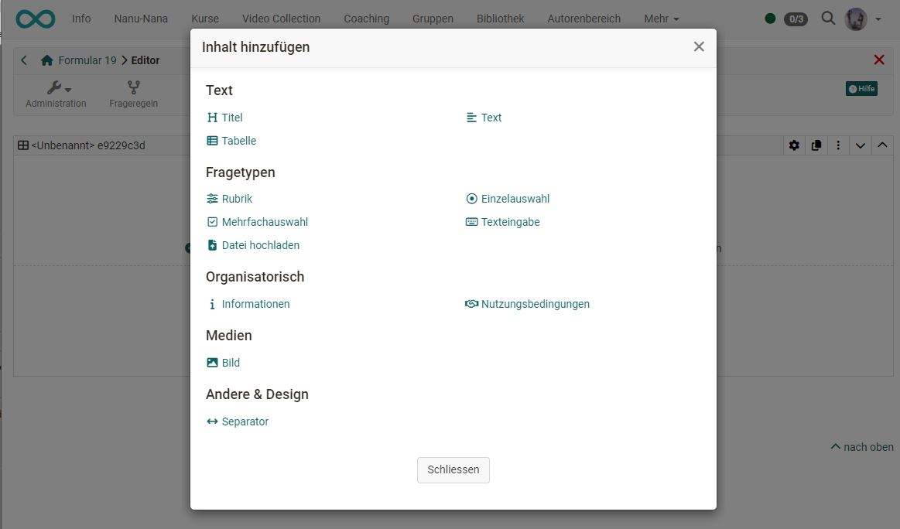
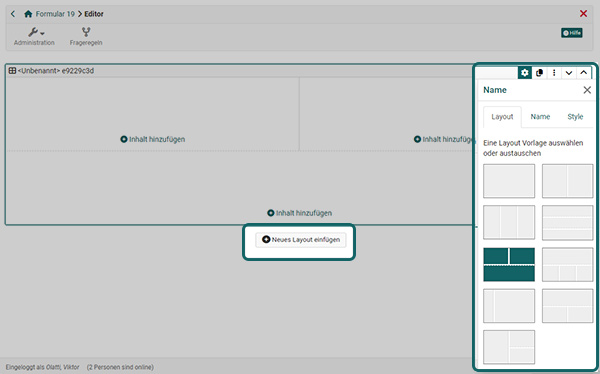
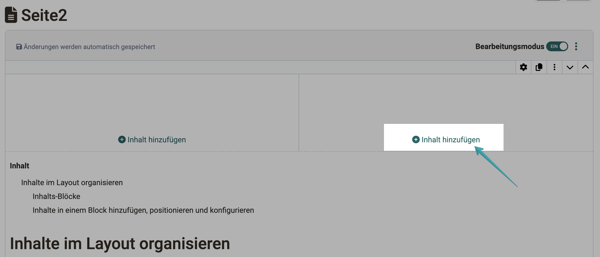
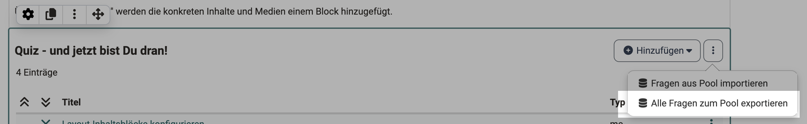
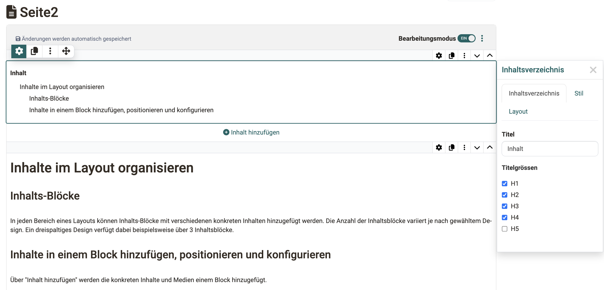
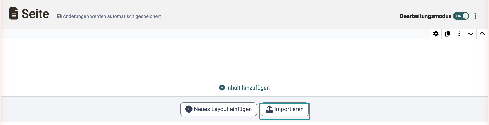
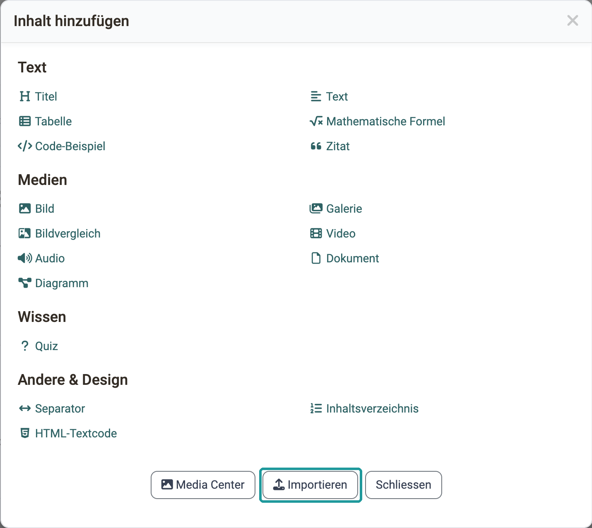
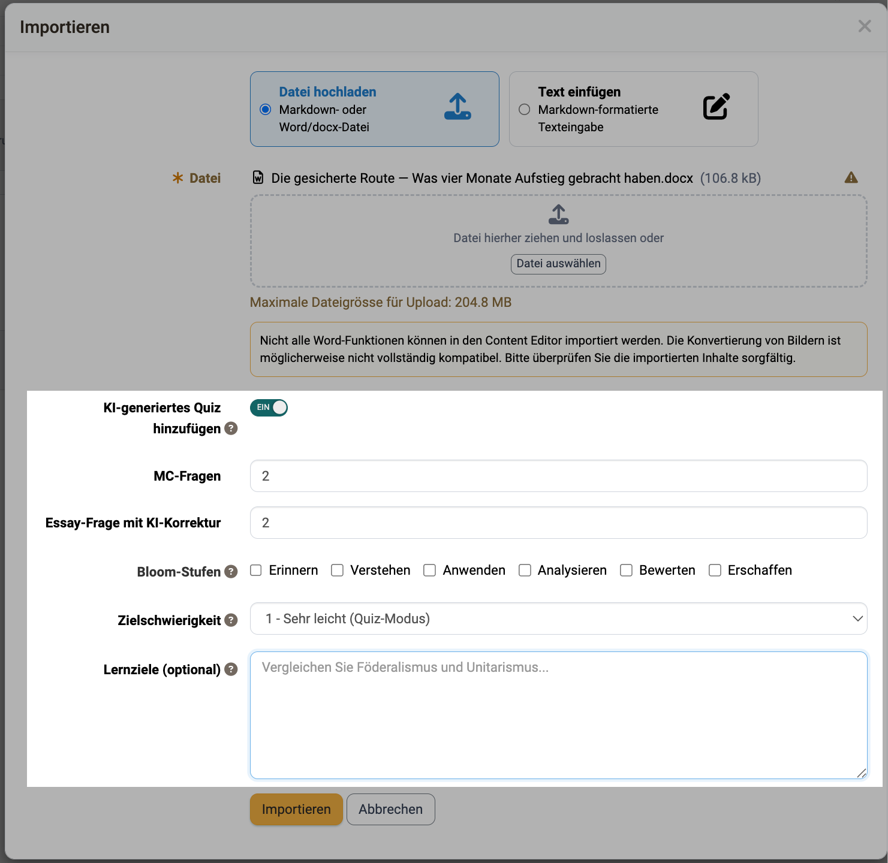

# Content Editor

## Was ist der Content Editor? {: #content_editor}

Der Content Editor ermöglicht es basierend auf einem selbst gewählten Layout verschiedene Inhaltselemente in eine Seite einzufügen und so eine Inhaltsseite optimiert für mobile Devices zu gestalten. Eine Speicherung der Änderungen erfolgt automatisch.

Der Content Editor wird an verschiedenen Stellen in OpenOlat verwendet. 

{ class="shadow lightbox" }

!!! note "Hinweis"

    Neben dem Content Editor existiert in OpenOlat noch der HTML-Editor "Tiny MC", der z.B. im [Kursbaustein "HTML-Seite"](../learningresources/Course_Element_HTML_Page.de.md) verwendet wird. 

## Wo kommt der Content Editor zum Einsatz? {: #content_editor_use}

Der Content Editor wird im [Kursbaustein Seite](../learningresources/Course_Element_Page.de.md), in der [Lernressource "Formular"](../learningresources/Form.de.md) und im ["Portfolio 2.0"](../area_modules/The_portfolio_editor_17_1.de.md) verwendet.

### Kursbaustein Seite [:octicons-tag-16:{ title="ab Release 18.0.0 (OO-6966)" }](https://track.frentix.com/issue/OO-6966){:target="_blank"} {: #course_element_page}

Der Content Editor wird im Kursbaustein Seite entweder im Kurseditor im Tab "Seiteninhalt" oder bei geschlossenem Kurseditor durch Aktivierung des Bearbeitungsmodus direkt beim gewünschten Kursbaustein Seite aktiviert. 

**Bei geschlossenem Kurseditor:**

{ class="shadow lightbox" }

Über den Schiebeschalter kann der Bearbeitungsmodus ein- und ausgeschaltet werden. 

**Im Kurseditor:**

{ class="shadow lightbox" }

Im Kurseditor kann konfiguriert werden, ob neben den Kursbesitzer:innen auch Betreuende den jeweiligen Content Editor des Kursbausteins bei geschlossenem Kurseditor verwenden und Änderungen vornehmen dürfen. 

{ class="shadow lightbox" }

Die Medien-Inhalte des [Kursbausteins "Seite"](../learningresources/Course_Element_Page.de.md) (Bilder, Audio, Video, Diagramme, Zitate, Dokumente, etc.) werden im [Media Center](../personal_menu/Media_Center.de.md), nicht im Ablageordner des Kurses (vergl. [Kursbaustein "HTML-Seite"](../learningresources/Course_Element_HTML_Page.de.md)), gespeichert. Weitere Infos finden Sie bei den Erläuterungen zu den jeweiligen Kursbausteintypen. 

Für Portfolio und Formular-Lernressource gelten andere Regeln.

[Zum Seitenanfang ^](#content_editor)

---

### Lernressource Formular {: #form}

Der Content Editor wird auch in der [Lernressource Formular](../learningresources/Form.de.md) und allen Elementen die die Lernressource Formular nutzen verwendet. 

Die angezeigten Optionen zum Einfügen von Inhalt sind an das Formular angepasst, z.B. stehen hier verschiedene Fragetypen zur Auswahl.

{ class="shadow lightbox" }

[Zum Seitenanfang ^](#content_editor)

---

### E-Portfolio [:octicons-tag-16:{ title="ab Release 11.0 (OO-2057)" }](https://track.frentix.com/issue/OO-2057){:target="_blank"} {: #portfolio}

Auch für Einträge in [Portfolio-Mappen](../area_modules/My_portfolio_binders.de.md), die sowohl kursunabhängig als auch in Verbindung mit [Portfoliovorlagen](../learningresources/Portfolio_template_Creation.de.md) und [Portfolioaufgaben](../learningresources/Course_Element_Portfolio_Task.de.md) verwendet werden können, wird der Content Editor verwendet.

{ class="shadow lightbox" }

[Portfolio >](../area_modules/The_portfolio_editor_17_1.de.md)

[Zum Seitenanfang ^](#content_editor)

---

## Layout im Content Editor [:octicons-tag-16:{ title="ab Release 17.1.0 (OO-6199)" }](https://track.frentix.com/issue/OO-6199){:target="_blank"} {: #content_editor_layout}

Bevor Sie Inhalte im Content Editor einfügen können, müssen Sie zuerst ein "neues Layout" hinzufügen. Das Layout dient als Raster, das die Anordnung der Inhalte (Blöcke) bestimmt.

Es stehen verschiedene Layouts zur Auswahl, die sich durch unterschiedlich angeordnete Felder unterscheiden. Sie können auf einer Seite auch mehrere Layouts kombinieren.

Falls nötig, lässt sich das Layout später jederzeit ändern. Klicken Sie dazu einfach auf das Zahnrad-Symbol (Einstellungen bearbeiten) des Layouts und wählen Sie ein neues Layout aus.

{ class="shadow lightbox" }

Sind mehrere Layouts vorhanden, können Sie die Reihenfolge der Layouts ändern. 
Zum Verschieben eines gesamten Layouts verwenden Sie die Pfeile.

{ class="shadow lightbox" }

### Layout löschen [:octicons-tag-16:{ title="ab Release 21.0 (OO-9407)" }](https://track.frentix.com/issue/OO-9407){:target="_blank"} {: #delete_layout}

Über das 3-Punkte-Menü eines Layouts lässt sich jedes Layout der Seite löschen, auch das erste. Beim Löschen entscheiden Sie, was mit dem Inhalt geschieht: "Alles löschen" entfernt das Layout mitsamt seinem Inhalt, "Nur das Layout löschen und den Inhalt verschieben" übernimmt den Inhalt in das angrenzende Layout. Wird das letzte Layout einer Seite gelöscht, weist der Dialog darauf hin, dass das Layout und sein gesamter Inhalt gelöscht werden; die Seite erhält anschliessend automatisch wieder ein leeres Standard-Layout. Ist nur noch ein einziges leeres Layout vorhanden, ist die Aktion "Löschen" deaktiviert.

[Zum Seitenanfang ^](#content_editor)

---

## Inhalte im Layout organisieren {: #organize_content}

### Inhalts-Blöcke {: #content_blocks}

In jeden Bereich eines Layouts können Inhalts-Blöcke mit verschiedenen konkreten Inhalten hinzugefügt werden. Die Anzahl der Inhaltsblöcke variiert je nach gewähltem Design. Ein dreispaltiges Design verfügt dabei beispielsweise über 3 Inhaltsblöcke. 

### Inhalte in einem Block hinzufügen, positionieren und konfigurieren {: #add_content}

Über "Inhalt hinzufügen" werden die konkreten Inhalte und Medien einem Block hinzugefügt. Der Link erscheint in jedem Bereich eines Layouts, so dass Sie den Inhalt genau dort einfügen, wo er stehen soll.

{ class="shadow lightbox" }

Der Dialog "Inhalt hinzufügen" listet die verfügbaren Inhaltstypen nach den Bereichen "Text", "Medien", "Wissen" sowie "Andere & Design" auf. Am unteren Rand führen zwei Schaltflächen direkt zum [Media Center](#media_center) und zum [Import](#import_position).

Fahren Sie im Bearbeitungsmodus mit der Maus über einen Block, wird dieser hervorgehoben [:octicons-tag-16:{ title="ab Release 20.2.0 (OO-8966)" }](https://track.frentix.com/issue/OO-8966){:target="_blank"}. Das hilft, einzelne Blöcke auseinanderzuhalten, wenn mehrere gleichartige Elemente aufeinander folgen.

Sobald ein hinzugefügter Inhalt angeklickt/markiert worden ist, erscheint ein Popup-Fenster, in dem Eigenschaften dieses Inhalts eingestellt werden können. Das ist der sogenannte ["Inspektor"](#inspector). 

Das Inspektor-Popup lässt sich auch mit dem Zahnrad-Icon des Inhalts ein- und ausblenden.

{ class="shadow lightbox" }

**Menüs**

Die Werkzeugleiste eines markierten Blocks umfasst vier Symbole: das Zahnrad für den Inspektor, ein Symbol zum Duplizieren, ein 3-Punkte-Menü und ein Fadenkreuz. Über das 3-Punkte-Menü fügen Sie weitere Inhaltselemente davor oder danach ein, verschieben das Element nach oben oder unten und löschen es. Über das Fadenkreuz verschieben Sie das markierte Element per Drag & Drop an eine andere Position, in einen anderen Inhalts-Block oder in ein anderes Layout.

Ein Block lässt sich mit der Aktion "Duplizieren" kopieren, sowohl als Kurzaktion am Block selbst als auch über das 3-Punkte-Menü [:octicons-tag-16:{ title="ab Release 20.1.0 (OO-7709)" }](https://track.frentix.com/issue/OO-7709){:target="_blank"}.

{ class="shadow lightbox" }

[Zum Seitenanfang ^](#content_editor)

---

### Generelle Formatierungen für alle Inhaltsblöcke - Der Inspektor [:octicons-tag-16:{ title="ab Release 17.1.0 (OO-6198)" }](https://track.frentix.com/issue/OO-6198){:target="_blank"} {: #inspector}

**Abstände**

Für die ansprechende Gestaltung eines Layouts sind einheitliche Abstände zwischen den Feldern des Layouts (Inhaltsblöcken) bedeutsam. Sie haben die Wahl zwischen verschiedenen Abständen: 

* kein Abstand
* S (klein)
* M (mittel)
* L (gross)
* XL (extragross)
* benutzerdefiniert

=== "S (kleiner Abstand)"

    { class="shadow lightbox" title="kleiner Abstand" }

=== "M (mittlerer Abstand)"

    { class="shadow lightbox" title="mittlerer Abstand" }

=== "XL (extra-grosser Abstand)"

    { class="shadow lightbox" title="extra-grosser Abstand" }

**Hintergrund**

Im Tab "Stil" legen Sie den Hintergrund eines Layouts fest [:octicons-tag-16:{ title="ab Release 18.2.5 (OO-7641)" }](https://track.frentix.com/issue/OO-7641){:target="_blank"}. Neben "Kein Hintergrund" steht eine vordefinierte Farbliste zur Auswahl, mit der sich einzelne Layouts farblich voneinander abheben lassen.

**Block-Stil 'Hinweis'**

Layouts und verschiedene Inhaltsblöcke können als formatierte Hinweis-Box dargestellt werden [:octicons-tag-16:{ title="ab Release 18.2.3 (OO-7138)" }](https://track.frentix.com/issue/OO-7138){:target="_blank"}. Bei Auswahl eines vordefinierten Hinweis-Typs werden Informationen durch eine entsprechende Farbgebung der Box und mit passendem Icon - deutlich hervorgehoben. Ein Set an weiteren Farben und Icons zur benutzerdefinierten Gestaltung der Box ist ebenfalls verfügbar. Auf Wunsch kann eine Box auch einklappbar gemacht werden.

{ class="shadow lightbox" }

Beispiel:

{ class="shadow lightbox" }

[Zum Seitenanfang ^](#content_editor)

---

### Anker {: #anchors}

Jedes Titel-Element einer Seite erhält automatisch einen Anker, also ein Sprungziel, über das sich direkt zu diesem Abschnitt springen lässt [:octicons-tag-16:{ title="ab Release 21.0 (OO-9411)" }](https://track.frentix.com/issue/OO-9411){:target="_blank"}. Andere Inhaltstypen erhalten keinen Anker.

Sie müssen dafür nichts einstellen. Die Anker werden auf der Seite nicht angezeigt und lassen sich auch nicht einzeln kopieren. Genutzt werden sie vom Element Inhaltsverzeichnis, das die Titel der Seite auflistet und über diese Anker als Sprungmarken verlinkt. Je mehr Titel-Elemente eine Seite gliedern, desto brauchbarer wird das Inhaltsverzeichnis. [Zum Inhaltsverzeichnis ^](#table_of_contents)

[Zum Seitenanfang ^](#content_editor)

---

## Inhaltstypen {: #content_types}

Bitte beachten Sie, dass nicht in jedem Content Editor *alle* Elemente zur Verfügung stehen. 

{ class="shadow lightbox" }

### Titel {: #title}

Für das Überschriftselement sind verschiedene Schriftgrössen vordefiniert.

Jeder Titel erhält zusätzlich einen [Anker](#anchors). Genutzt wird dieser ausschliesslich vom Element ["Inhaltsverzeichnis"](#table_of_contents), das die Titel auflistet und über ihre Anker verlinkt. Ausserhalb des Inhaltsverzeichnisses lassen sich die Anker nicht ansteuern.

{ class="shadow lightbox" }

### Text {: #text}

Hierüber werden Texte hinzugefügt.

{ class="shadow lightbox" }

### Tabelle {: #table}

{ class="shadow lightbox" }

### Mathematische Formel [:octicons-tag-16:{ title="ab Release 16.2.0 (OO-6070)" }](https://track.frentix.com/issue/OO-6070){:target="_blank"} {: #formula}

Für mathematische Formeln steht ein spezieller kleiner Editor zur Verfügung.

{ class="shadow lightbox" }

Dieses Textelement existiert nicht im Formular Editor. 

### Code-Beispiel [:octicons-tag-16:{ title="ab Release 18.2.0 (OO-7140)" }](https://track.frentix.com/issue/OO-7140){:target="_blank"} {: #code}

Der 'Code' Block ermöglicht die Textdarstellung in einer Schriftart mit festen Abständen und Nummerierung der Zeilen. Dies ist insbesondere bei technischen Lerninhalten wie Programmierbeispielen sehr hilfreich. Beim Anlegen des Code Blocks kann die verwendete Programmiersprache gewählt werden. Zur Weiterverarbeitung können Teilnehmende die Code-Vorlage direkt in die Zwischenablage kopieren.

{ class="shadow lightbox" }

Dieses Textelement existiert nicht im Formular Editor. 

### Zitat {: #quote}

Wird ein Text als Zitat erfasst, hat er automatisch eine vordefinierte Formatierung. Die Zitate werden wie Audios oder Videos als wiederverwendbare Objekte im Media Center gespeichert.

Dieses Textelement existiert nicht im Formular Editor. 

[Zum Seitenanfang ^](#content_editor)

---

!!! info "Bereich Medien"

    Statt des Bereichs Medien mit den zugehörigen Inhaltselementen gibt es im [Formular Editor](../learningresources/Form_Editor.de.md) die Bereiche "Fragetypen" und "Organisatorisch" mit entsprechenden Inhaltselementen. 

### Bild {: #image}

Alle im Media Center verfügbaren Bilder können eingebunden werden. Neue Bilder lassen sich hochladen und werden automatisch im Media Center abgelegt. Unterstützt werden die Bildformate png, jpg, gif und svg [:octicons-tag-16:{ title="svg ab Release 20.3.0 (OO-9350)" }](https://track.frentix.com/issue/OO-9350){:target="_blank"}.

### Galerie [:octicons-tag-16:{ title="ab Release 19.0.0 (OO-7142)" }](https://track.frentix.com/issue/OO-7142){:target="_blank"} {: #gallery}

Mehrere Bilder können in einem Galerie-Element durchgeblättert werden (Slideshow), in einem Raster dargestellt werden (Spalten und Zeilen von Autor:innen definierbar) oder mit Vorschau dargestellt werden (1 Bild gross, die übrigen Bilder als verkleinerte Vorschaubilder). Im Inspektor kann das Erscheinungsbild der Galerie variiert werden. Die Bilder entstammen dem Media Center. 

{ class="shadow lightbox" }

### Bildervergleich [:octicons-tag-16:{ title="ab Release 19.0.0 (OO-7143)" }](https://track.frentix.com/issue/OO-7143){:target="_blank"} {: #image_comparison}

Zwei übereinander liegende Bilder können durch einen Schieberegler überblendet werden.

{ class="shadow lightbox" }

### Audio {: #audio}

Audios können direkt in OpenOlat neu aufgenommen, hochgeladen oder aus den bereits vorhandenen Audios ausgewählt werden.

{ class="shadow lightbox" }

### Video [:octicons-tag-16:{ title="ab Release 18.0 (OO-7001)" }](https://track.frentix.com/issue/OO-7001){:target="_blank"} {: #video}

Im Block 'Video' können auch Videos per URL eingebunden werden.  
Unterstützt werden die Video-Formate MP4 und m3u8 sowie die Plattformen YouTube, Vimeo, Panopto und nanoo.tv. Auch die Aufzeichnung neuer Videos direkt in OpenOlat ist möglich.

### Dokument {: #document}

Hier können Dokumente in verschiedenen Formaten (z.B. PDF- oder Word-Dateien) per Drag & Drop hochgeladen, aus dem Media Center ausgewählt oder in bestimmten Formaten direkt erstellt werden. Die Medien werden automatisch im Media Center abgelegt.

Über das Inspektor-Menü haben Sie ebenfalls Zugriff auf das Media Center, um den Dokumenten zusätzliche Informationen hinzuzufügen und weitere Freigaben zu definieren. Eine Datei, die zunächst nur für einen Inhaltsblock vorgesehen war, kann dadurch auch anderweitig genutzt oder von anderen OpenOlat-Benutzer:innen bearbeitet werden.

Zusätzlich besteht im Bereich "Share" die Möglichkeit, für neu erstellte oder hochgeladene Dokumente direkt eine Freigabe zu erteilen.

{ class="shadow lightbox" }

### Diagramm (draw.io.) [:octicons-tag-16:{ title="ab Release 18.1.0 (OO-7092)" }](https://track.frentix.com/issue/OO-7092){:target="_blank"} {: #diagram}

Es können bereits vorhandene Diagramme aus dem Media Center geladen werden oder direkt neue Diagramme mit draw.io erstellt werden. Wenn Sie als Einzelperson die Datei bearbeiten, findet die Bearbeitung auf dem OpenOlat-Server statt, im Kollaborationsmodus auf einem externen Server. 

{ class="shadow lightbox" }

[Zum Seitenanfang ^](#content_editor)

---

!!! info "Bereich Wissen"

    Dieser Bereich existiert nur im Content Editor des Kursbausteins Seite.

### Quiz [:octicons-tag-16:{ title="ab Release 19.0.0 (OO-7145)" }](https://track.frentix.com/issue/OO-7145){:target="_blank"} {: #quiz}

Mit diesem Inhaltselement können automatisiert auswertbare Quizfragen in eine Seite eingebunden werden. Sie haben die Möglichkeit, neue Fragen zu erstellen oder bestehende Fragen aus dem Fragenpool hinzuzufügen. Zu jeder Frage lassen sich zudem Feedbacks ergänzen, inklusive Bildern und Videos, was den Lernwert steigert.

Diese kleinen Quizfragen sollen die Auseinandersetzung mit den Inhalten fördern, vergeben jedoch keine Punkte. Für bewertbare Quizfragen nutzen Sie bitte die Kursbausteine ["Test"](../learningresources/Course_Element_Test.de.md) oder ["Selbsttest"](../learningresources/Course_Element_Self_Test.de.md).

{ class="shadow lightbox" }

Über das 3-Punkte-Menü des Quiz-Elements tauschen Sie Fragen mit dem [Fragenpool](../area_modules/Question_Bank.de.md) aus. "Fragen aus Pool importieren" übernimmt bestehende Fragen in das Quiz, "Alle Fragen zum Pool exportieren" schreibt umgekehrt sämtliche Fragen des Quiz in den Fragenpool. So lassen sich Fragen, die direkt auf der Seite entstanden sind, für andere Kurse und Tests weiterverwenden.

{ class="shadow lightbox" }

[Zum Seitenanfang ^](#content_editor)

---

### Separator {: #separator}

Ein Separator ist eine Linie (optisches Gestaltungselement) zur Trennung von Inhalten.

### Inhaltsverzeichnis {: #table_of_contents}

Das Element "Inhaltsverzeichnis" macht lange Seiten übersichtlich: Es listet die Titel der Seite als anklickbare Sprungmarken auf und führt mit einem Klick direkt zum jeweiligen Abschnitt [:octicons-tag-16:{ title="ab Release 21.0 (OO-9411)" }](https://track.frentix.com/issue/OO-9411){:target="_blank"}. Erfasst werden die Titel, die auf der Seite nach dem Inhaltsverzeichnis folgen, bis zum nächsten Titel gleicher oder höherer Stufe. So lässt sich ein Verzeichnis für die ganze Seite oder nur für ein einzelnes Kapitel erstellen. Im Inspektor legen Sie unter "Titelgrössen" fest, welche Titelstufen (H1 bis H5) im Verzeichnis erscheinen; standardmässig sind H1 bis H4 ausgewählt. Wird das Inhaltsverzeichnis als Hinweis-Box dargestellt, dient sein Titel als Titel der Box.

{ class="shadow lightbox" }

Sie fügen das Element über "Inhalt hinzufügen" im Bereich "Andere & Design" ein. Beim Einfügen trägt es den Titel "Inhalt", den Sie im Inspektor überschreiben können.

Bleibt das Verzeichnis leer, erscheint der Hinweis "Keine Titel nach dieser Position gefunden". Das Element steht dann unterhalb der Titel, die es auflisten soll, oder die gewählten Titelgrössen passen nicht zu den vorhandenen Titeln. Verschieben Sie es vor die gewünschten Titel oder passen Sie die Titelgrössen im Inspektor an.

Dieses Element existiert nicht im Formular Editor.

### HTML-Textcode {: #html}

Ausschliesslich im Editor des Kursbausteins Seite gibt es noch den HTML-Textcode Editor. Er übernimmt ähnliche Funktionen wie das Inhaltselement "Text" bietet aber noch weitere Menüs und Möglichkeiten. 

[Zum Seitenanfang ^](#content_editor)

---

## KI-Feedback zu Freitextantworten {: #ai_feedback}

Ist im [KI Modul](../../manual_admin/administration/External_Tools_AI.de.md) die KI Funktion "Essay Bewertung" konfiguriert, lassen sich einem Quiz auch Freitextfragen hinzufügen [:octicons-tag-16:{ title="ab Release 21.0 (OO-9497)" }](https://track.frentix.com/issue/OO-9497){:target="_blank"}. Beantworten Lernende eine solche Frage, können sie unter "KI-Feedback" ein formatives Feedback zu ihrer Antwort abrufen. Das Feedback vergibt keine Punkte und dient der Selbsteinschätzung.

Eingeleitet wird es durch die "Beurteilung" der Antwort mit den Stufen "sehr gut", "gut", "mittelmässig", "ungenügend" und "falsch", ergänzt um eine kurze Gesamteinschätzung. Die Angabe "Verlässlichkeit Feedback" mit den Werten "hoch", "mittel" und "niedrig" zeigt, wie verlässlich die KI ihre eigene Einschätzung einstuft.

Unter "Detailliertes Feedback" lassen sich weitere Abschnitte aufklappen: "Was gut gelungen ist", "Was fehlt noch" und "Nächster Schritt", dazu die abgedeckten und die fehlenden Punkte der Antwort sowie unter "Sprache" Rückmeldungen zu "Grammatik" und "Rechtschreibung". Der Bereich erscheint nur, wenn die KI dazu etwas beizutragen hat.

Je nach eingesetztem KI-Modell dauert die Bewertung einige Sekunden bis mehrere Minuten. Die Seite informiert währenddessen gestuft über den Fortschritt: zuerst wartet sie auf die KI-Korrektur, nach kurzer Zeit weist sie darauf hin, die Seite geöffnet zu lassen, und danach darauf, dass die Bewertung mit diesem Modell mehrere Minuten dauern kann. Sobald das Ergebnis bereit ist, aktualisiert sich die Seite selbst. Überschreitet die Bewertung die im [KI Modul](../../manual_admin/administration/External_Tools_AI.de.md#ai_function_limits) eingestellte Wartezeit, bricht OpenOlat sie ab und meldet dies [:octicons-tag-16:{ title="ab Release 21.0.2 (OO-9677)" }](https://track.frentix.com/issue/OO-9677){:target="_blank"}.

Zu lange Antworten weist OpenOlat schon vor der Bewertung zurück. Die zulässige Wortzahl legt die System-Administration im KI Modul fest, standardmässig 400 Wörter. Die Meldung an die Lernenden nennt den eingestellten Wert.

{ class="shadow lightbox" }

[Zum Seitenanfang ^](#content_editor)

---

## Import von Markdown- und Word-Dateien [:octicons-tag-16:{ title="ab Release 20.3.0 (OO-9290)" }](https://track.frentix.com/issue/OO-9290){:target="_blank"} {: #markdown}

!!! info "Wichtig"

    Markdown ist ein weit verbreitetes Textformat, das in vielen Tools und KI-Anwendungen ausgegeben wird. Es ermöglicht die nahtlose Übernahme und Weiterverwendung bestehender Inhalte ohne zusätzlichen Formatierungsaufwand. Gleichzeitig unterstützt es eine klare Struktur und erleichtert die kontinuierliche Weiterentwicklung von Lerninhalten.

Markdown-Dateien und Word-Dokumente können direkt im Content Editor importiert werden, wodurch sich Inhalte aus externen Werkzeugen, Textdateien oder KI-Anwendungen ohne manuelles Nachformatieren übernehmen lassen. Der Inhalt wird automatisch in das strukturierte Seitenformat überführt und bildet so eine effiziente Grundlage, um Kursseiten schneller und einfacher mit Inhalten zu befüllen.

Klicken Sie zum Import auf den Button **"Importieren"** am unteren Rand des Content Editors. Im Feld "Importmodus" wählen Sie zwischen zwei Varianten:

{ class="shadow lightbox" }

**A) Datei hochladen:** (Unterstützt werden)

* Markdown-Dateien (.md, .markdown, .txt) 
*  ZIP-Archive bis maximal 50 MB (Ein ZIP-Archiv muss genau eine Markdown-Datei enthalten und kann zusätzlich die darin relativ referenzierten Bilddateien mitliefern.)
* Word-Dokumente (.docx) bis maximal 200 MB [:octicons-tag-16:{ title="Word-Import ab Release 21.0 (OO-9415)" }](https://track.frentix.com/issue/OO-9415){:target="_blank"}.

**B) Text einfügen:** Markdown-formatierter Text wird direkt in das Eingabefeld eingefügt, z.B. aus der Zwischenablage. Lokale Bildpfade werden in diesem Modus nicht unterstützt.

{ class="shadow lightbox" }

!!! info "Word-Dokumente importieren"
    Word-Dokumente werden beim Import automatisch in Markdown umgewandelt und durchlaufen anschliessend dieselbe Verarbeitung wie Markdown-Dateien. Formatierungen wie hochgestellter, tiefgestellter, unterstrichener und hervorgehobener Text bleiben dabei ebenso erhalten wie Tabellen und eingebettete Bilder. Beim Hochladen einer .docx-Datei zeigt OpenOlat einen Hinweis an, da nicht alle Word-Funktionen übernommen werden können. Prüfen Sie die importierten Inhalte deshalb sorgfältig.

### Umwandlung der Elemente {: #import_conversion}

Die Markdown-Elemente werden beim Import wie folgt in Blöcke des Content Editors umgewandelt:

| Markdown-Element | Block im Content Editor |
|------------------|-------------------------|
| Überschrift (Ebene 1 bis 6, `#` bis `######`) | [Titel](#title) in der entsprechenden Grösse (H1 bis H6) |
| Absatz | [Text](#text) |
| Trennlinie (`---`) | [Separator](#separator) |
| Codeblock | [Code-Beispiel](#code) (mit erkannter Programmiersprache) |
| Blockzitat (`>`) | Text mit [Hinweis-Box](#inspector) |
| GitHub-Admonition (z.B. `> [!WARNING]`) | Text mit Hinweis-Box des passenden Typs |
| Liste (Aufzählung oder nummeriert) | Text mit Liste |
| Tabelle | [Tabelle](#table) |
| Bild | [Bild](#image) (Ablage im [Media Center](#media_center)) |
| Mathematischer Block (`$$...$$`) | [Mathematische Formel](#formula) |
| Inline-Formatierung ``, ``, `<u>`, `<mark>` oder `==Text==` | Text mit erhaltener Formatierung [:octicons-tag-16:{ title="ab Release 21.0 (OO-9400)" }](https://track.frentix.com/issue/OO-9400){:target="_blank"} |
| Bildgrösse `{width=300 height=200}` direkt nach dem Bild | Bild in der angegebenen Anzeigegrösse |
| Tabelle mit fetter erster Zeile bzw. erster Spalte | Tabelle mit Zeilen- bzw. Spaltenüberschrift |
| MkDocs-Admonition `!!! info "Titel"` | Text mit Hinweis-Box des passenden Typs |
| YAML-Metadatenblock am Dokumentanfang, durch `---` eingefasst | Wird erkannt und entfernt, die Seite beginnt direkt mit dem Inhalt [:octicons-tag-16:{ title="ab Release 21.0 (OO-9402)" }](https://track.frentix.com/issue/OO-9402){:target="_blank"} |

Die Titelgrösse steuert zugleich, welche importierten Titel das Element ["Inhaltsverzeichnis"](#table_of_contents) erfasst und als Sprungmarken verlinkt.

!!! note "Markdown-Erweiterungen"
    Zusätzlich werden die Markdown-Erweiterungen für durchgestrichenen Text, Task-Listen und Fussnoten unterstützt. GitHub-Admonitions der Typen NOTE, TIP, IMPORTANT, WARNING, CAUTION, INFO, SUCCESS und ERROR erhalten eine Hinweis-Box mit passendem Typ und Icon; bei MkDocs-Admonitions kommen weitere Typen wie ABSTRACT, HINT, QUESTION, ATTENTION, DANGER, BUG oder EXAMPLE hinzu. Ein Admonition-Titel in Anführungszeichen wird übernommen, ein leerer Titel `""` blendet die Titelzeile aus, ohne Titelangabe erscheint die Standardbezeichnung des Typs. HTML-Blöcke werden aus Sicherheitsgründen nicht übernommen; der Import schliesst mit einer entsprechenden Warnung ab.

### Bilder beim Import {: #import_images}

Bilder werden direkt ins [Media Center](#media_center) eingebunden, wobei eine Duplikats-Prüfung verhindert, dass das selbe Bild mehrfach im Media Center abgelegt wird. So wird Platz gespart und automatisch aufgeräumt, ohne dass man sich als Autor:in darum kümmern muss.

Bilder mit absoluten URLs werden beim Import heruntergeladen, sofern die Administrator:innen die jeweilige Domain für externe Medien freigegeben haben. Auch direkt im Markdown eingebettete Base64-Bilder (Data-URIs) werden übernommen.

Ist das [KI Modul](../../manual_admin/administration/External_Tools_AI.de.md) mit der KI Funktion "Bildbeschreibungs-Generator" konfiguriert, werden für importierte Bilder die Metadaten (Alt-Text, Beschreibung, Schlagwörter) im Hintergrund automatisch per KI erzeugt [:octicons-tag-16:{ title="ab Release 20.3.0 (OO-9356)" }](https://track.frentix.com/issue/OO-9356){:target="_blank"}. Dabei wird eine verkleinerte Version des Bildes an den KI-Dienst übertragen. [Details zu Metadaten mit KI >](Media_Center_Items.de.md#metadata_ai)

### Import an einer bestimmten Position {: #import_position}

Der Button "Importieren" steht zusätzlich im **Dialog "Inhalt hinzufügen"** zur Verfügung [:octicons-tag-16:{ title="ab Release 21.0 (OO-9423)" }](https://track.frentix.com/issue/OO-9423){:target="_blank"}. Beim Import über diesen Dialog wird der Inhalt genau dort eingefügt, wo Sie gerade arbeiten: im jeweiligen Inhalts-Block bzw. vor oder nach dem Element, über das der Dialog geöffnet wurde. Beim Import über den Button am unteren Rand des Content Editors werden die Inhalte am Seitenende eingefügt.

{ class="shadow lightbox" }

### KI-Fragen beim Import erzeugen {: #import_ai_quiz}

Ist das [KI Modul](../../manual_admin/administration/External_Tools_AI.de.md) mit den KI Funktionen "Essay Fragen Generator" und "Essay Bewertung" konfiguriert, können Sie im Import-Dialog zusätzlich die Option **"KI-generiertes Quiz hinzufügen"** aktivieren [:octicons-tag-16:{ title="ab Release 21.0 (OO-9497)" }](https://track.frentix.com/issue/OO-9497){:target="_blank"}. OpenOlat erzeugt dann aus dem importierten Inhalt Fragen und fügt sie als [Quiz-Element](#quiz) am Seitenende an. Über die Felder "MC-Fragen" und "Essay-Frage mit KI-Korrektur" legen Sie fest, wie viele Fragen je Typ erzeugt werden (bis zu fünf pro Typ).

Drei weitere Felder steuern, welche Fragen entstehen. Unter "Bloom-Stufen" wählen Sie, welche kognitiven Stufen die Fragen abdecken sollen: "Erinnern", "Verstehen", "Anwenden", "Analysieren", "Bewerten" und "Erschaffen". Die "Zielschwierigkeit" reicht von "1 - Sehr leicht (Quiz-Modus)" bis "5 - Sehr schwer"; mit "Keine Präferenz" wird die Schwierigkeit je Frage zufällig gewählt. Im Feld "Lernziele (optional)" erfassen Sie ein Lernziel pro Zeile, um die Fragen inhaltlich zu fokussieren.

{ class="shadow lightbox" }

Die Generierung läuft im Hintergrund und kann eine Minute dauern; das Quiz-Element erscheint, sobald die Fragen bereit sind. Prüfen Sie die erzeugten Fragen anschliessend auf inhaltliche Korrektheit. Im E-Portfolio steht die KI-Fragengenerierung nicht zur Verfügung.

[Zum Seitenanfang ^](#content_editor)

---

## Media Center {: #media_center}

Im Content Editor des Kursbausteins Seite und des Portfolios gibt es noch einen separaten Button, der zum Media Center führt. Im Prinzip handelt es sich dabei um einen weiteren Weg unabhängig von der Art des Mediums auf die Dateien zuzugreifen. 

Mit Klick auf den Link erhalten Sie Zugriff auf die Dateien Ihres Media Centers. Hier können Sie Dateien auswählen, erstellen oder hochladen. 

{ class="shadow lightbox" }

[Media Center (Persönliche Werkzeuge) >](../personal_menu/Media_Center.de.md) 
[Ausführliche Informationen zum Media Center (Basiskonzept) >](Media_Center_Concept.de.md)

[Zum Seitenanfang ^](#content_editor)
