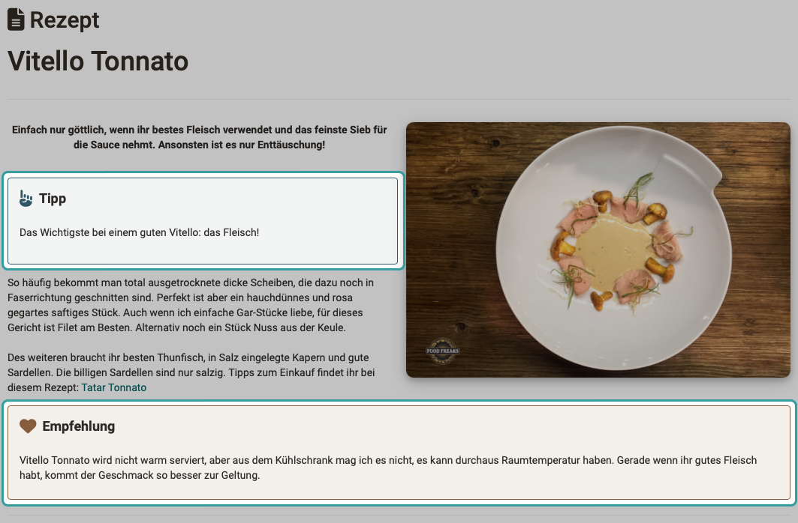

# Content Editor {: #content_editor}

## Was kann der Content Editor?

Im Content Editor können Autor:innen Seiten und Formulare in mehreren Layout-Rastern zusammenstellen. In ein wählbares Raster können verschiedene Inhaltselemente, wie Text, Bilder, Videos, usw. eingefügt werden.

Ziel ist die Ermöglichung eines adaptiven Designs, so dass die Inhalte auch auf Mobile Devices passend dargestellt werden.

{ class="shadow lightbox" }

!!! info "Hinweis"
      
    Ein anderer Editor in OpenOlat ist z.B. der HTML-Editor "Tiny MC", der z.B. im Kursbaustein "HTML-Seite" verwendet wird.

## Wo kommt der Content Editor zum Einsatz?

### Kursbaustein Seite

Nachdem Sie im Kurseditor einen neuen Kursbaustein vom Typ "Seite" eingefügt haben, wählen Sie den **Tab "Seiteninhalt"**. Dort wird die Möglichkeit zum Editieren angeboten, die den Content Editor öffnet, um diesen Kursbaustein zu gestalten.

{ class="shadow lightbox" }

### Bearbeitungsmöglichkeit im Run Mode

Im Run Mode (bei geschlossenem Kurseditor) können Sie als Kursbesitzer:in einen Kursbaustein "Seite" auch bearbeiten, nachdem Sie rechts oben den Toggle-Button zur Bearbeitung eingeschaltet haben. 
(Sie öffnen damit nicht den Kurseditor, sondern direkt den Content Editor, den es zur Bearbeitung eines Kursbausteins vom Typ "Seite" benötigt.) 

{ class="shadow lightbox" }

!!! info "Hinweis zur Speicherung"
      
    Für die mit dem Content Editor erstellte Seite gilt: 
    Die Medien-Inhalte einer Seite (Bilder, Audio, Video, Diagramme, Zitate, Dokumente, etc.) sind im Medien Center gespeichert. Die Seite selbst (Text, Layout, Einstellungen) wird im Kurs gespeichert. 
    Im ähnlichen Kursbaustein HTML-Seite kommt nicht der Content-Editor, sondern der Editor Tiny-MC zum Einsatz. Dort wird eine HTML-Datei erstellt, die als Lernressource in den Kursbaustein eingefügt und mitsamt den Medien im Ablageordner des Kursbausteins gespeichert ist. 
    Für Portfolio und Formular-Lernressource gelten andere Regeln.

    

Es besteht die Möglichkeit, auch Betreuer:innen im fertigen Kurs die Bearbeitung dieser Seite zu erlauben.
(Auch für Betreuer:innen wird dann der Toggle-Button rechts oben im Kursbaustein Seite angezeigt.)

{ class="shadow lightbox" }

### Lernressource Formular

Editieren Sie im Autorenbereich eine Lernressource "Formular", geschieht die Bearbeitung ebenfalls im Content Editor. Die angezeigten Optionen zum Einfügen von Inhalt sind an das Formular angepasst (verschiedene Fragetypen zur Auswahl).

{ class="shadow lightbox" }

### E-Portfolio

Auch für Einträge in Portfolio-Mappen wird der Content Editor verwendet.

{ class="shadow lightbox" }

## Layout erstellen

Um eine korrekte Darstellung auch auf Mobile Devices zu sichern, werden alle Inhalte in Layout-Raster eingefügt. Wird ein Mobile als aktuelles Gerät erkannt, können die Layout-Felder so automatisch alle untereinander dargestellt werden.

{ class="shadow lightbox" }

### Layoutvorlage austauschen

Ist das Layout markiert (selektiert), können Sie auch nachträglich das Layout und eine andere Standard-Anordnung der Layoutfelder wählen, ohne bereits in die Layoutfelder eingefügte Inhalte zu verlieren. Selektieren Sie das Layout und klicken Sie das Zahnrad-Icon.

{ class="shadow lightbox" }

!!! hint "Empfehlung"
      
    Beim nachträglichen Ändern des Layouts werden die Inhalte neu in Layout-Felder verteilt. Sie sollten deshalb die Anordnung der Inhalte überprüfen und falls nötig korrigieren.

### Weitere Layouts einfügen

Sie können mehrere dieser Layouts untereinander einfügen. Klicken Sie dazu auf das Icon mit den 3 Punkten rechts oben. Auch am unteren Rand der Seite wird ein Button zum Einfügen eines weiteren Layout-Elements angezeigt.

Sind mehrere Layouts vorhanden, können Sie die Reihenfolge der Layouts ändern. 
Zum Verschieben eines gesamten Layouts verwenden Sie die Pfeile.

{ class="shadow lightbox" }

### Content Editor verlassen

Zum Verlassen des Content Editors klicken Sie links oben auf "Zurück", Sie gelangen damit wieder zum Kurseditor, in dem alle Kursbausteine angezeigt werden.

Haben Sie die Seite im Run Modus bearbeitet, verlassen Sie den Bearbeitungsmodus durch Umschalten des Toggle-Buttons.

**Ihre im Content Editor gemachten Einfügungen und Änderungen werden automatisch gespeichert.**

Auch um zwischendurch in die Vorschau zu wechseln, ohne den Editor zu verlassen, können Sie den Schalter "Bearbeitungsmodus" rechts oben benutzen.

## Inhalte in ein Layout einfügen

### Was ist ein Layout?

* Ein Layout ist ein Raster, das die Inhalte (Blöcke) strukturiert.
* Es können mehrere Layouts in einem Kursbaustein "Seite" eingefügt werden.
* Es stehen mehrere Layouts zur Auswahl, die sich durch unterschiedlich angeordnete Felder unterscheiden.

### Was ist ein Inhalts-Block?

* Ein Block ist der gesamte Inhalt eines Feldes im Layout. 
* Es können mehrere Inhalte in einen Block eingefügt werden, z.B. ein Titel und ein Text. 

{ class="shadow lightbox" title="Inhaltsblöcke im Kursbaustein Seite"}

{ class="shadow lightbox" title="Inhaltsblöcke in der Lernressource Formular"}

### Inspektor

Sobald ein Inhalt markiert worden ist, erscheint ein Popup-Fenster, in dem Eigenschaften dieses Inhalts eingestellt werden können. 

Ein Inspektor-Popup lässt sich auch mit dem Zahnrad-Icon ein- und ausblenden.

{ class="shadow lightbox" }

### Inhalte verschieben

Bei einem selektierten Inhalt wird links oben am Rahmen ein Icon mit einem Pfeilkreuz angezeigt. Wenn Sie dieses Icon wählen, können Sie mit gedrückter Maustaste den Inhalt an ein beliebige andere Stelle verschieben. Auch in ein anderes Layoutfeld und in ein anderes Layout-Element.

{ class="shadow lightbox" }

### Generelle Formatierungen für alle Inhaltsblöcke

**Abstände**

Für die ansprechende Gestaltung eines Layouts sind einheitliche Abstände zwischen den Feldern des Layouts (Inhaltsblöcken) bedeutsam. Sie haben die Wahl zwischen verschiedenen Abständen: 

* kein Abstand
* S (klein)
* M (mittel)
* L (gross)
* XL (extragross)
* benutzerdefinert

=== "S (kleiner Abstand)"

    { class="shadow lightbox" title="kleiner Abstand" }

=== "M (mittlerer Abstand)"

    { class="shadow lightbox" title="mittlerer Abstand" }

=== "XL (extra-grosser Abstand)"

    { class="shadow lightbox" title="extra-grosser Abstand" }

**Block-Stil 'Hinweis'**

Ab Release 18.2.3 können Layouts und manche Inhaltsblöcke als formatierte Hinweis-Box dargestellt werden. Bei Auswahl eines vordefinierten Hinweis-Typs werden Informationen durch eine entsprechende Farbgebung der Box - ggfs. mit passendem Icon - deutlich hervorgehoben. Ein Set an weiteren Farben und Icons zur benutzerdefinierten Gestaltung der Box ist ebenfalls verfügbar. Auf Wunsch kann eine Box auch einklappbar gemacht werden.

{ class="shadow lightbox" }

Beispiel:

{ class="shadow lightbox" }

## Inhaltstypen 

<h3>Titel</h3>

Für das Überschriftselement sind verschiedene Schriftgrössen vordefiniert.

{ class="shadow lightbox" }

<h3>Paragraph</h3>

In einem Paragraph stehen im Unterschied zu einem Textabschnitt auch Hinweisboxen und Spalten zur Verfügung.

{ class="shadow lightbox" }

<h3>Textabschnitt</h3>

In einem Textabschnitt steht ein einfacher Texteditor zur Erstellung von Textblöcken zur Verfügung.

{ class="shadow lightbox" }

<h3>Bild</h3>

Es können alle im Medien Center verfügbaren Bilder eingebunden werden. Neue Bilder können hochgeladen werden und sind dann im Medien Center abgelegt.

<h3>Galerie</h3>

Mehrere Bilder können in einem Galerie-Element durchgeblättert werden (Slideshow), in einem Raster dargestellt werden (Spalten und Zeilen von Autor:innen definierbar) oder mit Vorschau dargestellt werden (1 Bild gross, die übrigen Bilder als verkleinerte Vorschaubilder). Im Inspektor kann das Erscheinungsbild der Galerie variiert werden. Die Bilder entstammen dem Medien Center. 

{ class="shadow lightbox" }

<h3>Bildervergleich</h3>

Zwei übereinander liegende Bilder können durch einen Schieberegler überblendet werden.

{ class="shadow lightbox" }

<h3>Separator</h3>

Ein Separator ist eine Linie (optisches Gestaltungselement) zur Trennung von Inhalten.

<h3>Tabelle</h3>

{ class="shadow lightbox" }

<h3>Mathematische Formel</h3>

Für mathematische Formeln steht ein spezieller kleiner Editor zur Verfügung.

{ class="shadow lightbox" }

<h3>Code</h3>

Der 'Code' Block ermöglicht die Textdarstellung in einer Schriftart mit festen Abständen und Nummerierung der Zeilen. Dies ist insbesondere bei technischen Lerninhalten wie Programmierbeispielen sehr hilfreich. Beim Anlegen des Code Blocks kann die verwendete Programmiersprache gewählt werden. Zur Weiterverarbeitung können Teilnehmende die Code-Vorlage direkt in die Zwischenablage kopieren.

{ class="shadow lightbox" }

<h3>Audio</h3>

Audios können direkt in OpenOlat neu aufgenommen werden, hochgeladen oder aus den bereits vorhandenen Audios ausgewählt werden.

{ class="shadow lightbox" }

<h3>Video</h3>

Im Block 'Video' können auch Videos per URL eingebunden werden.  
Unterstützt werden die Video-Formate MP4 und m3u8 sowie die Plattformen Youtube, Vimeo, Panopto und nanoo.tv.  
Auch die Aufzeichnung neuer Videos direkt in OpenOlat ist möglich.

<h3>Zitat</h3>

Wird ein Text als Zitat erfasst, hat er automatisch eine vordefinierte Formatierung. Die Zitate werden wie Audios oder Videos als wiederverwendbare Objekte im Medien Center gespeichert.  

<h3>Dokument</h3>

Dokumente (wie z.B. pdf- oder Word-Dateien) können per Drag&drop hochgeladen werden. Sie werden im Medien Center abgelegt. Fürs Medien Center können hier Beschreibungen und Angaben unter "Share" gemacht werden. Die zunächst nur für diesen Inhaltsblock hochgeladene Datei kann dann ggf. auch anderweitig und durch andere OpenOlat-Autor:innen verwendet werden.
Auf Wunsch können die Dokumente auch bearbeitbar im Medien Center abgelegt werden.

{ class="shadow lightbox" }

<h3>draw.io Diagramm</h3>

Es können bereits vorhandene Diagramme aus dem Medien Center geladen werden oder direkt neue Diagramme mit draw.io erstellt werden. Wenn Sie als Einzelperson die Datei bearbeiten, findet die Bearbeitung auf dem OpenOlat-Server statt, im Kollaborationsmodus auf einem externen Server. 

{ class="shadow lightbox" }

<h3>Quiz</h3>

Wie oben gezeigt, können in Formulare verschiedene Fragetypen eingefügt werden.  
Auch im Kursbaustein "Seite" sind ab Release 19.0 Quizfragen verfügbar. Ein Quiz (Paket aus einer oder mehreren Fragen) kann als Block in die Seite eingefügt werden. Zu jeder Frage können mehrere ausführliche Feedbacks hinzugefügt werden (inkl. Bildern und Videos). Als Inhaltsblock auf einem Kursbaustein "Seite" sind Quizzes zur abwechlungsreichen Inhaltsvermittlung gedacht und es werden deshalb keine Punkte an den Kurs weiter gegeben (kein bewertbarer Kursbaustein). Für auswertbare Quizfragen verwenden Sie den Kursbaustein "Test" oder "Selbsttest".

{ class="shadow lightbox" }

<h3>Aus meinem Medien Center wählen</h3>

Im Medien Center können verschiedene Medientypen abgelegt werden. Statt auf einen ganz bestimmten Inhaltstyp, können Sie unter dieser Auswahloption auf alle für Sie im Medien Center freigegebenen Medien unterschiedlichster Typen zugreifen. 
Mit dem Button "Mediendatei hinzufügen" erstellen Sie direkt neue Mediendateien. 

{ class="shadow lightbox" }

!!! info "Hinweis"
      
    Zum Medien Center finden Sie mehr Informationen hier:  [Benutzerhandbuch > Persönliches Menü > Persönliche Werkzeuge > Medien Center](../personal_menu/Media_Center.de.md)