# Content Editor {: #content_editor}

## What can the Content Editor do? {: #content_editor}

In the Content Editor, authors can compile pages and forms in several layout grids. Various content elements such as text, images, videos, etc. can be inserted into a selectable grid.

The aim is to enable an adaptive design so that the content is also displayed appropriately on mobile devices.

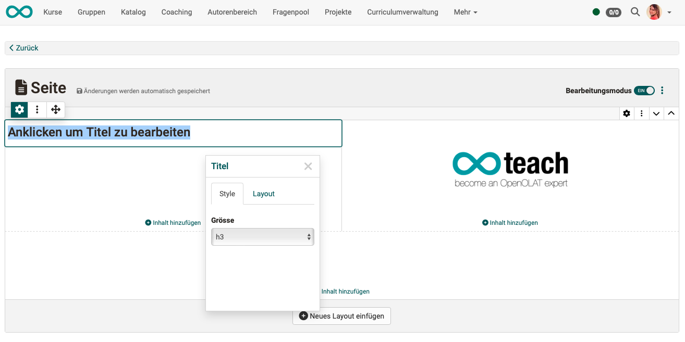{ class="shadow lightbox" }

!!! info "Note"

    Another editor in OpenOlat is, for example, the HTML editor "Tiny MC", which is used in the course element [HTML page](../learningresources/Course_Element_HTML_Page.md), for example.

## Where is the Content Editor used? {: #content_editor_use}

The content editor is used in the [Course element page](../learningresources/Course_Element_Page.md), in the [Learning resource “Form”](../learningresources/Form.md) and in the [“Portfolio 2.0”](../area_modules/The_portfolio_editor.md).

### Course element page {: #course_element_page}

The Content Editor is activated in the "Page" course block either in the Course Editor under the "Page Content" tab, or—when the Course Editor is closed—by enabling edit mode directly on the desired "Page" course block. 

**When the course editor is closed:**

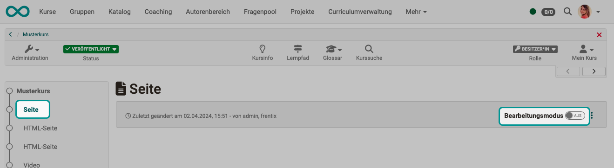{ class="shadow lightbox" }

The slide switch can be used to turn the processing mode on and off. 

**In the course editor:**

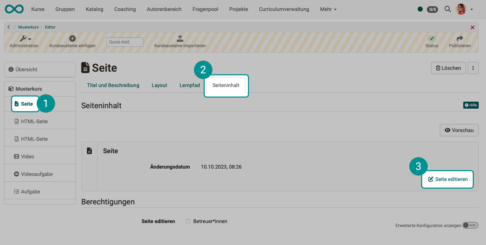{ class="shadow lightbox" }

In the course editor, you can configure whether, in addition to course owners, instructors are also allowed to use the course module's content editor and make changes when the course editor is closed. 

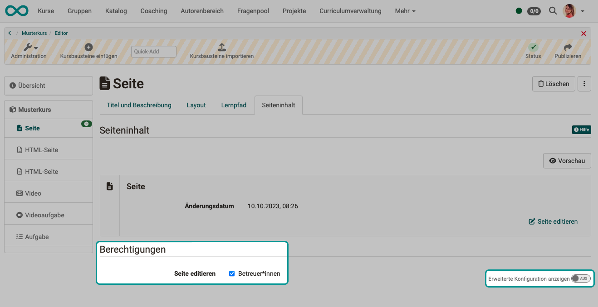{ class="shadow lightbox" }

The media content of the [Course Element "Page"](../learningresources/Course_Element_Page.md) (images, audio, video, diagrams, quotes, documents, etc.) is stored in the [Media Center](../ personal_menu/Media_Center.md), not in the course’s storage folder (see [Course Element "HTML Page"](../learningresources/Course_Element_HTML_Page.md)). For more information, see the explanations for the respective course element types. 

Different rules apply to the portfolio and the form-based learning resource.

[To the top of the page ^](#content_editor)

---

### Learning resource form {: #form}

The content editor is also used in the [learning resource form](../learningresources/Form.md) and all elements that use the learning resource form. 

The displayed options for inserting content are adapted to the form, e.g. different question types are available here.

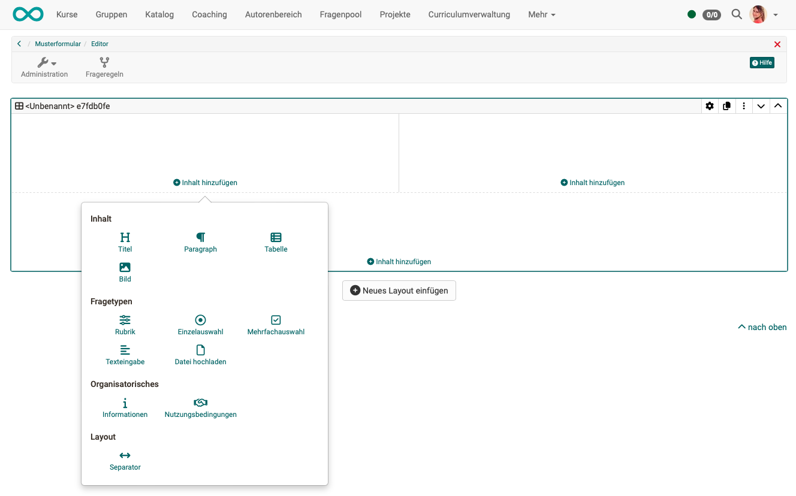{ class="shadow lightbox" }

[To the top of the page ^](#content_editor)

---

### E-portfolio {: #portfolio}

This also applies to entries in [portfolio folders](../ area_modules/My_portfolio_binders.md), which can be used both independently of a course and in conjunction with [portfolio templates](../learningresources/Portfolio_template_Creation.md) and [portfolio tasks](../learningresources/Course_Element_Portfolio_Task.md), the Content Editor is used.

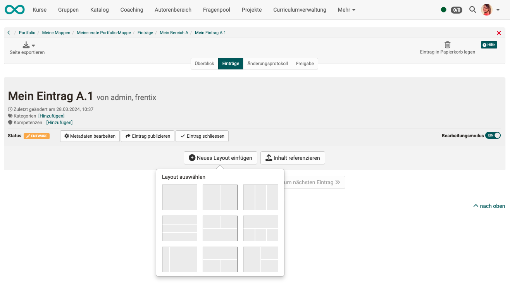{ class="shadow lightbox" }

[To the top of the page ^](#content_editor)

---

## Layout in the content editor {: #content_editor_layout}

Before you can insert content in the Content Editor, you must first "add a new layout". The layout serves as a grid that determines the arrangement of the content (blocks).

There are various layouts to choose from, which differ in the way the fields are arranged. You can also combine several layouts on one page.

If necessary, the layout can be changed later at any time. To do this, simply click on the gear icon (Edit settings) of the layout and select a new layout.

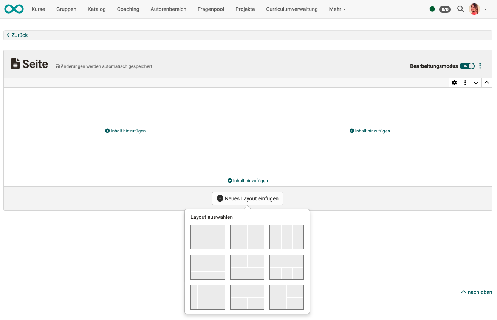{ class="shadow lightbox" }

If several layouts are available in a form, you can change the order of the layouts. Use the arrows to move an entire layout.

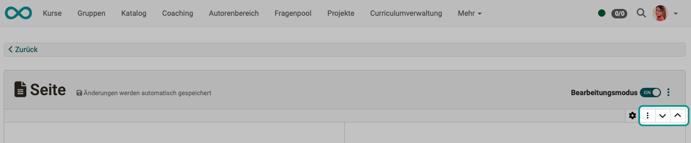{ class="shadow lightbox" }

[To the top of the page ^](#content_editor)

---

## Organizing Content in the Layout {: #organize_content}

### Content Blocks {: #content_blocks}

Content blocks with various specific types of content can be added to each section of a layout. The number of content blocks varies depending on the selected design. For example, a three-column design has 3 content blocks. 

### Adding, Positioning, and Configuring Content in a Block {: #add_content}

Use "Add Content" to add specific content and media to a block. 

As soon as you click or select a piece of added content, a pop-up window appears where you can configure the properties of that content. This is called the "Inspector".

You can also show or hide the Inspector pop-up using the gear icon next to the content.

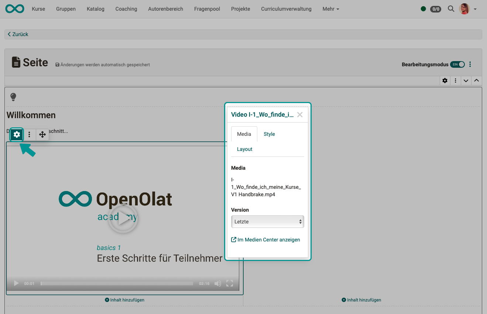{ class="shadow lightbox" }

**Menus**

In addition to the gear icon, there is also a three-dot menu and a crosshair. The crosshair allows you to add additional content elements before or after the selected item, or to delete the selected item. You can also use the crosshair to drag and drop the selected item to a different position, a different content block, or a different layout.  

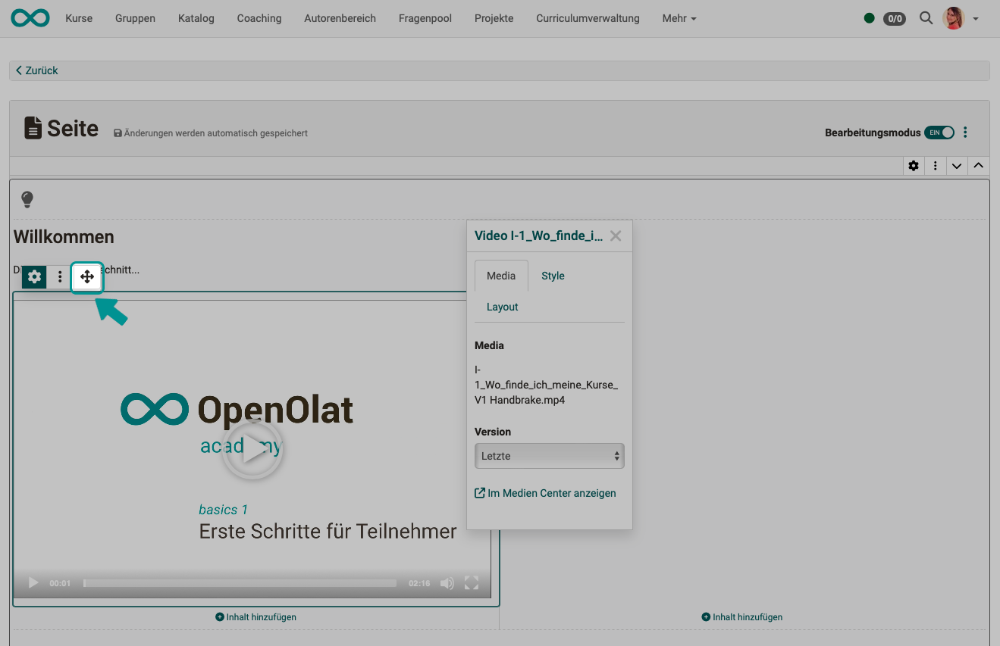{ class="shadow lightbox" }

[To the top of the page ^](#content_editor)

---

### General Formatting for All Content Blocks - The Inspector {: #inspector}

**Distances**

Consistent spacing between the layout fields (content blocks) is important for creating an appealing layout. You can choose from various spacing options: 

* no distance
* S (small)
* M (medium)
* L (large)
* XL (extra large)
* custom

=== "S (small distance)"

    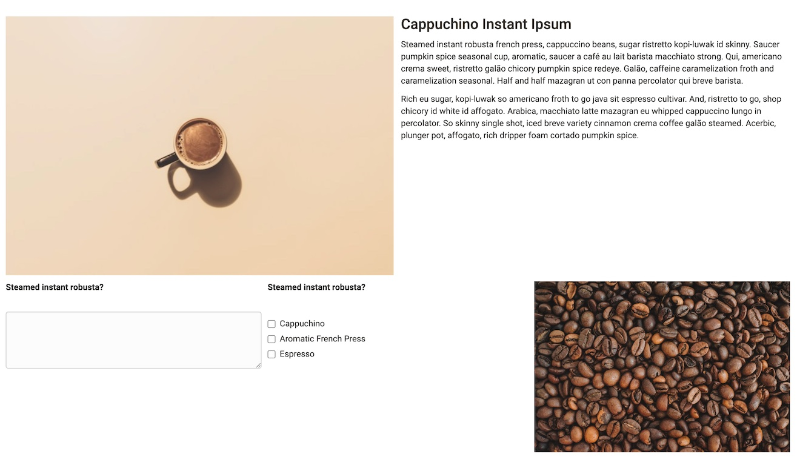{ class="shadow lightbox" title="kleiner Abstand" }

=== "M (medium distance)"

    { class="shadow lightbox" title="mittlerer Abstand" }

=== "XL (extra large distance)"

    { class="shadow lightbox" title="extra-grosser Abstand" }

**Block style "Note"**

Starting with Release 18.2.3, layouts and some content blocks can be displayed as formatted info boxes. When a predefined info type is selected, the information is clearly highlighted by applying the corresponding color scheme to the box—along with a matching icon, if applicable. A set of additional colors and icons is also available for customizing the box’s appearance. If desired, a box can also be made collapsible.

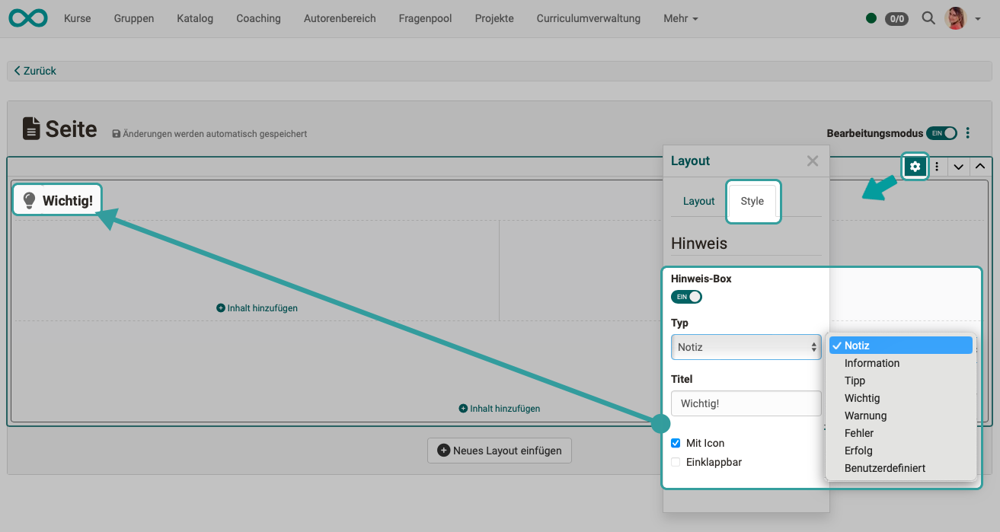{ class="shadow lightbox" }

Example:

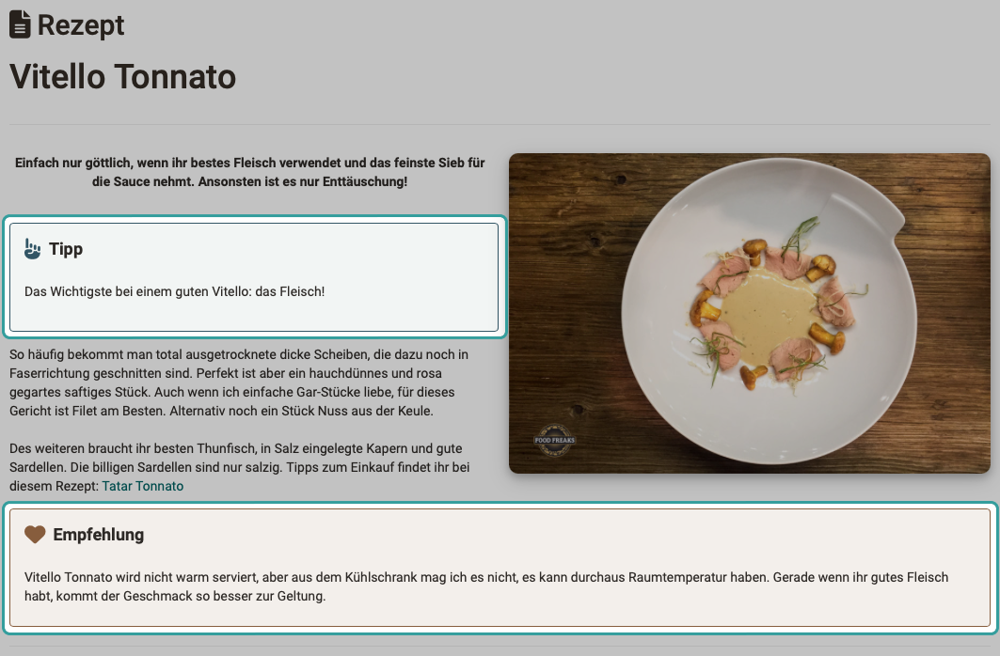{ class="shadow lightbox" }

[To the top of the page ^](#content_editor)

---

## Content types

Please note that not *all* elements are available in every content editor. 

### Text elements {: #text_elements}

<h3>Title</h3>

Various font sizes are predefined for the heading element.

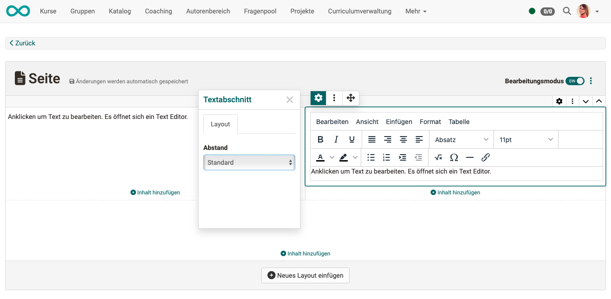{ class="shadow lightbox" }

<h3>Paragraph</h3>

In contrast to a text section, a paragraph also contains note boxes and columns.

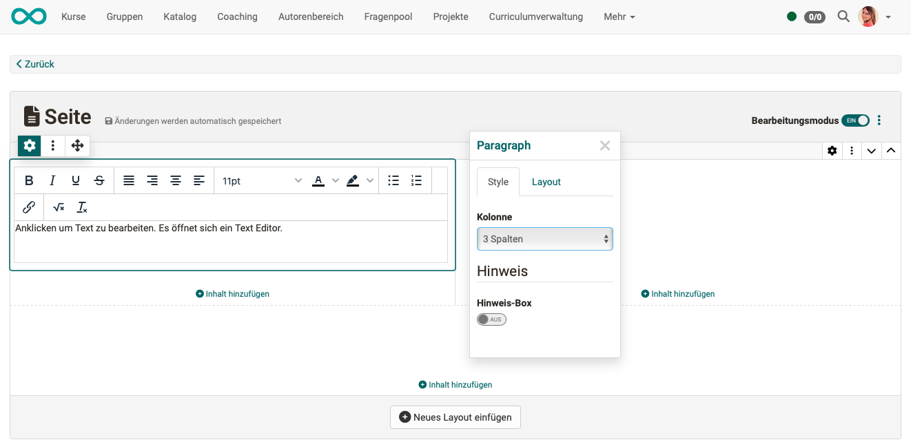{ class="shadow lightbox" }

<h3>Text section</h3>

A simple text editor is available in a text section for creating text blocks.

{ class="shadow lightbox" }

<h3>Table</h3>

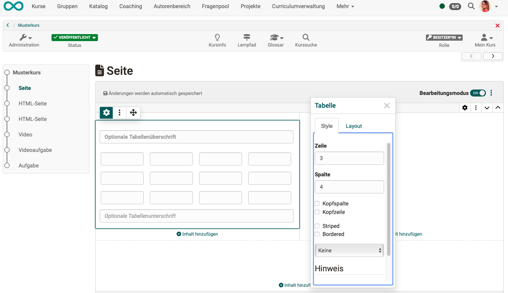{ class="shadow lightbox" }

<h3>Mathematic formula</h3>

A special small editor is available for mathematical formulas.

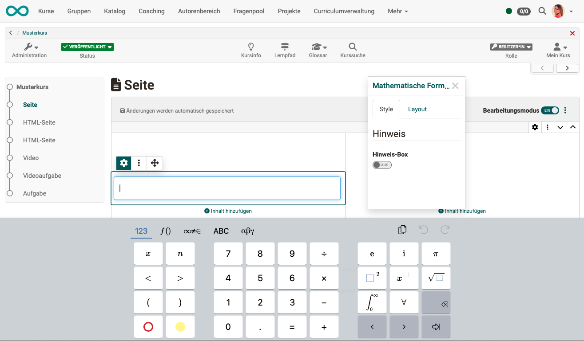{ class="shadow lightbox" }

<h3>Code</h3>

The 'Code' block enables text to be displayed in a font with fixed spacing and numbering of the lines. This is particularly helpful for technical learning content such as programming examples. The programming language used can be selected when creating the code block. Participants can copy the code template directly to the clipboard for further processing.

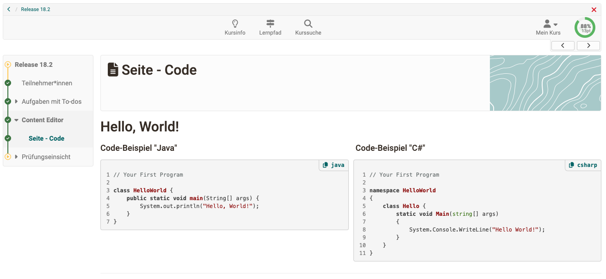{ class="shadow lightbox" }

This text element does not exist in the Form Editor. 

<h3>Quote</h3>

If a text is entered as a quote, it automatically has a predefined formatting. The quotes are saved as reusable objects in the Media Center, just like audio or videos.

This text element does not exist in the Form Editor. 

### Media {: #media}

!!! info "Info"

    Instead of the "Media" section and its associated content elements, the [Form Editor](../learningresources/Form_Editor.md) includes the "Question Types" and "Organizational" sections with their corresponding content elements. 

<h3>Image</h3>

All images available in the Media Center can be integrated. New images can be uploaded and are then stored in the Media Center.

<h3>Gallery</h3>

Several images can be scrolled through in a gallery element (slideshow), displayed in a grid (columns and rows definable by author) or displayed with preview (1 image large, the remaining images as reduced preview images). The appearance of the gallery can be varied in the inspector. The images come from the Media Center. 

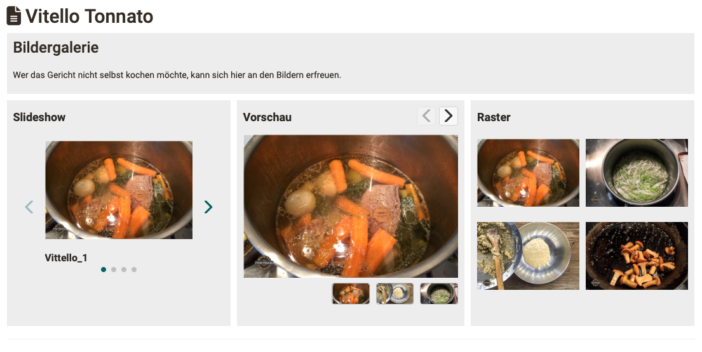{ class="shadow lightbox" }

<h3>Image comparison</h3>

Two superimposed images can be cross-faded using a slider.

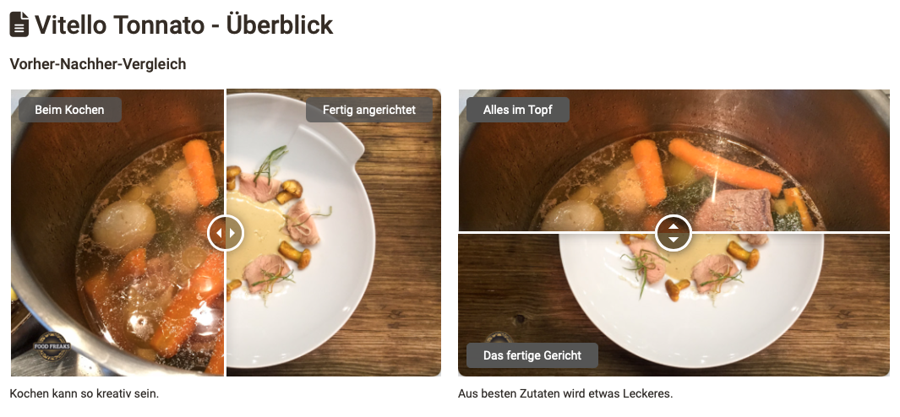{ class="shadow lightbox" }

<h3>Audio</h3>

Audio can be recorded directly in OpenOlat, uploaded or selected from existing audio.

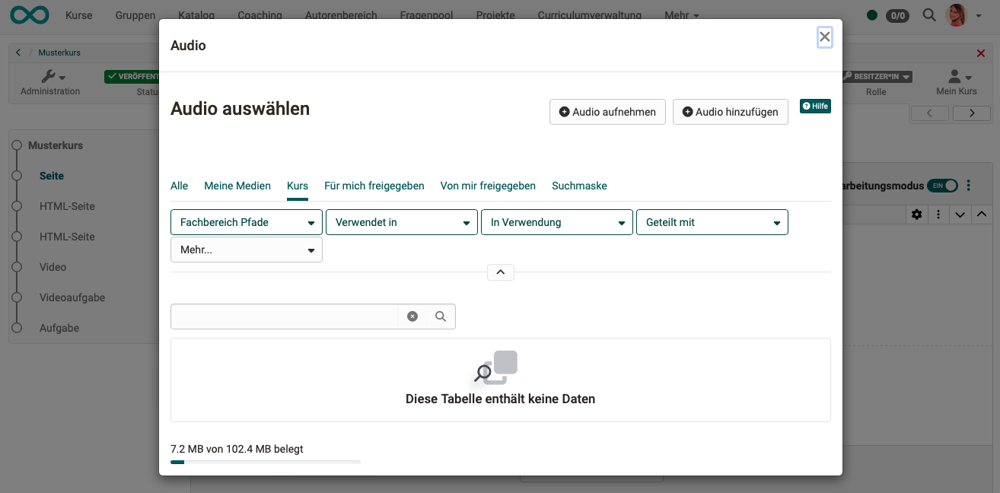{ class="shadow lightbox" }

<h3>Video</h3>

Videos can also be integrated via URL in the 'Video' block. The video formats MP4 and m3u8 as well as the platforms Youtube, Vimeo, Panopto and nanoo.tv are supported. It is also possible to record new videos directly in OpenOlat.
 

<h3>Document</h3>

Here, you can upload documents in various formats (e.g., PDF or Word files) using drag-and-drop, select them from the Media Center, or create them directly in specific formats. The media files are automatically saved in the Media Center.

You can also access the Media Center via the Inspector menu to add additional information to documents and define further sharing options. This allows a file that was initially intended for a single content block to be used for other purposes or edited by other OpenOlat users.

In addition, the "Share" section allows you to share newly created or uploaded documents directly.

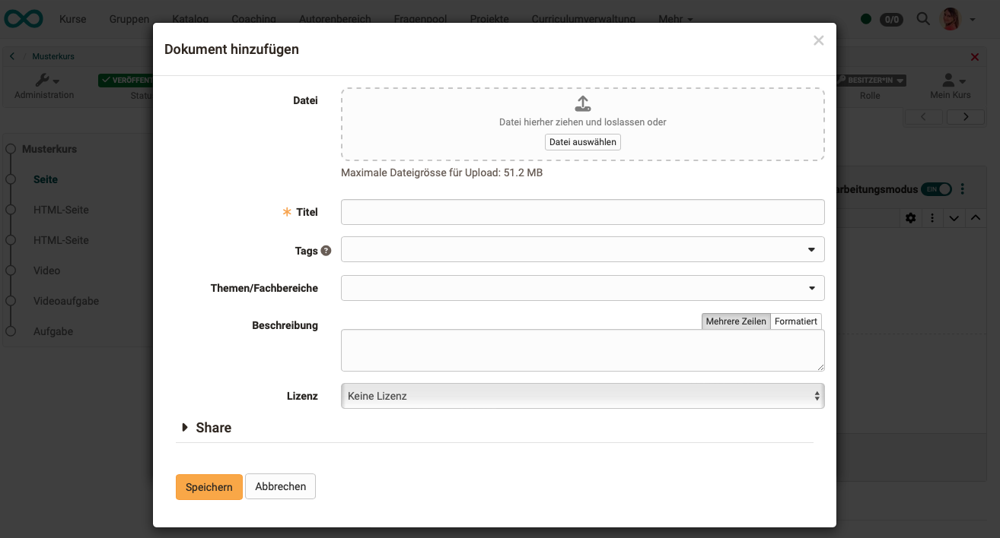{ class="shadow lightbox" }

<h3>draw.io diagram</h3>

Existing diagrams can be loaded from the Media Center or new diagrams can be created directly with draw.io. If you edit the file as an individual, the editing takes place on the OpenOlat server, in collaboration mode on an external server. 

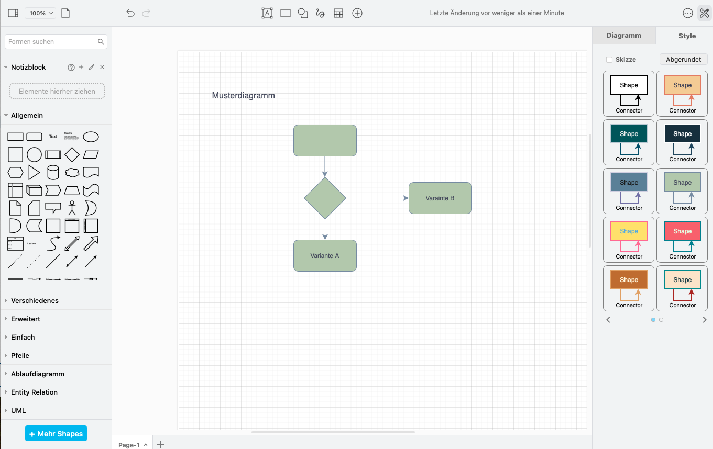{ class="shadow lightbox" }

[To the top of the page ^](#content_editor)

---

### Knowledge {: #quiz}

!!! info "Info"

    This section is available only in the Content Editor of the Course Building Block page.

<h3>Quiz</h3>

This content element allows you to embed quiz questions that can be automatically graded into a page. You can create new questions or add existing ones from the question bank. You can also add feedback to each question, including images and videos, which enhances the learning experience.
 
These short quiz questions are intended to encourage engagement with the course content, but they do not award points. For graded quizzes, please use the "Test" or "Self-Test" course modules.

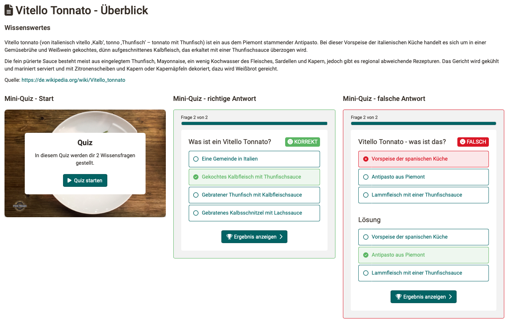{ class="shadow lightbox" }

[To the top of the page ^](#content_editor)

---

### Importing Markdown Files {: #markdown}

!!! info "Info"

    Markdown is a widely used text format that is output by many tools and AI applications. It allows for the seamless import and reuse of existing content without the need for additional formatting. At the same time, it supports a clear structure and facilitates the ongoing development of learning content.

Starting with version 20.3, Markdown files can be imported directly into the Content Editor, allowing content from external tools or plain text files to be imported without manual reformatting. The content is automatically converted into the structured page format, providing an efficient foundation for populating course pages with content more quickly and easily. The content is automatically converted into the Content Editor’s functional blocks, such as Title, Table, Info Box, etc.

Images are imported directly into the Media Center, and a duplicate check ensures that the same image isn't stored multiple times in the Media Center. This saves space and keeps things organized automatically, without the author having to worry about it.

To import, click the button at the bottom of the content editor. You can either import an entire file or paste Markdown-formatted text into an input field. 

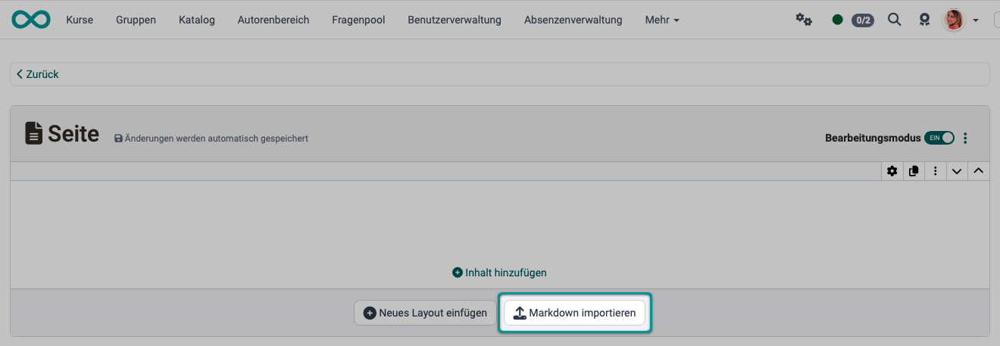{ class="shadow lightbox" }

[To the top of the page ^](#content_editor)

---

### Importing Word Files {: #word}

Just like Markdown files, Word files (version 20.3 and later) can also be imported.

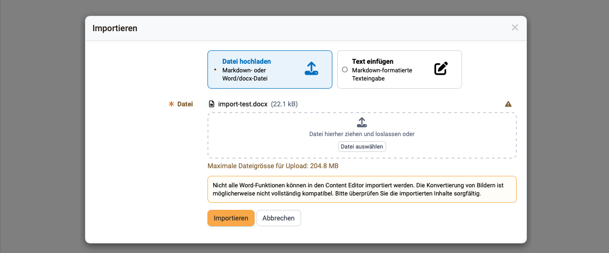{ class="shadow lightbox" }

!!! info "Note"

    Not all Word features can be imported into the Content Editor. The conversion of images may not be fully compatible. Please review the imported content carefully.

[To the top of the page ^](#content_editor)

---

### Others & Design {: #others_and_design}

<h3>Separator</h3>

A separator is a line (visual design element) used to separate content.

<h3>HTML Code</h3>

The HTML text code editor is available exclusively in the "Page" course element editor. It performs similar functions to the "Text" content element but offers additional menus and options. 

[To the top of the page ^](#content_editor)

---

## Media Center {: #media_center}

In the Content Editor for the "Page" and "Portfolio" course blocks, there is a separate button that leads to the Media Center. Essentially, this provides an additional way to access the files, regardless of the type of media. 

Click the link to access the files in your Media Center. Here, you can select, create, or upload files. 

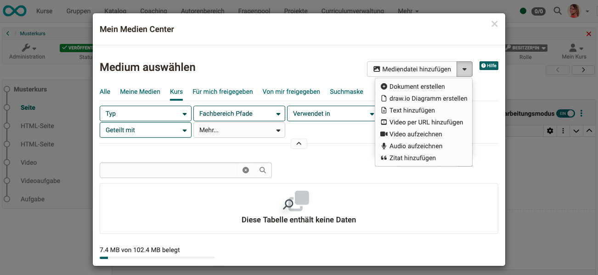{ class="shadow lightbox" }

[To the top of the page ^](#content_editor)

---

## Further information {: #further_information}

[Course element page >](../learningresources/Course_Element_Page.md) 
[Learning resource form >](../learningresources/Form.md) 
[Portfolio >](../area_modules/The_portfolio_editor.md) 
[Media Center (Personal tools)>](../personal_menu/Media_Center.md) 
[Detailed information about the Media Center (Basic concept) >](../../manual_user/basic_concepts/Media_Center_Concept.md) 

[To the top of the page ^](#content_editor)

