# Content Editor

## What can the Content Editor do? {: #content_editor}

In the Content Editor, authors can compile pages and forms in several layout grids. Various content elements such as text, images, videos, etc. can be inserted into a selectable grid.

The aim is to enable an adaptive design so that the content is also displayed appropriately on mobile devices.

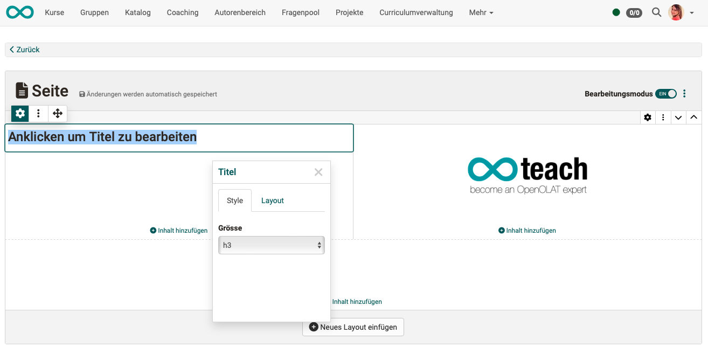{ class="shadow lightbox" }

!!! note "Note"

    Another editor in OpenOlat is, for example, the HTML editor "Tiny MC", which is used in the course element [HTML page](../learningresources/Course_Element_HTML_Page.md), for example.

## Where is the Content Editor used? {: #content_editor_use}

The content editor is used in the [Course element page](../learningresources/Course_Element_Page.md), in the [Learning resource “Form”](../learningresources/Form.md) and in the [“Portfolio 2.0”](../area_modules/The_portfolio_editor_17_1.md).

### Course element page [:octicons-tag-16:{ title="from Release 18.0.0 (OO-6966)" }](https://track.frentix.com/issue/OO-6966){:target="_blank"} {: #course_element_page}

The Content Editor is activated in the "Page" course block either in the Course Editor under the "Page Content" tab, or, when the Course Editor is closed, by enabling edit mode directly on the desired "Page" course block. 

**When the course editor is closed:**

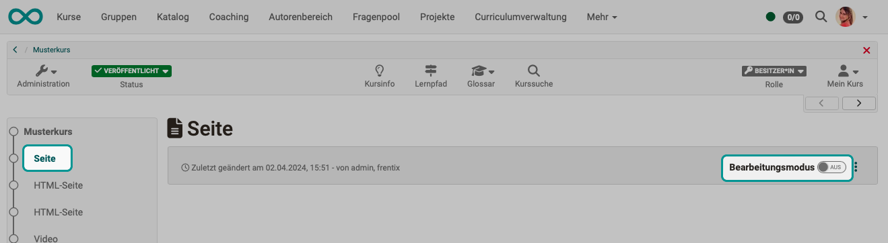{ class="shadow lightbox" }

The slide switch can be used to turn the processing mode on and off. 

**In the course editor:**

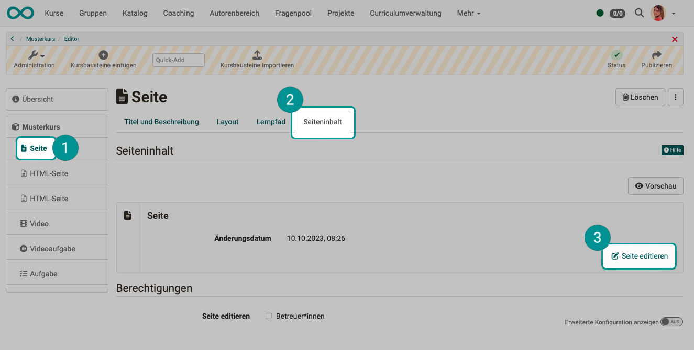{ class="shadow lightbox" }

In the course editor, you can configure whether, in addition to course owners, instructors are also allowed to use the course module's content editor and make changes when the course editor is closed. 

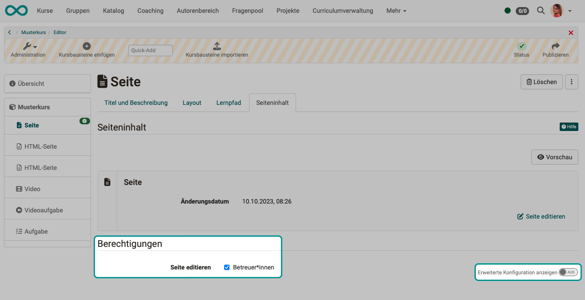{ class="shadow lightbox" }

The media content of the [Course Element "Page"](../learningresources/Course_Element_Page.md) (images, audio, video, diagrams, quotes, documents, etc.) is stored in the [Media Center](../personal_menu/Media_Center.md), not in the course’s storage folder (see [Course Element "HTML Page"](../learningresources/Course_Element_HTML_Page.md)). For more information, see the explanations for the respective course element types. 

Different rules apply to the portfolio and the form-based learning resource.

[To the top of the page ^](#content_editor)

---

### Learning resource form {: #form}

The content editor is also used in the [learning resource form](../learningresources/Form.md) and all elements that use the learning resource form. 

The displayed options for inserting content are adapted to the form, e.g. different question types are available here.

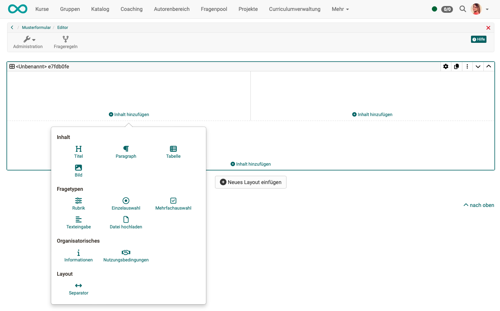{ class="shadow lightbox" }

[To the top of the page ^](#content_editor)

---

### E-portfolio [:octicons-tag-16:{ title="from Release 11.0 (OO-2057)" }](https://track.frentix.com/issue/OO-2057){:target="_blank"} {: #portfolio}

This also applies to entries in [portfolio folders](../area_modules/My_portfolio_binders.md), which can be used both independently of a course and in conjunction with [portfolio templates](../learningresources/Portfolio_template_Creation.md) and [portfolio tasks](../learningresources/Course_Element_Portfolio_Task.md), the Content Editor is used.

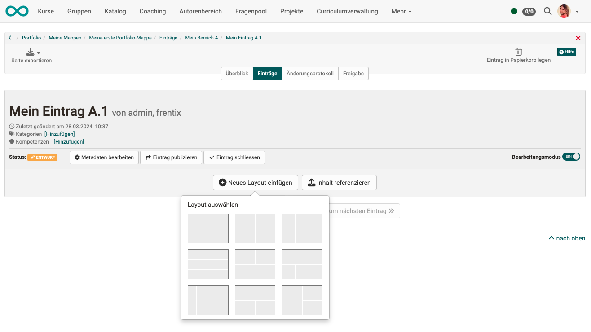{ class="shadow lightbox" }

[Portfolio >](../area_modules/The_portfolio_editor_17_1.md)

[To the top of the page ^](#content_editor)

---

## Layout in the content editor [:octicons-tag-16:{ title="from Release 17.1.0 (OO-6199)" }](https://track.frentix.com/issue/OO-6199){:target="_blank"} {: #content_editor_layout}

Before you can insert content in the Content Editor, you must first "add a new layout". The layout serves as a grid that determines the arrangement of the content (blocks).

There are various layouts to choose from, which differ in the way the fields are arranged. You can also combine several layouts on one page.

If necessary, the layout can be changed later at any time. To do this, simply click on the gear icon (Edit settings) of the layout and select a new layout.

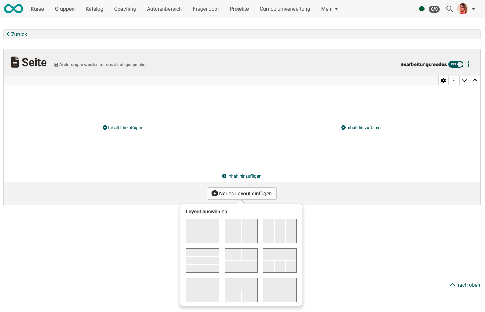{ class="shadow lightbox" }

If several layouts are available in a form, you can change the order of the layouts. Use the arrows to move an entire layout.

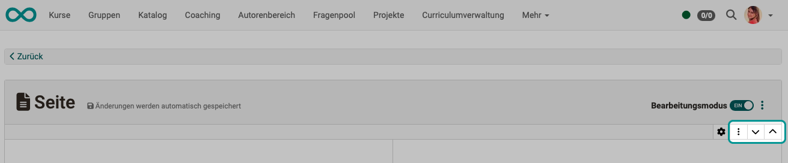{ class="shadow lightbox" }

### Deleting a layout [:octicons-tag-16:{ title="from Release 21.0 (OO-9407)" }](https://track.frentix.com/issue/OO-9407){:target="_blank"} {: #delete_layout}

Every layout on a page can be deleted via the layout's three-dot menu, including the first one. When deleting, you decide what happens to the content: "Delete everything" removes the layout together with its content, "Only delete the layout and move the content" moves the content to the adjacent layout. When the last layout of a page is deleted, the dialog points out that the layout and all its content will be deleted; the page then automatically receives an empty default layout again. If only a single empty layout is left, the "Delete" action is disabled.

[To the top of the page ^](#content_editor)

---

## Organizing Content in the Layout {: #organize_content}

### Content Blocks {: #content_blocks}

Content blocks with various specific types of content can be added to each section of a layout. The number of content blocks varies depending on the selected design. For example, a three-column design has 3 content blocks. 

### Adding, Positioning, and Configuring Content in a Block {: #add_content}

Use "Add content" to add specific content and media to a block. The link appears in every section of a layout, so you can insert the content exactly where it belongs.

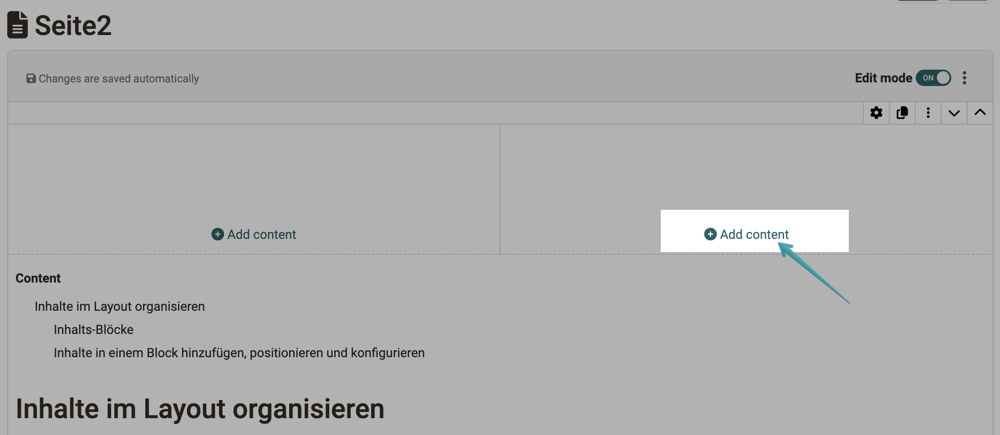{ class="shadow lightbox" }

The "Add content" dialog lists the available content types grouped into the sections "Text", "Media", "Knowledge" and "Other & design". At the bottom, two buttons lead directly to the [Media Center](#media_center) and to the [import](#import_position).

When you hover over a block with the mouse in edit mode, that block is highlighted [:octicons-tag-16:{ title="from Release 20.2.0 (OO-8966)" }](https://track.frentix.com/issue/OO-8966){:target="_blank"}. This helps you tell blocks apart when several similar elements follow one another.

As soon as you click or select a piece of added content, a pop-up window appears where you can configure the properties of that content. This is called the ["Inspector"](#inspector).

You can also show or hide the Inspector pop-up using the gear icon next to the content.

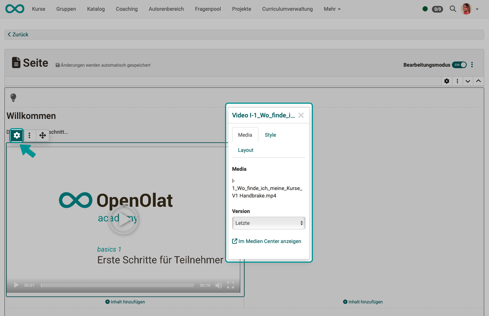{ class="shadow lightbox" }

**Menus**

The toolbar of a selected block comprises four icons: the gear for the Inspector, an icon to duplicate, a three-dot menu and a crosshair. The three-dot menu lets you add further content elements before or after the element, move the element up or down, and delete it. The crosshair lets you drag and drop the selected element to a different position, into a different content block, or into a different layout.

A block can be copied with the "Duplicate" action, both as a short action on the block itself and via the three-dot menu [:octicons-tag-16:{ title="from Release 20.1.0 (OO-7709)" }](https://track.frentix.com/issue/OO-7709){:target="_blank"}.

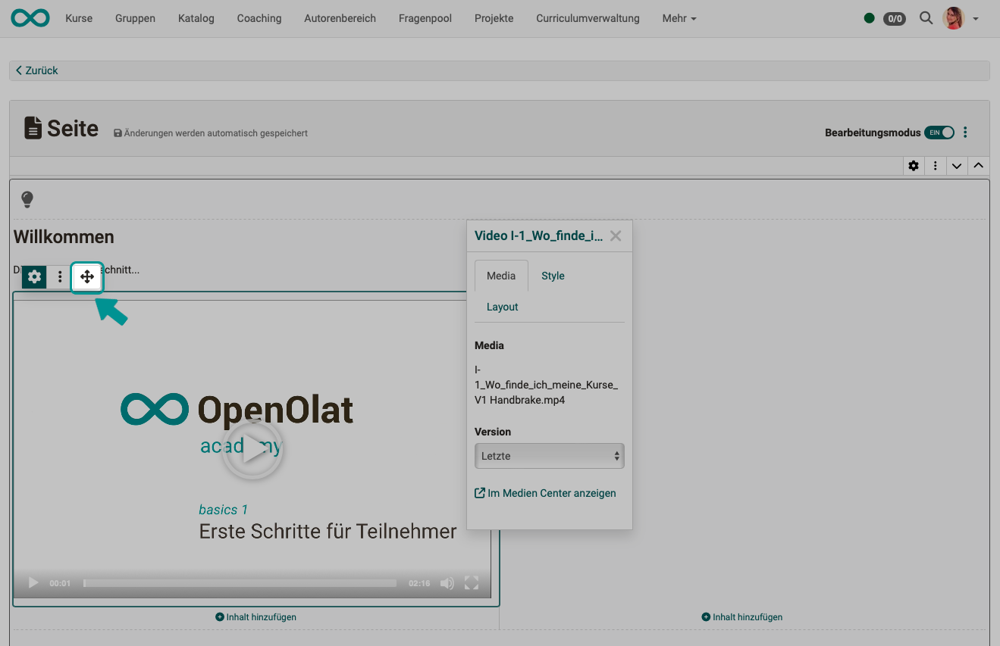{ class="shadow lightbox" }

[To the top of the page ^](#content_editor)

---

### General Formatting for All Content Blocks - The Inspector [:octicons-tag-16:{ title="from Release 17.1.0 (OO-6198)" }](https://track.frentix.com/issue/OO-6198){:target="_blank"} {: #inspector}

**Distances**

Consistent spacing between the layout fields (content blocks) is important for creating an appealing layout. You can choose from various spacing options: 

* no distance
* S (small)
* M (medium)
* L (large)
* XL (extra large)
* custom

=== "S (small distance)"

    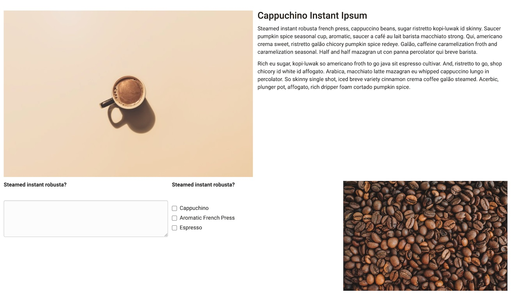{ class="shadow lightbox" title="kleiner Abstand" }

=== "M (medium distance)"

    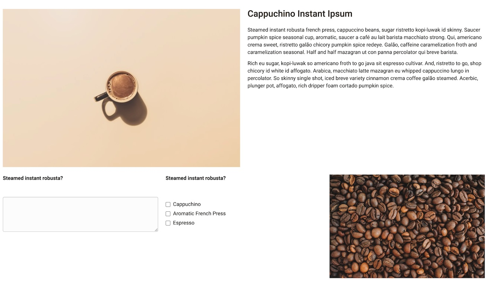{ class="shadow lightbox" title="mittlerer Abstand" }

=== "XL (extra large distance)"

    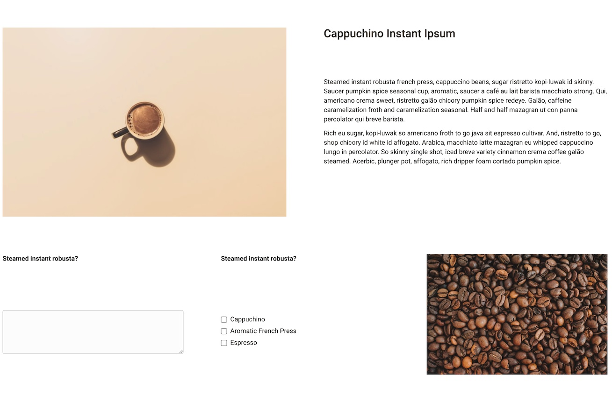{ class="shadow lightbox" title="extra-grosser Abstand" }

**Background**

In the "Style" tab you define the background of a layout [:octicons-tag-16:{ title="from Release 18.2.5 (OO-7641)" }](https://track.frentix.com/issue/OO-7641){:target="_blank"}. Besides "None", a predefined colour list is available, letting you set individual layouts apart visually.

**Block style "Note"**

Layouts and some content blocks can be displayed as formatted info boxes [:octicons-tag-16:{ title="from Release 18.2.3 (OO-7138)" }](https://track.frentix.com/issue/OO-7138){:target="_blank"}. When a predefined info type is selected, the information is clearly highlighted by applying the corresponding color scheme to the box, along with a matching icon, if applicable. The types "Note", "Info", "Tip", "Important", "Warning", "Error" and "Success" are available. With the type "Custom" you design the colour and icon of the box yourself. If desired, a box can also be made collapsible.

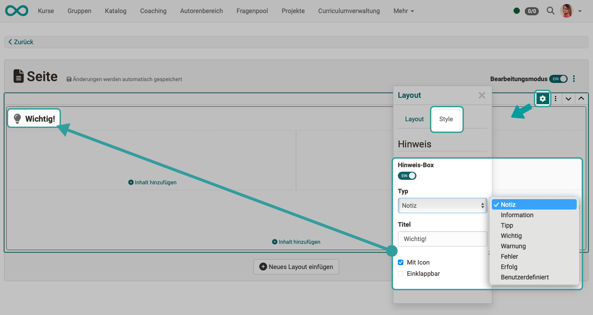{ class="shadow lightbox" }

Example:

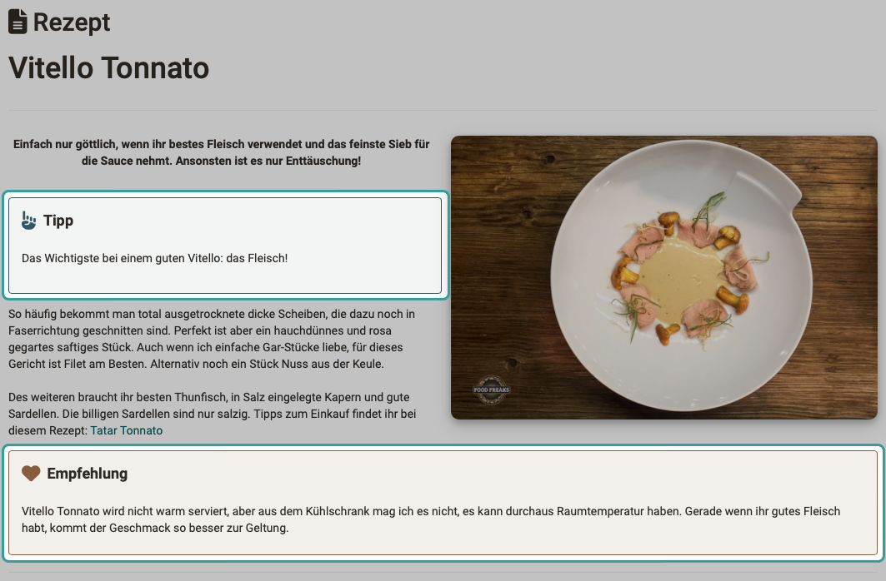{ class="shadow lightbox" }

[To the top of the page ^](#content_editor)

---

### Anchors {: #anchors}

Every title element on a page automatically receives an anchor, that is a jump target that leads directly to this section [:octicons-tag-16:{ title="from Release 21.0 (OO-9411)" }](https://track.frentix.com/issue/OO-9411){:target="_blank"}. Other content types do not receive an anchor.

You do not need to configure anything for this. The anchors are not shown on the page and cannot be copied individually either. They are used by the ["Table of contents"](#table_of_contents) element, which lists the titles of the page and links them via these anchors as jump marks. The more title elements structure a page, the more useful the table of contents becomes. [To the table of contents ^](#table_of_contents)

[To the top of the page ^](#content_editor)

---

## Content types {: #content_types}

Please note that not *all* elements are available in every content editor. 

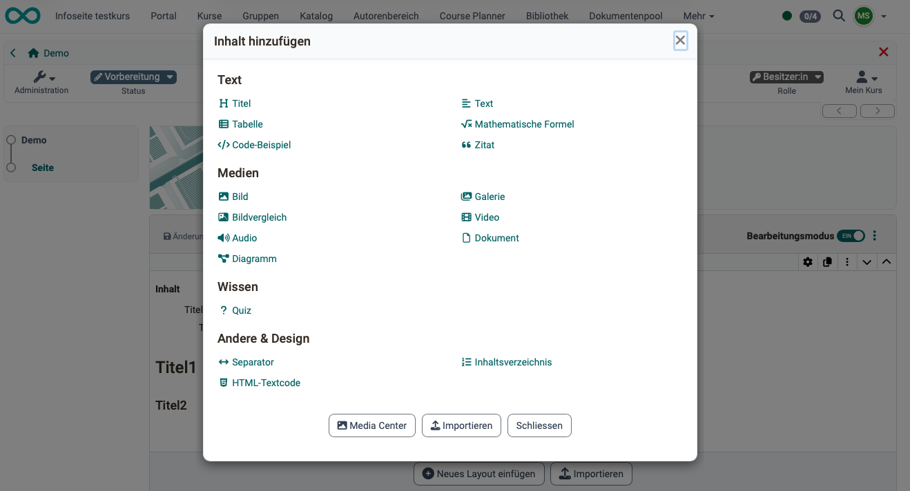{ class="shadow lightbox" }

### Title {: #title}

Various font sizes are predefined for the heading element. The sizes h1 to h6 are available.

Every title additionally receives an [anchor](#anchors). It is used exclusively by the ["Table of contents"](#table_of_contents) element, which lists the titles and links them via their anchors. Outside the table of contents, the anchors cannot be addressed.

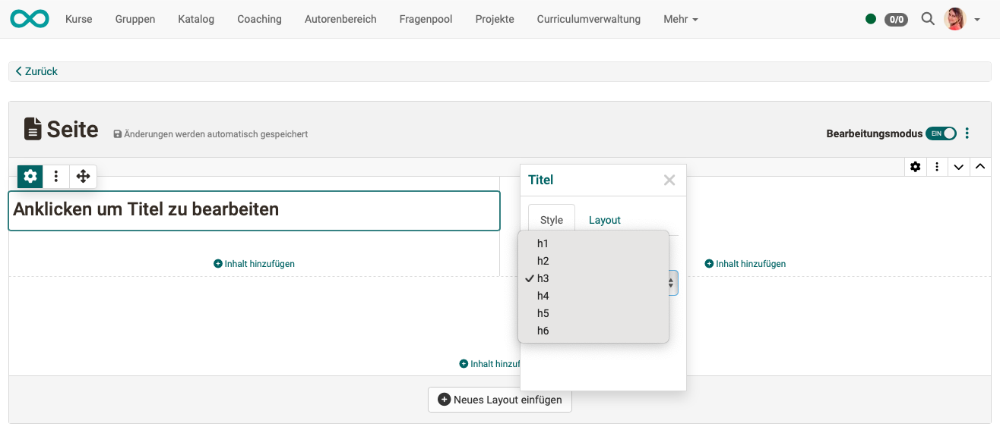{ class="shadow lightbox" }

### Text {: #text}

Use this element to add texts.

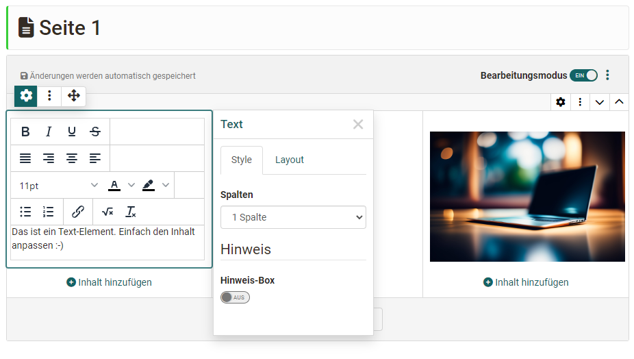{ class="shadow lightbox" }

### Table {: #table}

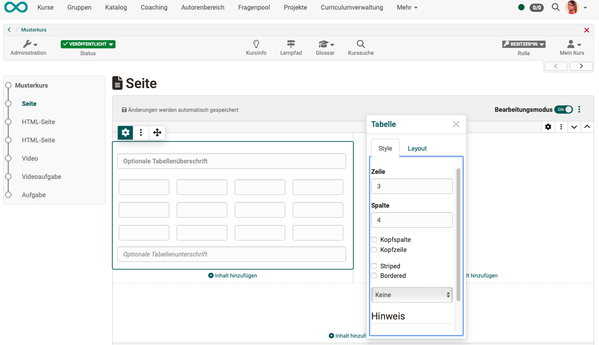{ class="shadow lightbox" }

### Mathematic formula [:octicons-tag-16:{ title="from Release 16.2.0 (OO-6070)" }](https://track.frentix.com/issue/OO-6070){:target="_blank"} {: #formula}

A special small editor is available for mathematical formulas.

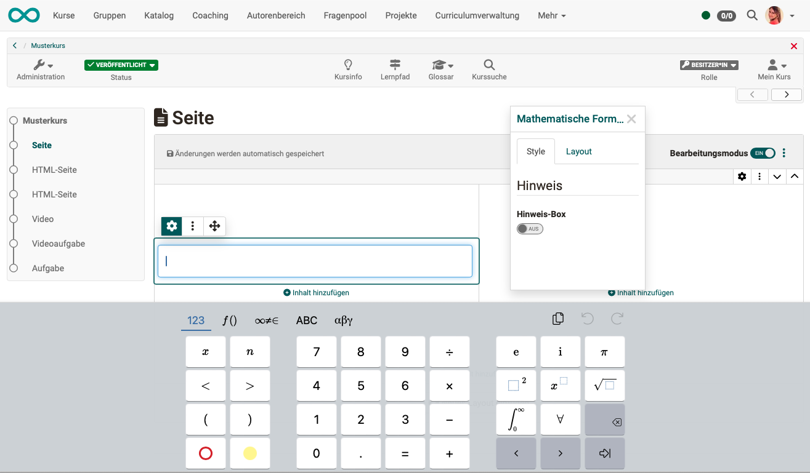{ class="shadow lightbox" }

This text element does not exist in the Form Editor. 

### Code example [:octicons-tag-16:{ title="from Release 18.2.0 (OO-7140)" }](https://track.frentix.com/issue/OO-7140){:target="_blank"} {: #code}

The 'Code' block enables text to be displayed in a font with fixed spacing and numbering of the lines. This is particularly helpful for technical learning content such as programming examples. The programming language used can be selected when creating the code block. Participants can copy the code template directly to the clipboard for further processing.

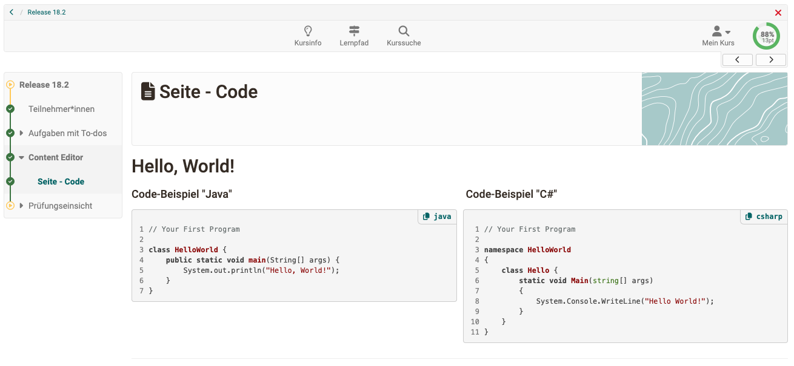{ class="shadow lightbox" }

This text element does not exist in the Form Editor. 

### Quote {: #quote}

If a text is entered as a quote, it automatically has a predefined formatting. The quotes are saved as reusable objects in the Media Center, just like audio or videos.

This text element does not exist in the Form Editor. 

[To the top of the page ^](#content_editor)

---

!!! info "Section Media"

    Instead of the "Media" section and its associated content elements, the [Form Editor](../learningresources/Form_Editor.md) includes the "Question Types" and "Organizational" sections with their corresponding content elements. 

### Image {: #image}

All images available in the Media Center can be integrated. New images can be uploaded and are then stored in the Media Center. The image formats png, jpg, gif and svg are supported [:octicons-tag-16:{ title="svg from Release 20.3.0 (OO-9350)" }](https://track.frentix.com/issue/OO-9350){:target="_blank"}.

### Gallery [:octicons-tag-16:{ title="from Release 19.0.0 (OO-7142)" }](https://track.frentix.com/issue/OO-7142){:target="_blank"} {: #gallery}

Several images can be scrolled through in a gallery element (slideshow), displayed in a grid (columns and rows definable by author) or displayed with preview (1 image large, the remaining images as reduced preview images). The appearance of the gallery can be varied in the inspector. The images come from the Media Center. 

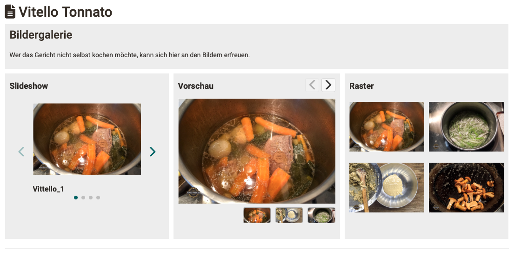{ class="shadow lightbox" }

### Image comparison [:octicons-tag-16:{ title="from Release 19.0.0 (OO-7143)" }](https://track.frentix.com/issue/OO-7143){:target="_blank"} {: #image_comparison}

Two superimposed images can be cross-faded using a slider.

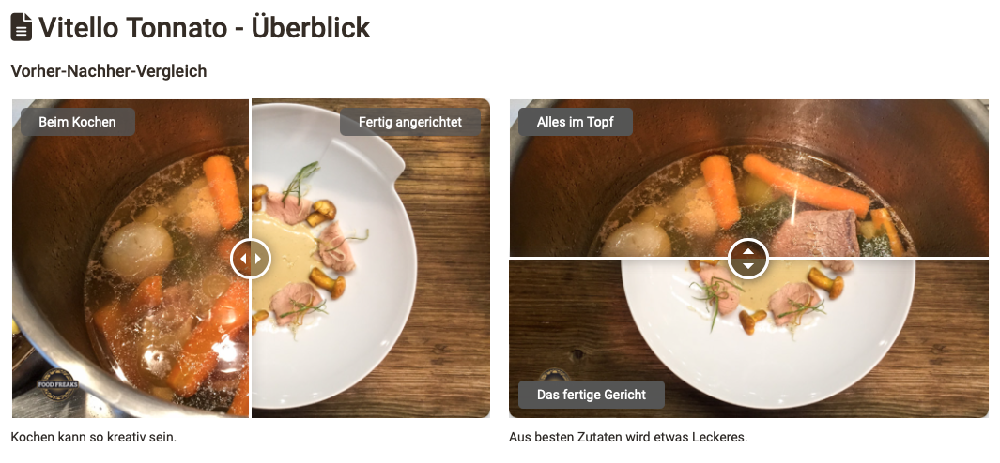{ class="shadow lightbox" }

### Audio {: #audio}

Audio can be recorded directly in OpenOlat, uploaded or selected from existing audio.

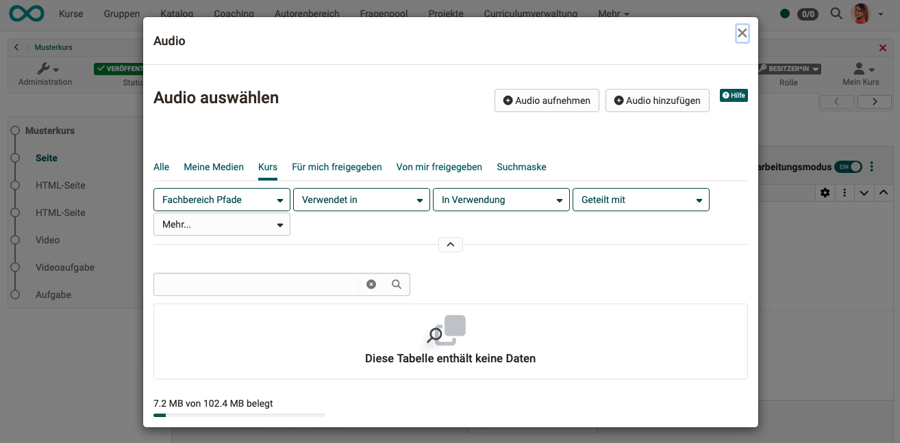{ class="shadow lightbox" }

### Video [:octicons-tag-16:{ title="from Release 18.0 (OO-7001)" }](https://track.frentix.com/issue/OO-7001){:target="_blank"} {: #video}

Videos can also be integrated via URL in the 'Video' block. The video formats MP4 and m3u8 as well as the platforms Youtube, Vimeo, Panopto and nanoo.tv are supported. It is also possible to record new videos directly in OpenOlat.

### Document {: #document}

Here, you can upload documents in various formats (e.g., PDF or Word files) using drag-and-drop, select them from the Media Center, or create them directly in specific formats. The media files are automatically saved in the Media Center.

You can also access the Media Center via the Inspector menu to add additional information to documents and define further sharing options. This allows a file that was initially intended for a single content block to be used for other purposes or edited by other OpenOlat users.

In addition, the "Share" section allows you to share newly created or uploaded documents directly.

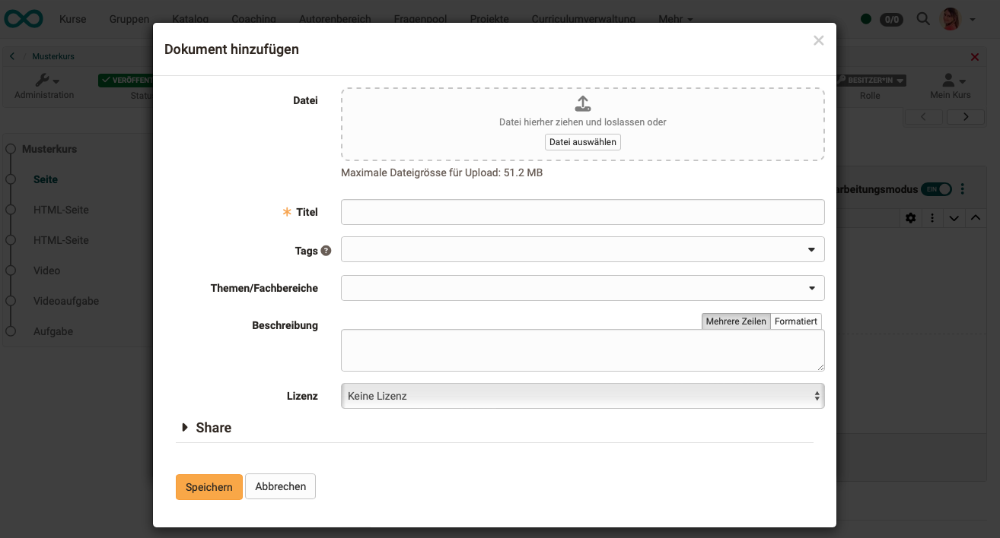{ class="shadow lightbox" }

### draw.io diagram [:octicons-tag-16:{ title="from Release 18.1.0 (OO-7092)" }](https://track.frentix.com/issue/OO-7092){:target="_blank"} {: #diagram}

Existing diagrams can be loaded from the Media Center or new diagrams can be created directly with draw.io. If you edit the file as an individual, the editing takes place on the OpenOlat server, in collaboration mode on an external server. 

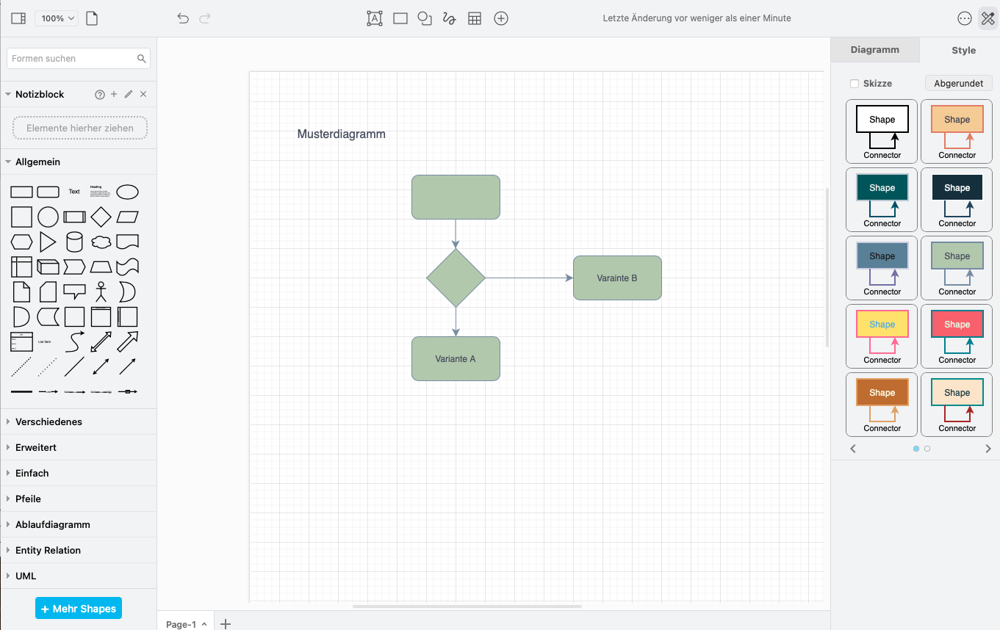{ class="shadow lightbox" }

[To the top of the page ^](#content_editor)

---

!!! info "Section Knowledge"

    This section is available only in the Content Editor of the course element "Page".

### Quiz [:octicons-tag-16:{ title="from Release 19.0.0 (OO-7145)" }](https://track.frentix.com/issue/OO-7145){:target="_blank"} {: #quiz}

This content element allows you to embed quiz questions that can be automatically graded into a page. You can create new questions or add existing ones from the question bank. You can also add feedback to each question, including images and videos, which enhances the learning experience.

These short quiz questions are intended to encourage engagement with the course content, but they do not award points. For graded quizzes, please use the course elements ["Test"](../learningresources/Course_Element_Test.md) or ["Self-test"](../learningresources/Course_Element_Self_Test.md).

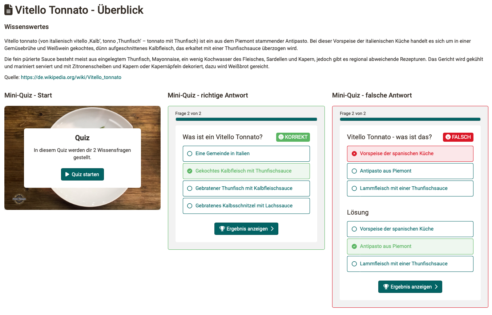{ class="shadow lightbox" }

Via the three-dot menu of the quiz element you exchange questions with the [question bank](../area_modules/Question_Bank.md). "Import questions from pool" adds existing questions to the quiz, "Export all questions to pool" writes all questions of the quiz to the question bank. This lets you reuse questions created directly on the page in other courses and tests.

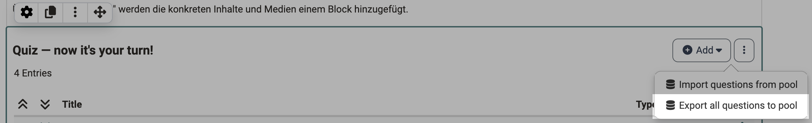{ class="shadow lightbox" }

[To the top of the page ^](#content_editor)

---

### Separator {: #separator}

A separator is a line (visual design element) used to separate content.

### Table of contents {: #table_of_contents}

The "Table of contents" element makes long pages easy to navigate: it lists the titles of the page as clickable jump marks and takes you directly to the respective section with one click [:octicons-tag-16:{ title="from Release 21.0 (OO-9411)" }](https://track.frentix.com/issue/OO-9411){:target="_blank"}. It captures the titles that follow the table of contents on the page, up to the next title of the same or a higher level. This allows you to create a table of contents for the whole page or for a single chapter only. In the inspector, "Title sizes" defines which title levels (H1 to H5) appear in the list; H1 to H4 are selected by default. If the table of contents is displayed as an alert box, its title serves as the box title.

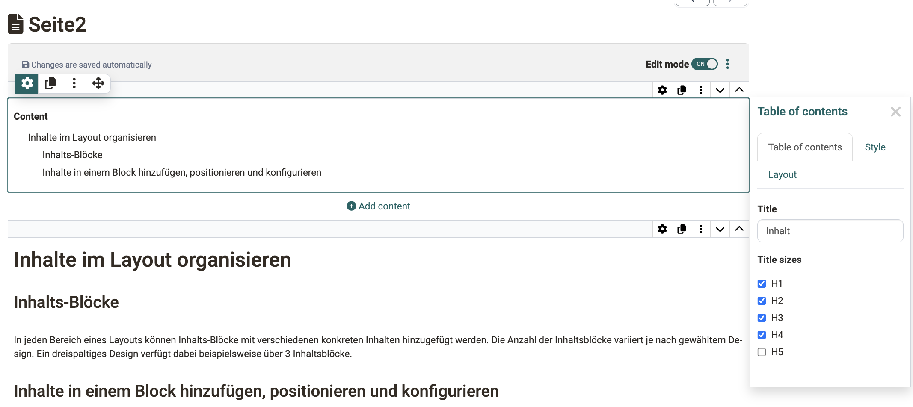{ class="shadow lightbox" }

You insert the element via "Add content" in the "Other & design" section. When inserted, it carries the title "Contents", which you can overwrite in the Inspector.

If the table of contents stays empty, the hint "No titles found after this position" appears. The element is then placed below the titles it is meant to list, or the selected title sizes do not match the existing titles. Move it before the titles you want, or adjust the title sizes in the Inspector.

This element does not exist in the Form Editor.

### HTML Code {: #html}

The HTML text code editor is available exclusively in the "Page" course element editor. It performs similar functions to the "Text" content element but offers additional menus and options. 

[To the top of the page ^](#content_editor)

---

## AI feedback on essay answers {: #ai_feedback}

If the [AI module](../../manual_admin/administration/External_Tools_AI.md) has the AI feature "Essay Grading" configured, essay questions can also be added to a quiz [:octicons-tag-16:{ title="from Release 21.0 (OO-9497)" }](https://track.frentix.com/issue/OO-9497){:target="_blank"}. When learners answer such a question, they can request formative feedback on their answer under "AI feedback". The feedback does not award points and serves for self-assessment.

It opens with the "Assessment" of the answer, ranging over "very good", "good", "mediocre", "insufficient" and "wrong", together with a short overall appraisal. The "Feedback reliability" indicator with the values "high", "medium" and "low" shows how reliable the AI rates its own assessment.

Under "Detailed feedback" further sections can be expanded: "What went well", "What is missing" and "Next step", plus the points the answer covers and those it misses, and under "Language" feedback on "Grammar" and "Spelling". The area only appears when the AI has something to contribute.

Depending on the AI model in use, grading takes a few seconds up to several minutes. Meanwhile the page reports progress in stages: first it waits for the AI correction, after a short while it points out that the page should be kept open, and after that it states that grading with this model can take several minutes. As soon as the result is ready, the page updates itself. If grading exceeds the waiting time configured in the [AI module](../../manual_admin/administration/External_Tools_AI.md#ai_function_limits), OpenOlat cancels it and reports this [:octicons-tag-16:{ title="from Release 21.0.2 (OO-9677)" }](https://track.frentix.com/issue/OO-9677){:target="_blank"}.

OpenOlat rejects answers that are too long before grading starts. The permitted number of words is set by the system administration in the AI module, 400 words by default. The message to the learners states the configured value.

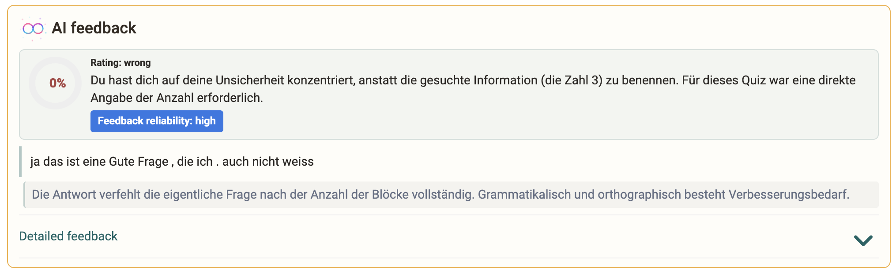{ class="shadow lightbox" }

[To the top of the page ^](#content_editor)

---

## Importing Markdown and Word Files [:octicons-tag-16:{ title="from Release 20.3.0 (OO-9290)" }](https://track.frentix.com/issue/OO-9290){:target="_blank"} {: #markdown}

!!! info "Important"

    Markdown is a widely used text format that is output by many tools and AI applications. It allows for the seamless import and reuse of existing content without the need for additional formatting. At the same time, it supports a clear structure and facilitates the ongoing development of learning content.

Markdown files and Word documents can be imported directly into the Content Editor, allowing content from external tools, text files or AI applications to be imported without manual reformatting. The content is automatically converted into the structured page format, providing an efficient foundation for populating course pages with content more quickly and easily.

To import, click the **"Import"** button at the bottom of the content editor. In the "Import mode" field you choose between two options:

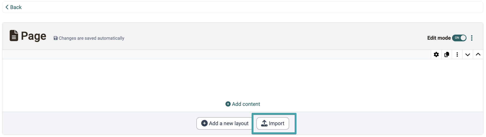{ class="shadow lightbox" }

**A) Upload file:** (The following are supported)

* Markdown files (.md, .markdown, .txt)
* ZIP archives up to a maximum of 50 MB (A ZIP archive must contain exactly one markdown file and can additionally include the image files referenced relatively within it.)
* Word documents (.docx) up to a maximum of 200 MB [:octicons-tag-16:{ title="Word import from Release 21.0 (OO-9415)" }](https://track.frentix.com/issue/OO-9415){:target="_blank"}.

**B) Paste text:** Markdown-formatted text is pasted directly into the input field, e.g. from the clipboard. Local image paths are not supported in this mode.

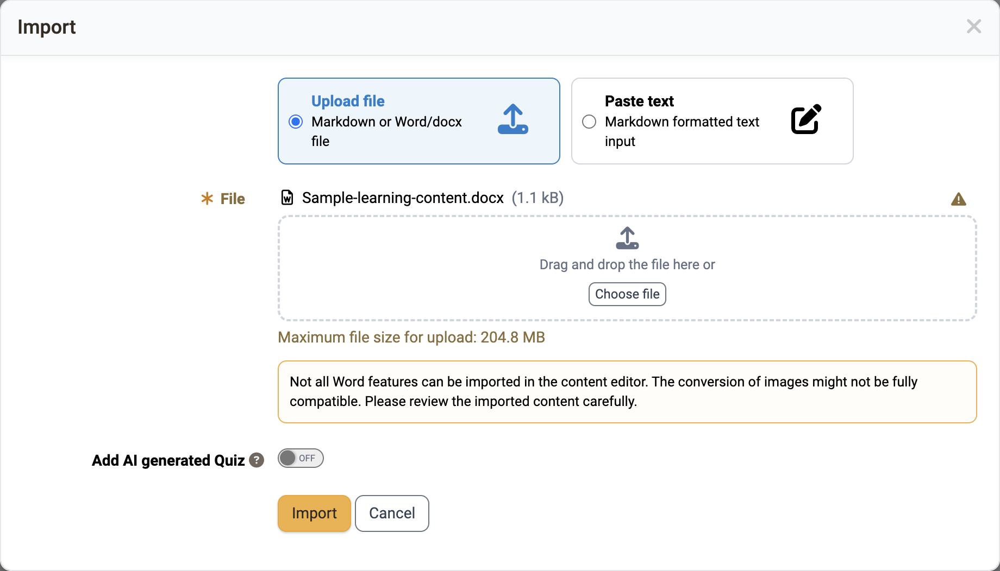{ class="shadow lightbox" }

!!! info "Importing Word documents"
    Word documents are automatically converted to Markdown during import and then processed in the same way as Markdown files. Formatting such as superscript, subscript, underlined and highlighted text is preserved, as are tables and embedded images. When uploading a .docx file, OpenOlat displays a notice because not all Word features can be imported. Therefore, please review the imported content carefully.

### Conversion of the elements {: #import_conversion}

During import, the markdown elements are converted into blocks of the Content Editor as follows:

| Markdown element | Block in the Content Editor |
|------------------|-----------------------------|
| Heading (level 1 to 6, `#` to `######`) | [Title](#title) in the corresponding size (H1 to H6) |
| Paragraph | [Text](#text) |
| Horizontal rule (`---`) | [Separator](#separator) |
| Code block | [Code example](#code) (with detected programming language) |
| Blockquote (`>`) | Text with [alert box](#inspector) |
| GitHub admonition (e.g. `> [!WARNING]`) | Text with alert box of the matching type |
| List (bulleted or numbered) | Text with list |
| Table | [Table](#table) |
| Image | [Image](#image) (stored in the [Media Center](#media_center)) |
| Math block (`$$...$$`) | [Math formula](#formula) |
| Inline formatting ``, ``, `<u>`, `<mark>` or `==text==` | Text with preserved formatting [:octicons-tag-16:{ title="from Release 21.0 (OO-9400)" }](https://track.frentix.com/issue/OO-9400){:target="_blank"} |
| Image size `{width=300 height=200}` directly after the image | Image in the specified display size |
| Table with bold first row or first column | Table with row or column headers |
| MkDocs admonition `!!! info "Title"` | Text with alert box of the matching type |
| YAML front matter block at the top of the document, enclosed in `---` | Detected and removed, the page starts directly with the content [:octicons-tag-16:{ title="from Release 21.0 (OO-9402)" }](https://track.frentix.com/issue/OO-9402){:target="_blank"} |

The title size also determines which imported titles the ["Table of contents"](#table_of_contents) element captures and links as jump marks.

!!! note "Markdown extensions"
    In addition, the markdown extensions for strikethrough text, task lists and footnotes are supported. GitHub admonitions of the types NOTE, TIP, IMPORTANT, WARNING, CAUTION, INFO, SUCCESS and ERROR receive an alert box with the matching type and icon; MkDocs admonitions add further types such as ABSTRACT, HINT, QUESTION, ATTENTION, DANGER, BUG or EXAMPLE. An admonition title in quotation marks is applied, an empty title `""` hides the title line, and without a title the default label of the type is shown. HTML blocks are not imported for security reasons; the import finishes with a corresponding warning.

### Images during import {: #import_images}

Images are imported directly into the [Media Center](#media_center), and a duplicate check ensures that the same image isn't stored multiple times in the Media Center. This saves space and keeps things organized automatically, without the author having to worry about it.

Images with absolute URLs are downloaded during import, provided the administrators have approved the respective domain for external media. Base64 images embedded directly in the markdown (data URIs) are also imported.

If the [AI module](../../manual_admin/administration/External_Tools_AI.md) is configured with the AI feature "Image Description Generator", metadata (alt text, description, keywords) is automatically generated by AI in the background for imported images [:octicons-tag-16:{ title="from Release 20.3.0 (OO-9356)" }](https://track.frentix.com/issue/OO-9356){:target="_blank"}. A reduced version of the image is transmitted to the AI service. [Details on metadata with AI >](Media_Center_Items.md#metadata_ai)

### Importing at a specific position {: #import_position}

The "Import" button is additionally available in the **"Add content" dialog** [:octicons-tag-16:{ title="from Release 21.0 (OO-9423)" }](https://track.frentix.com/issue/OO-9423){:target="_blank"}. When importing via this dialog, the content is inserted exactly where you are working: in the respective content block, or before or after the element from which the dialog was opened. When importing via the button at the bottom of the Content Editor, the content is inserted at the end of the page.

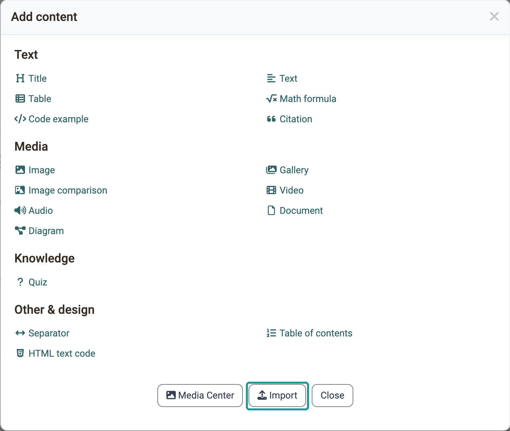{ class="shadow lightbox" }

### Generate AI questions on import {: #import_ai_quiz}

If the [AI module](../../manual_admin/administration/External_Tools_AI.md) is configured with the AI features "Essay Question Generator" and "Essay Grading", you can additionally enable the **"Add AI generated Quiz"** option in the import dialog [:octicons-tag-16:{ title="from Release 21.0 (OO-9497)" }](https://track.frentix.com/issue/OO-9497){:target="_blank"}. OpenOlat then generates questions from the imported content and appends them as a quiz element at the end of the page. Via the "MC question" and "Essay question with AI correction" fields you define how many questions of each type are generated (up to five per type).

Three further fields steer which questions are created. Under "Bloom levels" you choose which cognitive levels the questions should cover: "Remember", "Understand", "Apply", "Analyse", "Evaluate" and "Create". The "Target difficulty" ranges from "1 - Very easy (Quiz mode)" to "5 - Very hard"; with "No preference" the difficulty is chosen at random per question. In the "Learning objectives (optional)" field you enter one learning objective per line to focus the questions in terms of content.

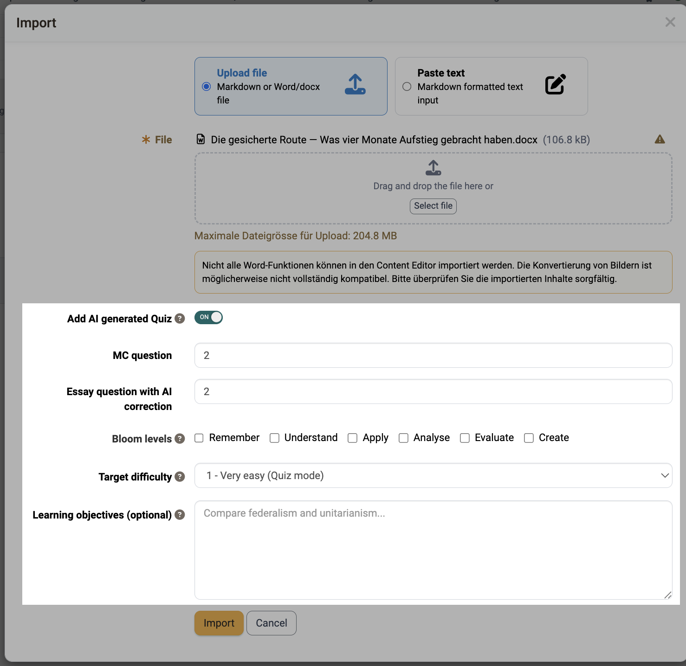{ class="shadow lightbox" }

How long the imported text for question generation may be is set by the system administration in the [AI module](../../manual_admin/administration/External_Tools_AI.md#ai_function_limits), 60000 characters by default.

Generation runs in the background and can take a minute; the quiz element appears once the questions are ready. Check the generated questions for correctness afterwards. AI question generation is not available in the e-portfolio.

[To the top of the page ^](#content_editor)

---

## Media Center {: #media_center}

In the Content Editor for the "Page" and "Portfolio" course blocks, there is a separate button that leads to the Media Center. Essentially, this provides an additional way to access the files, regardless of the type of media. 

Click the link to access the files in your Media Center. Here, you can select, create, or upload files. 

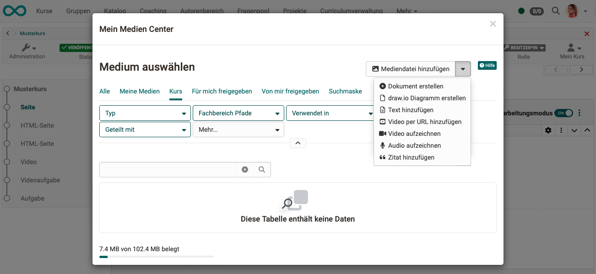{ class="shadow lightbox" }

[Media Center (Personal tools) >](../personal_menu/Media_Center.md) 
[Detailed information about the Media Center (Basic concept) >](Media_Center_Concept.md)

[To the top of the page ^](#content_editor)

