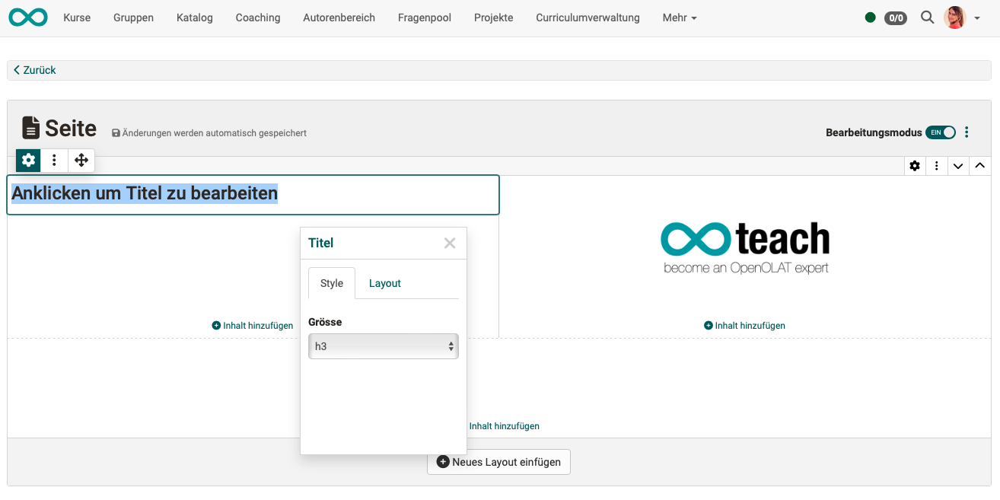
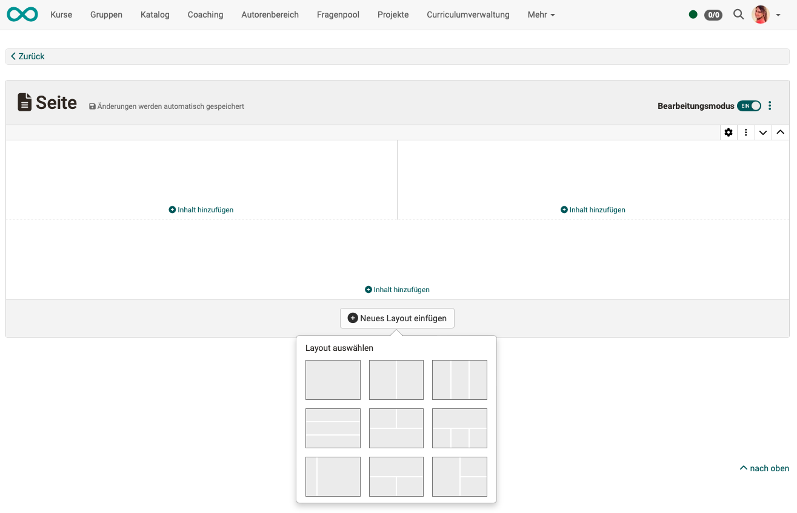
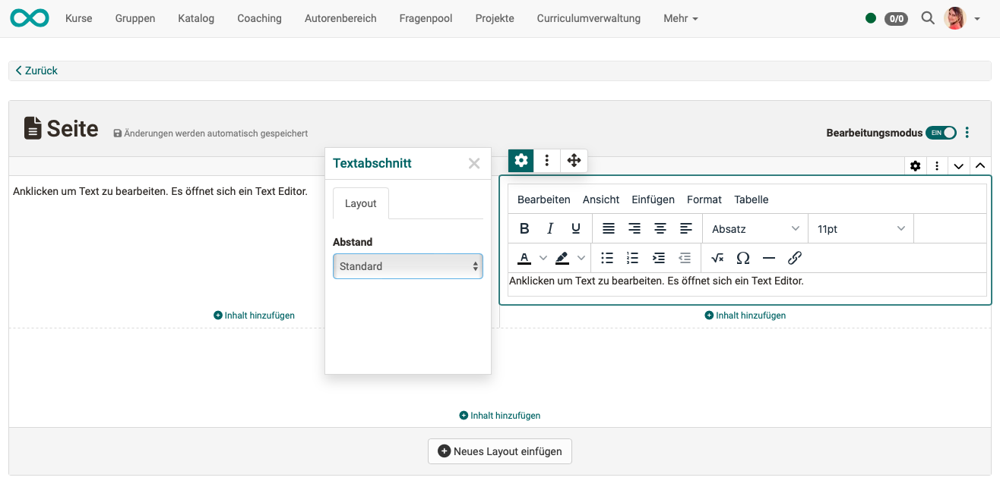

# Content Editor {: #content_editor}

## What can the Content Editor do?

In the Content Editor, authors can compile pages and forms in several layout grids. Various content elements such as text, images, videos, etc. can be inserted into a selectable grid.

The aim is to enable an adaptive design so that the content is also displayed appropriately on mobile devices.

{ class="shadow lightbox" }

!!! info "Note"

    Another editor in OpenOlat is, for example, the HTML editor "Tiny MC", which is used in the course element "HTML page", for example.

## Where is the Content Editor used?

### Course element page

After you have inserted a new "Page" course element in the course editor, select the **"Page content"** tab. The option to edit is offered there, which opens the content editor to design this course element.

{ class="shadow lightbox" }

!!! info "Note on storing"

    The following applies to the page created with the Content Editor: 
    The media content of a page (images, audio, video, diagrams, quotes, documents, etc.) are stored in the Media Center. The page itself (text, layout, settings) is saved in the course. 
    In the similar course element HTML page, the editor Tiny-MC is used instead of the content editor. An HTML file is created there, which is inserted into the course element as a learning resource and saved together with the media in the storage folder of the course element. 
    Different rules apply to the portfolio and form learning resource.

It is also possible to allow coaches to edit this page in the finished course.

{ class="shadow lightbox" }

### Learning resource Form

If you edit a "Form" learning resource in the authoring area, the editing also takes place in the Content Editor. The displayed options for inserting content are adapted to the form (various question types to choose from).

{ class="shadow lightbox" }

### E-portfolio

The Content Editor is also used for entries in portfolio folders.

{ class="shadow lightbox" }

## Create layout

To ensure correct display on mobile devices, all content is inserted in layout grids. If a mobile is recognized as the current device, the layout fields can automatically be displayed one below the other.

{ class="shadow lightbox" }

### Replace layout template

If the layout is marked (selected), you can also subsequently select the layout and a different standard arrangement of the layout fields without losing content that has already been inserted into the layout fields. Select the layout and click the gear icon.

{ class="shadow lightbox" }

!!! hint "Recommendation"

    When the layout is subsequently changed, the content is redistributed in layout fields. You should therefore check the arrangement of the content and correct it if necessary.

### Insert further layouts

You can insert several of these layouts one below the other. To do this, click on the icon with the 3 dots at the top right. 

If several layouts are available, you can change the order of the layouts. 
Use the arrows to move an entire layout.

{ class="shadow lightbox" }

### Leave content editor

Zum Verlassen des Content Editors klicken Sie links oben auf "Zurück", Sie gelangen damit wieder zum Kurseditor, in dem alle Kursbausteine angezeigt werden.

The additions and changes you make in the Content Editor are saved automatically.

To switch to the preview without leaving the editor, you can use the "Edit mode" button at the top right.

## Insert content into a layout

### What is a layout?

* A layout is a grid that structures the content (blocks).
* Several layouts can be inserted in a "Page" course element.
* There are several layouts to choose from, which differ in the way the fields are arranged.

### What is a content block?

* A block is the entire content of a field in the layout. 
* Several contents can be inserted into a block, e.g. a title and a text. 

{ class="shadow lightbox" title="Inhaltsblöcke im Kursbaustein Seite"}

{ class="shadow lightbox" title="Inhaltsblöcke in der Lernressource Formular"}

### Inspector

When content is selected, an icon with an arrow cross is displayed at the top left of the frame. If you select this icon, you can move the content to any other position by holding down the mouse button. Also in another layout field and in another layout element.

{ class="shadow lightbox" }

### General formatting for all content blocks

**Spacing**

Uniform spacing between the fields of the layout (content blocks) is important for the appealing design of a layout. You have the choice between different spacings:

* no spacing
* S (small)
* M (medium)
* L (large)
* XL (extra large)
* user defined

=== "S (small spacing)"

    { class="shadow lightbox" title="kleiner Abstand" }

=== "M (medium spacing)"

    { class="shadow lightbox" title="mittlerer Abstand" }

=== "XL (extra large spacing)"

    { class="shadow lightbox" title="extra-grosser Abstand" }

**Block style 'Note'**

As of release 18.2.3, layouts and some content blocks can be displayed as a formatted note box. When selecting a predefined note type, information is clearly highlighted by a corresponding color of the box - if necessary with a matching icon.
A set of additional colors and icons for customizing the box is also available. A box can also be made collapsible on request.

{ class="shadow lightbox" }

Example:

{ class="shadow lightbox" }

## Content types

<h3>Titel</h3>

Various font sizes are predefined for the heading element.

{ class="shadow lightbox" }

<h3>Text section</h3>

A simple text editor is available in a text section for creating text blocks.

{ class="shadow lightbox" }

<h3>Paragraph</h3>

In contrast to a text section, a paragraph also contains note boxes and columns.

{ class="shadow lightbox" }

<h3>Image</h3>

All images available in the Media Center can be integrated. New images can be uploaded and are then stored in the Media Center.

<h3>Separator</h3>

A separator is a line (visual design element) for separating content.

<h3>Table</h3>

{ class="shadow lightbox" }

<h3>Mathematic formula</h3>

A special small editor is available for mathematical formulas.

{ class="shadow lightbox" }

<h3>Code</h3>

The 'Code' block enables text to be displayed in a font with fixed spacing and numbering of the lines. This is particularly helpful for technical learning content such as programming examples. The programming language used can be selected when creating the code block. Participants can copy the code template directly to the clipboard for further processing.

{ class="shadow lightbox" }

<h3>Audio</h3>

Audio can be recorded directly in OpenOlat, uploaded or selected from existing audio.

{ class="shadow lightbox" }

<h3>Video</h3>

Videos can also be integrated via URL in the 'Video' block. The video formats MP4 and m3u8 as well as the platforms Youtube, Vimeo, Panopto and nanoo.tv are supported. It is also possible to record new videos directly in OpenOlat.

<h3>Quote</h3>

If a text is entered as a quote, it automatically has a predefined formatting. The quotes are saved as reusable objects in the Media Center, just like audio or videos. 

<h3>Document</h3>

If documents (e.g. Word files) are uploaded, they can be made available to other OpenOlat authors and, if desired, stored in the Media Center for editing.

{ class="shadow lightbox" }

<h3>draw.io diagram</h3>

Existing diagrams can be loaded from the Media Center or new diagrams can be created directly with draw.io. Editing takes place on an external server.

{ class="shadow lightbox" }

<h3>Quiz</h3>

As shown above, different question types can be inserted into forms. Quiz questions are also available in the course element "Page" from release 18.2.5. However, they cannot be evaluated, but are intended to provide a variety of content. For evaluable quiz questions, use the course element "Test" or "Self-test".

<h3>Choose from my media center</h3>

Various media types can be stored in the Media Center. Instead of accessing a specific content type, you can use this selection option to access all media of different types that have been released to you in the Media Center.

{ class="shadow lightbox" }

!!! info "Hint"

    You can find out more about the Media Center here:  [User Manual > Personal Menu > Personal Tools > Media Center](../personal_menu/Media_Center.md)
