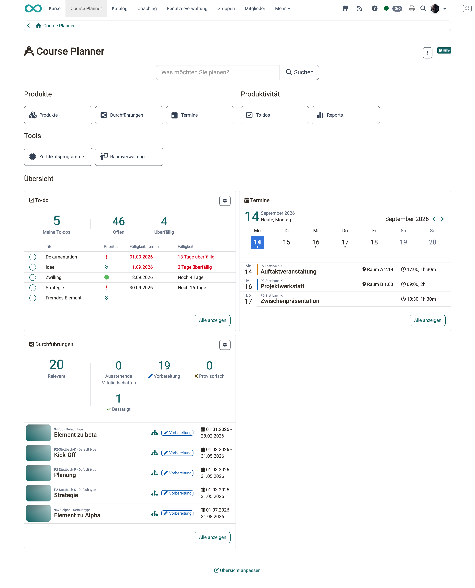
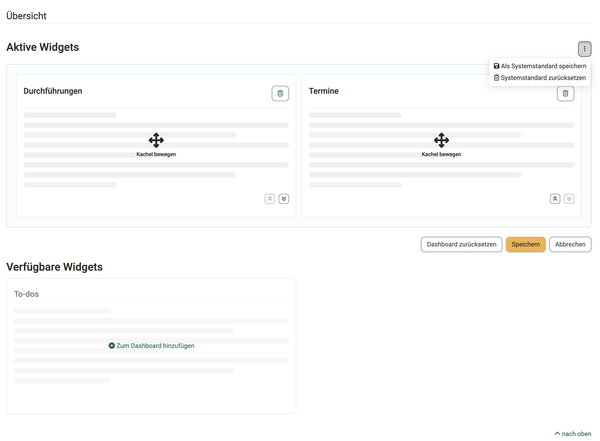

# Übersichtsseiten und Widgets {: #dashboard_concept}

Wer mit Bildungsprodukten oder mit Betreuungsaufgaben arbeitet, beginnt den Arbeitstag meist mit denselben Fragen: Welche Durchführungen laufen gerade, welche Termine stehen diese Woche an, welche Aufgaben sind offen. Jede dieser Angaben liegt in einem eigenen Bereich. Die Übersichtsseiten fassen sie als Kacheln zusammen: Jede Kachel zeigt einen Ausschnitt eines Bereichs und führt mit einem Klick dorthin. Kursplaner:innen und Betreuer:innen stellen sich die Seite auf ihre Arbeit zusammen, Administrator:innen legen fest, womit alle starten.

Diese Seite beschreibt das Konzept einmal zentral. Die einzelnen Widgets sind auf den Seiten der jeweiligen Bereiche beschrieben.

## Was ist ein Widget? {: #widget_definition}

Ein **Widget** ist eine Kachel auf einer Übersichtsseite. Sie zeigt einen Ausschnitt der Daten, für die Sie sonst in einen eigenen Bereich wechseln müssten, zum Beispiel die nächsten Termine oder die relevanten Durchführungen. Das Widget ersetzt den Bereich nicht, es erspart Ihnen den Weg dorthin.

Jedes Widget lässt sich persönlich ein- und ausblenden und in der Reihenfolge verschieben. Ihre Anordnung gilt nur für Sie und nur für diese eine Übersichtsseite.

## Wo Übersichtsseiten vorkommen {: #where}

Übersichtsseiten mit Widgets gibt es an fünf Stellen:

| Übersichtsseite | Widgets | Beschrieben auf |
|---|---|---|
| Course Planner, Startseite | Durchführungen, Termine, To-do | [Course Planner: Dashboard >](../area_modules/Course_Planner_Dashboard.de.md) |
| Produkt, Tab Übersicht | Durchführungen, Termine, To-do | [Course Planner: Produkte >](../area_modules/Course_Planner_Products.de.md) |
| Durchführung, Tab Übersicht | Mitglieder, Termine, Kursinhalt, To-do, Katalog | [Course Planner: Durchführungen >](../area_modules/Course_Planner_Implementations.de.md) |
| Coaching, Übersicht | Kurse - Als Betreuer:in, Termine | [Coaching - Übersicht >](../area_modules/Coaching.de.md) |
| Zertifikatsprogramm, Übersicht | Aktive Mitglieder | [Course Planner: Zertifikatsprogramme >](../area_modules/Course_Planner_Certification_Programs.de.md) |

Welche Widgets Sie tatsächlich sehen, hängt von Ihren Rollen und von den aktivierten Modulen ab. Das Widget **Termine** zum Beispiel erscheint nur, wenn das Modul **Termin- und Absenzenverwaltung** systemweit aktiv ist.

!!! info "Wichtig"

    Das Widget **Termine** heisst im Course Planner und im Coaching gleich und trägt dasselbe Symbol, zeigt aber unterschiedliche Termine. Im Course Planner erscheinen Termine aus Bildungsprodukten, für die Sie als Administrator:in, Absenzenverwalter:in, Besitzer:in oder Betreuer:in zuständig sind. Im Coaching erscheinen nur Termine, in denen Sie selbst als Dozent:in eingetragen sind, und zwar ausdrücklich keine Termine aus Bildungsprodukten.

Beide Widgets zeigen Termine aus einer bestimmten Rolle heraus. Ihre **eigenen** Termine sehen Sie dagegen vollständig an einer Stelle: im persönlichen Werkzeug [Absenzen](../personal_menu/Absences.de.md#tab_events_absences), Tab **Termine und Absenzen**. Die Liste führt alle Termine, an denen Sie als Teilnehmer:in geführt sind, und trennt sie in **Absenzen innerhalb eines Produkts** und **Absenzen ausserhalb eines Produkts**. Ob ein Termin aus einem Bildungsprodukt des Course Planners oder aus einem einzelnen Kurs stammt, spielt für die Vollständigkeit dieser Liste keine Rolle.

!!! note "Hinweis"

    Termine aus Projekten erscheinen dort nicht. Sie sind eigene Objekte des Projektmoduls und werden im Projekt selbst geführt.

## Aufbau einer Übersichtsseite [:octicons-tag-16:{ title="ab Release 20.3 (OO-9305)" }](https://track.frentix.com/issue/OO-9305){:target="_blank"} {: #structure}

Eine Übersichtsseite ist von oben nach unten gleich aufgebaut:

- **Schaltflächen (Launcher)**, in Gruppen zusammengefasst. Sie führen in die Bereiche.
- **Trennbereich "Übersicht"**. Er grenzt die Daten von der Navigation darüber ab.
- **Widgets** in einem responsiven Kachel-Layout. Je nach Bildschirmbreite ordnen sich die Kacheln neu an.

{ class="shadow lightbox" }

## Wiederkehrende Bedienelemente [:octicons-tag-16:{ title="ab Release 20.3.0 (OO-9244)" }](https://track.frentix.com/issue/OO-9244){:target="_blank"} {: #controls}

Alle Widgets verwenden dieselben Schaltflächen. Was sie bewirken, ist überall gleich:

- **"Alle anzeigen"** öffnet den vollständigen Bereich hinter dem Widget. Wohin genau, hängt vom Widget ab.
- **"Details"** öffnet den zugehörigen Tab des gerade geöffneten Objekts.
- **Zahnrad "Einstellungen ändern"** öffnet die Konfiguration eines Tabellen-Widgets.

### Kennzahlenzeile {: #key_figures}

Tabellen-Widgets zeigen über der Tabelle eine Zeile mit Kennzahlen. Die **Hauptkennzahl** steht in der Titelzeile des Widgets. Ein Klick auf eine Kennzahl filtert die Tabelle darunter auf die entsprechenden Einträge.

### Kachel-Einstellungen ändern [:octicons-tag-16:{ title="ab Release 20.3.0 (OO-9132)" }](https://track.frentix.com/issue/OO-9132){:target="_blank"} {: #widget_settings}

Über das Zahnrad **"Einstellungen ändern"** stellen Sie ein Tabellen-Widget für sich ein:

- **Hauptkennzahl**: die Kennzahl, die in der Titelzeile des Widgets steht.
- **Kennzahlen**: die weiteren Kennzahlen, die das Widget zeigt. Die Hauptkennzahl ist immer ausgewählt und lässt sich nicht abwählen.
- **Anzahl Einträge**: wie viele Zeilen die Tabelle zeigt, 5 bis 15.

Mit **Speichern** übernehmen Sie die Einstellungen, mit **Abbrechen** verwerfen Sie sie.

## Übersicht anpassen [:octicons-tag-16:{ title="ab Release 20.3.0 (OO-9273)" }](https://track.frentix.com/issue/OO-9273){:target="_blank"} {: #customize}

Unterhalb der Widgets steht der Button **"Übersicht anpassen"**. Er wechselt in den Bearbeitungsmodus mit zwei Bereichen:

- **Aktive Widgets**: die Kacheln, die die Seite zeigt. Über **"Kachel bewegen"** ordnen Sie sie per Drag & Drop neu an, über **"Vom Dashboard entfernen"** blenden Sie eine Kachel aus.
- **Verfügbare Widgets**: die ausgeblendeten Kacheln. Über **"Zum Dashboard hinzufügen"** holen Sie eine zurück. Sie erscheint am Ende der aktiven Widgets.

{ class="shadow lightbox" }

Mit **Speichern** übernehmen Sie die Anordnung und verlassen den Bearbeitungsmodus, mit **Abbrechen** verwerfen Sie die Änderungen. **"Dashboard zurücksetzen"** stellt die Standardanordnung wieder her.

!!! tip "Tipp"

    Für die Bedienung ohne Maus stehen zusätzlich die Aktionen **"Nach oben verschieben"** und **"Nach unten verschieben"** zur Verfügung.

!!! info "Wichtig"

    Jede Übersichtsseite speichert ihre eigene Anordnung. Eine Änderung im Course Planner wirkt nicht auf das Coaching. Gäste sehen den Button "Übersicht anpassen" nicht.

## Welche Anordnung gilt {: #configuration_cascade}

OpenOlat bestimmt die angezeigten Widgets in drei Stufen:

1. **Ihre persönliche Anordnung**, sofern Sie eine gespeichert haben.
2. Sonst der **Systemstandard**, den die Systemadministration festlegt.
3. Sonst **alle verfügbaren Widgets**.

Als Systemadministrator:in legen Sie den Systemstandard im Bearbeitungsmodus über **"Als Systemstandard speichern"** fest. Er gilt für alle Personen ohne eigene Anordnung. **"Systemstandard zurücksetzen"** nimmt ihn wieder weg. So blenden Sie zum Beispiel ein einzelnes Widget für alle Personen ohne eigene Anordnung aus.

## Weiterführende Informationen {: #further_information}

**Auf dieser Seite erwähnt** 
[Course Planner: Dashboard >](../area_modules/Course_Planner_Dashboard.de.md) 
[Course Planner: Produkte >](../area_modules/Course_Planner_Products.de.md) 
[Course Planner: Durchführungen >](../area_modules/Course_Planner_Implementations.de.md) 
[Coaching - Übersicht >](../area_modules/Coaching.de.md) 
[Course Planner: Zertifikatsprogramme >](../area_modules/Course_Planner_Certification_Programs.de.md) 
[Persönliche Werkzeuge: Absenzen >](../personal_menu/Absences.de.md)

**Weiterführend** 
[Tabellenkonzept >](Table_Concept.de.md) 
[Termine und Absenzen >](Events_and_Absences.de.md) 
[Course Planner: To-dos >](../area_modules/Course_Planner_Todos.de.md)

[Zum Seitenanfang ^](#dashboard_concept)
