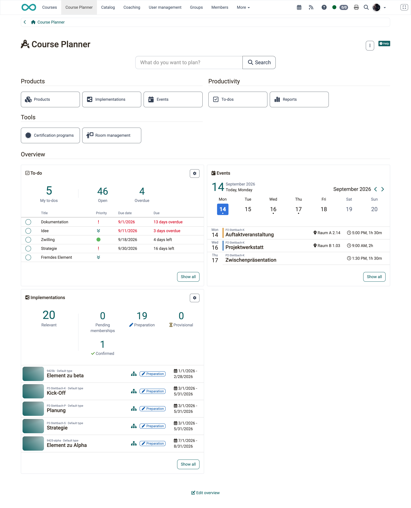
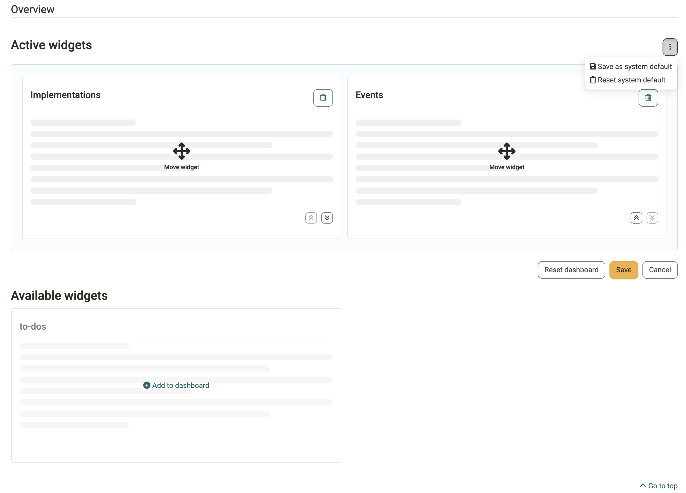

# Overview pages and widgets {: #dashboard_concept}

People who work with educational products or with coaching tasks usually start the day with the same questions: which implementations are running, which events are scheduled this week, which tasks are open. Each of these lives in its own area. The overview pages bring them together as tiles: each tile shows a slice of one area and takes you there with one click. Course planners and coaches arrange the page around their own work, administrators define what everybody starts with.

This page describes the concept once, centrally. The individual widgets are described on the pages of their respective areas.

## What is a widget? {: #widget_definition}

A **widget** is a tile on an overview page. It shows a slice of the data you would otherwise have to open a separate area for, for example the next events or the relevant implementations. The widget does not replace the area, it saves you the way there.

You can show and hide every widget for yourself and move it in the order. Your arrangement applies only to you and only to this one overview page.

## Where overview pages appear {: #where}

Overview pages with widgets exist in five places:

| Overview page | Widgets | Described on |
|---|---|---|
| Course Planner, start page | Implementations, Events, To-do | [Course Planner: Dashboard >](../area_modules/Course_Planner_Dashboard.md) |
| Product, Overview tab | Implementations, Events, To-do | [Course Planner: Products >](../area_modules/Course_Planner_Products.md) |
| Implementation, Overview tab | Members, Events, Content, To-do, Catalog | [Course Planner: Implementations >](../area_modules/Course_Planner_Implementations.md) |
| Coaching, overview | Courses - As coach, Events | [Coaching - Overview >](../area_modules/Coaching.md) |
| Certification program, overview | Active members | [Course Planner: Certification programs >](../area_modules/Course_Planner_Certification_Programs.md) |

Which widgets you actually see depends on your roles and on the activated modules. The widget **Events**, for example, only appears if the module **Events and absences** is active system-wide.

!!! info "Important"

    The widget **Events** has the same name and the same symbol in the Course Planner and in Coaching, but it shows different events. In the Course Planner you see events from educational products for which you are administrator, absence manager, owner or coach. In Coaching you only see events in which you are entered as a lecturer yourself, and explicitly no events from educational products.

Both widgets show events from one specific role. **Your own** events, in contrast, are all in one place: in the personal tool [Absences](../personal_menu/Absences.md#tab_events_absences), tab **Events and absences**. The list holds all events in which you are entered as a participant and separates them into **Absences within a product** and **Absences outside a product**. Whether an event comes from an educational product of the Course Planner or from a single course makes no difference to the completeness of this list.

!!! note "Note"

    Events from projects do not appear there. They are objects of their own in the project module and are managed in the project itself.

## Structure of an overview page [:octicons-tag-16:{ title="from Release 20.3 (OO-9305)" }](https://track.frentix.com/issue/OO-9305){:target="_blank"} {: #structure}

An overview page has the same structure from top to bottom:

- **Buttons (launchers)**, combined in groups. They take you into the areas.
- **Separator "Overview"**. It separates the data from the navigation above it.
- **Widgets** in a responsive tile layout. The tiles rearrange themselves depending on the screen width.

{ class="shadow lightbox" }

## Recurring controls [:octicons-tag-16:{ title="from Release 20.3.0 (OO-9244)" }](https://track.frentix.com/issue/OO-9244){:target="_blank"} {: #controls}

All widgets use the same buttons. What they do is the same everywhere:

- **"Show all"** opens the complete area behind the widget. Where exactly depends on the widget.
- **"Details"** opens the corresponding tab of the object that is currently open.
- **Gear "Change settings"** opens the configuration of a table widget.

### Key figures row {: #key_figures}

Table widgets show a row with key figures above the table. The **main figure** is in the title row of the widget. A click on a key figure filters the table below it to the corresponding entries.

### Change tile settings [:octicons-tag-16:{ title="from Release 20.3.0 (OO-9132)" }](https://track.frentix.com/issue/OO-9132){:target="_blank"} {: #widget_settings}

Use the gear **"Change settings"** to set up a table widget for yourself:

- **Main figure**: the key figure that is in the title row of the widget.
- **Figures**: the further key figures the widget shows. The main figure is always selected and cannot be deselected.
- **Number of entries**: how many rows the table shows, 5 to 15.

**Save** applies the settings, **Cancel** discards them.

## Edit overview [:octicons-tag-16:{ title="from Release 20.3.0 (OO-9273)" }](https://track.frentix.com/issue/OO-9273){:target="_blank"} {: #customize}

The button **"Edit overview"** is below the widgets. It switches to the edit mode with two areas:

- **Active widgets**: the tiles the page shows. Use **"Move widget"** to rearrange them by drag & drop, use **"Remove from dashboard"** to hide a tile.
- **Available widgets**: the hidden tiles. Use **"Add to dashboard"** to bring one back. It appears at the end of the active widgets.

{ class="shadow lightbox" }

**Save** applies the arrangement and leaves the edit mode, **Cancel** discards the changes. **"Reset dashboard"** restores the default arrangement.

!!! tip "Tip"

    For operation without a mouse, the actions **"Move up"** and **"Move down"** are available in addition.

!!! info "Important"

    Every overview page stores its own arrangement. A change in the Course Planner has no effect on Coaching. Guests do not see the button "Edit overview".

## Which arrangement applies {: #configuration_cascade}

OpenOlat determines the displayed widgets in three steps:

1. **Your personal arrangement**, if you have saved one.
2. Otherwise the **system default** that the system administration defines.
3. Otherwise **all available widgets**.

As a system administrator you define the system default in the edit mode with **"Save as system default"**. It applies to all people without their own arrangement. **"Reset system default"** removes it again. This is how you hide a single widget for all people without their own arrangement, for example.

## Further information {: #further_information}

**Mentioned on this page** 
[Course Planner: Dashboard >](../area_modules/Course_Planner_Dashboard.md) 
[Course Planner: Products >](../area_modules/Course_Planner_Products.md) 
[Course Planner: Implementations >](../area_modules/Course_Planner_Implementations.md) 
[Coaching - Overview >](../area_modules/Coaching.md) 
[Course Planner: Certification programs >](../area_modules/Course_Planner_Certification_Programs.md) 
[Personal tools: Absences >](../personal_menu/Absences.md)

**Further reading** 
[Table concept >](Table_Concept.md) 
[Events and absences >](Events_and_Absences.md) 
[Course Planner: To-dos >](../area_modules/Course_Planner_Todos.md)

[To the top of the page ^](#dashboard_concept)
