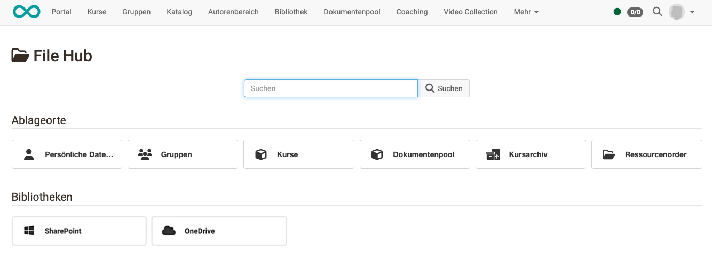
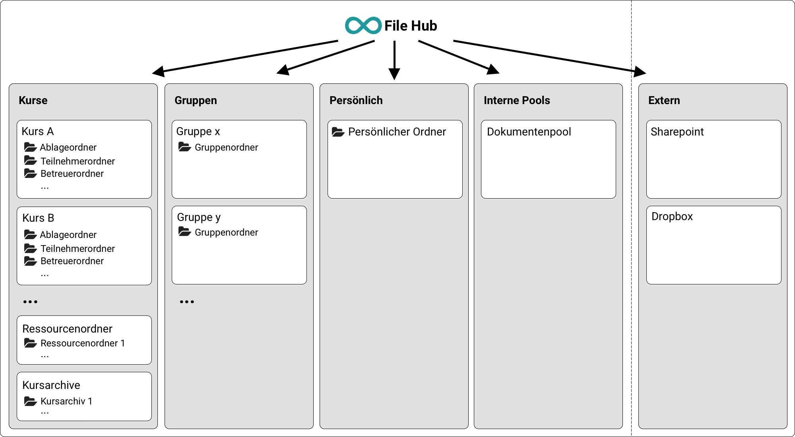
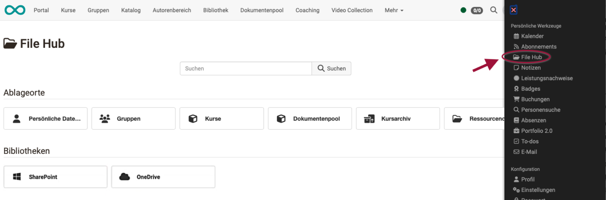

# Konzept des File Hub

## Was ist der File Hub?

Ab Release 19 steht in OpenOlat ein File Hub als **globaler Dateibrowser** zur Verfügung, in dem **alle in OpenOlat vorhandenen Ordner** aufgelistet sind. (Kursordner, Gruppenordner, Archivordner, usw.) 

{ class="shadow lightbox"}

## Merkmale des File Hubs

* **Multi-File-Upload** per drag & drop
* Werden im File Hub Dateien an einen anderen Ort übernommen, werden sie jeweils **kopiert**.  
(Im Unterschied zum [Media Center](../personal_menu/Media_Center.de.md), dort sollen z.B. Logos, AGBs u.ä. zentral verwaltet, upgedated und allen Autor:innen zur Verfügung gestellt werden. Deshalb werden dort die Dateien verlinkt.)
* Es werden nur Ordner im File Hub angezeigt, auf die die aktuell eingeloggte Person **Zugriffsberechtigungen** hat.

## Struktur

{ class="shadow lightbox"}

## Wie öffne ich den File Hub?

### Der File Hub im persönlichen Menü

Die Ordner und Dateien werden im File Hub entsprechend individuellen, persönlichen Berechtigungen angezeigt, deshalb gehört der File Hub auch zu den **persönlichen Werkzeugen** und ist im **persönlichen Menü** zu finden.

{ class=" shadow lightbox" }

{ class=" shadow lightbox" }

### Der File Hub in anderen Zusammenhängen

Der File Hub wird an an vielen weiteren Stellen immer dann angezeigt, wenn **aus Dateien ausgewählt** werden soll. 
Zur **Anzeige eines Ordnerinhalts** finden Sie den File Hub zum Beispiel in der Kursadministration unter **Administration > Dateien**. (Ab Release 19)

## Quellen

### Dokumentenpool

Der [Dokumentenpool](../../manual_admin/administration/Modules_Document_pool.de.md) ist eine Dokumentenverwaltung innerhalb OpenOlat.

* Die darin enthaltenen Dokumente können mit einer Taxonomie versehen werden.
* Der Zugriff auf den Dokumentenpool kann an Kompetenzen gebunden werden.
* Er kann als Site für alle OpenOlat-Benutzer freigeschaltet werden und ist dann in der Hauptnavigation am oberen Rand enthalten.
* Die Dokumente aus dem Dokumentenpool können jedoch nicht in einen Kurs eingebunden werden.

Der Dokumentenpool ist im Unterschied zum File Hub ein Teilbereich, ein "Teil-Behälter". Er kann beispielsweise für eine Verwaltung von Lehrmaterialien verwendet werden, auf die je nach hinterlegter Kompetenz zugegriffen werden kann.

Im File Hub werden dagegen umfassend alle Ordner und Dateien in OpenOlat verwaltet, auch die des [Dokumentenpools](../../manual_admin/administration/Modules_Document_pool.de.md).

### Gruppen

Zu den [Gruppenwerkzeugen](../groups/Using_Group_Tools.de.md) gehören auch Ordner, die nur für die Mitglieder einer bestimmten Gruppe zur Verfügung stehen.
Auf die Gruppenordner kann auch via File Hub zugegriffen werden, sofern die Berechtigung dazu vorhanden ist (Gruppenmitgliedschaft). 

### Kursarchiv

In [Kursarchiven](../learningresources/Course_Archiving.de.md) werden Teilnehmerdaten separat von Kursen in zip-Dateien aufbewahrt. Die darin enthaltenen Dateien und Unterordner können im File Hub angezeigt werden.

### Kurse

Die in einem Kurs verwendeten Dateien befinden sich in einem zum Kurs gehörenden Ordner, dem [Ablageordner](../learningresources/Storage_folder.de.md). 
Bis Release 18 haben Sie darauf Zugriff unter **Kursadministration > Ablageordner**. 
Ab Release 19 ist der Zugriff umbenannt und unter **Kursadministration > Dateien** zu finden.

Der [Ablageordner](../learningresources/Storage_folder.de.md) ist kursspezifisch. Um ausserdem auch mehrfach in verschiedenen Kursen genutzte Dateien verwenden zu können, kann ergänzend ein **Ressourcenordner** im Kurs eingebunden werden. 

### Persönliche Dateien

Es werden im File Hub nur Ordner angezeigt, auf die die eingeloggte Person auch Zugriffsberechtigung hat. Deshalb kann z.B. auch auf den [Persönlicher Ordner](../personal_menu/Personal_folders.de.md) via File Hub zugegriffen werden. (Die Dateien dort sind ausschliesslich für die gerade eingeloggte Person einsehbar.)

### Ressourcenordner

[Ressourcenordner](../learningresources/Resource_Folder.de.md) dienen als Behälter für kursübergreifend mehrfach genutzte Dateien.

* Sie gelten als Lernressourcen und sind deshalb im Autorenbereich aufgelistet. Sie können dort auch neu erstellt und editiert werden. (Autorenbereich > Button "Erstellen" rechts oben)
* Ressourcenordner können im Autorenbereich zentral gepflegt werden. Ressourcenordner haben eigene Besitzer:innen. (Sie können deshalb auch von einer anderen Person gepflegt werden als dem/der Kursbesitzer:in, die den Ressourcenordner in einen Kurs einbindet.)
* Der gleiche Ressourcenordner kann in verschiedene Kurse eingebunden sein. Werden Dateien im Ressourcenordner geändert, sind sie in allen Kursen geändert.
* Pro Kurs kann jeweils 1 Ressourcenordner eingebunden werden. 
* Es sind Unterordner innerhalb der Ressourcenordners möglich.

### Sharepoint

Bei Sharepoint handelt es sich um eine externe Quelle (Microsoft Programm). 
Dateien aus Sharepoint können im File Hub abgerufen werden, wenn die Zugriffsberechtigung von Administrator:innen eingerichtet wurde.

### OneDrive

Bei OneDrive handelt es sich um eine externe Quelle (Microsoft Programm).
Dateien aus OneDrive können im File Hub abgerufen werden, wenn die Zugriffsberechtigung von Administrator:innen eingerichtet wurde.

## Einrichten der Zugriffsbedingungen

Wie oben bereits erwähnt, werden im File Hub nur Ordner und Dateien angezeigt, auf die eine Zugriffsberechtigung besteht. Das Erteilen/Einrichten der Zugriffsberechtigungen geschieht **in den jeweiligen Quellen**.

Beispiel Gruppenordner 
Der File Hub erkennt automatisch, ob Sie Mitglied einer Gruppe sind und welche Gruppenordner Ihnen im File Hub angezeigt werden. Wer also Zugriff auf einen Gruppenordner via File Hub erhalten möchte, muss eine Mitgliedschaft in der betreffenden Gruppe erhalten (-> Gruppenverwaltung).

Beispiel Ablageordner 
Im Ablageordner eines Kurses werden Dateien aus den Kursbausteinen des Kurses abgelegt. Die Menü-Option "Ablageordner" in der Kursadministration wird standardmässig nur den Kursbesitzer:innen angezeigt, die als Autor:innen den Kurs beasrbeiten können. Entsprechend werden im File Hub auch nur Ablageordner angzeigt, bei denen man selbst Kursbesitzer:in ist oder die von anderen Kursbesitzer:innen in den Kurseinstellungen freigegeben wurden.

Beispiel Sharepoint 
Die Zugriffsmöglichkeit auf externe Werkzeuge, wie z.B. Microsoft Sharepoint, muss von Administrator:innen eingerichtet werden unter **Administration > Externe Werkzeuge > Microsoft Sharepoint**.

## Weitere Informationen

[File Hub im persönlichen Menü](../personal_menu/File_Hub.de.md) 
[Media Center](../personal_menu/Media_Center.de.md) 
[Dokumentenpool](../../manual_admin/administration/Modules_Document_pool.de.md) 
[Ablageordner](../learningresources/Storage_folder.de.md) 
[Ressourcenordner](../learningresources/Resource_Folder.de.md) 
[Persönlicher Ordner](../personal_menu/Personal_folders.de.md) 
[Kursarchiv](../learningresources/Course_Archiving.de.md) 

