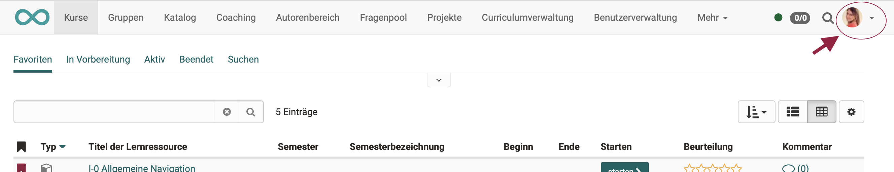

# File Hub Concept

## What is the File Hub?

As of Release 19, a file hub is available in OpenOlat as a **global file browser**, in which **all folders available in OpenOlat** are listed. (Course folders, group folders, archive folders, etc.) 

{ class="shadow lightbox"}

## Features of the File Hub

* **Multi file upload** via drag & drop
* If files are transferred to another location in the File Hub, they are **copied** in each case.  
(In contrast to the [Media Center](../personal_menu/Media_Center.md), where logos, terms and conditions, etc. are centrally managed, updated and made available to all authors. This is why the files are linked there).
* Only folders in the File Hub to which the person currently logged in has **access permissions** are displayed.

## Structure

{ class="shadow lightbox"}

## How do I open the file hub

The folders and files are displayed in the File Hub according to individual, personal permissions, which is why the File Hub is also one of the **personal tools** and can be found in the **personal menu**.

{ class=" shadow lightbox" }

{ class=" shadow lightbox" }

### The File Hub in other contexts

The File Hub is displayed in many other places whenever **selected from files** is to be selected. 
To **display the contents of a folder**, you can find the File Hub in the course administration under **Administration > Files**. (From release 19)

## Sources

### Document pool

The [Document pool](../../manual_admin/administration/Modules_Document_pool.md) is a document management system within OpenOlat.

* The documents contained therein can be provided with a taxonomy.
* Access to the document pool can be linked to competencies.
* It can be activated as a site for all OpenOlat users and is then included in the main navigation at the top.
* However, the documents from the document pool cannot be integrated into a course.

In contrast to the File Hub, the document pool is a sub-area, a "partial container". It can be used, for example, to manage teaching materials that can be accessed depending on the expertise stored.

In contrast, all folders and files in OpenOlat, including those in the [Document pool](../../manual_admin/administration/Modules_Document_pool.md), are managed comprehensively in the File Hub.

### Groups

The [Group tools](../groups/Using_Group_Tools.md) also include folders that are only available to members of a specific group.
The group folders can also be accessed via File Hub, provided you have the necessary authorization (group membership).

### Course archive

In [course archives](../learningresources/Course_Archiving.md), participant data is stored separately from courses in zip files. The files and subfolders contained therein can be displayed in the File Hub.

### Courses

The files used in a course are located in a folder belonging to the course, the [storage folder](../learningresources/Storage_folder.md). 
Up to Release 18, you can access this under **Course administration > Storage folder**. 
As of Release 19, access has been renamed and can be found under **Course administration > Files**.

The [storage folder](../learningresources/Storage_folder.md) is course-specific. In order to also be able to use files that are used several times in different courses, a **resource folder** can also be included in the course. 

### Personal files

Only folders to which the person logged in has access authorization are displayed in the File Hub. Therefore, for example, the [Personal folder](../personal_menu/Personal_folders.md) can also be accessed via File Hub. (The files there can only be viewed by the person who is currently logged in).

* They are considered learning resources and are therefore listed in the authoring area. They can also be created and edited there. (Authoring area > "Create" button top right)
* Resource folders can be maintained centrally in the authoring area. Resource folders have their own owners. (They can therefore also be maintained by someone other than the course owner who integrates the resource folder into a course).
* The same resource folder can be included in different courses. If files are changed in the resource folder, they are changed in all courses.
* 1 resource folder can be integrated per course. 
* Subfolders are possible within the resource folder.

### Media Center

In the [Media Center](../personal_menu/Media_Center.md), which is also a personalized collection, **media files** (e.g. mp4) and **content elements** (e.g. elements of the course element "Page" created with the Content Editor) are stored. 

### Sharepoint

Sharepoint is an external source (Microsoft program). 
Files from Sharepoint can be accessed in the File Hub if the access authorization has been set up by administrators.

### OneDrive

OneDrive is an external source (Microsoft program).
Files from OneDrive can be accessed in the File Hub if the access authorization has been set up by the administrator.

## Setting up the access conditions

As mentioned above, the File Hub only displays folders and files for which access permission has been granted. Access permissions are granted/set up **in the respective sources**.

Example group folder 
The File Hub automatically recognizes whether you are a member of a group and which group folders are displayed in the File Hub. Anyone wishing to gain access to a group folder via File Hub must be a member of the relevant group (-> Group management).

Example filing folder 
Files from the course elements of a course are stored in the storage folder of a course. By default, the "Storage folder" menu option in the course administration is only displayed to course owners who can edit the course as authors.
Accordingly, only folders for which you are the course owner or which have been shared by other course owners in the course settings are displayed in the File Hub.

Example Sharepoint 
Access to external tools, such as Microsoft Sharepoint, must be set up by the administrator under **Administration > External tools > Microsoft Sharepoint**.

## Further information

[File Hub in the personal menu](../personal_menu/File_Hub.md) 
[Media Center](../personal_menu/Media_Center.md) 
[Document pool](../../manual_admin/administration/Modules_Document_pool.md) 
[Storage folder](../learningresources/Storage_folder.md) 
[Resource folder](../learningresources/Resource_Folder.md) 
[Personal folder](../personal_menu/Personal_folders.md) 
[Course archive](../learningresources/Course_Archiving.md) 
